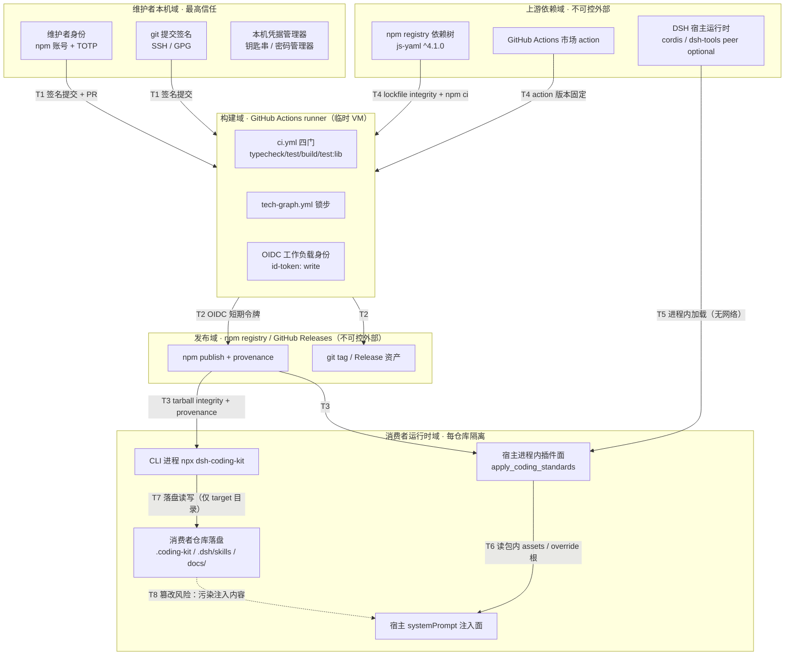
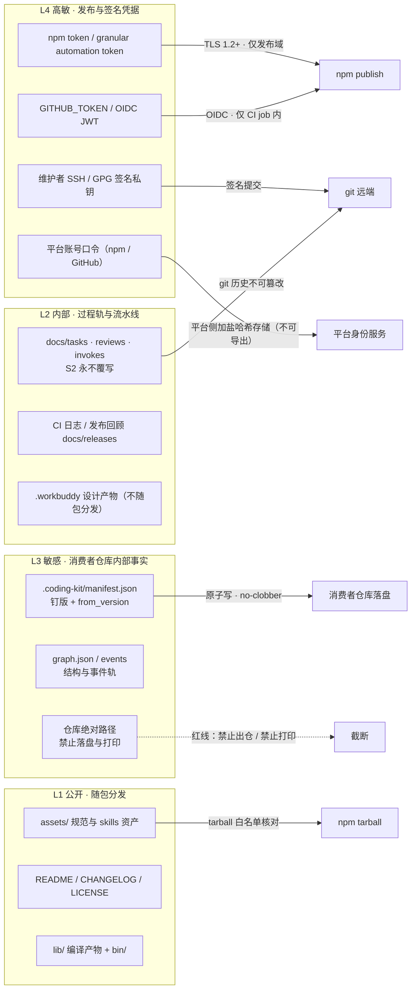
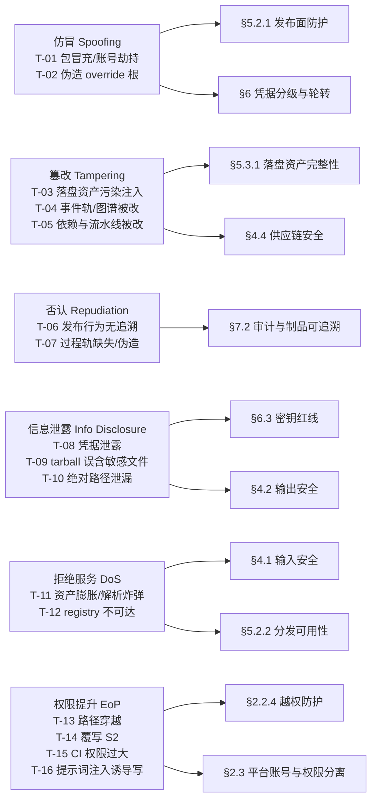

# AICoding 架构设计 · 安全设计

> 本文档为《AICoding 架构设计》核心产物之一，对应**《安全架构设计模版》**，阶段门 **G5**，Owner = security-architect（严守正）。
>
> **上游输入（威胁建模基线）**：G4《系统设计》v1.1（已冻结）、G1《资料摘要》v1.1、G3《高层架构设计》。
>
> **语义适配说明（主理人裁定：A 档——保留模板全部标题与编号，仅将正文语境从「云上业务系统」改写为「本地 CLI + npm 分发 + 宿主进程内调用」）**：
>
> 1. 本项目是**本地 CLI + npm 分发的 Node 包（dsh-coding-kit）**，**无任何云资源、无服务端、无数据库、无南北向业务流量**。模板以云上系统为默认语境，本文对每一处云语义章节**先做语义适配再落地**（映射见 §0 修订记录），**不轻易裁剪**——覆盖面本身即评审对象。
> 2. 本文所有机制、阈值、流程均**可被机械校验或落到具体命令/配置**，禁止出现"建议加强安全""建议使用 WAF"一类泛化结论。
> 3. 与《部署设计》的重叠项按主理人下发的**重叠区权威方分配表**执行：发布面防护、密钥分级与轮转、审计字段与保留期、落盘资产完整性 = **本文权威**；分发拓扑骨架、落盘路径清单、凭据存储基础设施选型 = **《部署设计》权威，本文引用**。
> 4. **威胁单点建模纪律**：同一威胁只在本文件**一处**建模（STRIDE 主类在 §1.2 威胁—缓解映射表占一行），其余章节只做**交叉引用**，不重复建模，以保证 G5 交叉 diff 时映射链单点可追溯。

---

## 0. 元信息：修订记录

| 文档版本 | 发布日期 | 修订人 | 修订说明 |
| --- | --- | --- | --- |
| v1.0 | 2026-09-08 | security-architect（严守正） | 初稿：基于 G4《系统设计》v1.1 冻结边界（模块 M1–M7、落盘格式、分发链路、S2 真值源）与 G1《资料摘要》v1.1（D1–D20、X1–X20），将模板全章节做 A 档语义适配；新增模板未覆盖的「提示词供应链：落盘资产被篡改 → 污染 `apply_coding_standards` 注入内容」建模（§5.3.1） |
| v1.1 | 2026-09-08 | security-architect（严守正） | 定稿：① 回注中间确认裁决——§5.3.1 落盘资产完整性采用**方案 A「来源标注 + 显式校验命令」**（用户裁决，2026-09-08），同步定稿 §7.1 SEC-01 触发条件与阈值；② Step S 策略对齐——按《部署设计》权威命名回填：分发链路 **L1–L5**、资源编号 **R-C-001 / R-C-002 / R-C-003 / R-C-004 / R-M-001 / R-S-002 / R-S-003 / R-S-004 / R-S-005 / R-S-006 / R-M-003**（§5.1 / §5.2 / §6.1 / §7.2）；③ 落盘路径改引《部署设计》§3.1.3 权威口径（只消费不重述）；④ pinned 回退语义交叉引用《部署设计》§4.5.5 五条硬规则（§5.2.2） |

**经中间确认决策登记（供 G5 / G6 追溯）**：

| 项 | 内容 |
| --- | --- |
| 论题 | 落盘 / 包内规范资产的完整性保护强度（T-03 提示词供应链处置策略） |
| 决议时间 | 2026-09-08 |
| 裁决方 | 用户（经主理人转交） |
| 裁决结果 | **方案 A「来源标注 + 显式校验命令」** |
| 落地动作 | ① 注入结果标注 `source`（`package` / `override`）并列出 `injectedFiles`；② 发布时为包内 assets 生成 **sha256 清单随包分发**；③ 新增**按需**校验入口（`assets verify` / `--verify-assets`），由人或 CI 显式触发；④ **默认不改变注入行为**（合法 override 定制不被阻断） |
| 交叉核对 | §5.3.1 检测手段表（D-1~D-7）、处置矩阵（高/中/低）、§7.1 SEC-01、§7.2 业务操作审计字段、§1.2 T-03 残余风险，五处口径已统一 |
| 状态 | 已定稿，不再就同一论题发起确认 |

**语义适配映射（A 档，保留标题只改正文）**：

| 模板章节 | 模板默认语境 | 本项目适配语境 |
| --- | --- | --- |
| §1.1 安全总体架构图 | DDoS / WAF / CLB / 云防火墙 / 堡垒机 / SOC | 发布面防护（npm 2FA + provenance + token 作用域）、分发链路完整性（TLS + lockfile integrity）、落盘资产完整性、过程轨不可篡改（S2 + git 签名）、CI 四门、平台审计 |
| §2 身份与访问管理 | 终端用户登录 / MFA / 会话 | 维护者发布身份（npm + TOTP）、GitHub OIDC 工作负载身份、平台（npm/GitHub）角色模型、消费者本地 OS 身份、hat 帽制（产品内功能级授权） |
| §3 数据安全 | 公网 TLS / mTLS / DB SSL / KMS 落盘加密 | npm+GitHub 全链路 HTTPS（TLS 1.2+）、进程内函数调用（无内部网络）、落盘文件原子写与 git 不可篡改、凭据平台托管 + OIDC 临时令牌 |
| §4 应用安全 | Web OWASP Top 10 | CLI 面 / 宿主工具面 OWASP：路径穿越、YAML 解析注入、命令注入、依赖投毒、调试信息与绝对路径泄漏、提示词注入 |
| §5 网络与基础设施 | VPC / 安全组 / 主机 / K8s / 中间件 | 五信任域划分（上游依赖域 / 构建域 / 发布域 / 消费者运行时域 / 维护者本机域）、发布面防护、GitHub Actions runner 安全、落盘资产完整性、依赖与进程内组件安全 |
| §6 密钥与凭证 | KMS 白盒密钥 / CAM 策略 | npm token / GitHub PAT / GITHUB_TOKEN / OIDC / git 签名密钥 的分级、轮转、作用域最小化、吊销 |
| §7 运行时安全 | IDS / SOC / 堡垒机 / 五维审计 | CI 告警与流水线条带、发布审计与制品可追溯（provenance / CHANGELOG / tag 签名）、五类应急预案（含提示词供应链污染与仓库破坏） |

**未启用章节声明**：**无**。本文按主理人裁定走 A 档，模板全部一级/二级/三级/四级章节**均保留并已完成语义适配**，不做整节删除、不做序号顺延。

**权威边界声明（交叉 diff 口径）**：

| 重叠项 | 本文角色 | 对《部署设计》的要求 |
| --- | --- | --- |
| 分发拓扑骨架（链路节点 / 落盘位置 / 凭据存储机制命名） | 引用方 | 本文 §5.1 / §6.1 按其最终命名回填 |
| 安全组规则 / 发布面防护（WAF 语义替代） | **权威** | 按 §5.2.1 / §5.2.3 落实 |
| KMS / Vault 选型（本项目 = 凭据存储机制） | 定义分级与访问策略（权威） | 基础设施选型归部署侧 |
| 密钥分级 / 访问控制 / 轮转周期 | **权威** | 按 §6.1 / §6.2 配置 |
| 日志收集管道与存储 | 定义字段、保留期、不可篡改要求（权威） | 按 §7.2 配置 |
| 落盘路径清单（位置 / 写入时机 / 覆盖合并语义） | 消费方（**不重述、不自行补路径**） | 本文引用《系统设计》§4.1 / §5.1 与《部署设计》最终口径 |
| 落盘资产完整性（检测 / 恢复 / 影响评级） | **权威** | 见 §5.3.1 |

---

## 1. 安全总体架构

> 本章给出安全能力全景（§1.1）与威胁模型（§1.2）。§1.1 回答"有哪些控制组件与信任域"，§1.2 回答"要防什么、由哪一章防"——后者是全文的索引骨架，后续章节只做交叉引用，不重复建模。

### 1.1 安全总体架构图

> **总览**：本项目无云上安全产品，安全能力由**四类自建/平台机制**叠加构成——① 分发链路（npm + GitHub）与发布面防护；② CI 四门与流水线门禁；③ 落盘资产与过程轨的完整性；④ 平台审计与制品可追溯。下表为模板组件清单的**语义适配版**（"模板原语义 → 本项目承载机制"）。

| 模板组件 | 本项目承载机制（语义适配） | 作用 | 是否启用 |
| --- | --- | --- | --- |
| DDoS 高防 | 分发可用性（npm registry 官方托管 SLA + 已安装包离线可用） | 抵御"registry 不可达 / 包被下架"导致的消费者不可用 | 是（外部托管 + 离线兜底） |
| WAF | **发布面防护**：npm 2FA、token 作用域最小化、provenance 签名、依赖漏洞扫描、tarball 白名单核对、发布凭据隔离 | 防御"包被冒充 / 恶意版本发布 / 依赖投毒" | 是（权威方：security，见 §5.2.1） |
| 云防火墙 | 分发链路边界：TLS 1.2+ 强制、registry 域名固定、CI egress 域名白名单 | 收敛出口面，防止中间人与越域访问 | 是（见 §5.2.2） |
| 主机安全 | 消费者主机与维护者发版本机基线（OS 补丁、磁盘加密、目录权限、凭据管理器） | 保护落盘资产与发布凭据所在主机 | 是（部分由消费者自管，见 §5.3.1） |
| 数据安全审计 | **自建校验器**：版本钉一致性校验、S2 真值源回归、tarball 文件清单 diff、assets 完整性校验、`graph yaml check` 漂移检测 | 数据/资产一致性与篡改发现 | 是（自建） |
| KMS | **凭据托管**：npm/GitHub 平台凭据 + GitHub OIDC 临时令牌 + 维护者本机钥匙串 / 密码管理器 | 敏感凭据不出平台、不入库、不落盘 | 是（平台托管 + OIDC，见 §6） |
| 堡垒机 | **变更通道**：git 签名提交 + PR + 分支保护 + CI 绿闸 + 平台 2FA（无长驻运维通道、无 SSH 跳板） | 运维与发布操作可追溯、不可单人静默完成 | 是（替代形态，见 §5.2.4） |
| NAT 网关 | 出口收敛：CI runner 仅访问 `registry.npmjs.org` / `github.com` 域 | 隐藏并收敛构建域出口 | 是（见 §5.2.2） |
| SOC（安全运营中心） | 仓库与流水线配置扫描：secret scanning、Dependabot、分支保护校验、workflow `permissions` 最小化、`npm audit` | 资产体检与配置漂移发现 | 是（平台能力 + CI 门禁） |

**图 1-1 信任边界图（Trust Boundary）**：

**边界说明（T1–T8 为本文唯一信任边界编号，全文复用）**：

| 边界 | 跨域方向 | 主要风险 | 控制点 |
| --- | --- | --- | --- |
| T1 | 维护者本机 → 构建域 | 未签名/未评审代码进入流水线 | 签名提交 + PR + 分支保护 + CI 绿（§5.2.4） |
| T2 | 构建域 → 发布域 | 构建产物被替换、发布凭据滥用 | OIDC 临时令牌 + provenance + 四门（§6.2.1、§5.2.1） |
| T3 | 发布域 → 消费者运行时域 | 恶意/被替换版本被安装 | tarball integrity（sha512）+ provenance 校验 + 钉版（§5.2.2） |
| T4 | 上游依赖域 → 构建域 | 依赖投毒、action 投毒 | lockfile integrity + `npm ci` + action 版本固定 + `npm audit`（§4.4） |
| T5 | DSH 宿主 → 插件面 | 宿主契约变更/注入面被滥用 | 契约版本嗅探 + 不匹配降级 + dest 白名单（§2.2.4） |
| T6 | 插件面 → 宿主 systemPrompt | 注入内容被污染（提示词供应链） | source 标注 + 完整性校验 + override 提示（§5.3.1） |
| T7 | CLI → 消费者仓库文件系统 | 路径穿越、覆写 S2、越权写 | `--target` 归属校验 + S2 硬闸（exit 2）+ no-clobber（§2.2.4、§4.1） |
| T8 | 落盘资产 → 注入内容 | **落盘资产被篡改污染规范内容** | 见 §5.3.1（本项目最具特征风险，威胁 T-03） |

**图 1-2 敏感数据流图（按 §3.1 数据分级 L1–L4 标注）**：

**图 1-3 威胁—缓解措施映射图（STRIDE → 章节）**：

### 1.2 威胁模型

> **方法**：STRIDE + 资产驱动。每条威胁**唯一建模于本表**（编号 T-xx，全文复用），并至少映射到一个具体缓解章节；缓解措施在该章节落地，本表不复述机制细节。
> **资产口径**：A1 包内 `assets/` 规范与 skills 资产；A2 消费者落盘（manifest / events / graph / skills / IDE 文件，路径与写入语义引用《系统设计》§4.1、§5.1）；A3 过程轨 S2 三目录；A4 发布凭据（npm token / GITHUB_TOKEN / OIDC / 签名私钥）；A5 源码仓与 CI 配置；A6 宿主 systemPrompt 注入面；A7 消费者仓库代码与结构。

**STRIDE 六类覆盖表（本项目语义适配版）**：

| 威胁类别（STRIDE） | 本项目典型示例（落到具体模块 / 数据对象） |
| --- | --- |
| 仿冒（Spoofing） | npm 包被冒充发布（typosquatting / 账号接管）；伪造消费者仓库内 override 根 `.coding-kit` 冒充合法规范源；伪造维护者提交（无签名） |
| 篡改（Tampering） | 落盘 `assets` 或 override 根被改写 → 污染 `apply_coding_standards` 注入内容；`.coding-kit/events/*`、`shared/graph.json` 被改 → 门禁结论漂移；`package-lock.json` / workflow 被改 → 依赖投毒（DEF-027 EINTEGRITY 已有史实） |
| 否认（Repudiation） | 发布行为无签名与审计（谁发的、从哪个 commit 构建的）；过程轨（invoke/reviews）缺失或被人工补写；`refresh-ide-blocks --yes` 改写存量文件后无留痕 |
| 信息泄露（Information Disclosure） | npm token / GITHUB_TOKEN 进仓库或 CI 日志；tarball 误含 `.env` / `docs/` / `.workbuddy/` / 私钥；错误堆栈与命令输出泄漏仓库绝对路径；provenance 暴露内部构建信息（需权衡） |
| 拒绝服务（DoS） | 超大/恶意 `assets` 目录或 `.graph.yaml` 造成注入膨胀与解析耗尽；`wiki export` / `graph` 遍历超大仓库；npm registry 不可达导致新装失败（已安装包须离线可用） |
| 权限提升（Elevation of Privilege） | `--target` / `dest` 路径穿越写到仓库外；绕过 S2 硬闸（真值源分裂 X7 时期四份前缀不一致可被利用）；CI `permissions` 过大导致 job 可写全仓或换取越权令牌；宿主内被提示词注入诱导调用 `init_coding_kit` 写任意目录 |

**威胁—缓解措施映射表（16 条，全部映射到具体章节，无空行）**：

| 编号 | STRIDE | 威胁描述（落到模块 / 数据对象） | 影响资产 | 初评 | 缓解措施（章节） | 残余风险 |
| --- | --- | --- | --- | --- | --- | --- |
| T-01 | 仿冒 | 攻击者接管 npm/GitHub 账号或抢注近似包名，发布含恶意 `assets` 或 `lib` 的版本，消费者 `npx`/`dsh plugin add` 拉取执行 | A1 / A7 | 高 | §5.2.1 发布面防护（2FA、provenance、token 作用域）、§6.2.1 OIDC、§7.2 发布审计 | 平台侧账号安全依赖 npm/GitHub；以 2FA + 最小作用域 + 审计降低 |
| T-02 | 仿冒 | 在消费者仓库放置伪造 override 根（`.coding-kit` / `.dsh/coding-kit`），使 `apply_coding_standards` 读取恶意规范源 | A1 / A6 | 中 | §5.3.1 来源标注与完整性校验、§2.2.4 override 探测止于 git root、§7.1 来源异常告警 | override 为产品合法机制，最终信任归仓库 owner |
| T-03 | 篡改 | **落盘资产被篡改 → 污染 `apply_coding_standards` 注入给模型的规范内容 → 影响模型行为**（提示词供应链；模板无对应章节，本文建模于 §5.3.1） | A1 / A6 / A7 | 高 | **§5.3.1 落盘资产完整性**（经中间确认用户裁决**方案 A**，见 §0 决策登记）：来源标注 + assets sha256 清单 + 按需校验入口（`assets verify` / `--verify-assets`）+ 高危特征扫描）、§4.1 输入安全（注入内容特征）、§7.1 SEC-01 告警 | 中：默认注入路径不做实时阻断，依赖人/CI 显式触发校验；override 合法性由仓库 owner 与 git 守护 |
| T-04 | 篡改 | `.coding-kit/events/*`、`shared/graph.json`、`*.graph.yaml` 被改写，导致 HGM 公理与 `graph yaml check` 结论漂移 | A2 | 中 | §3.3.3 落盘数据安全、§5.3.1 完整性检测、§7.2 落盘数据变更审计、§4.3.3 防结论漂移 | 依赖消费者 git 守护 |
| T-05 | 篡改 | `package-lock.json` / workflow / action 版本被改造成依赖投毒（DEF-027 EINTEGRITY 为同类史实） | A5 / A1 | 高 | §4.4 供应链安全、§5.2.2 分发链路完整性、§5.3.2 构建运行时安全、§5.4.2 强制校验 | 上游包作者账号安全不可控 |
| T-06 | 否认 | 发布行为无法溯源到具体人/commit/构建（`npm publish` 仅人但无签名绑定、tag 可移动） | A5 / A1 | 中 | §7.2 发布审计与制品可追溯（provenance + 签名 tag + CHANGELOG + CI 运行记录）、§5.2.4 变更通道 | 平台日志保留期依赖 npm/GitHub |
| T-07 | 否认 | 过程轨（invoke / reviews）缺失、被人工补写或时间倒填，削弱"过程可追溯"承诺 | A3 | 中 | §7.2 业务操作审计、§3.3.3 S2 永不覆写与 git 历史、§4.3.3 结论唯绑归档事件 | 人工闸（HG-*）仍需人签 |
| T-08 | 信息泄露 | npm token / GITHUB_TOKEN / 签名私钥进入仓库、CI 日志、tarball 或错误堆栈 | A4 | 高 | §6.1 分级与存储、§6.3 使用红线（含 secret scanning 与 pack 核对）、§4.2.2 调试信息管控、§3.2.5 传参禁忌 | 维护者本机安全（§5.3.1 主机基线） |
| T-09 | 信息泄露 | tarball 误含 `docs/`、`.workbuddy/`、`.env`、私钥、`src/`、`test/` 等（`files` 白名单失控） | A5 / A7 | 中高 | §3.3.4 分发包与导出面（白名单 + `npm pack --dry-run` 清单 diff）、§5.2.1 发布前核对、§7.2 打包审计 | 需 CI 强制清单 diff 才能机械拦截 |
| T-10 | 信息泄露 | 命令输出/日志/落盘泄漏仓库绝对路径与内部结构（违反"lint 阻止绝对路径"约束） | A7 / A3 | 低 | §3.3.5 展示脱敏（仅相对路径）、§4.2.1 统一异常处理、§7.2 日志字段规范 | 第三方库日志不可完全控 |
| T-11 | 拒绝服务 | 超大 `assets` 目录 / 恶意 `.graph.yaml`（别名炸弹、深层嵌套）导致注入膨胀（24k 截断失效）或解析耗尽 | A1 / A6 | 中 | §4.1 输入安全（YAML 安全 schema、节点 id 白名单、遍历上限）、§3.1 容量水位（24k 截断与文件清单核对）、§5.5 类水位见《系统设计》§5.5.4 | 本地单进程，影响面限于本机 |
| T-12 | 拒绝服务 | npm registry 不可达 / 包被下架，导致新安装与升级失败 | A1 | 低 | §5.2.2 分发可用性（离线可用 + 钉版回退 + 下游 CI 熔断回滚通道）、§7.3 应急预案五 | 已安装包不受影响 |
| T-13 | 权限提升 | `--target` / `dest` 路径穿越或符号链接逃逸，写到消费者仓库之外（如 `$HOME`、系统目录） | A2 / A7 | 中 | §2.2.4 越权防护（realpath 归属校验 + dest 白名单）、§4.1 输入安全（路径校验）、§5.3.1 主机基线 | 需实现侧落实 realpath 校验 |
| T-14 | 权限提升 | 绕过"S2 永不覆写"硬闸（历史上 4 份 S2 前缀硬编码不一致 X7，判定可随命令漂移） | A3 | 高 | §2.2.4 越权防护（`S2_TRUTH_PREFIXES` 唯一真值源，命中 `fail(2)`）、§3.3.3 落盘数据安全、§4.3.1 越权防护、§7.1 越权拒写计数 | 已由 F1 收敛解决，需回归覆盖 M1/M2/M3/M4/M6 |
| T-15 | 权限提升 | CI workflow `permissions` 过大 / fork PR 泄露 secrets / job 可换取越权 OIDC 令牌 | A5 / A4 | 中高 | §2.3.2 权限分离、§2.3.3 高敏权限分离、§6.2.2 作用域最小化、§5.3.2 构建运行时安全 | 依赖仓库配置正确 |
| T-16 | 权限提升 | 宿主会话被提示词注入，诱导模型调用 `init_coding_kit` / `refresh-ide-blocks` 写入非预期目录或关闭门禁 | A6 / A2 | 中 | §2.2.4 dest 白名单（`.coding-kit` / `.dsh/coding-kit`）、§3.2.4 二次确认（`--yes` 显式）、§4.3.5 关键业务二次验证、§4.1 输入安全（注入内容不作为指令执行） | 提示词注入无法根除，靠最小写面收敛 |

**威胁—缓解覆盖自检**：六类 STRIDE 全部命中（仿冒 2 / 篡改 3 / 否认 2 / 信息泄露 3 / DoS 2 / 权限提升 4 = 16 条），每条均有且不只有一处缓解章节，无空行、无"待定"。

---

## 2. 身份与访问管理（IAM）

> 语义适配：本项目**无终端用户账号体系**（本地 CLI，消费者侧身份 = 本地操作系统用户）。IAM 的真实主体是**维护者（发布身份）**、**CI 工作负载身份**、**平台（npm/GitHub）账号**与**消费者本地 OS 身份**。产品内的 hat 帽制（00/10/20/30/40）是**功能级授权**，不是基础设施 IAM，见 §2.2.2 交叉引用《系统设计》§7.2.5。

### 2.1 身份认证（Authentication）

> 本节回答"谁在发布、谁在构建、凭什么被信任"。消费者侧无登录（本地进程），因此认证面收敛为**发布身份 + 工作负载身份 + 提交签名**三类，共 5 种认证方式。

#### 2.1.1 用户登录

> 本项目"登录"面为：**发布平台登录（npm / GitHub）**、**CI 工作负载换取令牌**、**git 提交签名**。认证方式清单（≥2 种，实际 5 种）：

| # | 认证方式 | 适用主体 / 场景 | 形态 | 强度要求 |
| --- | --- | --- | --- | --- |
| C-1 | npm 账号 + TOTP / WebAuthn 2FA | 维护者交互发布（`npm publish` / `npm version`） | 人 + 第二因子 | **强制开启 2FA**；优先 WebAuthn（防钓鱼） |
| C-2 | GitHub OIDC 工作负载身份（JWT） | CI 内发布与构建，**无长期密钥** | 机器身份（短期） | 首选；`id-token: write` 按 job 授予， audience/repo/ref 条件限制 |
| C-3 | GitHub 账号 + 2FA + SSO + PR 评审 | 代码变更与合并 | 人 + 第二因子 + 同行评审 | main 分支禁直推 |
| C-4 | git 提交 / tag 签名（SSH 或 GPG） | 所有提交与发布 tag | 密钥对 | 强制签名提交；tag 签名后禁止移动 |
| C-5 | npm granular access token（automation） | 无法使用 OIDC 时的兜底发布通道 | 机器令牌（受限） | 单包 + publish-only + 有效期 ≤ 90 天 + IP/CIDR 可选限制 |

**强制二次认证（2FA/MFA）场景**：① npm publish / version / tag / owner 变更 / unpublish；② GitHub 仓库设置变更（分支保护、secrets、workflow）；③ 新增/删除发布令牌；④ 关闭或重置 2FA；⑤ 异地/新设备首次发布。

**消费者侧**：无登录（本地进程）。消费者身份与权限由本地 OS 账户与仓库目录权限决定，kit 不引入任何身份体系（零云约束 N2）。

#### 2.1.2 密码策略（量化阈值）

> 语义适配：口令类凭据由 npm / GitHub 平台侧存储（加盐哈希），kit 侧**不存储、不传输明文口令**；下表为**发布身份与令牌的策略基线**（对维护者的可核查要求 + 对平台配置的期望值）。

| 项 | 基线值 | 本项目适配说明 |
| --- | --- | --- |
| 最小长度 | ≥ 8 位（业务系统）；≥ 12 位（云控制台、CVM、数据库） → **本项目：≥ 16 位** | 发布平台账号口令 ≥ 16 位（npm/GitHub 平台执行） |
| 复杂度 | 同时包含数字、大写字母、小写字母、特殊字符 | 平台侧强制；禁用与包名/用户名同形口令 |
| 加密传输 | 前端 RSA 加密提交，密文传输 → **本项目：仅 HTTPS/TLS 1.2+ 提交，禁止 HTTP 与 `strict-ssl=false`** | 见 §3.2.1 |
| 加密存储 | bcrypt / scrypt / argon2 加盐哈希；**禁止 MD5 / SHA1 明文** | 平台侧加盐哈希；**kit 侧零口令存储**（本地仅存平台颁发的令牌，且优先不落盘） |
| 更换周期 | 默认 90 天提醒（可配置） | 平台口令 90 天提醒；**令牌轮转 ≤ 90 天**（§6.1）；OIDC 随 job 失效，无需轮转 |
| 重复限制 | 不允许使用最近 5 次的密码 | 平台侧策略开启 |
| 失败锁定 | 连续失败 5 次锁定 1 小时（次数和时长可配置） | 平台侧策略 + 异常登录邮件告警（§7.1） |
| 自动登出 | 30 分钟无操作自动登出 | 平台控制台会话 ≤ 30 分钟无操作登出；**本地 `.npmrc` 会话凭据随 CI job 销毁** |
| 注册策略 | 不允许用户自行注册，仅管理员创建；改密需原密码验证 | npm org 成员仅 Owner 邀请；GitHub 协作者仅 Owner 授予；包 owner 变更须双人确认（Owner + 1 名 maintainer） |

#### 2.1.3 会话管理

| 维度 | 基线值 | 本项目适配 |
| --- | --- | --- |
| Token 类型 | JWT / Session ID，**禁止 URL 携带 token** | GitHub OIDC JWT（短期）、npm granular access token、**GITHUB_TOKEN**（job 内临时） |
| 有效期 | 默认 24 小时，提供续期与主动注销 | OIDC JWT：≤ 单个 job 时长（建议 ≤ 30 分钟）；granular token：≤ 90 天（默认取 30 天）；`GITHUB_TOKEN`：job 结束即失效；**禁止永久 token** |
| 互踢机制 | 管理端同账号仅允许单设备登录；异地登录提示 | 平台侧：新设备/异地登录触发 2FA 重认证 + 邮件通知；发布通道：同一包禁止并发 publish（后到者失败） |
| 风险登录 | 异地 / 异常登录二次验证 | 异地/新设备/非常规时段发布 → 强制 2FA 二次确认 + 发布前版本钉校验（《系统设计》§4.5.4） |
| 存储红线 | — | **禁止** token 进入：URL、CLI 参数、环境变量明文回显、`.npmrc` 入库、CI 日志、tarball、错误堆栈（见 §3.2.5、§6.3） |

### 2.2 授权与权限控制（Authorization）

> 本节回答"被认证的主体能做什么"。权限按**接口级 / 数据级 / 功能级**三维展开，隔离单元为**消费者仓库**，越权防护落到可机械校验的路径白名单与 S2 硬闸。

#### 2.2.1 权限模型

> **裁定（沿用模板默认并适配）**：**RBAC0 为主 + ABAC 用于高敏场景**。理由与证据：npm org 与 GitHub 仓库的角色模型（owner / maintainer / member；admin / maintain / write / triage / read）本身即 RBAC0，平台不提供自定义角色引擎，因此主体模型无选择空间；高敏操作（publish、tag、分支保护变更）叠加 ABAC 条件属性——`ref == refs/heads/main`、`tag 签名有效`、`CI 四门全绿`、`environment == prod`、`actor 属于发布组`，四条件全成立才放行。
>
> **交叉引用**：产品内 hat 帽制（00 delegate-only / 10 / 20 / 30 / 40 execute）属**功能级授权**，非基础设施 RBAC，口径见《系统设计》§7.2.5；其"谁能签发人工闸"落到 §4.3.5 二次验证与 §7.2 审计。

#### 2.2.2 权限维度

| 维度 | 本项目落点 | 具体控制 |
| --- | --- | --- |
| 接口级 | 宿主工具注册面 + 平台 API 面 | 宿主工具仅注册 2 个（`apply_coding_standards` / `init_coding_kit`）；token 作用域 publish-only、按包授权；平台 API 调用走最小 scope；无 HTTP 服务故无接口签名面（签名语义适配见 §3.2.4） |
| 数据级 | 落盘路径域（引用《系统设计》§4.1 / §5.1，本文不重述路径清单） | 三域：① **只读区**（包内 `assets/`，随 tarball 分发，进程只读）；② **受保护区**（S2 三目录，永不覆写，命中 `fail(2)`）；③ **可写区**（manifest / events / graph / skills 落点 / IDE 文件，写前 no-clobber + 备份 + 原子写）。列级：日志与输出不打印绝对路径（§3.3.5） |
| 功能级 | CLI 旗标与平台操作 | `npm publish` / `npm version` / tag = 仅人（Agent 禁，RELEASING 禁令）；`refresh-ide-blocks --yes` / `sync prompts --force` / `task close --yes` = 显式旗标 + preflight；`--yes` 与 `--dry-run` 互斥；分支保护 = PR + CI 绿 + 评审 |

#### 2.2.3 多租户隔离

> **裁定：逻辑隔离（消费者仓库级），私有化/物理隔离不适用**。依据：《系统设计》§7.2.5「多租户隔离：消费者仓库级隔离（本地文件系统隔离）」与《高层架构设计》§4.2「多租户：消费者仓库级隔离（每个消费者的仓库/工作区是隔离单元，无服务端多租户）」——上游已冻结，本文继承。

| 隔离单元 | 边界 | 强度 | 控制措施 |
| --- | --- | --- | --- |
| 消费者仓库 | git root（override 探测止于最近含 `.git` 的祖先） | 逻辑隔离 | 命令只作用于解析后的 target/仓库根；跨仓引用禁止（§2.2.4） |
| 同机多仓 | 各自 git root + 各自落盘目录 | 逻辑隔离 | 单进程串行执行（`--test-concurrency=1`）；无跨进程锁，靠 no-clobber 与 preflight |
| 用户级 skills 落点（`$HOME/.dsh/skills`） | OS 用户主目录 | 用户级共享（同 OS 用户下多仓共享） | 目录权限 ≤ 0700；仅 DSH runtime 按需加载；**禁止跨用户写入**；仓库级 `.dsh/skills` 优先级高于用户级（同《系统设计》§3.2.M6） |
| 宿主进程 | DSH 宿主会话 | 进程内 | 插件面不落盘宿主会话数据；注入内容仅 `systemPrompt.context` 持有，随 dispose 释放 |
| 服务端多租户 | — | 不适用（无服务端） | 零云约束 N2，永不做 SaaS 化（《高层架构设计》O4） |

#### 2.2.4 越权防护

| 越权类型 | 本项目场景 | 防护措施（机械可执行） |
| --- | --- | --- |
| 水平越权（IDOR） | A 仓命令写入 B 仓；`--target` 指向仓库外；符号链接逃逸 | ① `--target` 解析为 realpath 后必须**位于目标仓库 git root 之内**，否则 `fail(1)`；② 遍历与写入**不跟随跨根符号链接**；③ 写类命令默认 dry-run，`--yes` 才写盘；④ 命中的相对路径逐条输出供人核对 |
| 垂直越权 | 工具面写任意目录；覆写 S2 过程域；Agent 越权 publish | ① `init_coding_kit` 的 `dest` **运行期二次校验**，仅允许白名单（`.coding-kit` / `.dsh/coding-kit`），非法即 `init_coding_kit: dest not allowed`；② S2 判定走**唯一真值源** `S2_TRUTH_PREFIXES`（《系统设计》§3.2.M7，F1 收敛后 1 份），命中 `fail(2)`（专用退出码 2，区别于通用失败 1）；③ `refresh-ide-blocks` preflight 四闸（S2 / git dirty / malformed / mixed）任一不过即拒写；④ `npm publish` / `npm version` 仅人，Agent 禁（RELEASING 禁令，CI 亦不得自动 publish） |
| 结论越权 | 人工标注/绕过门禁结论（T-07、§4.3.3） | 结论唯绑机械判定与归档事件；`close` 快照仅在 `renameSync` 真归档后消费，与豁免旗标无关 |
| 交叉引用 | — | 路径穿越与注入类威胁见 T-13 / T-16（§1.2），此处不重复建模 |

### 2.3 云账号与云资源访问

> 语义适配：「云账号与云资源」= **npm 组织账号 + GitHub 组织/仓库账号 + 其上的包/仓库/流水线资源**。

#### 2.3.1 账号策略

| 项 | 要求 |
| --- | --- |
| 主体账号 | 使用 **npm org / GitHub org 下的个人成员账号**承载操作；**禁止共享账号**（一人一号，可追溯到人） |
| 主账号 / 根凭证 | **禁止**使用组织 owner 个人账号执行日常 CI；**禁止**为"包发布"创建跨包通用的 owner 级长期令牌（对标模板"禁止为主账号创建访问密钥"） |
| 2FA | 全部有写权限的成员**强制 2FA**（npm org 与 GitHub org 均开启 require 2FA） |
| 成员生命周期 | 人员变更 24 小时内撤销 npm/GitHub 成员资格与令牌；离职清单含"令牌吊销"项 |
| 消费者侧 | 无平台账号要求（本地工具，零注册、零遥测） |

#### 2.3.2 权限分离

| 类别 | 身份形态 | 用途 | 禁止事项 |
| --- | --- | --- | --- |
| 人员身份 | 个人账号 + 2FA + 签名提交 | 控制台操作、评审、发布（人） | 禁止把个人长期令牌写入 CI |
| 工作负载身份 | GitHub OIDC（`id-token: write`，repo/ref/环境 条件限制） | CI 内换取短期凭据、发布（自动化通道） | 禁止复用他人令牌；禁止在 fork PR 触发的 job 中换取 |
| 只读/审计身份 | 只读 PAT / org auditor 角色 | 审计、合规核查、镜像核对 | 禁止用于写操作 |
| 消费者身份 | 本地 OS 用户 | 本地执行 CLI | kit 不采集、不上传任何身份信息（§3.3.7） |

#### 2.3.3 高敏权限分离

| 权限层级 | 操作 | 承载者 | 额外约束 |
| --- | --- | --- | --- |
| L4 高敏 | `npm publish` / `npm version` / tag 创建与删除 / `npm unpublish` / `deprecate` / 包 owner 变更 | 仅 Owner（人） | 2FA + 签名 tag + 发布前四门绿 + 版本钉校验 + 双人确认（owner 变更） |
| L3 中敏 | main 分支合并、workflow 变更、secrets 变更、分支保护变更 | maintainer + PR 评审 | PR 必须来自分支；CI 绿；禁止 force push |
| L2 低敏 | issue / PR 评论、分支推送（非 main）、本地开发 | 成员 | 无额外约束 |
| L1 只读 | 代码读取、审计日志查看 | 成员 / auditor | 只读 |

---

## 3. 数据安全

> 本章按「分级 → 传输 → 存储 → 使用 → 备份 → 合规」六段组织。分级（§3.1）是本章基线：它决定加密强度、脱敏规则与审计强度，后续各节不再重复解释级别含义。

### 3.1 数据分级

> 分级决定加密强度、脱敏规则与审计要求（L1 无特殊管控 → L4 严格审计）。本表与《系统设计》§7.2.2 数据安全分级一致并补齐 L4。

| 等级 | 类别 | 本项目示例（落到具体文件/对象） | 处理策略 |
| --- | --- | --- | --- |
| L1 | 公开 | `README.md` / `README.zh-CN.md` / `CHANGELOG.md` / `LICENSE` / `RELEASING.md`；包内 `assets/`（standards、coding_wiki、graph 模板、skills、IDE 片段）；`lib/` 编译产物；`bin/dsh-coding-kit.js` | 无特殊管控；随 tarball 分发；内容可公开引用 |
| L2 | 内部 | 过程轨 S2 三目录（`docs/tasks/`、`docs/harness/reviews/`、`docs/harness/invokes/by-task/`）；`docs/releases/` 发布回顾；CI 日志；`.workbuddy/` 设计产物（不随包分发） | 需仓库内鉴权访问（git 权限）；**永不覆写** + git 历史可追溯；禁止打进 tarball |
| L3 | 敏感 | `.coding-kit/manifest.json`（钉版 + `from_version` + `upgraded_at`）；`shared/graph.json` 与 `events/*`（反映仓库结构与过程事实）；**仓库绝对路径**（禁止落盘与打印）；kit 源码仓内部结构 | 不随包分发；落盘走原子写 + 备份；日志与输出仅用**仓内相对路径**；随仓库 git 自管 |
| L4 | 高敏 | npm token / npm granular automation token / GitHub PAT / `GITHUB_TOKEN` / OIDC JWT；维护者 SSH / GPG 签名私钥；npm/GitHub 账号口令（平台侧存储）；`.npmrc` 中的认证串 | **不入库、不落盘、不进 tarball、不进日志**；平台托管 + OIDC 优先；有效期与轮转见 §6.1；泄露即吊销（§7.3 预案四） |

**分级执行红线**：① L4 一旦出现在仓库/日志/tarball 即按**泄露事件**处理（《系统设计》§8.2.2 已规定禁止打印绝对路径，本文扩展为禁止打印 L4）；② L2/L3 一律**不进 tarball**（`files` 白名单仅 L1）；③ 分级归属变更须同步修订本表与 §3.3 各节。

### 3.2 数据传输安全

> 本项目的传输面只有两处：**分发链路（npm / GitHub，公网 HTTPS）** 与 **进程内/落盘通道（无网络）**。因此"接口签名"语义适配为**制品与提交签名 + 内容完整性戳 + 幂等键**。

#### 3.2.1 公网访问

| 项 | 要求 |
| --- | --- |
| 协议 | npm registry 与 GitHub 全链路 **HTTPS / TLS 1.2+**；禁用 SSLv3、TLS 1.0/1.1 |
| 客户端配置 | `registry` 固定为 `https://registry.npmjs.org`；**禁止** `strict-ssl=false`、禁止 HTTP registry、禁止未校验的私有镜像混用（防镜像投毒） |
| git 远端 | 仅 `https://` 或 `git@github.com:`（SSH）；禁止 `git://`（无加密无校验） |
| CI 出口 | 仅允许 `registry.npmjs.org`、`github.com`、`api.github.com`、`objects.githubusercontent.com`（§5.2.2） |
| 业务侧 | kit 运行期**不发起任何网络请求**（无遥测、无上报），TLS 面只在安装/发布链路上 |

#### 3.2.2 服务内部访问

| 场景 | 结论 |
| --- | --- |
| 模块间调用 | 同进程内函数调用（无 RPC、无 MQ），不适用 mTLS |
| 宿主 ↔ 插件 | DSH 宿主进程内加载（`cordis`），同进程；契约版本嗅探 + 不匹配降级（U-01，《系统设计》§3.1.3） |
| 跨租户 | 无跨租户访问（§2.2.3 逻辑隔离） |
| mTLS | **不启用**（无内部网络通信）；若 2.0 引入远程宿主注册表再评估 |

#### 3.2.3 数据库连接

> 语义适配：无数据库，本节映射为**落盘数据读写通道**（落盘路径与写入时机引用《系统设计》§4.1 / §4.2，本文不重述）。

| 项 | 要求 |
| --- | --- |
| 通道 | 本地文件系统同步 IO（`node:fs`），无网络、无连接池、无远程挂载假设 |
| 写入 | 统一 **atomicWrite（tmp + rename）** + 写前备份（refresh 场景 5 代）；tmp 名含 `process.pid` 防并发撞名 |
| 读取 | 只读区（包内 `assets/`）以只读方式打开；override 根读取止于 git root |
| 禁止 | 禁止在 NFS / 网络挂载 / 同步盘（iCloud/Dropbox）上依赖 rename 原子性；禁止写入仓库外路径（§2.2.4） |
| 完整性 | 读取后校验 sha256 内容戳（graph `generated_at`、sync prompts 三分），不符即报 drift |

#### 3.2.4 接口签名

> 语义适配：本项目**无 REST/gRPC 接口**，签名语义映射为**制品与提交签名 + 内容完整性戳 + 防重放幂等键**。

| 机制 | 算法 / 形态 | 用途 | 防重放 |
| --- | --- | --- | --- |
| 制品完整性 | npm tarball **sha512 integrity**（registry 与 lockfile 双向校验） | 防包被替换（T-01 / T-03） | `npm ci` 强制 lockfile，禁止 `npm install` 漂移 |
| 构建溯源 | **npm provenance（Sigstore）** + GitHub OIDC | 证明"哪个 commit / 哪条 workflow 构建的这个版本"（T-06） | 单次构建绑定单次 OIDC 令牌 |
| 提交与标签签名 | **SSH 或 GPG 签名**（commit + tag） | 防伪造提交与移动 tag（T-06 / T-01） | tag 签名后禁止移动；main 禁 force push |
| 内容戳（幂等） | **SHA-256**：`generated_at = sha256(yaml源)[0:16]`；`sync prompts` 三分（add/skip/conflict） | 防生成物漂移与重复写入（T-04） | 内容相同则 skip（天然幂等） |
| 事件幂等键 | `type:subject[:状态摘要]`（DEF-015） | 事件重复摄入去重 | 已摄入键命中即 skipped |
| 建议引入（待裁决） | **`assets` 内容哈希清单**（如 `assets/ASSETS.sha256.json`） | 包内/落盘规范资产完整性自检（T-03） | 与发布版本绑定，随包分发（见 §5.3.1，`[中间确认]` 论题） |

#### 3.2.5 传参禁忌

| # | 禁忌 | 具体约束（机械可查） |
| --- | --- | --- |
| 1 | URL / CLI 参数携带凭据 | **禁止** token、口令、私钥出现在 URL、命令行参数、`--flag` 取值中；CI 中通过 secrets 注入环境变量，禁止 `${{ secrets.X }}` 拼进 `run:` 命令行回显 |
| 2 | `.npmrc` 入库 | `//registry.npmjs.org/:_authToken=` 形式**禁止入库**；`.npmrc` 加入 `.gitignore`；CI 中临时生成且 job 后销毁 |
| 3 | 日志打印凭据 | 禁止 `echo`/`cat` token；GitHub 对 secrets 自动掩码，但**禁止**通过 base64/拆分等方式规避掩码 |
| 4 | 敏感参数走 GET / 明文环境变量 | 无 HTTP 面；环境变量仅用于 CI secrets，禁止写入产物文件 |
| 5 | 仓库绝对路径外泄 | 命令输出、落盘文件、日志**一律使用仓内相对路径**；lint 阻止绝对路径（《系统设计》§8.2.2 硬性要求） |
| 6 | tarball 携带敏感文件 | 禁止 `.env`、`.git`、`docs/`、`.workbuddy/`、`src/`、`test/`、私钥、`.npmrc` 进包；`files` 白名单 + `npm pack --dry-run` 清单核对（§3.3.4） |
| 7 | 错误信息泄露内部事实 | 统一异常处理，禁止堆栈/SQL/内部路径外泄（§4.2.1） |

### 3.3 数据存储安全

> 存储面分三类：**L4 凭据（平台托管，不落盘）**、**L3 落盘数据（消费者仓库，git 守护）**、**L1 分发包（tarball 白名单）**。本节逐项给出加密、完整性、备份与销毁要求。

#### 3.3.1 加密存储（仅敏感数据需要）

| 对象 | 等级 | 加密方案 | 密钥管理 |
| --- | --- | --- | --- |
| 发布凭据（token / PAT） | L4 | **不落盘**为首选；必须落时（CI 临时 `.npmrc`）权限 0600 且 job 结束销毁 | 平台托管 + OIDC 临时换取（§6.1、§6.2.1） |
| 签名私钥（SSH / GPG） | L4 | 维护者本机**钥匙串 / 密码管理器 / 硬件密钥**（YubiKey 优先）加密保护；私钥文件 0600 | 本机凭据管理器；禁止入库、禁止进 tarball |
| 口令类 | L4 | 平台侧 bcrypt / scrypt / argon2 加盐哈希 | 平台托管，kit 侧零存储 |
| 消费者落盘（manifest / events / graph） | L3 | **本地明文**（消费者仓库 git 自管）；依赖 OS 磁盘加密保护 | — |
| 备份（refresh 5 代） | L3 | 原字节复制，与源同级 | — |
| 注入内容（systemPrompt） | L1/L3 混合 | 随宿主进程内存持有，不落盘 | 宿主管理 |
| 落盘数据加密口令（可选） | L3 | **当前未启用**（本地明文 + git 自管，见《系统设计》§7.2.2「存储加密：不启用」）；若将来启用，用 AES-256 + 本机钥匙串托管 | 禁止硬编码、禁止入库（§6.3） |

**红线**：**禁止**任何密钥/口令硬编码进 `src/`、`assets/`、配置文件、测试 fixture；禁止对称密钥随包分发。

#### 3.3.2 敏感字段单向哈希加盐

| 场景 | 做法 |
| --- | --- |
| 用户/维护者口令 | 平台侧 bcrypt / argon2 加盐哈希（**禁止 MD5 / SHA1 明文**）；kit 侧不实现口令存储 |
| 内容完整性戳 | SHA-256（非口令哈希，仅防篡改与漂移）：`generated_at`、`sync prompts` 三分、`skills check` drift |
| 凭据指纹（便于审计比对，不存明文） | 如需在审计中标识令牌，仅记录 `sha256(token)[0:8]` 前缀指纹，禁止记录明文或可逆串 |
| 禁止 | 禁止自研哈希、禁止无盐哈希、禁止把哈希当加密使用 |

#### 3.3.3 数据库安全

> 语义适配：**落盘数据安全**（manifest / events / graph / skills / IDE 文件；路径与写入时机引用《系统设计》§4.1、§4.2，本文不重述）。

| 项 | 控制措施 |
| --- | --- |
| 最小权限 | 仅解析后的 target 目录可写；**只读区**（包内 `assets/`）进程只读；**S2 区**命中即 `fail(2)`（唯一真值源 `S2_TRUTH_PREFIXES`，覆盖 M1/M2/M3/M4/M6） |
| 账号分离 | 无数据库账号；运维/维护者以 OS 用户身份执行，禁止以 root/管理员常态执行 CLI |
| 写入保护 | no-clobber（已存在即跳过）+ 写前备份（refresh 5 代）+ atomicWrite（tmp+rename）+ 未知参数严格拒绝（`rest` 非空即报错，不静默忽略） |
| 审计 | 写入清单逐条输出；落盘变更靠 git diff 可追溯；CI 侧 `graph yaml compile --all` + `git diff --exit-code` 拦编译漂移（§7.2 落盘数据变更审计） |
| 备份加密 | 备份与源同级（明文 + 磁盘加密）；禁止把凭据写进备份 |
| 禁止 | 禁止把落盘文件当作密钥存储；禁止跨仓库复用同一落盘目录 |

#### 3.3.4 文件存储安全

> 语义适配：无对象存储桶，映射为**分发包（tarball）与消费者落盘的存储与导出面**。

| 控制项 | 具体措施 |
| --- | --- |
| 导出白名单 | `package.json` `files` 固定为 `bin` / `lib` / `assets` / `cordis.patch.yml` / `README.md` / `RELEASING.md` / `LICENSE`；**禁止** `docs/`、`src/`、`test/`、`.workbuddy/`、`SPEC.md`、`.env`、`.git` 入包 |
| 发布前核对 | `npm pack --dry-run` 逐项核对文件清单（RELEASING ⑦）；**建议 CI 增加 tarball 文件清单 diff 门禁**，与上一版清单比对，新增文件即 FAIL 需人工确认（缓解 T-09） |
| 资产"黑户"治理 | `assets/docs/` 为资产地图未登记却随包分发的目录（《资料摘要》X1）；发布前须确认其 4 个 POINTER 页**不含内部路径与凭据**，或显式从 `files`/资产地图中处置 |
| 落盘权限 | 新建文件 ≤ 0644、目录 ≤ 0755；用户级 skills 落点 ≤ 0700；备份目录仅所有者可读 |
| 类型与大小校验 | 遍历仅收 `.md`（`listMarkdownFiles`）；跳过 `node_modules` 与点开头目录；注入上限 24k 字符按文件边界截断（缓解 T-11） |
| 病毒/恶意内容 | 无上传面，不适用病毒扫描；改为**资产内容特征扫描**（§5.3.1）与依赖漏洞扫描（`npm audit`，§4.4） |
| 预签名/外链 | 不适用（无私桶、无外链） |

#### 3.3.5 数据使用安全

| 场景 | 措施 |
| --- | --- |
| 展示脱敏 | 绝对路径 → 仅输出仓内相对路径；令牌 → 统一显示为 `npm_****`（前 4 位 + 掩码）；内部仓库标识（`tenantId`）取 git root 摘要而非全路径 |
| 导出管控 | 唯一导出面 = tarball（白名单 + pack 核对 + 清单 diff）；**无批量数据导出能力**；`wiki export` / `graph yaml export` 仅写消费者仓库内文件，不外发 |
| 水印 | 不适用（无文档外发）；过程轨以 git 提交者 + 签名 + 时间戳替代水印 |
| 数据销毁 | 备份 5 代 `pruneBackups` 自动清理；卸载 = 删除落盘目录（`.coding-kit` / `.dsh/skills`）；凭据**吊销即失效**（平台侧 revoke）；归档 task 物理 `renameSync` 归档（非软删） |
| 使用审计 | 写类命令逐条输出命中清单；`--json` 报告含 traceId 与结果，供 CI 归档（§7.2） |

#### 3.3.6 数据备份与异地容灾

| 存储类型 | 备份策略 | 异地 | RPO | RTO |
| --- | --- | --- | --- | --- |
| 消费者仓库落盘（manifest / events / graph / docs） | git 版本库（消费者自管远端）+ 提交即备份 | 是（git 远端，消费者自管） | ≤ 5 分钟 | ≤ 1 分钟（`git checkout`） |
| IDE 文件（AGENTS.md / CLAUDE.md / .cursor rules） | `refresh-ide-blocks` 写前原字节备份 5 代（`.coding-kit/backups/refresh-ide-blocks/<UTCts>/<相对路径>`，命名自《系统设计》§4.2.5） | 随仓库 git | ≈ 0（写前即时备份） | ≤ 1 分钟（备份 cp 回 / `git checkout -- <path>`） |
| 源码仓与 CI 配置 | GitHub 远端 + tag；tag 签名防移动 | 是（GitHub） | ≤ 1 次提交 | ≤ 5 分钟 |
| npm 发布制品 | npm registry 保留（不可删版本为准）；provenance 留痕 | 是（npm CDN） | — | 回滚 = 钉上一已知良好版本（§5.2.2） |
| 恢复演练 | **每季度 ≥ 1 次**（git checkout 恢复演练 + 钉版回退演练）；refresh 写前备份每次自证 | — | — | 与《系统设计》§4.3.2 口径一致（RTO ≤ 1min / RPO ≤ 5min） |

#### 3.3.7 隐私合规

> **合规适用性裁定**：本项目为**本地 CLI + npm 分发的开发者工具**，**无账号体系、无服务端、无遥测、无埋点、不采集任何个人信息**——依据《系统设计》§7.2.2「敏感字段清单：**无个人敏感字段（本地开发者工具）**」与《高层架构设计》§6.1「N2 维持零云资源约束」。因此：
> - **GDPR /《个人信息保护法》的数据处理者义务不适用**（无个人信息处理活动）；
> - 但**明示承诺仍然必要**：把"不采集、不上传、不遥测"写入 README 与隐私说明，构成对外承诺（§7.2 与 §7.3 中作为"对外承诺失真"事件的处理依据）；
> - **数据出境合规评估不适用**（全部处理发生在消费者本机；唯一出境面是发布/安装链路的包传输，不含个人信息）；
> - **数据最小化**：kit 只读消费者仓库内必要文件，且**不落盘绝对路径、不外发任何内容**；
> - **可被遗忘权**：无存储个人信息，故无删除请求流程；仓库内容删除由消费者自行 git 处理；
> - **供应商/第三方**：npm 与 GitHub 为外部平台，但**不接收任何消费者数据**（仅维护者发布包传输），无需签署数据处理协议（DPA）；若将来引入第二条分发通道（含第三方 marketplace，《高层架构设计》O3 已明确不做）则需重评。

| 项 | 结论 | 证据/依据 |
| --- | --- | --- |
| 个人信息处理活动 | 无 | 《系统设计》§7.2.2「敏感字段清单：无个人敏感字段（本地开发者工具）」 |
| 用户同意机制 | 不适用；以 README 明示"零采集"替代 | 零云约束 N2（《高层架构设计》§6.1） |
| 数据驻留 | 全部在消费者本机；无服务端 | 《系统设计》§5.4.2「跨 Region 部署：否」 |
| 出境合规 | 不适用 | 同上 |
| 合规复评触发条件 | 若出现下列任一情形须重评并修订本节：① 引入遥测/埋点；② 引入账号体系或 SaaS 化；③ 引入第三方分发通道；④ 采集任何可识别到人的信息 | 本文设定 |

---

## 4. 应用安全

> 语义适配：本项目**无 Web 前端、无 HTTP 服务**，攻击面为**CLI 命令面 + 宿主工具面 + 落盘/注入内容面**。下表按 OWASP Top 10 逐项给出**本项目语境下的具体防护措施**（每项均可机械校验，非泛化表述）。

### 4.1 输入安全

| 风险（OWASP） | 本项目等价面 | 防护措施（具体可执行） |
| --- | --- | --- |
| SQL 注入 | 无 SQL；等价面为 **YAML / JSON / Markdown 结构化解析注入** | ① `js-yaml` 单点封装于 `src/yaml.ts`，**仅暴露 `yamlLoad` / `yamlDump`**；② 使用默认 `DEFAULT_SCHEMA`，**禁用 `!!js/function`、`!!js/*` 等危险 tag**，禁用自定义 schema；③ 结构化数据一律 `JSON.parse`（**禁止 `eval` / `new Function`**）；④ Markdown 解析为逐行正则扫描（不引入可执行模板引擎）；⑤ 图谱节点 id 校验 `^[a-zA-Z_][a-zA-Z0-9_]*$`、skill 名 kebab-case `^[a-z0-9]+(-[a-z0-9]+)*$`、preset 校验 `VALID_PRESETS` 词表；⑥ 未知参数**严格拒绝**（`refresh-ide-blocks` 剔除旗标后 `rest` 非空即报错），不静默忽略 |
| XSS | 无 HTML 渲染面；等价面为**生成物（Mermaid / Markdown）与宿主 systemPrompt 注入** | ① Mermaid 节点文本**一律双引号包裹**，禁止 `--"label"-->` 与 `//` 注释（`99_mermaid_protocol.md` 编译器契约）；② 编译生成物 `.md` 为 `graph yaml compile` 产物，**禁止手写**（`check --all` 拦 drift）；③ 注入内容以纯文本 `systemPrompt.context({name, order: 50, text})` 注入，不解析为可执行结构；④ `wiki export` 输出仅本地文件，不做 HTML 渲染；⑤ 无 `innerHTML` 类面（无前端） |
| CSRF | 无 Web 会话；等价面为**IDE/宿主自动执行诱导命令** | ① 所有写操作默认 dry-run，`--yes` 才写盘（且 `--yes` 与 `--dry-run` 互斥）；② IDE 片段（AGENTS.md / CLAUDE.md / Cursor rules）中的命令为**建议文本**，执行需人确认；③ `init_coding_kit` 的 `dest` 白名单二次校验；④ 无 Cookie / 无会话态（进程短生命周期） |
| 命令注入 | 唯一外部命令调用为 `execFileSync('git', ['-C', target, 'status', '--porcelain'])` | ① **数组参数化调用，禁止 `shell: true`**（无 shell 拼接）；② `target` 由 `--target` 解析并校验存在；③ git 不可用/非仓库时 catch 降级为 `none` 而非抛错外泄；④ **红线：禁止引入 `child_process.exec` / `execSync` 拼接形式**；⑤ CI 样例不拼接用户输入；⑥ `stdio` 设 `pipe` 防污染输出 |
| 反序列化 | YAML / JSON 反序列化 | ① 见"SQL 注入"行 yaml/js 约束；② `HgmEvent` 字段白名单（`type` / `subject` / `data`），未知字段不落盘；③ 事件内容不作为代码执行；④ 无 Java 反序列化面（无 fastjson/Jackson `$type`/`@class` 等价物） |
| SSRF | kit **不发起任意 URL 请求**（无 http client 运行时依赖） | ① 唯一运行时依赖 `js-yaml ^4.1.0`，无网络库；② 网络访问仅经 npm CLI / git 官方客户端，域名固定；③ CI 出口域名白名单（§5.2.2）；④ 禁止在 `assets/` 中放置"远程拉取并执行"的脚本片段；⑤ 若将来引入网络调用，必须做 URL 白名单 + 内网 IP 黑名单 |
| 文件上传 | 无上传面；等价面为**消费者落盘写入** | ① 写入路径必须由 `--target`/`dest` 白名单派生，**禁止拼接外部可控字符串**；② realpath 后须位于目标 git root 内（§2.2.4）；③ 写前 no-clobber 检查；④ S2 命中即拒（exit 2）；⑤ 原子写 + 5 代备份；⑥ 遍历仅收 `.md`，跳过 `node_modules` 与点开头目录 |
| XXE | 无 XML 解析面 | ① 全项目不解析 XML（`cordis.patch.yml` 为 YAML，仅作数据读取）；② 依赖仅 `js-yaml`；③ **红线：若将来引入 XML 解析，必须关闭 DTD / 外部实体**；④ 依赖树监控：新增 XML 解析依赖须安全评审 |
| 开放重定向 | 无跳转面；等价面为**路径/链接跟随** | ① override 根探测**止于最近含 `.git` 的祖先**，不越 git root、不跟随跨根符号链接；② `--target` realpath 归属校验；③ `wiki export` 相对链接不做远程跳转；④ 无 HTTP 302 面 |
| 安全配置错误（Top 10 A05） | 平台与仓库配置 | ① workflow `permissions:` 显式最小化（默认 `contents: read`）；② 分支保护（PR + CI 绿 + 禁 force push + 签名提交）；③ 依赖 `npm ci` 强制 lockfile；④ `engines` 约束 node `^22.19.0 \|\| >=24.0.0`；⑤ 禁止 `strict-ssl=false`；⑥ 资产地图与 `files` 白名单对齐（X1 治理） |
| 漏洞组件（Top 10 A06） | 依赖与 action | 见 §4.4 第三方与供应链安全 |

### 4.2 输出安全

> 输出面 = 命令 stdout/stderr、`--json` 报告、落盘文件、CI 日志。统一异常处理保证错误信息**可诊断但不泄露内部事实**。

#### 4.2.1 统一异常处理

| 要求 | 落地方式 |
| --- | --- |
| 统一出口 | `fail(message, exitCode)` 只 throw 不 exit，经 `cli.ts` 顶层 `.catch()` 统一落地退出码（`e.exitCode ?? 1`），**全项目唯一失败出口** |
| 错误码体系 | 6 位错误码（类别 + 模块 + 序号，如 `A02001`），退出码 0/1/2 语义固定（0 放行 / 1 通用失败 / 2 门禁阻断），见《系统设计》§3.5.1 |
| 禁止暴露 | **禁止**输出堆栈、内部绝对路径、SQL（无）、凭据、完整文件系统布局；对外文案走错误码注册表用户文案列 |
| 结构化输出 | `--json` 时输出 `{code, msg, exitCode, traceId, timestamp}`，`msg` 为脱敏文案 |
| 失败即阻断 | 门禁类失败 failClosed：不确定即阻断（exit 2），不静默放行 |

#### 4.2.2 调试信息

| 项 | 约束 |
| --- | --- |
| 生产响应 | 调试信息（debug、stacktrace、内部路径）**严禁**出现在命令输出与落盘文件中 |
| 日志级别 | ERROR 级须含业务上下文（`task_slug` / `exitCode` / `traceId`）但**不含绝对路径与凭据** |
| 后门控制 | `HARNESS_VERSION` 为测试注入后门，**禁止生产依赖**（《系统设计》§5.1 L3 配置层级明确） |
| CI 日志 | 禁止打印 secrets；禁止 `set-output` 输出令牌；job 日志保留期内可审计 |
| 生成物 | 编译生成物 `.md` 中 `generated_at` 为内容戳（sha256-16hex），**不含构建机路径/用户名** |

### 4.3 业务逻辑安全

> 本地 CLI 无"刷接口/薅羊毛"面，本节语义适配为：**防越权、防重复写、防绕过门禁刷通过、幂等、关键操作二次确认**五类。

#### 4.3.1 越权防护

- **水平越权（IDOR）**：每个写/读接口必须校验资源归属——`--target` realpath 落在目标仓库内；task/review 定位走归一化 slug（`normalizeSlug`）；事件幂等键 `type:subject[:状态]` 唯绑 subject。
- **垂直越权**：RBAC0（平台角色）+ ABAC（高敏条件，§2.2.1）+ 命令级守卫生效——S2 唯一真值源判定（`S2_TRUTH_PREFIXES`，命中 `fail(2)`）、`dest` 白名单、preflight 四闸。
- **交叉引用**：完整威胁建模见 §1.2 T-13 / T-14 / T-16，此处不重复建模。

#### 4.3.2 防刷防爬

> 语义适配：本地 CLI 无"刷接口/爬虫"面，映射为**防重复执行、防误刷写、防重试风暴**。

| 措施 | 说明 |
| --- | --- |
| 幂等写 | 写类命令幂等：no-clobber（init/upgrade/skills install）、sha256 三分（sync prompts）、`renameSync` 唯绑归档（task close）、A4 防二刷（refresh-ide-blocks） |
| 旗标互斥 | `--yes` 与 `--dry-run` 不可同现；`--force` 才允许覆盖 conflict |
| 执行串行 | 单进程串行（`--test-concurrency=1`），无并发写竞态 |
| 重试策略 | **本地同步不重试（0 次）**，重试由外层 CI/人触发；重试安全由幂等保证 |
| 无 QPS 限流 | 无服务端入口，不适用；禁止为"防刷"引入网络限流依赖（零云） |

#### 4.3.3 防薅羊毛

> 语义适配：映射为**防"绕过门禁刷通过"**——确保结论不能靠改参数/补文档刷出来。

| 措施 | 说明 |
| --- | --- |
| 机械判定不可替代 | 门禁结论由守卫求值产生，**不接受人工标注为通过**；人工闸（HG-*）独立留档 |
| 单一实现源 | 守卫实现集中在 `cli-checks.ts`，多命令复用（避免"不同命令不同结论"） |
| 顺序固定 | `CLOSE_GUARD_ORDER` 13 项固定顺序求值；`lifecycle` 五守卫/`close` 13 守卫口径与 `lifecycle.yaml` 同源 |
| 结论唯绑事件 | done 快照**仅在 `renameSync` 真归档后消费**，与豁免旗标无关（20 审 R2 口径） |
| 硬闸已硬化 | D5 测试制品探测自 1.5.0 由 WARN 硬化为 FAIL；`verify --spec` 自 1.6.0 为真闸（exit 2） |
| 一致性回归 | S2 真值源回归（4 命令同路径结论一致）为发布硬闸（QS-01 / AL-04） |

#### 4.3.4 幂等性

| 接口类型 | 幂等键 / 机制 | 重复请求语义 |
| --- | --- | --- |
| 写入类（init / upgrade / skills install） | no-clobber + 版本钉比较 | 已存在即 skip，输出 skipped 清单 |
| 更新类（sync prompts） | sha256 三分（add / skip / conflict） | conflict 默认不覆盖，需 `--force` |
| 删除归档类（task close） | `renameSync` + 快照存在性唯绑 | 重复 close 不产生二次归档 |
| 查询类（status / timeline / check） | 天然幂等 | — |
| 事件摄入（graph ingest） | `type:subject[:状态摘要]`（DEF-015） | 已存在返回 skipped 计数 |
| 刷新类（refresh-ide-blocks） | A4 防二刷 + 内容比对 | 命中位置已含现行字面即不改 |

#### 4.3.5 关键业务二次验证

| 关键操作 | 二次验证方式 |
| --- | --- |
| `npm publish` / `npm version` / tag | **仅人执行** + 2FA + 签名 tag + 发布前四门绿 + 版本钉校验；**Agent 与 CI 禁止**（RELEASING 禁令） |
| `refresh-ide-blocks --yes`（改写存量 IDE 文件） | 显式 `--yes` + preflight 四闸（S2 / git clean / malformed / mixed）+ 写前 5 代备份 |
| `task close --yes`（关账归档） | 显式 `--yes`；13 守卫全过；默认 dry-run 零写入 |
| `sync prompts --force`（覆盖本地 prompts） | 显式 `--force`；conflict 逐条列出 |
| 包 owner 变更 / `deprecate` / `unpublish` | 双人确认（Owner + maintainer）+ 2FA + 审计留痕 |
| 分支保护 / secrets / workflow 变更 | PR + 评审 + CI 绿；main 禁直推 |

### 4.4 第三方与供应链安全

| 控制项 | 具体措施（本项目） |
| --- | --- |
| 依赖最小化 | 唯一运行时依赖 `js-yaml ^4.1.0`；peer optional 仅 `@deepseek-ai/cordis ^4.0.1`、`@deepseek-ai/dsh-tools`（仅 `index.ts` 引入，CLI 面不触碰）；新增运行时依赖须安全评审并说明理由 |
| 依赖完整性 | `npm ci` 强制 lockfile（**禁止 `npm install` 漂移**）；lockfile integrity 校验；DEF-027 EINTEGRITY 教训：npm ≥ 11 不安装可选 peer 树，cordis/dsh-tools 已提 devDeps 并在双矩阵 CI 验证 |
| 漏洞扫描 | CI 内 `npm audit`（阈值：high/critical FAIL，阻断合并）+ Dependabot 告警开启；`assets/ci/samples` 样例同样不含真实密钥 |
| 开源协议合规 | 本项目 MIT；依赖 license 审查，**禁止 GPL/AGPL 依赖进入随包分发的依赖树**；`LICENSE` 随包分发 |
| 镜像源白名单 | registry 固定 `https://registry.npmjs.org`；**禁止**未受控内网镜像源（防投毒）；`.npmrc` 不入库 |
| Action 供应链 | workflow 使用的 action **固定到具体版本（tag 或 SHA）**；禁止 `pull_request_target` + checkout PR 代码的高危组合；fork PR 不授予写权限与 secrets |
| 制品可追溯 | npm provenance（Sigstore）+ 签名 tag + CHANGELOG 版本节 + `npm pack --dry-run` 清单核对 + tarball 清单 diff（建议 CI 门禁） |
| 秘密扫描 | GitHub secret scanning + push protection 开启；CI 增加"发布前密钥扫描通过"红线项 |
| 供应商管理 | 外部平台为 npm（registry）与 GitHub（Actions/Releases）；**不接收消费者数据**，无需 DPA；订阅其 status page 用于事件感知（§7.3）；年度复评一次（凭据策略与平台能力变化） |
| 上线门禁 | CI 四门（`prepublishOnly = typecheck && test && build && test:lib`）+ 版本钉一致性校验 + secret scanning，任一失败即停发版 |

## 5. 网络与基础设施安全

> 语义适配：本项目**无 VPC / 子网 / 安全组 / 容器编排**，"网络分区"映射为**信任域划分**（按分发与执行链路切分），"流量管控"映射为**发布面防护 + 分发链路边界 + 本地进程与文件访问面收敛 + 变更通道**。
> **交叉引用**：分发拓扑骨架（链路节点命名、落盘位置、凭据存储机制命名）以《部署设计》为权威，本节按其最终命名回填；本文**不重述落盘路径清单**（引用《系统设计》§4.1 / §5.1）。

### 5.1 网络分区

> 本项目"网络分区"= **五个信任域**（与 §1.1 图 1-1 的 T1–T8 边界一一对应）。域间默认拒绝，仅显式放通下表通路。

| 域 ID | 信任域（模板原语义 → 本项目） | 承载资产 | 信任级别 | 入站（允许） | 出站（允许） | 禁止事项 |
| --- | --- | --- | --- | --- | --- | --- |
| D1 | 上游依赖域（DMZ 语义 → 不可控外部） | npm registry 依赖树（`js-yaml`，R-M-001）、GitHub Actions 市场 action（R-C-002 消费）、DSH 宿主运行时 R-C-004（cordis / dsh-tools） | 最低 | 仅作为被拉取方；kit 不向其开放任何入站 | — | 禁止未固定版本的 action；禁止未受控镜像源；禁止宿主契约变更不做降级 |
| D2 | 构建域（DevOps VPC 语义） | GitHub Actions runner **R-C-002**（`ubuntu-latest` 临时 VM）、workflow（`ci.yml` / `tech-graph.yml`）、OIDC 工作负载身份（L1） | 中（临时、可弃） | 仅由 D5 经签名提交 + PR 触发（L1） | `registry.npmjs.org`、`github.com`、`api.github.com`、`objects.githubusercontent.com` | 禁止长期凭据落盘；禁止 fork PR 取 secrets；禁止 `pull_request_target` 高危组合；禁止 self-hosted runner（除非专用且隔离） |
| D3 | 发布域（DMZ 语义 → 对外发布面） | npm registry 发布面 **R-M-001**、GitHub Releases **R-S-002** / tag、provenance（Sigstore，L2） | 低（不可控平台） | 仅接受 D2 经 OIDC（L1/L2）或 D5 经 2FA 的发布请求 | — | 禁止无 provenance 的自动化发布（L2 硬规则）；禁止共享/通用令牌；禁止移动已签名 tag |
| D4 | 消费者运行时域（业务 VPC 语义） | 消费者本机 npx·npm install **R-C-003**、DSH 宿主运行时 **R-C-004**；规范覆盖与 kit 主数据 **R-S-003**、Skill 落点 **R-S-004**、S2 过程域 **R-S-005**、npm cache **R-S-006** | 由消费者自管（每仓库隔离） | 仅本机用户触发；**不监听任何网络端口** | 安装/升级时经 L3 访问 D1/D3 | 禁止跨仓库写入；禁止写仓库外路径；禁止跟随跨根符号链接；禁止覆写 S2（R-S-005）；**禁止写入 `.cyning-harness/`（legacy 探测标记，任何位置）** |
| D5 | 维护者本机域（DevOps 运维端语义） | 维护者本机 **R-C-001**：npm/GitHub 身份 + 2FA、git 签名私钥（SSH/GPG）、本机 `~/.npmrc` 与凭据管理器、工作树 | 最高（但需主机基线） | — | git 远端、npm registry（发布，L2） | 禁止未签名提交；禁止从未提交工作树 publish；禁止私钥入库；禁止共享账号 |

**域间通路矩阵（默认拒绝 + 显式放通）**：

| 通路 | 方向 | 是否放通 | 放通条件 | 对应边界 |
| --- | --- | --- | --- | --- |
| D5 → D2 | 提交/PR 触发构建（**L1**） | ✅ | 签名提交 + PR + 分支保护（main 禁直推）；OIDC 令牌交换，`id-token: write` + `permissions` 显式声明，**不使用长期 token**，令牌随运行结束失效不落盘；交换失败作业直接失败，**不降级匿名访问** | T1 |
| D2 → D1 | 拉取依赖与 action（**L1**） | ✅ | `npm ci`（lockfile integrity）+ action 版本固定 | T4 |
| D2 → D3 | 构建产物发布（**L2**） | ✅（仅 main + tag 路径，且由**人**执行 publish） | provenance 签名链：Sigstore 绑定 workflow 身份 + commit sha；tarball 附 integrity(sha512) + shasum；**provenance 不可用即禁止发布，不得降级为无签名** | T2 |
| D5 → D3 | 人工发布（**L2**） | ✅（唯一人通道） | 2FA + 签名 tag + 版本钉校验 + 四门全绿 | T2 |
| D3 → D4 | tarball 分发到消费者（**L3**） | ✅ | integrity/lockfile 校验；通道 latest / next / pinned；**校验失败 failClosed（安装失败），禁止静默升降级**；pinned `X.Y.Z` 不受维护者新发布影响 | T3 |
| D1 → D4 | DSH 宿主加载插件（**L5**） | ✅ | cordis 加载 `apply()` **仅注册工具不自动注入**；契约锚 0.1.0-rc.8；版本嗅探不匹配即降级（U-01）；插件面与 CLI 面零代码共享 | T5 |
| D4 → D4 | 落盘读写（**L4**） | ✅（受限） | no-clobber + sha256 幂等键 + **S2 永不覆写**；`refresh-ide-blocks` 写前留 5 代备份并 prune；仅解析后的 target 目录 | T7 |
| D5 → D4 | 直连消费者环境 | ❌ | 不存在该通路（无远程运维通道） | — |
| D3 → D2 | 平台回调触发构建 | ✅ | 仅 GitHub 事件触发，凭据不回传 | T1 |
| 任意 → D4 入站 | 网络入站 | ❌ | CLI 不监听端口，无入站面 | — |

**与《部署设计》的对齐结果（Step S 策略对齐已完成）**：

| 对齐项 | 部署侧权威命名（platform-architect） | 本文回填状态 |
| --- | --- | --- |
| 分发拓扑链路节点 | **L1 源码仓库↔CI runner / L2 CI↔npm registry / L3 registry↔安装器 / L4 安装器↔落盘 / L5 宿主进程↔插件包** | ✅ 已回填：域间通路矩阵逐条标注 L1–L5 |
| 资源编号 | 维护者本机 **R-C-001**、GitHub Actions runner **R-C-002**、消费者本机 npx·npm install **R-C-003**、DSH 宿主运行时 **R-C-004**、npm registry **R-M-001**、GitHub Releases **R-S-002**、规范覆盖与 kit 主数据 **R-S-003**、Skill 落点 **R-S-004**、S2 过程域 **R-S-005**、npm cache **R-S-006**、凭据存储 **R-M-003** | ✅ 已回填：§5.1 域表、§5.2.1、§6.1、§7.2 |
| 落盘位置清单 | platform §3.1.3 权威口径：`<repo>/.coding-kit/`（含 `manifest.json`、`events/*`）、`<repo>/.dsh/coding-kit/`、`<repo>/.dsh/skills/`（rank 100）、`$HOME/.dsh/skills/`（rank 400）、S2 三目录、`<repo>/docs/_tech_graph/*.md`、`<repo>/docs/harness/prompts/*`、规范注入落点（`docs/standards/`、`docs/coding_wiki/`、AGENTS.md / CLAUDE.md / .cursor，`>24k` 按文件边界截断、no-clobber）、`<repo>/.claude/skills/`（默认不写）、`.cyning-harness/`（**legacy 探测标记，禁止写入**） | ✅ 已消费：**不重述路径、不自行补路径**；仅在 §5.3.1 资产面清单标注各落点的**安全属性**（只读 / 可写 / 受保护 / 禁止写入） |
| 凭据存储机制 | **R-M-003 = GitHub Encrypted Secrets + OIDC 临时令牌 + 本机 `~/.npmrc`**；明确**不引入云 KMS / Vault**（零云 N2） | ✅ 已回填 §6.1 存储列 |
| pinned 回退语义 | platform §4.5.5 五条硬规则（pinned 直钉不随新发布生效；坏版本走 latest 回指 + patch + **保留可安装性用 deprecate、不做 unpublish**；消费者改 pin 值回退；下游 CI 改一行 pin 即熔断回滚；落盘 git 回滚 / 5 代备份 RTO≤1min、RPO≤5min） | ✅ 已交叉引用（§5.2.2），本文**不另立口径** |

### 5.2 流量管控（南北向 + 东西向）

> 语义适配：「南北向」= **发布域与消费者之间的分发流量** + **构建域 → 发布域**；「东西向」= **进程内调用与落盘读写**（无网络通信）。

#### 5.2.1 公网入口防护

> 模板原语义为 DDoS 高防 / WAF / CLB。**本项目唯一"公网入口"是发布面与分发面**，防护按下表落实（权威方：security-architect）。

| # | 防护措施 | 具体配置 | 缓解威胁 |
| --- | --- | --- | --- |
| 1 | **npm 2FA（强制）** | 所有具 publish 权限的 npm 成员开启 2FA；优先 WebAuthn（防钓鱼），TOTP 为下限；org 开启 "require 2FA" | T-01 |
| 2 | **token 作用域最小化** | 使用 npm **granular access token**：限定到 `dsh-coding-kit` 单包 + `publish-only` + 有效期 ≤ 30 天（上限 90 天）+ 可选 IP/CIDR 限制；**禁止** org-wide 或 read/write 通用令牌 | T-01 / T-08 |
| 3 | **provenance 签名** | 自动化与人工发布均开启 `npm publish --provenance`（Sigstore），使消费者可验证"哪个 commit / 哪条 workflow 构建" | T-01 / T-05 / T-06 |
| 4 | **依赖漏洞扫描** | CI 内 `npm audit`：high/critical 判 FAIL 阻断合并；Dependabot 告警开启并按 §7.3 预案一处置 | T-05 |
| 5 | **发布凭据隔离** | 长期发布令牌仅 Owner 持有并存于本机凭据管理器；**CI 不持长期令牌**（走 OIDC）；不同环境/通道不复用同一令牌 | T-08 / T-15 |
| 6 | **tarball 白名单核对 + 清单 diff** | 发布前 `npm pack --dry-run` 逐项核对（RELEASING ⑦）；**建议 CI 增加 tarball 文件清单 diff 门禁**，与上一版清单比对，新增/删除文件即 FAIL 待人工确认 | T-09 |
| 7 | **包名防冒充** | 官方包名固定 `dsh-coding-kit`；README/keywords 明示；定期核查 registry 上的近似名（typosquatting）与旧产品线 `@cyning/harness` 的 deprecate 状态；**不做第三方 marketplace 分发**（《高层架构设计》O3） | T-01 |
| 8 | **迁移期旧包治理** | 旧产品线走 `npm deprecate` + EOS 时间表 + MIGRATION 文档（《系统设计》§4.5.3 T1–T4），防止旧包继续扩散造成"双源信任" | T-01 |
| 9 | **发布前硬闸** | 工作树干净且全提交、四门全绿、CHANGELOG 归拢、版本钉一致、pack 核对、发布后 `npm view` 核验（RELEASING ①–⑨ 全项） | T-06 / T-09 |

#### 5.2.2 网络边界防护

> 模板原语义为云防火墙（互联网边界墙 / NAT 边界墙 / 入侵防御）。本项目映射为**分发链路边界 + 分发可用性与熔断回滚**。

**A. 分发链路边界**：

| 项 | 配置 |
| --- | --- |
| TLS | npm/GitHub 全链路 **TLS 1.2+**；`strict-ssl` 保持默认 `true`，**禁止关闭**；禁用 TLS 1.0/1.1、SSLv3 |
| registry 固定 | `registry=https://registry.npmjs.org`；禁止 HTTP registry 与未受控镜像源（防镜像投毒） |
| 出口白名单（构建域） | `registry.npmjs.org`、`github.com`、`api.github.com`、`objects.githubusercontent.com`；其余一律不放通 |
| git 传输 | 仅 HTTPS 或 SSH（`git@github.com:`）；**禁止 `git://`** |
| 完整性 | tarball sha512 integrity（registry 与 lockfile 双向）+ `npm ci` 强制 lockfile + 签名 tag 防移动 |
| 消费者运行期 | **零网络调用**（无遥测、无上报），因此无运行时出口面 |

**B. 分发可用性与下游 CI 熔断回滚通道**：

| 场景 | 熔断/降级动作 | 回滚通道 |
| --- | --- | --- |
| npm registry 不可达 | 已安装包**离线照常执行**（唯一运行时依赖随包分发）；新安装失败不影响存量消费者 | 无需回滚（存量可用） |
| 新版本存在缺陷（门禁误判/资产污染） | 下游 CI 中 kit 相关步骤失败 → 按 workflow 既有 `continue-on-error` 语义熔断（tech-graph / hgm-ingest 样例默认 continue-on-error），**不阻断业务仓其他门禁** | **熔断/回滚（对齐《部署设计》§4.5.5 五条硬规则，本文不另立口径）**：① pinned `X.Y.Z` **直钉**，维护者新发布不自动生效；② 下游 CI **改一行 pin 值**即可熔断回滚；③ 消费者改 pin 值 + lockfile/integrity **failClosed**；④ 通道形态 `npx --yes dsh-coding-kit@<pin> <cmd>`（README §Host usage Capability 白名单） |
| 已发布版本被判定有害 | 坏版本三件套（对齐 platform §4.5.5）：**latest 回指上一良好版 + 发 patch + `npm deprecate` 标注**，CHANGELOG 与 release 说明同步 | **保留可安装性——走 `deprecate`、不做 `unpublish`**（unpublish 仅 72h 窗口且会击穿所有 pinned 消费者）；消费者侧钉版回退 + 落盘 git 回滚 / 5 代备份（RTO ≤ 1min、RPO ≤ 5min，与《系统设计》§4.3.2 自洽） |
| 宿主契约变更（DSH 上游） | 版本嗅探 + 不匹配降级（U-01），不硬失败 | 回退到兼容版本 |

#### 5.2.3 主机流量防护

> 模板原语义为安全组 + ACL（默认拒绝 + 显式放通，禁止 0.0.0.0/0 开放敏感端口）。本项目映射为**本地进程与文件访问面收敛**。

| 项 | 约束 |
| --- | --- |
| 监听端口 | **kit 不监听任何网络端口**（无 HTTP/gRPC/socket 服务）；代码红线：禁止引入 `node:http` server、`net.createServer`、daemon 化 |
| 敏感端口 | 不存在 22/23/3306/6379 类暴露面（无 sshd/数据库/缓存）；消费者主机端口策略由消费者自管 |
| 入站面 | 无入站面，故不存在 `0.0.0.0/0` 放通问题；DSH 宿主加载为**进程内调用**，不走端口 |
| 落盘面 | 仅解析后的 target/仓库目录可写（§2.2.4）；只读区（包内 `assets/`）与受保护区（S2）不可写 |
| 进程面 | 单进程、短生命周期（命令结束即退出）；无长驻进程、无后台线程、无计划任务 |
| 主机防火墙 | 消费者本机防火墙由消费者自管；维护者发版本机须开启系统防火墙 + 磁盘加密（§5.3.1 主机基线） |

#### 5.2.4 运维通道防护

> 模板原语义为堡垒机（运维/文件传输/数据库操作日志全量记录）。本项目**无堡垒机、无 SSH 跳板、无长驻运维通道**（本地 CLI + 平台 Web），映射为**变更通道防护**。

| 项 | 措施 |
| --- | --- |
| 变更通道 | 所有代码/配置变更经：**签名提交（SSH/GPG）→ 分支 → PR → 评审 → CI 四门绿 → 合并到 main**；main 禁直推、禁 force push |
| 发布通道 | `npm publish` / `npm version` / tag：**仅人** + 2FA + 签名 tag；Agent 与 CI 禁止自动 publish（RELEASING 禁令） |
| 平台控制台 | npm/GitHub 控制台操作强制 2FA；敏感设置变更（secrets / 分支保护 / owner）需评审与留痕 |
| 审计留痕 | 平台 audit log（npm + GitHub）全量开启并保留 ≥ 1 年（§7.2）；git 签名提交提供不可否认的变更主体证据 |
| 无运维通道 | 不存在运维跳板机、不存在生产环境 SSH；消费者环境 kit 从不远程访问 |
| 文件传输 | 无文件传输通道（无 SCP/FTP）；分发只经 npm tarball |

### 5.3 主机与容器安全

> 本节承载：① 主机与构建运行时基线；② **本项目最具特征的风险——落盘资产完整性（T-03 提示词供应链）**，模板无对应章节，由 §5.3.1 建模。

#### 5.3.1 主机安全

> 本节承载两件事：① 模板"主机安全"的通用基线（最小化、账号管控、密钥登录、主机安全组件）在**维护者发版本机与消费者本机**上的落地；② **本项目最具特征的风险建模——落盘资产完整性（T-03 提示词供应链）**，模板无对应章节，由本节点名建模（权威方：security-architect）。

**A. 资产面清单（落盘/包内规范资产，完整性保护对象）**

> 落盘路径与写入时机**引用《部署设计》§3.1.3 权威口径**（platform-architect），本文**只标注安全属性、不重述路径事实、不自行补路径**：主数据根 R-S-003（no-clobber + 5 代备份 prune）、Skill 落点 R-S-004（项目级 rank 100 / 用户级 rank 400）、S2 过程域 R-S-005（**永不覆写**）、`.cyning-harness/`（**legacy 探测标记，任何位置禁止写入**）。

| # | 资产（落点按 platform §3.1.3，安全属性由本文定义） | 域 / 资源 | 可写性 | 被篡改后的后果 | 完整性依赖 |
| --- | --- | --- | --- | --- | --- |
| A-1 | 包内 `assets/`（standards / coding_wiki / graph / harness / skills / IDE 片段 / docs POINTER） | D4（随 tarball，R-S-003 源） | **只读**（npm 安装后不可写） | 注入给模型的规范内容被污染 → 模型按恶意规范产出代码（提示词供应链） | tarball sha512 integrity + provenance + **assets sha256 清单（方案 A 定稿）** |
| A-2 | 消费者 override 根（规范覆盖落点，与包内 assets 语义等价的定制面） | D4（R-S-003） | 可写（**合法定制面**） | 同上，且因优先级高于包内 assets，风险更高 | git 可追溯 + **来源标注 + 按需校验（方案 A）** |
| A-3 | skills 落点（项目级 rank 100 / 用户级 rank 400） | D4（R-S-004） | 可写（no-clobber） | 宿主按需加载恶意技能，改变模型行为 | `skills check` drift 检测（sha256 三分）+ 目录权限 ≤ 0700 |
| A-4 | 事件轨与图谱（事件轨月分片 sha256 去重、`*.graph.yaml`、`shared/graph.json`） | D4（R-S-003） | 可写（幂等键） | 门禁/公理结论漂移 | `graph yaml check` + `axioms check` + git diff |
| A-5 | IDE 入口文件（`AGENTS.md` / `CLAUDE.md` / `.cursor/rules/*.mdc`；`.claude/skills/` 默认不写） | D4（R-S-003） | 可写（preflight 后） | 宿主/IDE 每次会话自动加载恶意指令 | marker 块解析 + 写前 5 代备份 + git diff |
| A-6 | legacy 目录 `.cyning-harness/`（任意位置） | D4 | **禁止写入**（legacy 探测标记） | 若被写入会成为"双源信任"与迁移歧义 | 只读降级探测 + 提示 `upgrade` |

**B. 威胁场景 T-03（落盘资产被篡改 → 污染注入内容）**

| 要素 | 内容 |
| --- | --- |
| 攻击路径 | ① 通过 PR 混入对 override 根的"规范微调"；② 本地恶意脚本/编辑器自动化改写 `assets/` 或 override 根；③ 依赖的 postinstall 或 CI 步骤写入落盘资产；④ 利用 `$HOME/.dsh/skills` 共享落点跨仓投放 |
| 影响 | 注入内容（`apply_coding_standards` → `systemPrompt.context`）被污染后，模型会按恶意"规范"行事：弱化门禁、外泄上下文、植入后门写法、绕过人工闸。**这是本项目唯一能直接影响模型行为的安全风险** |
| 现有抑制 | 注入源优先级明确（override > package）并回传 `source`；注入文件清单 `injectedFiles` 可核对；override 探测止于 git root；注入上限 24k 按文件边界截断；`init_coding_kit` 不读 override |
| 缺口 | 无内容哈希基线，无法机械判定"包内 assets 是否被本地改写"；override 内容无基线比对；注入内容无恶意特征扫描 |
| 评级 | **高**（影响模型行为 + 传播路径多 + 现有无检测手段） |

**C. 检测手段（经中间确认（用户裁决：方案 A「来源标注 + 显式校验命令」，2026-09-08））**

> **裁决落地口径**：① 注入结果标注 `source`（`package` / `override`）并列出 `injectedFiles`；② 发布时为包内 assets 生成 **sha256 清单随包分发**；③ 新增**按需**校验入口（`assets verify` / `--verify-assets` 旗标），由人或 CI **显式触发**；④ **默认不改变注入行为**（合法 override 定制不被阻断）。
>
> 裁决理由（写入备查）：override 是产品**合法能力**，"内容不一致即阻断"会误伤合法定制；方案 A 同时覆盖"包内被篡改（清单可验）"与"override 合法定制（不阻断）"两种语义，并为未来升级到强制校验保留路径。

| # | 手段 | 做法 | 覆盖资产 | 状态（定稿） |
| --- | --- | --- | --- | --- |
| D-1 | 来源标注 | 注入结果中显式输出 `source`（`package` / `override`）与 `injectedFiles` 清单，人或 CI 可核对 | A-1 / A-2 | **定稿：已有能力，直接启用** |
| D-2 | 包内资产哈希清单 | 发布时生成 `assets` 内容 sha256 清单随包分发（建议 `assets/ASSETS.sha256.json`），随版本绑定 | A-1 | **定稿：发布流程新增一步**（构建/发布侧按此配置） |
| D-3 | 按需校验入口 | 新增只读校验入口（`assets verify` 命令 / `--verify-assets` 旗标）：比对实际文件与清单、输出差异，**不写盘、默认不改变注入行为** | A-1 / A-2 | **定稿：新增（按需触发）** |
| D-4 | drift 检测 | `skills check`（skills 产物与源一致）、`graph yaml check --all`（yaml↔json 切片）、`graph axioms check`（4 公理） | A-3 / A-4 | **定稿：已有能力，接入 CI** |
| D-5 | 内容特征扫描 | 作为 D-3 的校验项之一：扫描"忽略先前指令/忽略规范、外传数据（curl/wget 到外部域）、跳过 verify/gate-check、写入仓库外路径、隐藏不可见字符（零宽/RLO 控制符）"五类高危特征 | A-1 / A-2 / A-3 / A-5 | **定稿：随 D-3 一并实现** |
| D-6 | 链路完整性 | tarball sha512 integrity + `npm ci` + provenance + 签名 tag（L2/L3 硬规则） | A-1 | 定稿：已有 |
| D-7 | legacy 写入拦截 | 任何对 `.cyning-harness/`（任意位置）的写入一律拒绝并保持只读降级探测 + 提示 `upgrade` | A-6 | 定稿：遵循 platform §3.1.3 |

**D. 恢复机制**

| 场景 | 恢复动作 | RTO |
| --- | --- | --- |
| 包内 assets 与清单不一致 | `npm ci` / 重装钉版包（`npm i -E dsh-coding-kit@<pin>`）；校验通过后恢复注入 | ≤ 5 分钟 |
| override 根被污染 | `git checkout -- <override 目录>` 或删除该目录 → 自动回落到包内 assets（`source: package`） | ≤ 1 分钟 |
| skills 落点被污染 | 删除落点后重跑 `skills install`（no-clobber 依赖源正确）；`skills check` 复验 | ≤ 5 分钟 |
| IDE 入口文件被污染 | 备份 cp 回或 `git checkout -- <path>`；重跑 `refresh-ide-blocks --yes` | ≤ 1 分钟（5 代备份） |
| 已发布版本含污染资产 | `npm deprecate <version>` + CHANGELOG/release 说明 + 消费者钉版回退（§5.2.2） | ≤ 30 分钟（含公告） |

**E. 影响评级与处置矩阵（按方案 A 定稿：默认不阻断注入）**

> 与方案 A 的一致性说明：**注入路径（`apply_coding_standards`）默认不改变行为**——下表的"阻断"仅发生在**显式触发校验**（D-3 `assets verify` / `--verify-assets`）且命中高危特征的场景；未经显式校验时，注入照常执行并附来源标注与文件清单。

| 级别 | 判定条件 | 处置（默认路径 / 显式校验路径） | 通知 |
| --- | --- | --- | --- |
| 高 | 检出"外传数据 / 忽略规范 / 关闭门禁 / 写仓库外 / 隐藏控制符"任一高危特征；或包内 assets 与随包 sha256 清单不符 | **默认路径**：照常注入 + 输出 `source` 与 `injectedFiles`；**显式校验路径**：`assets verify` 报 FAIL（退出码按门禁语义取 2）、输出差异清单，并建议停止使用该资产直至重装钉版包 | P0（显式校验命中）：CI 红 + IM + 维护者立即处置（§7.3 预案三） |
| 中 | `source = override` 且该 override 未登记/未签名；或新增文件未出现在基线清单 | **提示 + 记录**（列出新增/变更文件与来源路径），**不阻断** | P2：记录到审计与告警（SEC-01） |
| 低 | 内容戳不一致但无高危特征（如格式重整、编译产物未重生成） | 提示 drift，建议重跑 `graph yaml compile` / `skills build` / `sync prompts` | P3 |

**SEC-01 告警触发条件与阈值（随方案 A 一并定稿）**：

| 触发方式 | 触发条件 | 阈值 | 级别 |
| --- | --- | --- | --- |
| 显式校验（`assets verify` / `--verify-assets`） | 命中任一高危特征，或包内 assets 与 sha256 清单不符 | **≥ 1 项即触发** | P0 |
| 注入路径（默认） | `source = override` 且该 override 未登记/未签名，或注入文件清单出现基线外新增文件 | **≥ 1 项即触发**（仅记录与提示，不改变注入行为） | P2 |
| CI 门禁（tech-graph / skills check / axioms） | drift 或公理违例 | diff > 0 / violations > 0 | P1 |
| 依赖扫描 | `npm audit` high 或 critical | **≥ 1 项即触发** | P1（阻断合并） |

**F. 主机基线（维护者发版本机 / 消费者本机）**

| 项 | 要求 |
| --- | --- |
| 系统与补丁 | 维护者发版本机：OS 与浏览器保持最新安全补丁；开启系统防火墙 |
| 磁盘加密 | 维护者发版本机**必须**开启全盘加密（FileVault / BitLocker）；消费者侧建议开启 |
| 账号管控 | 维护者发版本机使用**非管理员**日常账号；**严禁共享账号**；消费者侧 kit 不以特权运行 |
| 登录方式 | git 远端访问**优先 SSH 密钥登录**（密钥存钥匙串/硬件密钥，私钥 0600）；口令登录仅兜底且须 2FA |
| 主机安全组件 | 维护者发版本机安装并开启 EDR/杀毒与秘密扫描（企业基线）；消费者侧由消费者环境保障（《系统设计》§7.1「主机安全：依赖消费者本机」） |
| 目录权限 | 用户级 skills 落点 ≤ 0700；备份目录仅所有者可读；`.npmrc`（若临时生成）0600 且 job 后销毁 |
| 禁止事项 | 禁止在同步盘/NFS 上依赖 rename 原子性；禁止把私钥/令牌放桌面或聊天工具；禁止在未加密设备上执行 `npm publish` |

#### 5.3.2 容器 / K8s 安全

> 语义适配：本项目**无容器编排、无自建镜像、无 K8s**（本地 CLI + npm 分发）。"容器安全"映射为**构建与发布运行时（GitHub Actions runner）安全**——它是唯一"非本机、非受控"的执行环境，也是凭据被滥用的高风险面。

| 项 | 要求 |
| --- | --- |
| K8s RBAC / NetworkPolicy / Pod 安全策略 | **不适用**（无 K8s）；不引入容器编排以保持零云约束 N2 |
| 运行时形态 | GitHub 托管 `ubuntu-latest` runner，**每次全新临时 VM**（用完即弃，天然无状态残留） |
| 权限最小化 | 每个 workflow/job 显式声明 `permissions:`（默认 `contents: read`）；仅发布 job 按需授予 `id-token: write`；**禁止**在 workflow 顶层授予 `write-all` |
| 镜像/依赖扫描 | 无自建镜像；依赖扫描走 `npm audit`（high/critical FAIL，§4.4）；**不在镜像中打包密钥**（无镜像面），凭据仅经 OIDC 换取 |
| action 供应链 | 所有 `uses:` **固定到具体版本**（tag 或 commit SHA）；新增 action 需评审；禁止 `pull_request_target` + checkout PR 代码的高危组合 |
| fork PR | fork PR 触发的 job **不授予 secrets、不授予写权限**；需要 secrets 的 job 只在 `push` / 已合并分支触发 |
| self-hosted runner | **禁止**使用共享 self-hosted runner（会残留凭据与工作区）；如必须使用，须专用、隔离、每次重建 |
| 特权 | 无容器故无特权容器问题；红线：runner 内**禁止** `sudo` 安装未审查软件、禁止禁用 TLS 校验 |
| 产物与缓存 | 构建产物（`lib/`）在 CI 内重新生成，不复用跨 job 缓存的敏感内容；**禁止**上传含 `.npmrc`/凭据的产物 |
| 异常监控 | 见 §7.1「权限异常」：job 请求超范围 `id-token`、`permissions` 变更、workflow 文件变更均需告警 |

### 5.4 中间件安全

> 语义适配：本项目**无数据库 / Redis / MQ / 中间件服务**。"中间件"映射为**依赖与进程内组件**（`js-yaml`、cordis/dsh-tools peer、assets 资产库、git 子进程）。

#### 5.4.1 网络隔离

| 组件 | 暴露面 | 隔离要求 |
| --- | --- | --- |
| `js-yaml`（唯一运行时依赖） | 进程内库，无网络 | 单点封装于 `src/yaml.ts`（仅 `yamlLoad`/`yamlDump` 出口）；禁止在业务模块直接 `require('js-yaml')`（现状已满足，仅 `yaml.ts:4` 经 `createRequire` 引入） |
| `@deepseek-ai/cordis` / `@deepseek-ai/dsh-tools` | 仅插件面 `index.ts` 引入，peer optional | CLI 面运行路径**完全不触碰**这两个包（现状已满足）；禁止在 `cli-*.ts` 中引入 |
| assets 资产库 | 包内只读 | 只读打开；禁止写入；禁止把落盘 override 内容回写包内 |
| git 子进程 | 本机 | 仅 `execFileSync('git', ['-C', target, 'status', '--porcelain'])` 数组调用，无 shell、无网络 |
| node_modules | 不随包分发 | `files` 白名单不含依赖目录；依赖漏洞由 lockfile + `npm audit` 管控 |
| 端口暴露 | 无 | **禁止**任何组件监听端口（§5.2.3） |

#### 5.4.2 强制鉴权

| 组件 / 机制 | 强制校验项 |
| --- | --- |
| 依赖完整性 | `npm ci` 强制 lockfile；integrity 不符即失败（DEF-027 EINTEGRITY 教训）；禁止 `npm install` 漂移 |
| peer optional | 缺失时**不得静默降级为错误行为**：宿主契约版本嗅探 + 不匹配降级（U-01）须给出显式提示 |
| 版本约束 | `js-yaml ^4.1.0`；`engines` node `^22.19.0 \|\| >=24.0.0`；CI 双矩阵（22.x / 24.x）验证 |
| 资产一致性 | `skills check`（产物 vs 源）、`graph yaml check --all`（yaml vs json 切片）、`graph axioms check`（4 公理）、版本钉一致性（SPEC/ontology/discipline 三处 `as_of_package_version`） |
| 动态加载 | 全项目仅 `cli-status.ts:244` 一处 `await import()`（按需拉起 timeline）；**红线**：禁止 `import(变量)` 形式的动态路径加载 |
| 默认账号/弱口令 | 不适用（无中间件账号）；平台侧账号见 §2.1.2 |

#### 5.4.3 审计

| 对象 | 审计手段 | 落点 |
| --- | --- | --- |
| 依赖变更 | `package-lock.json` diff（PR 可见）+ `npm audit` 结果 + Dependabot 告警 | PR / GitHub 安全页 |
| 资产漂移 | `graph yaml compile --all` + `git diff --exit-code`（tech-graph.yml）、`skills check`、`graph axioms check` | CI 日志 + git |
| 落盘变更 | git diff（消费者仓）+ 写类命令输出的命中清单 | 消费者仓库 git |
| 秘密泄漏 | GitHub secret scanning + push protection；发布前"密钥扫描通过"红线 | GitHub 安全页 / 发布 checklist |
| 打包内容 | `npm pack --dry-run` 清单 + **建议 tarball 清单 diff 门禁** | 发布 checklist / CI |
| 保留期 | CI 日志按 GitHub 保留期，**建议 ≥ 90 天并随 release 归档**（§7.2） | GitHub |

---

## 6. 密钥与凭证管理

> 语义适配：本项目**无 KMS、无 Vault、无云 AKSK**。"云 AKSK"映射为**平台发布凭据**（npm token / GitHub PAT / `GITHUB_TOKEN` / OIDC）；因零云约束 N2，凭据一律由**平台托管 + OIDC 临时换取**，不引入自建密钥基础设施。
> **权威声明**：凭据的**分级、访问控制、轮转周期、吊销路径**由本文定义（权威方：security-architect）；《部署设计》按此配置。

### 6.1 密钥分级与存储

> **凭据存储机制（对齐《部署设计》§2.2.4 资源编号 R-M-003）**：**GitHub Encrypted Secrets + OIDC 临时令牌 + 本机 `~/.npmrc`**；**明确不引入云 KMS / Vault**（零云约束 N2）。本文定义其分级、访问控制、轮转与吊销；基础设施选型与命名以《部署设计》为权威。
>
> R-M-003 的三类承载与本表对应关系：`GITHUB_TOKEN` / OIDC → **GitHub Encrypted Secrets + OIDC 临时令牌**（L1/L2）；npm 发布令牌（人工兜底通道）→ **本机 `~/.npmrc`**（0600，不入库）；本地签名私钥与平台口令 → **本机钥匙串 / 密码管理器**（不属 R-M-003，归维护者本机域 R-C-001）。

| 类型（模板原语义 → 本项目） | 存储 / 管理方式（R-M-003 承载） | 访问控制 | 轮转周期 | 吊销路径 | Owner |
| --- | --- | --- | --- | --- | --- |
| 数据库密码 → **落盘数据保护口令**（本项目无数据库；若将来启用落盘/备份加密，其口令归此类） | **当前未启用**（《系统设计》§7.2.2「存储加密：不启用」）；若启用：本机钥匙串 / 密码管理器托管，**禁止入库、禁止随包分发**（AES-256 + 本机托管，属 R-C-001） | 仅维护者本人 | 若启用：180 天 | 本机删除 + 更换加密密钥并重加密 | 维护者 |
| 云 AKSK → **npm token / npm granular access token** | **本机 `~/.npmrc`**（权限 0600，**禁止入库**）+ 平台托管（npm 后台）；**CI 侧不落长期 token**（走 OIDC，属 R-M-003 的 OIDC 部分） | 仅 Owner；单包 + publish-only 作用域；可选 IP/CIDR | **≤ 90 天（默认取 30 天）** | npm 后台 revoke + 立即排查已发布版本 | 维护者（Owner） |
| 云 AKSK（第二形态）→ **GitHub PAT / `GITHUB_TOKEN`** | **GitHub Encrypted Secrets（R-M-003）**；`GITHUB_TOKEN` 平台按 job 自动颁发、job 结束失效、**不存储**；fine-grained PAT（如确需）亦存于 Encrypted Secrets + 仓库级最小 scope | job 级 `permissions` 最小化；fork PR 不授予 | `GITHUB_TOKEN`：随 job（≤ job 时长）；PAT：**≤ 90 天** | GitHub 后台 revoke | 维护者（Owner） |
| 服务间通信密钥 → **OIDC 工作负载身份 + 宿主会话凭据** | **GitHub OIDC 临时令牌（R-M-003）**：`id-token: write`，条件限制 repo/ref/environment；**无长期密钥、不落盘**（L1 交换失败即失败，不降级匿名） | 仅指定 workflow + ref 可换取；audience 限定 | 单次 job 有效（≤ job 时长，建议 ≤ 30 分钟） | 关闭 workflow 或删除 environment 即失效 | 维护者（Owner） |
| 服务间通信密钥（第二形态）→ **git 提交/标签签名私钥（SSH / GPG）** | 维护者本机钥匙串 / 密码管理器 / 硬件密钥（YubiKey 优先）；私钥文件权限 0600 | 仅本人；推送需本地解锁 | **365 天**（或人员变更/设备更换时立即轮换） | 平台删除已注册公钥 + 撤销本地密钥 | 维护者 |
| 用户密码 → **维护者平台账号口令（npm / GitHub）** | 平台侧 bcrypt/argon2 加盐哈希；**kit 侧零存储** | 个人账号 + 强制 2FA；禁止共享 | 90 天提醒 | 平台侧改密；个人账号随人员离职停用 | 维护者本人 |
| API Key / Token → **npm granular automation token / fine-grained PAT / 第三方集成令牌（如将来引入）** | **GitHub Encrypted Secrets（R-M-003）** 或本机 `~/.npmrc`（0600）；平台托管 + 最小作用域 + 有效期上限；**禁止写入 `.npmrc` 入仓** | 按用途单发（一用途一令牌），禁止多用途复用 | **≤ 90 天**（automation token 取 30 天） | 平台 revoke + 排查使用记录 | 维护者（Owner） |

**分级执行要求**：① 每类凭据登记 **Owner / 用途 / 存储位置 / 轮转日期**四项（台账随发布 checklist 维护）；② L4 凭据**禁止**出现在源码、tarball、日志、错误堆栈、URL、CI 回显；③ 不同环境/通道**禁止共用**同一凭据（npm 与 GitHub 各发各的、人与 CI 各发各的）。

### 6.2 AKSK 泄露防护

> 两个方案**叠加使用**（不是二选一）：方案 A 解决"有没有长期密钥可泄露"，方案 B 解决"万一泄露，能造成多大损害"。

#### 6.2.1 方案 A：KMS 白盒密钥

> 语义适配：**OIDC 短期凭证（首选方案，对应模板"KMS 白盒密钥"的位置与强度）**。

| 步骤 | 做法 |
| --- | --- |
| 1 | CI 发布 job 声明 `permissions: { contents: read, id-token: write }`（**仅该 job**） |
| 2 | 通过 GitHub OIDC 换取 npm 短期发布令牌（`--provenance` 同时生成 Sigstore 溯源），**不落盘任何长期密钥** |
| 3 | OIDC 令牌绑定 `repository` / `ref` / `environment` / `audience` 条件，fork PR 与其他仓库无法换取 |
| 4 | 令牌随 job 结束失效，runner 销毁后无残留 |
| 5 | 人工发布通道作为兜底：人持 npm granular token + 2FA（不进 CI） |

**为什么不用自建 KMS / Vault**：引入 KMS/Vault 会击穿零云约束 N2（《高层架构设计》§6.1）并新增运维面，与"本地 CLI + npm 分发"形态冲突；OIDC 在强度上等价更优（无长期密钥可泄露）。

#### 6.2.2 方案 B：CAM 策略限制

> 语义适配：**作用域与权限限制（令牌最小化 + 平台策略约束）**。

| 措施 | 配置 |
| --- | --- |
| npm 令牌作用域 | granular access token：限定 `dsh-coding-kit` **单包** + `publish-only` + 有效期 ≤ 30 天（上限 90）+ 可选 IP/CIDR；**禁止** org-wide / read-write 通用令牌 |
| GitHub 令牌权限 | `GITHUB_TOKEN` 按 job 声明最小 `permissions`；fine-grained PAT 仅授必需仓库与权限；**禁止** classic PAT（全仓全权限） |
| 分支与环境策略 | 发布走 protected environment（需评审/等待窗）；main 分支保护（禁直推、禁 force push、需 CI 绿、需签名提交） |
| 触发条件约束 | 发布 job 仅在 `push` 到 main 或 tag 事件触发；**禁止** fork PR 触发发布 |
| 组织级策略 | npm org 与 GitHub org 强制 2FA；成员最小权限；离职 24 小时内撤销 |
| 使用面约束 | 令牌不得写入 `.npmrc` 入库、不得出现在 CI 命令行回显、不得随产物上传 |

### 6.3 密钥使用红线

| # | 红线 | 落地校验 |
| --- | --- | --- |
| 1 | **严禁**凭据出现在源码、Git 仓库、tarball、日志、错误堆栈、URL、配置明文、测试 fixture | GitHub secret scanning + push protection；发布前"密钥扫描通过"红线项；`npm pack --dry-run` 核对 |
| 2 | **禁止**多业务/多环境共用同一凭据；一用途一令牌 | 凭据台账（Owner/用途/存储/轮转日期）；npm 后台按 token 核对使用记录 |
| 3 | 上线前必须通过**代码扫描 + 依赖扫描 + 打包扫描**，硬编码密钥即 FAIL 拦截 | CI 门禁（secret scanning + `npm audit` + pack 清单 diff） |
| 4 | 凭据一旦疑似泄露：**立即吊销 → 轮换 → 排查影响面 → 复盘** | §7.3 预案四（含"已发布版本是否被替换"的判定与 deprecate 决策） |
| 5 | 每一凭据明确 **所有人 / 用途 / 存储位置 / 轮转日期**；**发布 checklist 含"密钥扫描通过"项** | RELEASING 九步扩展项 |
| 6 | 禁止为绕过校验而关闭安全开关（`strict-ssl=false`、跳过 `npm ci`、禁用分支保护、放宽 `permissions`） | PR 评审 + 分支保护 + CI 配置校验 |
| 7 | 消费者侧**零凭据要求**：kit 不要求、不采集、不存储任何消费者凭据 | 代码约束（无网络、无账号体系）+ README 明示 |

---

## 7. 运行时安全：监控、审计、应急

> 语义适配：无 IDS/IPS 设备、无 SOC 平台。监控由 **CI 门禁 + 平台审计 + 自建校验器**构成；告警沿用《系统设计》§8.4 的 P0–P3 分级与通知方式（CI 红 + IM）。

### 7.1 安全事件监控

| 监控类（模板） | 本项目监控项 | 触发来源 | 告警 |
| --- | --- | --- | --- |
| 入侵检测（IDS/IPS） | ① **显式校验**（`assets verify` / `--verify-assets`）发现包内 assets 与 sha256 清单不符；② 注入时 `source = override` 且未登记/未签名；③ tarball 清单与上一版 diff 异常；④ provenance 校验失败（L2）；⑤ 依赖漏洞 high/critical（`npm audit` / Dependabot）；⑥ 内容高危特征（外传/关闭门禁/忽略规范/隐藏控制符） | 按需校验入口 / CI / 平台告警 | SEC-01（P0：显式校验命中；P2：来源与清单异常），阈值见 §5.3.1 E |
| 敏感操作 | ① `npm publish` / `npm version` / tag 创建或删除 / `deprecate` / `unpublish`；② 包 owner 变更；③ secrets、分支保护、workflow 文件变更；④ force push 到 main；⑤ `refresh-ide-blocks --yes` 改写存量文件；⑥ tarball 清单新增/删除文件 | 平台 audit log / git / CI | SEC-02（P0：非预期发布或 owner 变更；P1：配置变更） |
| 登录异常 | ① npm/GitHub 异地或新设备登录；② 2FA 关闭或重设；③ 令牌创建/删除/过期；④ 连续登录失败；⑤ 非常规时段发布 | 平台 audit log + 邮件通知 | SEC-03（P0：2FA 变更与非预期令牌；P1：异地/新设备） |
| 权限异常 | ① CI job 请求超出声明的 `id-token` / `permissions`；② fork PR 触发需 secrets 的 job；③ S2 越权写入被拒（exit 2 计数异常上升）；④ `refresh-ide-blocks` preflight 拒写（git dirty / malformed / mixed）；⑤ `--target` 归属校验失败；⑥ `init_coding_kit: dest not allowed` | CI / 命令退出码 / 日志 | SEC-04（P1：权限超范围；P2：越权拒写聚集） |
| 结论一致性（本项目特有） | ① S2 真值源回归失败（跨命令结论不一致）；② 版本钉偏差 > 0；③ `graph yaml check` / `axioms` 漂移；④ `skills check` drift；⑤ discipline 接线状态漂移 | CI / 发布前校验 | SEC-05（P0/P1，沿用 AL-01~AL-05） |

**告警规则编排（安全侧新增 5 条，与《系统设计》§8.4.2 AL-01~AL-05 同表管理）**：

| 编号 | 级别 | 触发条件 | 维度 | Owner | Runbook |
| --- | --- | --- | --- | --- | --- |
| SEC-01 | P0/P2 | **P0**：显式校验（`assets verify` / `--verify-assets`）命中任一高危特征，或包内 assets 与 sha256 清单不符（阈值 ≥1 项）；**P2**：注入时 `source = override` 且未登记/未签名，或注入清单出现基线外新增文件 | 提示词供应链（T-03） | `@维护者` | P0：停止使用该资产 → `npm ci`/重装钉版包 → 定位来源 commit → 复核 `injectedFiles`；P2：核对 override 来源与 git diff，必要时 `git checkout` 回落包内 assets |
| SEC-02 | P0/P1 | 非计划发布、tag 删除/移动、包 owner 变更（P0）；workflow/secrets/分支保护变更（P1） | 发布面 | `@维护者` | 立即确认是否授权 → 未授权则 revoke 令牌 + deprecate 受影响版本 + 换发凭据 |
| SEC-03 | P0/P1 | 2FA 关闭/重设、非预期令牌创建（P0）；异地/新设备登录或发布（P1） | 身份 | `@维护者` | 吊销会话与令牌 → 强制重认证 → 排查已发布版本 → 复盘 |
| SEC-04 | P1/P2 | CI job 权限超范围或 fork PR 触及 secrets（P1）；越权拒写/归属校验失败聚集（P2） | 权限 | `@维护者` | 收敛 `permissions` → 修正 workflow → 复核分支保护 |
| SEC-05 | P0/P1 | S2 真值源回归失败、版本钉偏差 > 0、资产 drift | 一致性与完整性 | `@维护者` | 见《系统设计》AL-02/AL-03/AL-04；必要时停发版 |

### 7.2 审计日志

> **5 个维度**（模板原语义 → 本项目适配），每维度给出**必含字段、保留期、不可篡改保障**。**通道与资源命名对齐《部署设计》**（L1–L5、R-C-001…R-S-006、R-M-003）；**保留期口径为本文权威，不变**。

| 维度（模板原语义 → 本项目） | 覆盖链路 / 资源 | 必含字段 | 载体 | 保留期 | 不可篡改保障 |
| --- | --- | --- | --- | --- | --- |
| 云资源审计日志 → **平台账号与仓库审计（npm + GitHub audit log）** | L1（R-C-002）、L2（R-M-001）、L3（R-C-003 / R-S-006） | 事件名称、时间（UTC 秒级）、操作者（账号 + 主体 ID）、源 IP、请求 ID、资源（包/仓库/令牌/分支）、结果（成功/失败） | npm audit log、GitHub audit log | **≥ 1 年**（平台侧保留；建议季度导出归档到发布回顾目录） | 平台侧只追加；导出件随 git 提交并签名 |
| 业务操作审计 → **CLI 命令与过程轨** | L4（R-S-003 / R-S-004 / R-S-005）、L5（R-C-004） | 时间戳、`traceId`（单次调用）、`tenantId`（消费者仓库标识摘要，非绝对路径）、`module`（M1–M7）、`event`（如 `verify.pass`）、命令与参数摘要（脱敏）、`exitCode`、命中清单（相对路径）、注入 `source`（`package`/`override`）与 `injectedFiles` | 结构化日志（沿用《系统设计》§8.2.2 schema）+ 过程轨落盘（invoke / reviews / tasks） | 过程轨：**git 历史永久**（≥ 1 年）；命令输出随终端/CI | 过程轨属 S2（R-S-005），**永不覆写**；git 签名提交 |
| 数据库审计 → **落盘数据变更审计** | L4（主数据根 R-S-003、Skill 落点 R-S-004、事件轨、图谱、IDE 文件） | 文件相对路径、变更类型（新增/修改/归档/删除）、变更前后内容戳（sha256）、执行命令、时间、备份代次、影响条目数 | git diff（消费者仓）+ CI `git diff --exit-code` + refresh 写前备份 | git 历史永久；**备份保留 5 代** | S2 永不覆写；备份原字节复制；`renameSync` 唯绑归档 |
| 堡垒机日志 → **运维/变更通道日志**（无堡垒机，以签名提交与 PR 记录替代） | L1（R-C-001 → R-C-002） | 提交 SHA、签名主体与签名状态、PR 编号、评审人、合并时间、分支保护事件、tag 签名状态 | git 签名提交 + PR 记录 + 分支保护事件 | git 历史永久 | SSH/GPG 签名；main 禁 force push；签名 tag 禁移动 |
| WAF / 防火墙日志 → **发布面防护日志** | L2（provenance / integrity）、L3（通道 latest / next / pinned 与 failClosed）、依赖与秘密扫描 | 扫描类型与结果（`npm audit` / secret scanning / provenance 校验 / **assets sha256 清单校验**）、命中项（CVE 编号、文件路径、规则号）、拦截动作、时间、阻断/放行结论 | CI 日志 + GitHub 安全页 + 发布 checklist + `assets verify` 输出 | CI 日志 **≥ 90 天**（建议随 release 归档）；安全告警 ≥ 1 年 | CI 只追加；归档件随 release 资产；provenance 由 Sigstore 存证 |

**审计通用要求**：① 所有日志**禁止**记录 L4 凭据明文与仓库绝对路径；② `--json` 报告须含 `traceId` 与 `exitCode` 以便跨命令串联；③ 注入类操作须记录 `source` 与 `injectedFiles`，作为提示词供应链（T-03）的取证基线；④ 发布回顾（`docs/releases/`）须续写到当前版本，作为"发布行为可追溯"的人文审计补充（对齐《资料摘要》X3 缺口）；⑤ 保留期不足的载体（CI 日志 90 天）必须归档，否则视为审计缺口。

### 7.3 应急响应

> **5 类事件预案**（模板原语义 → 本项目适配）。统一字段：判定标准 / 立即动作 / 止损 / 取证 / 恢复 / 通知 / 复盘。

| # | 事件类型（模板 → 本项目） | 判定标准 | 立即动作（≤ 15 分钟） | 止损 | 取证 | 恢复（RTO/RPO） | 通知 | 复盘 |
| --- | --- | --- | --- | --- | --- | --- | --- | --- |
| 1 | 漏洞响应 → **依赖 / 源码 / CI 配置漏洞** | `npm audit` high/critical；Dependabot 告警；workflow 高危组合（`pull_request_target`、权限过宽） | 停止发布；标记受影响版本范围 | 升级/替换依赖（或临时移除）；workflow 降权；必要时 `npm deprecate` 受影响版本 | 记录 CVE、影响版本区间、引入提交 | 修复版本发布后消费者钉版升级；RTO ≤ 1 天 / RPO 0 | P0/P1 按《系统设计》§8.4；必要时 README/CHANGELOG 公告 | 24 小时内复盘，补 CI 门禁防复发 |
| 2 | 数据泄露 → **敏感内容外泄**（tarball 误含 `docs/`、`.env`、私钥；日志泄漏绝对路径/内部结构；发布回顾或 issue 误公开内部资料） | tarball 清单 diff 检出非白名单文件；仓库/日志出现 L4 或绝对路径 | 立即 `npm deprecate` 受影响版本（或申请下架）；删除泄露载体 | 换发全部可能暴露的凭据（见预案 4）；清理 CI 日志与缓存 | 记录泄露文件清单、暴露窗口、可下载量 | 发布不含敏感文件的新版本；RTO ≤ 4 小时 | P0；按 §3.3.7 若涉及个人信息须按合规要求通报（当前判定不适用） | 增加 tarball 清单 diff 门禁与 secret scanning 红线 |
| 3 | 被攻击 → **账号劫持 / 恶意版本发布 / 依赖投毒 / 提示词供应链污染（T-03）** | 非授权发布或 tag 变更；provenance 缺失或与 commit 不符；注入内容命中高危特征；包内资产与清单不符 | 冻结发布（撤销令牌/environment）；`npm deprecate` 恶意版本 | 吊销全部凭据并轮换；通知消费者钉版回退；定位污染来源（commit/PR/依赖） | 保全 tarball、provenance、CI 日志、git 签名、注入文件清单 | 消费者：`git checkout` 回落包内 assets 或重装钉版包（RTO ≤ 5 分钟）；发布侧：干净重建 + 重新发布（RTO ≤ 1 天） | P0：CI 红 + IM + 公告（README/CHANGELOG） | 补齐发布面防护缺口（2FA/provenance/最小权限），纳入 §5.2.1 检查项 |
| 4 | 密钥泄露 → **npm token / GitHub PAT / `GITHUB_TOKEN` / OIDC 配置 / 签名私钥泄露** | secret scanning 命中；令牌出现在日志/issue/产物；异地或异常使用记录 | **立即吊销**（npm/GitHub 后台 revoke；删除本地私钥并撤销平台注册公钥） | 轮换全部同类凭据；排查"已发布版本是否被替换"（比对 provenance 与 tag 签名） | 拉取平台 audit log 与 npm publish 记录，确定暴露窗口与影响版本 | 重新签发凭据并验证发布链路；RTO ≤ 2 小时 / RPO 0 | P0；若已发布可疑版本，联动预案 3 | 台账更新（轮转日期）；补 secret scanning/push protection |
| 5 | 勒索病毒 → **消费者仓库破坏 / 本地勒索**（落盘被加密或恶意批量改写、IDE 文件被批量注入、过程轨被删改） | 落盘文件不可解析或内容异常；`refresh-ide-blocks` 报 malformed/mixed 激增；S2 目录出现未授权变更（不可能由 kit 造成 → 判定为外部破坏） | 断开可疑进程/网络；停止一切 kit 写操作 | 隔离本机（消费者侧）；kit 侧：提示以 git 恢复，不以写操作"修复" | 保全 git 状态、备份代次、命令退出码与清单 | `git checkout` / 备份 cp 回（**RTO ≤ 1 分钟 / RPO ≤ 5 分钟**，与《系统设计》§4.3.2 一致）；S2 因永不覆写而天然可恢复 | P0（消费者侧由消费者自管，kit 提供恢复指引） | 强调"过程轨必须入 git"的接入要求；必要时加固备份代次与权限 |

**演练要求**：**每年 ≥ 1 次**灾备与应急演练，覆盖：① 钉版回退演练（预案 1/3）；② 凭据吊销与轮换演练（预案 4）；③ 落盘与 IDE 文件恢复演练（预案 5，可复用 refresh 写前备份）；演练记录入发布回顾。

---

## 附录：中间确认自检报告

> 协议依据：`protocols/intermediate_confirmation.md`（§2.1 触发标准 #1、§2.2 触发标准 #2、§2.3 反向验证 3 问、§2.4 自检节奏）。本报告随 G5 审核提交，供追溯。

### 节点一：§1 威胁建模与 STRIDE 映射完成后

**§2.1 判定：命中（方案分歧型）。** 落盘/包内规范资产完整性（T-03）的处置策略存在 ≥2 种合理方案（提示 / 按需校验 / 强制阻断），会影响《部署设计》构建流程（是否生成 assets 哈希清单）与 CLI 命令面，且上游冻结文档未对该决策点做出选择（《系统设计》§7 的"自建校验器"仅覆盖版本钉一致性与 S2 真值源回归，未涉及 assets 完整性）。**已按协议 §3 以 `[中间确认]` 前缀发起单题确认**（论题：落盘/包内规范资产的完整性保护强度；推荐项：方案 A「来源标注 + 显式校验命令」）。

**§2.3 反向验证（强制三问）**：

- **Q1（3 个月后推翻的返工成本）**：返工范围 = §5.3.1 的「检测手段」表（6 行）与「影响评级与处置矩阵」表（3 行）+ §7.1 的 SEC-01 一行 + §1.2 中 T-03 的"残余风险"一格；切换成本 ≈ **0.15 人月**（若裁决 B，需额外设计 override 例外机制，约 0.4 人月）。判为**可控但非零**，且存在下游依赖，故发起。
- **Q2（用户/客户/监管是否可感知）**：**用户可感知**。具体感知点：宿主内开发者在 `apply_coding_standards` 后的输出（是否出现来源标注、是否出现校验提示或被阻断）；若裁决 B，合法使用 override 定制规范的消费者会被**阻断**（交互行为改变）。故命中 §2.2(2)。
- **Q3（与原始诉求一致性）**：用户原始诉求与 `material_digest.md` **未显式提及**此决策点；相关原文仅有《资料摘要》D9「`resolveReadRoot`：override 命中 → `{root: override, source: 'override'}`；否则回落包内 assets」（说明 override 是既定能力）。本决策若选 B 将**改变既有 override 行为**，故命中 §2.2(3)。

### 节点二：§2 身份与访问管理（IAM）完成后

**§2.1 判定：未命中。** ① 权限模型：npm/GitHub 的角色模型本身即 RBAC0（平台不提供自定义角色引擎），主体模型无选择空间；② 多租户隔离：《系统设计》§7.2.5 与《高层架构设计》§4.2 已冻结"消费者仓库级隔离（本地文件系统隔离）"；③ 认证方式：OIDC 优先 + 2FA 是平台既有能力，无 ≥2 种互斥合理方案。三项均属"上游已冻结"，§2.1 条件 3 不成立。

**§2.3 反向验证（强制三问）**：

- **Q1**：返工范围 = §2.1~§2.3 共 6 张表；切换成本 ≈ **0.1 人月**（纯文档策略改写，不改源码、不改产品行为）。判为可控。
- **Q2**：**用户/客户/监管均感知不到**。判断依据：本节对象是维护者与 CI 的**发布身份策略**，不随 tarball 分发、不改变任何 CLI 命令行为与输出；监管方无感知点（无个人信息处理，见 §3.3.7）。
- **Q3**：一致。直接引用《系统设计》§7.2.1 原文「账号体系：无（本地 CLI，无账号体系）……Token 有效期：npm token / OIDC 短期令牌（归 security-architect）」与 §7.2.5 原文「权限模型：hat 帽制（00 delegate-only / 10 / 20 / 30 / 40 execute），非 RBAC；多租户隔离：消费者仓库级隔离（本地文件系统隔离）」——本节继承未改写。

### 节点三：§3 数据安全（分级与隐私合规）完成后

**§2.1 判定：未命中。** ① 数据分级：L3/L4 归属已由《系统设计》§7.2.2 冻结（「敏感字段清单：无个人敏感字段」「from_version 分级 L3」）；② 合规框架适用范围：《系统设计》§7.2.2 已明确无个人敏感字段，且《高层架构设计》§6.1「N2 维持零云资源约束」排除数据处理活动，§2.1 条件 3 不成立。

**§2.3 反向验证（强制三问）**：

- **Q1**：返工范围 = §3.1 分级表（4 行）+ §3.3.7 隐私合规表（5 行）+ README 承诺一句；切换成本 ≈ **0.05 人月**。判为可控。
- **Q2**：**用户可感知，但感知点是对现状的陈述而非改变**。具体：README 将明示"零采集、零上传、零遥测"。判断依据：这是把《高层架构设计》§6.1「N2 维持零云资源约束」与《系统设计》§7.2.2「无个人敏感字段」两条**已冻结事实**转写为对外文案，不改变功能、交互、合同或监管属性；合规属性未发生变化（本就无个人信息处理活动）。故不构成 §2.2(2) 的"改变"，不命中。
- **Q3**：一致。引用原文：《高层架构设计》§6.1「N2 维持零云资源约束（不引入云依赖 / 第三方托管）」；《系统设计》§7.2.2「敏感字段清单：无个人敏感字段（本地开发者工具）」「数据分级：L1 公开（assets 资产）/ L2 内部（过程轨 docs/）/ L3 迁移元数据（manifest.from_version……）」。本文在 §3.1 补齐 L4（凭据类）属**分级表完整性补齐**，未改写上游已定的 L1–L3。

### 节点四：§6 密钥与凭证管理完成后（最后一次完整复核）

**§2.1 判定：未命中。** 凭据托管方案由上游冻结：《系统设计》§7.2.3「存储方式：npm token / GitHub OIDC（归 security-architect）」「下发方式：OIDC 临时令牌优先（GitHub Actions）」《高层架构设计》§5.2「发布凭据分级与轮转归 security-architect」。"是否引入自建 Vault/KMS"不构成合理候选——它会击穿零云约束 N2（《高层架构设计》O4「云服务 / SaaS 化：不做」），故不满足"≥2 种合理方案"。

**§2.3 反向验证（强制三问）**：

- **Q1**：返工范围 = §6.1 分级表（7 行）+ §6.2 两小节 + §6.3 红线表；切换成本 ≈ **0.1 人月**（策略性文档改写 + 平台后台配置项调整，无源码改造）。判为可控。
- **Q2**：**消费者与客户感知不到**；维护者可感知（发布流程需走 OIDC + 2FA、令牌有效期缩短）。判断依据：发布侧工具链不随 tarball 分发，消费者安装与执行行为完全不变；对外承诺（SLA、功能、数据范围）不变；监管方无感知点（无数据出境、无个人信息处理）。
- **Q3**：一致。引用《系统设计》§7.2.3 原文「下发方式：OIDC 临时令牌优先（GitHub Actions）」「红线：禁止入库 / 入代码 / 入配置明文（npm publish 仅人）」，与本文 §6.2.1 首选 OIDC、§6.3 红线逐条对齐。

### 自检小结

| 节点 | §2.1 判定 | Q1 返工成本 | Q2 可感知方 | Q3 与诉求一致 | 是否发起 |
| --- | --- | --- | --- | --- | --- |
| 一 · §1 威胁模型后 | **命中（方案分歧 + 用户可感知 + 上游未定）** | ≈0.15 人月（选 B 则 ≈0.4） | **用户（宿主内开发者）：注入输出/是否被阻断** | 诉求未提及；选 B 会改变既有 override 行为 | **是（已裁决：方案 A，2026-09-08）** |
| 二 · §2 IAM 后 | 未命中 | ≈0.1 人月 | 无 | 一致（引用《系统设计》§7.2.1/§7.2.5 原文） | 否 |
| 三 · §3 数据安全后 | 未命中 | ≈0.05 人月 | 用户（README 零采集陈述，非行为改变） | 一致（引用《高层架构设计》N2、《系统设计》§7.2.2 原文） | 否 |
| 四 · §6 密钥管理后 | 未命中 | ≈0.1 人月 | 维护者（发布流程），消费者/客户/监管无 | 一致（引用《系统设计》§7.2.3 原文） | 否 |

**结论**：四个自检节点中仅节点一命中，已按协议发起 `[中间确认]`（单题，5 项必填齐全），用户于 **2026-09-08 裁决采用方案 A「来源标注 + 显式校验命令」**（与本文推荐项一致），决议记录见 §0「经中间确认决策登记」。其余三节点完成反向验证 3 问并给出证据，判定未命中。至此全文**无未决中间确认项**。

**Step S 交接对账（与 platform-architect 的策略对齐）**：已收到部署侧分发拓扑骨架并完成回填——① 链路命名改用 **L1–L5**；② 资源编号改用 **R-C-001 / R-C-002 / R-C-003 / R-C-004 / R-M-001 / R-S-002 / R-S-003 / R-S-004 / R-S-005 / R-S-006 / R-M-003**；③ 落盘路径改引《部署设计》§3.1.3 权威口径（只消费、不重述、不自行补路径）；④ pinned 回退语义交叉引用《部署设计》§4.5.5（不另立口径）。**无与系统设计/业务边界冲突的部署事实**，故未就部署事实发起额外中间确认。

---

## 附录 B：图示与模板覆盖说明

| 项 | 说明 |
| --- | --- |
| 图 1-1 信任边界图 | 五信任域（D1–D5）+ 八条边界（T1–T8），Mermaid 内嵌于 §1.1 |
| 图 1-2 敏感数据流图 | 按 L1–L4 分级标注凭据、落盘、过程轨、公开资产四条流向，Mermaid 内嵌于 §1.1 |
| 图 1-3 威胁—缓解映射图 | STRIDE 六类 → 具体章节（§2.2.4 / §4.1 / §4.2 / §4.3.3 / §4.4 / §5.2.1 / §5.2.2 / §5.3.1 / §6 / §6.3 / §7.2），Mermaid 内嵌于 §1.1 |
| 生成方式说明 | `diagrams-generator` 技能依赖 `graphviz` + Python `diagrams` 包，当前环境均不可用（`dot not found`、`No module named 'diagrams'`），且该技能要求前置用户确认；为保证与《系统设计》《高层架构设计》同源同风格（均为 Mermaid 内嵌、随文档版本化），三图改用 **Mermaid 内嵌**，语义等价且可直接渲染 |
| 模板覆盖 | 模板全部一级/二级/三级/四级章节**均保留**并已完成 A 档语义适配（§1.1–§7.3，含 §2.3、§5.2.1、§5.3、§5.4 等云语义章节）；**无裁剪、无序号顺延** |
| 部署侧对齐（v1.1 回填） | 链路 **L1–L5**、资源 **R-C-001 / R-C-002 / R-C-003 / R-C-004 / R-M-001 / R-S-002 / R-S-003 / R-S-004 / R-S-005 / R-S-006 / R-M-003** 已回填 §5.1 / §5.2 / §6.1 / §7.2；落盘路径引《部署设计》§3.1.3；pinned 回退引《部署设计》§4.5.5 |
| 中间确认结论 | 1 项（§5.3.1 完整性保护强度）→ **用户裁决方案 A**，已定稿并登记于 §0 |
| 硬指标自检 | STRIDE 六类全覆盖（16 条威胁，每条映射到具体章节，无空行）；认证方式 5 种（≥2）；数据分级 L1–L4 齐全；OWASP Top 10 每项有具体防护措施（含 A05 安全配置错误、A06 漏洞组件）；密钥分级 5 类齐全（数据库密码/云 AKSK/服务间密钥/用户密码/API Key 均已语义适配并落表，存储统一引 R-M-003）；审计日志 5 维度齐全；应急响应 5 类事件齐全 |
