# AICoding 架构设计 · 系统设计

> 本文档为《AICoding 架构设计》核心产物之一，对应**系统架构设计模版**。
> 上游输入：《高层架构设计》产出的业务架构、系统定位、能力盘点；
> 下游输出：用于驱动《部署设计》《安全设计》《UserStory》的实施。

> **模版使用约定（语义适配说明）**：本项目是**本地 CLI + npm 分发的 Node 包（kit），无任何云资源、无服务端、无数据库**。模板《系统设计》以云上业务系统为默认语境，本文按主理人裁定做 A 档语义适配——**保留模板全部标题与编号，仅将正文语境从「云上业务系统」映射为「本地 CLI + 宿主进程内调用 + npm 分发链路」**；适配映射见 §0 修订记录。禁止改标题、禁止合并标题、禁止序号顺延。

---

## 0. 元信息：修订记录

> 记录文档版本、变更内容、修订人、修订时间，确保设计文档的可追溯。

| 文档版本 | 发布日期 | 修订人 | 修订说明 |
| --- | --- | --- | --- |
| v1.0 | 2026-09-04 | system-architect（高见远） | 初稿：基于 G3《高层架构设计》冻结边界与 G1《资料摘要》源码族，将模板语义适配为「本地 CLI + 宿主进程内调用 + npm 分发链路」形态，落盘格式 schema 与迁移路径随 §4 展开 |
| v1.1 | 2026-09-07 | system-architect（高见远） | 定稿：回注中间确认裁决——`.cyning-harness` 目录语义收敛采用**方案 B「彻底收敛 + 降级兼容」**（新落盘统一 `.coding-kit`，旧目录降级为 legacy 只读探测 + `upgrade` 迁移提示）；同步交叉核对 §3.2.M5 / §5.1 / §7.2.2 三处口径 |

**语义适配映射（A 档，保留标题只改正文）**：

| 模板章节 | 模板默认语境 | 本项目适配语境 |
| --- | --- | --- |
| §2 业务架构 / DDD 限界上下文 | 云上业务系统业务域 | 宿主运行时（DSH）、消费者仓库、纪律资产、CLI 门禁与流程的真实边界 |
| §3 应用架构 / 模块设计 | 后端服务模块 + REST/gRPC | `src/` 下 17 个 TS 模块（宿主进程内调用 + CLI 进程 + 分发链路） |
| §4 数据库设计 | MySQL 表 | 落盘格式 schema（manifest.json / graph.json / tasks-reviews 的 yaml+md / `docs/_tech_graph` yaml 源） |
| §5 部署架构 | K8s / 云资源 | npm 包形态与消费者本地落盘路径（`.dsh/skills`、`$HOME/.dsh/skills`、`.coding-kit`、`.dsh/coding-kit` 不覆盖策略） |
| §6 网络架构 | VPC / 子网 / 网关 | 宿主进程内调用 + npm/GitHub 分发链路 |
| §7 安全设计 | 云安全产品全景 | 架构侧引用，权威归 security-architect |
| §8 可观测设计 | APM / 监控大盘 | CLI 结构化日志 + 退出码 + 观测 schema（obs_status / obs_timeline）+ CI 门禁告警 |

**未启用章节声明（按模板《按需裁剪》条款，保留原编号、禁止顺延）**：

- 未启用：§4.4（理由：本地 CLI 无服务端缓存组件 / Redis；幂等与去重走落盘事件文件与 manifest，不引入缓存中间件）

**关键术语区分（全文必须显式区分同名不同义）**：

- **DSH** = DeepSeek Harness，宿主运行时；本项目是它的插件（`dsh plugin add` 安装面）。
- **kit** = 指本产品，全文统一用 kit，不用 harness 指代本产品；`harness` 仅指旧产品线 `@cyning/harness` 或 DSH 宿主。
- **ICVO** = Inform·Constrain·Verify·Orchestrate，纪律资产方法论内核。
- **P0** = 门禁检查（check/verify/gate-check/audit），机械判定。
- **项目过程命令 G1–G7** = `task/lifecycle/status/timeline` 等面向流程的 kit CLI 命令，与本文档所述专家团**阶段门 G1–G6 同名不同义**。
- **hat** = 角色帽制（00 delegate-only / 10 / 20 / 30 / 40 execute）。
- **S2 过程域** = `docs/tasks/` + `docs/harness/reviews/` + `docs/harness/invokes/by-task/`，任何命令永不覆写（硬约束）。
- **D5** = `test_strategy=required` 时的测试制品探测硬门禁。

---

## 1. 引言

### 1.1 文档目标

- **一句话定位**：本文档定义 dsh-coding-kit（kit）在交付物中的所有架构设计相关产物。
- **读者对象**：架构师 / 开发 / 运维（发版维护者）/ 安全 / 评审委员会。
- **设计范围**：业务架构 + 应用架构 + 落盘格式 schema + 部署架构（npm 包形态）+ 网络架构（进程内调用 + 分发链路）+ 安全设计（架构侧引用）+ 可观测设计。

### 1.2 关联文档清单

| 输入类型 | 内容要点 | 在本文档中的用途 | 形式 |
| --- | --- | --- | --- |
| 业务需求 | 审查→评价→升级路线；宿主策略乙·两步走；MVP = F1–F5（内部一致性 + 迁移治理） | 第 2 章业务架构 | 外部文档（高层架构设计 §1/§4/§6） |
| 非功能性需求 | 零云资源、消费者仓库级隔离、永不覆写 S2、版本钉一致 100%、退出码 2 阻断 | 第 3.5 / 5 / 7 章 | 外部文档（高层架构设计 §6.1） |
| 系统定位与边界 | kit = 跨宿主规范分发器演进方向上的已有系统扩展；DSH 是首个宿主非唯一宿主 | 第 3.1 集成架构 | 外部文档（高层架构设计 §4.2/§5.2） |
| 外部系统 API | DSH 宿主契约（cordis/dsh-tools peer optional，锚定 0.1.0-rc.8）；npm registry 语义 | 第 3.1.3 / 3.2 模块 | 外部文档（资料摘要 D1/D3/D9） |
| 云组件 / 中间件清单 | 无（本地 CLI，零云资源；唯一运行时依赖 js-yaml） | 第 3.1.3 / 5 章 | 本文档自带（§3.1.3 明确「无云组件」） |
| 团队 / 行业规范 | 退出码 2 阻断 / failClosed / 四层优先级（B1/B2 语义）；AGENTS.md / Agent Skills 开放标准 | 第 3.5 / 4.1 / 7 章 | 外部文档（行业调研报告 §2.3/§4.3） |

### 1.3 名词与术语表

| 业务术语 | 业务定义 | 应用层核心对象（§3.3 O-xx） | 落盘格式（§4.2） |
| --- | --- | --- | --- |
| 规范注入（Inform/Constrain） | 把纪律资产注入宿主原生配置位 | `InjectionBundle` / `L2Profile` | `assets/standards/*` + `assets/coding_wiki/*` |
| P0 门禁（Verify） | 机械判定纪律是否达标 | `GateCheck` / `ExitCode` | 无独立落盘（读 task 元信息） |
| 过程轨（Orchestrate） | tasks/reviews/invokes 留档 | `Task` / `Review` / `Invoke` | `docs/tasks/*` + `docs/harness/reviews/*` + `docs/harness/invokes/by-task/*` |
| S2 过程域真值源 | 永不覆写的三目录前缀唯一常量 | `S2_TRUTH_PREFIXES` | `src/cli-shared.ts` 共享常量 |
| 门禁退出码 | 0 放行 / 1 通用失败 / 2 阻断（failClosed） | `ExitCode` | 进程退出码 |
| 图谱（tech graph） | YAML-first 技术图谱，`.graph.yaml` 为唯一编辑源 | `GraphNode` / `GraphEdge` | `docs/_tech_graph/*.graph.yaml` + `shared/graph.json` |
| 事件轨（HGM） | 仓库生命周期事件幂等落盘 | `HgmEvent` / `Snapshot` | `.coding-kit/events/*` + `graph/snapshot.json`（legacy `.cyning-harness/events/*` 仅探测） |
| 迁移治理 | 旧产品线 `@cyning/harness` → kit | `Manifest` / `FromVersion` | `.coding-kit/manifest.json`（legacy `.cyning-harness/manifest.json` 仅探测） |
| 角色帽（hat） | 00/10/20/30/40 分帽制 | `Hat` / `HatId` | `assets/harness/prompts/*` + `assets/skills/*` |
| 分发底座 | npm + GitHub Releases + Actions | `NpmPackage` / `Release` | `package.json` + `.github/workflows/*` |

---

## 2. 业务架构

> 本章回答：kit 服务什么业务、由哪些场景构成、关键流程长什么样。本章不回答技术实现细节。

### 2.1 业务架构概览

#### 2.1.1 业务全景图

**业务域清单**（业务域 6 个，与 §3 模块、§4 落盘格式分组一致）：

| 业务域 | 核心场景 | 涉及角色 | 与其他业务域的关系 |
| --- | --- | --- | --- |
| 规范注入域（Inform/Constrain） | `apply_coding_standards` 注入 / `init_coding_kit` 落盘 / profile 档位选择 | 宿主内开发者 | 上游：分发与运行时域；下游：门禁判定域、消费者落盘 |
| 门禁判定域（Verify） | `check`/`verify`/`gate-check`/`audit` 机械判定 / D5 测试制品探测 | CLI 门禁执行者 | 上游：规范注入域、S2 真值源；下游：过程轨留档域 |
| 过程轨留档域（Orchestrate） | `task lint`/`task close`/`status`/`timeline`/`lifecycle`/`graph` 留档 | 维护者、CLI 门禁执行者 | 上游：门禁判定域；下游：迁移治理域、发布回顾 |
| 方法论内核域（ICVO + hat） | hat 帽制分派 / `skills build` 封装 / `discipline show` 纪律 | 宿主内开发者、维护者 | 上游：分发与运行时域；下游：规范注入、门禁语义 |
| 迁移治理域 | `upgrade` / `refresh-ide-blocks` / 旧产品线迁移时间表 | 旧产品线用户、维护者 | 上游：npm registry；下游：消费者迁移 |
| 分发与运行时域 | npm 分发 / GitHub Actions CI / Node 运行时 | 维护者、外部评估者 | 上游：无；下游：全部业务域 |

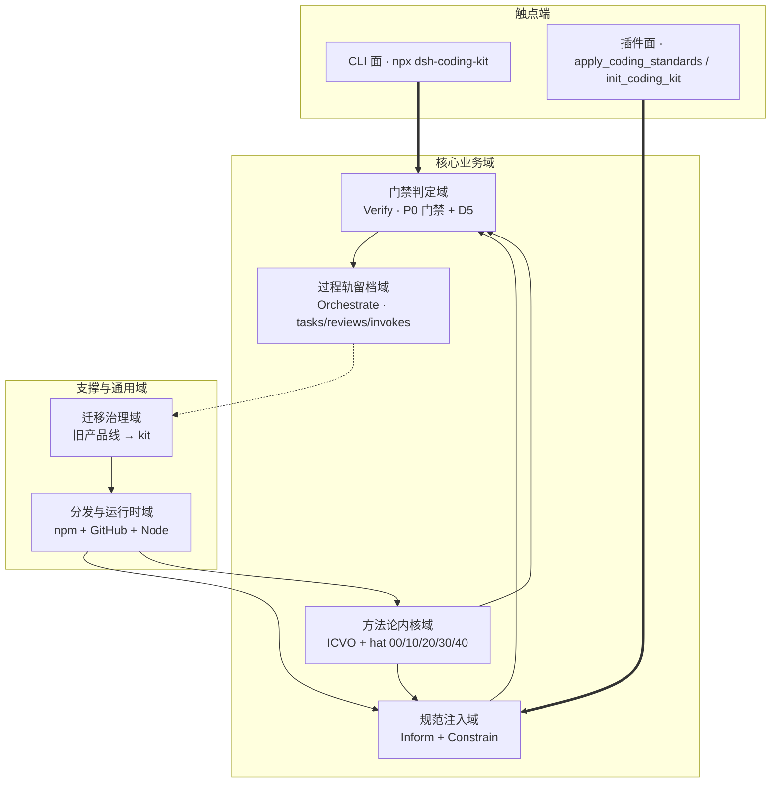

### 2.2 领域关系映射

#### 2.2.1 限界上下文清单

| 限界上下文 | 对应业务域 | 域类型 | 覆盖的核心业务实体 | 上下文边界（属于本域 vs 不属于） |
| --- | --- | --- | --- | --- |
| StandardInjection-BC | 规范注入域 | 核心域 | CodingStandard / L2Profile / InjectionBundle | 属于：规范资产、profile 档位、24k 注入截断；不属于：门禁判定、宿主契约实现 |
| GateVerify-BC | 门禁判定域 | 核心域 | GateCheck / ExitCode / D5TestArtifact | 属于：机械判定、退出码语义、failClosed；不属于：过程轨落盘、规范内容 |
| ProcessTrack-BC | 过程轨留档域 | 核心域 | Task / Review / Invoke / S2Prefix | 属于：tasks/reviews/invokes、close 守卫、S2 前缀；不属于：门禁判定、规范注入 |
| MethodKernel-BC | 方法论内核域 | 核心域 | Hat / ICVOPhase / Skill | 属于：hat 帽制、ICVO 四段、skills 封装；不属于：具体门禁实现、迁移语义 |
| MigrationGovern-BC | 迁移治理域 | 支撑域 | Manifest / FromVersion / LegacyLayout | 属于：manifest、from_version、IDE 块刷写、旧目录语义；不属于：门禁、过程轨 |
| Distribution-BC | 分发与运行时域 | 通用域 | NpmPackage / Release / Tarball | 属于：npm 分发、CI、运行时；不属于：业务能力层 |

**域类型说明**：

| 域类型 | 含义 | 投入策略 |
| --- | --- | --- |
| 核心域（Core） | 业务护城河，差异化竞争力所在 | 投入最多资源自研 |
| 支撑域（Supporting） | 必要但非差异化 | 可自研可外采 |
| 通用域（Generic） | 通用能力（如用户中心、消息中心） | 优先复用 / 外采 |

#### 2.2.2 上下文映射（Context Mapping）

| 关系编号 | 上游上下文 | 下游上下文 | 关系模式 | 同步方式 | 选择理由 |
| --- | --- | --- | --- | --- | --- |
| C-01 | DSH 宿主运行时（外部） | StandardInjection-BC | ACL（防腐层） | 宿主进程内调用 + 契约版本嗅探 | 宿主契约随上游版本演进（锚 0.1.0-rc.8），适配器隔离上游模型不污染本域 |
| C-02 | StandardInjection-BC | GateVerify-BC | Customer/Supplier | 同进程同步调用（落盘文件为中介） | 注入落盘后由门禁机械校验，上游配合下游判定节奏 |
| C-03 | GateVerify-BC | ProcessTrack-BC | Shared Kernel | 共享 S2 真值源常量 | S2 前缀是跨命令公共概念，必须唯一一致（X7 收敛目标），共享一小块常量 |
| C-04 | npm registry（外部） | Distribution-BC | Conformist | 遵循 npm semver / deprecate 语义 | 无议价能力的强势上游，直接遵循对方模型 |
| C-05 | MethodKernel-BC | 各 AI 编码宿主（2.0） | Published Language | AGENTS.md / Agent Skills 开放标准 | 多宿主共同消费，以开放标准暴露规范产物 |

**关系模式说明**：

| 关系模式 | 适用场景 |
| --- | --- |
| Customer/Supplier | 上下游强协作，下游能影响上游迭代节奏 |
| Conformist | 顺从者，下游完全遵循上游模型（如对接 npm registry） |
| ACL（Anticorruption Layer） | 在外部域和本域之间建一层适配，外部模型变化不影响本域 |
| Shared Kernel | 多个上下文共享一小块代码 / 模型；维护成本高，慎用 |
| Published Language | 上游以标准协议（AGENTS.md / SKILL.md）对外暴露，多下游消费 |

#### 2.2.3 跨域协作原则

| 原则编号 | 原则 |
| --- | --- |
| P-01 | 核心域 → 支撑域 / 通用域：禁止反向依赖（门禁域不依赖迁移治理域的内部模型） |
| P-02 | 核心域之间：禁止直接耦合，必须通过落盘文件 / 事件 / 共享常量解耦（注入域与门禁域以消费者落盘文件为中介） |
| P-03 | 对接外部不可控系统：必须建 ACL 防腐层（DSH 宿主契约走插件面适配，禁止把宿主模型贯穿到 CLI 面） |

### 2.3 详细业务架构

#### 2.3.1 用例图

**用例图清单**：

| 编号 | 用例图标题 | 涉及业务域 | 源文件位置 |
| --- | --- | --- | --- |
| UC-01 | CLI 门禁执行者 — P0 门禁与过程轨 | 门禁判定域 / 过程轨留档域 | `docs/uml/uc-01.puml`（本文档内嵌 Mermaid 等价图） |
| UC-02 | 宿主内开发者 — 规范注入与初始化 | 规范注入域 / 方法论内核域 | `docs/uml/uc-02.puml`（本文档内嵌 Mermaid 等价图） |

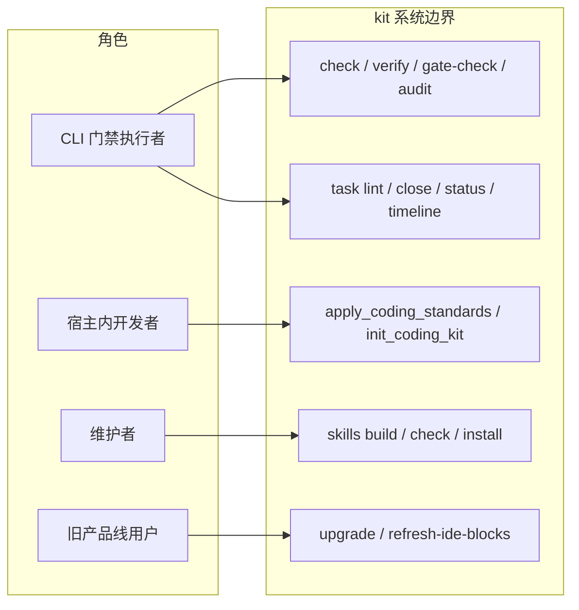

#### 2.3.2 业务流程图

**关键流程清单**（核心业务覆盖度 ≥ 80%）：

| 流程编号 | 流程名 | 起点 | 终点 | 涉及业务域 | 源文件位置 |
| --- | --- | --- | --- | --- |
| BF-01 | 规范注入 → 门禁 → 留档主链路 | 宿主内开发者触发注入 | 过程轨留档完成 | 规范注入 / 门禁判定 / 过程轨留档 | `docs/uml/bf-01.puml`（内嵌 Mermaid） |
| BF-02 | 旧产品线迁移流程 | 旧产品线用户执行 `upgrade` | 落盘迁移 + IDE 块刷新完成 | 迁移治理域 | `docs/uml/bf-02.puml`（内嵌 Mermaid） |

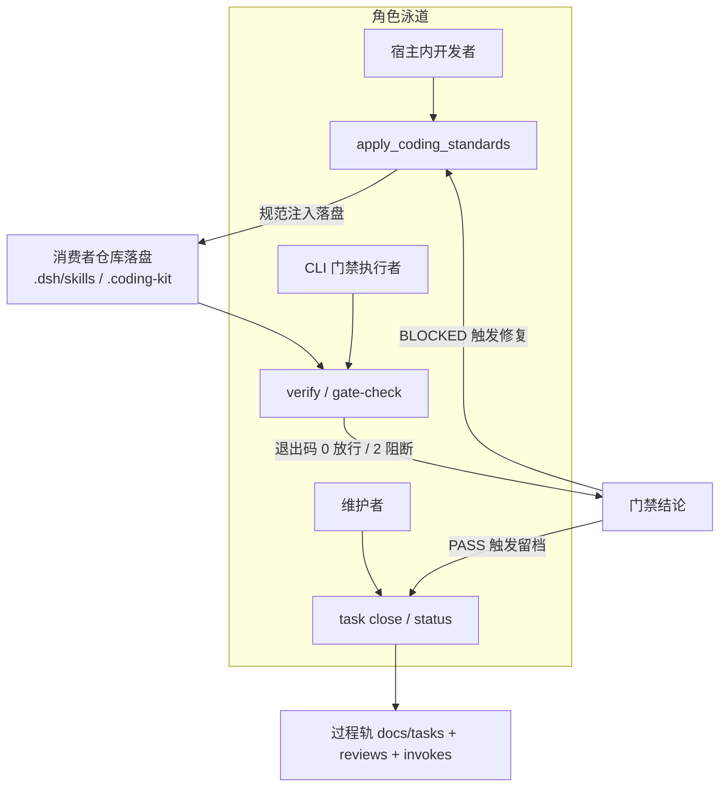

### 2.4 业务范围与边界

#### 2.4.1 功能模块清单

| 编号 | 一级功能名 | 子功能描述 | 对应业务域 | 实现状态 |
| --- | --- | --- | --- | --- |
| F1 | 过程轨留档 | — | 过程轨留档域 | — |
| F1.1 | — | S2 真值源唯一化：4 份硬编码前缀收敛为 1 份共享常量 | 过程轨留档域 | 完整实现 |
| F2 | P0 门禁 | — | 门禁判定域 | — |
| F2.1 | — | 门禁语义对齐：退出码 2 阻断 / failClosed / 分层强制 | 门禁判定域 | 完整实现 |
| F3 | 迁移治理 | — | 迁移治理域 | — |
| F3.1 | — | 旧产品线迁移时间表：deprecate + EOS + MIGRATION 文档 | 迁移治理域 | 完整实现 |
| F4 | 迁移治理 | — | 迁移治理域 | — |
| F4.1 | — | `.cyning-harness` 目录名语义收敛（X11） | 迁移治理域 | 完整实现 |
| F5 | 版本钉治理 | — | 分发与运行时域 | — |
| F5.1 | — | SPEC 钉版一致性做成发布前校验 | 分发与运行时域 | 完整实现 |
| F6 | 规范注入 | 宿主适配表（单一规范源 → N 宿主原生配置位，声明式适配表） | 规范注入域 | `[MOCK]` 2.0 阶段，1.x 只收敛真值源，不引入适配表 |
| N1 | 非功能 | 消费者仓库级隔离（无服务端多租户） | 跨域 | 完整实现 |
| N2 | 非功能 | 维持零云资源约束 | 跨域 | 完整实现 |

**编号规则**：

| 规则项 | 取值 |
| --- | --- |
| 一级编号 | `F1 / F2 / ...`，与一级业务域对应 |
| 子功能编号 | `F1.1 / F1.2 / ...`，互不重叠 |
| Mock / 简化标注 | 显式标注 `[MOCK]` 或 `[简化]`，附"完整版替换路径" |

**In-Scope（本期范围内）**：

| 编号 | 本期必做的事项 |
| --- | --- |
| F1 | S2 过程域真值源唯一化（X7 → R1） |
| F2 | P0 门禁语义对齐行业（退出码 2 / failClosed / 分层强制） |
| F3 | 旧产品线迁移治理（deprecate + EOS + MIGRATION） |
| F4 | `.cyning-harness` 目录名语义收敛（X11） |
| F5 | SPEC 钉版一致性发布前校验（X6 → R5） |
| N1 | 消费者仓库级隔离 |
| N2 | 维持零云资源约束 |

**Out-of-Scope（本期不做）**：

| 编号 | 不做的事项 | 不做的原因 | 未来归属 |
| --- | --- | --- | --- |
| O1 | 自研 IDE / 深度绑定单一宿主（R7） | 与 npm 包形态与零云优势冲突 | 永不做 |
| O2 | 商业化计费 / 团队席位（R8） | 内部一致性未收敛前商业化暴露信任风险 | MVP 外另行评估 |
| O3 | 第二分发通道 / 第三方 marketplace（R6） | 引入云依赖与第三方审核，击穿零云约束 | 后移 G5 |
| O4 | 云服务 / SaaS 化 | 本项目是本地 CLI + npm 分发，无任何云资源 | 永不做 |

### 2.5 质量与柔性可用

#### 2.5.1 服务质量目标

**质量目标 Top 4**：

| 优先级 | 质量目标 | 业务驱动 | 受影响的关键章节 |
| --- | --- | --- | --- |
| Q1 | 可维护性：S2 真值源唯一、内部一致性收敛 | 「永不覆写 S2」硬约束的实现一致性 | §3.2.M7 / §4.2 |
| Q2 | 可信度：门禁判定机械、一致、可解释 | 门禁结论跨命令一致率 100%（V1/V4） | §3.2.M2 / §3.5.1 |
| Q3 | 合规可控性：零云资源、离线可用 | 「无任何云资源」硬约束 | §5 / §6 / §7 |
| Q4 | 可移植性：跨平台、node 22/24 矩阵 | 消费者仓库环境异构 | §3.1.5 / §5.5 |

**可验证质量场景**：

| 场景编号 | 关联目标 | 触发源 | 触发条件 | 期望响应 | 度量指标 |
| --- | --- | --- | --- | --- |
| QS-01 | Q1 | 门禁执行 | 同一路径在不同命令（verify / refresh-ide-blocks / graph axioms / skills install）下判定是否命中 S2 | 结论一致 | S2 前缀硬编码份数 = 1；结论一致率 100% |
| QS-02 | Q2 | 门禁执行 | `verify --task` 不达标 / D5 缺测试制品 | 退出码 2 阻断，逐条列示 | 退出码 2；阻断语义与文档一致 |
| QS-03 | Q3 | 环境缺失 | npm registry 不可达 / 离线执行 | 已安装包照常执行 | 离线可用；无云依赖失败 |
| QS-04 | Q4 | 平台差异 | node 22.x 与 24.x 双矩阵 | CI 四门全绿 | 双矩阵 PASS；lib-smoke 编译产物一致 |

#### 2.5.2 业务柔性可用策略

**业务功能优先级分层**：

| 层级 | 含义 | 故障态下的处置方向 | 用户感知 |
| --- | --- | --- | --- |
| L0 核心业务 | 门禁判定 + S2 永不覆写 | 不降级；failClosed 失败即阻断 | 无 / 极轻微 |
| L1 重要业务 | 规范注入 / 过程轨留档 | 限流（dry-run 默认）+ 异步化（写前备份） | 变慢 / 排队提示 |
| L2 辅助业务 | 迁移辅助 / IDE 块刷新 | 关闭 / dry-run 兜底（DEF-029 只读） | 部分功能不可用 + 友好提示 |
| L3 附加业务 | 图谱 / 事件轨 / 文档一致性 | 直接关闭 + 异步补偿（hgm-ingest continue-on-error） | 通常无感 |

**业务降级清单**：

| 编号 | 关联功能（F-xx） | 触发条件 | 降级动作 | 用户感知 | 决策类型 |
| --- | --- | --- | --- | --- |
| BD-01 | F2.1 门禁 | 门禁判定不达标 | 退出码 2 阻断放行，逐条列示命中项 | 提示"门禁未通过，需修复后重试" | 自动 |
| BD-02 | F1.1 S2 保护 | 命令命中 S2 过程域 | 拒绝覆写并显式提示（永不覆写） | 提示"命中 S2 过程域，永不覆写" | 自动 |
| BD-03 | F3.1 迁移刷新 | git 工作区脏 / marker 畸形 | preflight fail-fast，拒写并提示先提交 | 提示"工作区未提交，先 commit/stash" | 自动 |

---

## 3. 应用架构

> 本章是系统设计的核心，占全文 40%~50%。回答：kit 由哪些模块组成、模块与外部系统怎么集成、模块内部交互链路是什么。

### 3.1 应用架构概览

#### 3.1.1 系统上下文

**系统上下文要素清单**（本系统画成单一节点，不展开内部组件）：

| 节点类型 | 节点名 | 与本系统的关系 | 关系语义 |
| --- | --- | --- | --- |
| 角色 | 宿主内开发者 | 使用 | 宿主内调用 `apply_coding_standards` / `init_coding_kit` |
| 角色 | CLI 门禁执行者 | 使用 | 执行 `npx dsh-coding-kit` 门禁与过程命令 |
| 角色 | 维护者 | 使用 | 发版 / CI / 迁移治理 |
| 角色 | 旧产品线用户 | 使用 | 从 `@cyning/harness` 迁移 |
| 上游平台 | DSH 宿主运行时 | 加载 → 本系统 | 宿主进程内加载插件（cordis） |
| 外部业务系统 | npm registry | 本系统 → 调用 | 包分发与版本解析、deprecate |
| 外部业务系统 | GitHub Actions | 本系统 → 调用 | CI 四门 / 图谱锁步 |
| 下游平台 | 消费者代码仓库 | 本系统 → 落盘 | 门禁执行 + 过程轨留盘 |

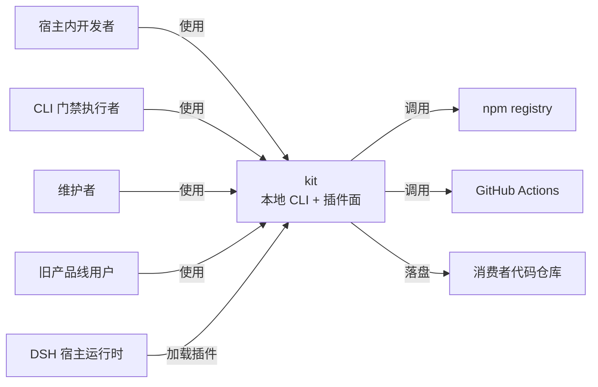

#### 3.1.2 系统模块图

**分层组件清单**（层次自上而下）：

| 层次 | 内容 | 数据来源 |
| --- | --- | --- |
| 接入层 | CLI 面（`npx dsh-coding-kit`）+ 插件面（`apply_coding_standards` / `init_coding_kit`） | §2.3 用例图角色 |
| 应用层 | M1 规范注入器 / M2 P0 门禁器 / M3 过程轨留档器 / M4 图谱与事件轨 / M5 迁移治理器 / M6 资产同步与 Skills 分发 / M7 公共基础设施 | §3.2 模块清单 |
| 基础能力层 | assets 资产库 / S2 过程域真值源 / 分发底座（npm + GitHub） | §3.1.3 / 高层架构 §5.1 |
| 集成对接层 | DSH 宿主（cordis/dsh-tools）/ npm registry / GitHub Actions | §3.1.3 外部依赖清单 |

```mermaid
flowchart TB
    subgraph L1[接入层]
        A1[CLI 面<br/>bin/dsh-coding-kit.js → cli.ts]
        A2[插件面<br/>src/index.ts apply()]
    end
    subgraph L2[应用层]
        M1[规范注入器]
        M2[P0 门禁器]
        M3[过程轨留档器]
        M4[图谱与事件轨]
        M5[迁移治理器]
        M6[资产同步与 Skills 分发]
        M7[公共基础设施 cli-shared + yaml]
    end
    subgraph L3[基础能力层]
        B1[assets 资产库<br/>standards/coding_wiki/graph/harness/ide/skills]
        B2[S2 过程域真值源<br/>docs/tasks + reviews + invokes]
        B3[分发底座<br/>npm + GitHub Releases + Actions]
    end
    A1 --> M2
    A1 --> M3
    A1 --> M5
    A2 --> M1
    M1 --> B1
    M2 --> M7
    M3 --> B2
    M4 --> B1
    M5 --> B3
    M6 --> B1
    M7 -.共享常量.- M2
    M7 -.共享常量.- M3
```

#### 3.1.3 集成架构

##### 外部依赖清单

| ID | 外部系统 | 归属团队 / 供应商 | 类别 | 使用方式 | 集成方式 | 协议 / 版本 | 功能定位 | 联系人 |
| --- | --- | --- | --- | --- | --- | --- | --- | --- |
| E-01 | DSH 宿主运行时 | DeepSeek Harness | 第三方业务平台 | 双向 | 宿主进程内 SDK（cordis） | cordis ^4.0.1；锚 0.1.0-rc.8 | 插件加载与宿主内工具注册 | 上游（README 锚定） |
| E-02 | npm registry | npm（外部厂商） | 第三方业务平台 | 消费 | npm CLI / HTTPS | npm semver；`npm deprecate` | 包分发 / 版本解析 / 迁移治理 | — |
| E-03 | GitHub Actions | GitHub（外部厂商） | 监控审计 | 双向 | OIDC 令牌 + workflow | workflow yaml | CI 四门 + 图谱锁步 | — |
| E-04 | 旧产品线 `@cyning/harness` | 本团队历史产品线 | 业务协作 | 消费 | 只读探测（`from_version` 迁移语义） | 旧包 2.x | 迁移治理的来源版本标记 | 维护者 |

**说明**：kit 无任何云组件（C-xx 清单整行删除，符合模板"不使用的组件整行删除"要求）；唯一运行时依赖为 npm 包 `js-yaml ^4.1.0`（见 §3.1.5 技术选型）。下表「云组件 / 基础设施清单」以"本地进程内基础设施"语义替换。

##### 云组件 / 基础设施清单（本项目语义适配为「进程内 / 文件系统组件」）

| ID | 组件类别 | 选型 | 部署形态 | 规格量级 | 容量预估 | 提供方 / SLA | 用途 |
| --- | --- | --- | --- | --- | --- | --- |
| C-01 | 落盘存储（manifest/graph/events） | 本地文件系统（JSON） | 消费者仓库内 | 无服务端 | manifest < 10KB；graph.json ≈ 32KB；events 月分片 | 本机文件系统 | 迁移/图谱/事件轨主数据 |
| C-02 | 资产存储 | 包内 `assets/`（md/yaml/example） | npm tarball 内 | 只读 | assets 整目录随包分发 | npm | 规范/skills/适配器资产 |
| C-03 | 过程轨存储 | 消费者仓库 `docs/`（yaml+md） | 消费者仓库内 | 只读保护 | S2 三目录永不覆写 | 本机文件系统 | tasks/reviews/invokes |
| C-04 | YAML 解析 | `js-yaml` | 进程内 | 单点封装 `yaml.ts` | 图谱/lifecycle/discipline 三源 | npm ^4.1.0 | YAML 读写 |

##### 组件依赖关系

| 业务模块（§3.2） | 依赖的外部系统（E-xx） | 依赖的进程内组件（C-xx） | 故障传导风险 |
| --- | --- | --- | --- |
| M1 规范注入器 | E-01 | C-02 | E-01 宿主契约变更 → 注入面需版本嗅探降级 |
| M2 P0 门禁器 | — | C-03、C-04 | C-03 S2 前缀不一致 → 门禁结论随命令漂移（X7） |
| M3 过程轨留档器 | — | C-03 | C-03 不可写 → close 守卫失败 |
| M4 图谱与事件轨 | — | C-01、C-04 | C-01 事件文件损坏 → snapshot/axioms 失败 |
| M5 迁移治理器 | E-02、E-04 | C-01 | E-02 npm 不可达 → 升级无法解析版本 |
| M6 资产同步与 Skills | — | C-02 | C-02 资产缺失 → skills build 失败 |
| M7 公共基础设施 | — | C-04 | C-04 js-yaml 缺失 → YAML 相关命令全部失败 |

#### 3.1.4 工程结构

```
dsh-coding-kit/
├── src/                          # 源码根（17 个 TS 模块，rootDir=src）
│   ├── index.ts                  # 插件面入口（apply_coding_standards / init_coding_kit）
│   ├── cli.ts                    # CLI 主入口（argv 解析 + 7 个一级命令实现）
│   ├── cli-shared.ts             # 公共基础设施（CliError/fail/takeOption/parseHarnessMeta）
│   ├── cli-checks.ts             # 门禁守卫实现（最大模块）
│   ├── cli-task-extra.ts         # task 扩展（sidecar/wiki_delta）
│   ├── cli-refresh-ide-blocks.ts # IDE 块刷写（R-07）
│   ├── cli-graph.ts              # graph 路由
│   ├── cli-graph-yaml.ts         # graph yaml 编译
│   ├── cli-graph-hgm.ts          # HGM 事件/公理
│   ├── cli-skills.ts             # skills 命令族
│   ├── cli-lifecycle.ts          # lifecycle/discipline
│   ├── cli-sync.ts               # sync index
│   ├── cli-sync-prompts.ts       # sync prompts
│   ├── cli-status.ts             # status
│   ├── cli-timeline.ts           # timeline
│   ├── cli-wiki.ts               # wiki export
│   └── yaml.ts                   # YAML 适配层（单点封装 js-yaml）
├── assets/                       # 资产库（随 npm 包分发）
│   ├── standards/                # Constrain 规范模板（L1/L2/SOURCES/POINTER）
│   ├── coding_wiki/              # Inform 资产（templates/topics）
│   ├── graph/                    # 图谱模板（.graph.yaml + stubs）
│   ├── harness/                  # Orchestrate 过程资产（prompts/templates/invokes/lifecycle/discipline）
│   ├── skills/                   # Agent Skills 封装（6 个 Starter 帽）
│   ├── ide/adapters/             # IDE 入口片段（Cursor/Claude/AGENTS）
│   ├── ci/samples/               # CI 样例（6 个 workflow）
│   ├── docs/                     # POINTER 薄指针页
│   └── ontology.yaml             # 方法论本体
├── test/                         # 测试族（40 份：39 根级 + lib-smoke 1）
├── bin/dsh-coding-kit.js         # CLI 壳（7 行 shim）
├── lib/                          # tsc 编译产物（17×3，不随源码分发）
├── docs/                         # 过程轨 + 自图谱（不随 npm 包发布）
│   ├── tasks/                    # S2 过程域
│   ├── harness/reviews/          # S2 过程域
│   ├── harness/invokes/by-task/  # S2 过程域
│   └── _tech_graph/              # 自图谱 dogfood（.graph.yaml 唯一编辑源）
├── package.json                  # 包元数据（files 白名单、engines、scripts）
├── tsconfig.json                 # TS 编译配置
└── cordis.patch.yml              # DSH bundle patch（- insert 形式）
```

**依赖方向**：业务命令模块（`cli-*.ts`）依赖公共基础设施（`cli-shared.ts`、`yaml.ts`），禁止反向；插件面（`index.ts`）与 CLI 面（`cli.ts` + `cli-*`）在源码层互不 import（两面零代码共享，见资料摘要 X7 关联发现）。

#### 3.1.5 技术选型（版本约束）

| 技术分类 | 选型 | 版本 | 备注 / 选型理由 |
| --- | --- | --- | --- |
| 运行时语言 | TypeScript | 5.8 | 团队规范固定；strict 模式 + ES2020 目标 |
| 运行时 | Node.js | `^22.19.0 || >=24.0.0` | engines 约束；`node --test --experimental-strip-types` 直跑 TS 源码 |
| 构建 | tsc（TypeScript Compiler） | 5.8 | 单一 tsc 产出 `lib/`；选 tsc 不选 esbuild/tsup：零额外依赖、`rewriteRelativeImportExtensions` 支撑 strip-types 实验特性 |
| 测试框架 | `node:test` + `node:assert/strict` | Node 内置 | 零第三方测试依赖；选它不选 jest/vitest：与"运行时依赖仅 js-yaml"的极简策略一致，且直接跑 TS 无转译 |
| 运行时依赖 | js-yaml | `^4.1.0` | 唯一运行时依赖；经 `yaml.ts` `createRequire` 单点封装，规避 ESM 互操作 |
| 宿主插件契约 | `@deepseek-ai/cordis`（peer optional） | `^4.0.1` | 插件面 `import type { Context }` 仅类型引入；optional 保证 CLI-only 可用 |
| 宿主工具注册 | `@deepseek-ai/dsh-tools`（peer optional） | `>=0.0.1-rc.1 <0.2.0` | `defineTool`；顶层静态导入，optional peer |
| 分发通道 | npm registry + npm CLI | — | 零云；`npm deprecate` 治理旧产品线；选 npm 不选第三方 marketplace：维持零云约束 |
| CI | GitHub Actions | workflow（ci.yml / tech-graph.yml） | 四步门禁 + 图谱锁步；node 22/24 矩阵 |
| 图谱 schema | 自研 `inform_graph.v3` | 3（schema_version） | graph_id 声明值真值源，`.graph.yaml` 唯一编辑源 |
| 观测 schema | 自研 `obs_status.v1` / `obs_timeline.v1` | 1 | 结构化观测契约 |
| 前端 | 无（CLI 产品，无 Web 前端） | — | 触点端为终端 + 宿主工具面板，无 SPA/SSR |

### 3.2 模块详细设计

#### 3.2.1 模块公共约束（Common）

**通信方式约束**：

| 约束项 | 取值 |
| --- | --- |
| 接口路径风格 | CLI 命令面（`<cmd> <sub> --flag`，扁平 if 链分派）+ 宿主工具（`apply()` 注册） |
| 协议 | 进程内函数调用 / 文件落盘（无网络 RPC） |
| 数据格式 | JSON（manifest/graph/events）+ YAML（graph/lifecycle/discipline）+ Markdown（tasks/reviews） |
| 字符编码 | UTF-8 |

**通用基础结构**：

| 基类 / 结构 | 用途 | 模块路径 |
| --- | --- | --- |
| `CliError` | 统一失败出口，携带 `exitCode`（默认 1，`fail()` 只 throw 不 exit） | `src/cli-shared.ts` |
| `fail(message, exitCode)` | 全项目统一失败出口，经异常冒泡到 `cli.ts` 落地退出码 | `src/cli-shared.ts` |
| `parseHarnessMeta` | 任务文档 `## Harness 元信息` 节解析（先到先得） | `src/cli-shared.ts` |
| `yamlLoad` / `yamlDump` | js-yaml 单点封装（仅 load/dump） | `src/yaml.ts` |
| `S2_TRUTH_PREFIXES` | S2 过程域前缀唯一真值常量（F1 交付物） | `src/cli-shared.ts`（收敛后新增） |

#### 3.2.2 模块清单与编号规则

**模块清单**：

| 编号 | 模块名 | 业务域（§2.1） | 模块负责人 | 关联子领域 |
| --- | --- | --- | --- | --- |
| M1 | 规范注入器（Inform/Constrain） | 规范注入域 | `@维护者` | `index.ts` + `assets/standards` + `assets/coding_wiki` |
| M2 | P0 门禁器（Verify） | 门禁判定域 | `@维护者` | `cli.ts` verify/gate-check/audit/check + `cli-checks.ts` + D5 |
| M3 | 过程轨留档器（Orchestrate） | 过程轨留档域 | `@维护者` | `cli.ts` task close + `cli-checks.ts` evalClose* + `cli-lifecycle.ts` + `cli-status.ts` + `cli-timeline.ts` |
| M4 | 图谱与事件轨（graph/wiki） | 过程轨留档域 | `@维护者` | `cli-graph.ts` + `cli-graph-yaml.ts` + `cli-graph-hgm.ts` + `cli-wiki.ts` |
| M5 | 迁移治理器（升级/迁移） | 迁移治理域 | `@维护者` | `cli.ts` cmdUpgrade/cmdInit + `cli-refresh-ide-blocks.ts` |
| M6 | 资产同步与 Skills 分发 | 方法论内核域 | `@维护者` | `cli-sync.ts` + `cli-sync-prompts.ts` + `cli-skills.ts` |
| M7 | 公共基础设施（shared/yaml/S2 真值源） | 跨域 | `@维护者` | `cli-shared.ts` + `yaml.ts` + 共享常量 |

**编号规则**：模块编号 `M{N}` 全局唯一；每个模块在 §3.2 下独立成节 `§3.2.M{N}`；节内五段式编号 `§3.2.M{N}.1` ~ `§3.2.M{N}.5`。

#### 3.2.3 单模块设计模板（五段式）

> 本节定义每个模块在 §3.2.M{N} 下五段各应产出什么内容。五段顺序固定：`.1 模块概述` / `.2 接口清单` / `.3 关键结构定义（DTO）` / `.4 模块逻辑时序图` / `.5 关键流程逻辑`。接口在本项目中为 CLI 命令 / 宿主工具（非 REST），"幂等性 / 鉴权"列对应"幂等语义 / 权限边界"。

#### 3.2.M1 规范注入器（Inform/Constrain）

##### §3.2.M1.1 模块概述

规范注入器覆盖「规范注入」与「初始化落盘」两个业务流程，业务逻辑在宿主内开发者与消费者仓库之间流动，涉及 DSH 宿主运行时（E-01）、包内 assets 资产库（C-02）、消费者仓库落盘（`.dsh/skills` / `.coding-kit`）。它对应插件面 `src/index.ts`，是 kit 与宿主运行时之间的 ACL 防腐层（上下文映射 C-01）。

##### §3.2.M1.2 接口清单

| 子领域 | 方法 | 路径 | 用途 | 请求 DTO | 响应 VO | 幂等 |
| --- | --- | --- | --- | --- | --- | --- |
| 规范注入 | apply | `apply_coding_standards`（宿主工具） | 注入纪律规范到 systemPrompt | `ApplyStandardsArgs` | `InjectionResult` | 是（persist 语义） |
| 初始化落盘 | init | `init_coding_kit`（宿主工具） | 复制 assets 到消费者仓 | `InitKitArgs` | `InitResult` | 是（no-clobber） |

##### §3.2.M1.3 关键结构定义（DTO）

```typescript
// 对应 src/index.ts apply_coding_standards / init_coding_kit
type ApplyStandardsArgs = {
  profile?: 'l1' | 'l1+l2' | 'full';   // 档位，默认 l1+l2；full 与 l1+l2 行为等价
  persist?: boolean;                    // 是否持久化注入，默认 true
};
type InitKitArgs = {
  dest?: '.coding-kit' | '.dsh/coding-kit'; // 目标目录白名单，默认 .coding-kit
};
type InjectionResult = {
  injectedFiles: string[];              // 实际注入的文件清单
  truncated: boolean;                   // 是否触发 24k 截断
};
type InitResult = {
  copied: string[];                     // 已复制相对路径
  skipped: string[];                    // 跳过（S2 命中 / 已存在）相对路径
};
```

| DTO / VO 名 | 字段名 | 类型 | 必填 | 业务含义 | 约束 / 默认值 |
| --- | --- | --- | --- | --- | --- |
| ApplyStandardsArgs | profile | string | 否 | 注入档位 | 枚举：l1 / l1+l2 / full |
| ApplyStandardsArgs | persist | boolean | 否 | 是否持久化 | 默认 true |
| InitKitArgs | dest | string | 否 | 目标目录 | 枚举：.coding-kit / .dsh/coding-kit |
| InjectionResult | truncated | boolean | 是 | 是否截断 | 24k 字符上限 |

##### §3.2.M1.4 模块逻辑时序图

| 编号 | 标题 | 场景类别 | 是否包含异常分支 |
| --- | --- | --- | --- |
| SQ-01 | 规范注入器 - apply_coding_standards 注入 | 核心动作执行 | 是 |

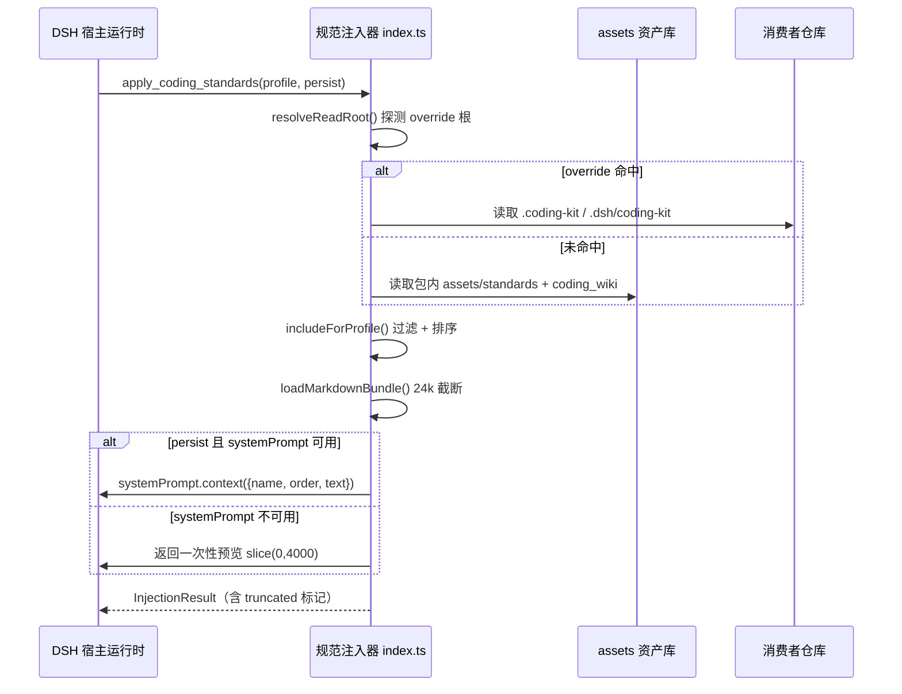

##### §3.2.M1.5 关键流程逻辑

无复杂状态机/事务/跨多步异步，本段省略。仅保留一条硬约束：`init_coding_kit` 采用 no-clobber（已存在即跳过）+ S2 跳过三重保护，永不覆写。

#### 3.2.M2 P0 门禁器（Verify）

##### §3.2.M2.1 模块概述

P0 门禁器覆盖 `check` / `verify` / `gate-check` / `audit` 四命令与 D5 测试制品探测，业务逻辑在 CLI 门禁执行者与消费者仓库之间流动，涉及 S2 过程域真值源（C-03）、task 元信息解析（C-03/C-04）。它是 kit 的核心差异化（机械判定，独立于宿主 hooks），对齐行业退出码 2 阻断 / failClosed 语义。

##### §3.2.M2.2 接口清单

| 子领域 | 方法 | 路径 | 用途 | 请求 DTO | 响应 VO | 幂等 |
| --- | --- | --- | --- | --- | --- | --- |
| 门禁 | verify | `verify --task / --spec / --with-wiki-lint` | 过程门禁机械判定 | `VerifyArgs` | `VerifyResult` | 天然（只读） |
| 门禁 | gate-check | `gate-check` | 闸门判定（阻断放行） | `GateCheckArgs` | `GateResult` | 天然 |
| 门禁 | audit | `audit` | 审计判定（D5 硬门禁） | `AuditArgs` | `AuditResult` | 天然 |
| 门禁 | check | `check` | 三向版本判定 | `CheckArgs` | `CheckResult` | 天然 |

##### §3.2.M2.3 关键结构定义（DTO）

```typescript
// 对应 cli.ts cmdVerify/cmdGateCheck/cmdAudit + cli-checks.ts
type VerifyArgs = { task?: string; spec?: string; withWikiLint?: boolean };
type ExitCode = 0 | 1 | 2;  // 0 放行 / 1 通用失败 / 2 门禁阻断（failClosed）
type VerifyResult = { ok: boolean; blocked: boolean; details: CheckDetail[] };
type CheckDetail = { code: string; reason: string; line?: number };
```

| DTO / VO 名 | 字段名 | 类型 | 必填 | 业务含义 | 约束 / 默认值 |
| --- | --- | --- | --- | --- | --- |
| VerifyArgs | task | string | 否 | task 文件路径 | verify 须指定 --task 或 --spec |
| VerifyArgs | withWikiLint | boolean | 否 | 纳入 wiki lint | 可选非破坏闸 |
| ExitCode | — | number | 是 | 退出码 | 枚举：0 / 1 / 2 |
| VerifyResult | blocked | boolean | 是 | 是否阻断 | blocked=true → exit 2 |

##### §3.2.M2.4 模块逻辑时序图

| 编号 | 标题 | 场景类别 | 是否包含异常分支 |
| --- | --- | --- | --- |
| SQ-02 | P0 门禁器 - verify --task 判定 | 核心动作执行 | 是 |

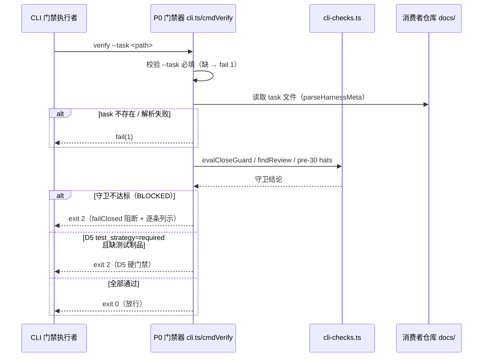

##### §3.2.M2.5 关键流程逻辑

```text
触发：verify --task <path>

Step 1: 参数校验（同步）
  ├── --task 缺失 → fail(1)「verify 须指定 --task」
  └── task 文件不存在 → fail(1)

Step 2: 守卫求值（同步，复用 cli-checks 单一实现源）
  ├── evalCloseGuard：13 守卫按 CLOSE_GUARD_ORDER 顺序求值
  ├── findReview：R<n> 审查文存在性闸（1.4.0 起接线）
  ├── pre-30 invoke hats：required ∩ {10,20,00} 硬闸
  └── D5 探测：test_strategy=required 时三级探测（强信号/文件名/CI 步骤）

Step 3: 退出码落盘
  ├── 任一守卫 BLOCKED → exit 2（阻断）
  ├── D5 缺制品 → exit 2
  └── 全过 → exit 0
```

**状态机迁移表**（门禁判定状态机）：

| 起始状态 | 触发事件 | 终止状态 | 触发条件 / 校验 | 副作用 |
| --- | --- | --- | --- | --- |
| IDLE | verify 调用 | EVALUATING | 参数校验通过 | 读取 task 元信息 |
| EVALUATING | 守卫求值完成 | PASS | 全部守卫通过 | exit 0 |
| EVALUATING | 守卫不达标 | BLOCKED | 任一守卫失败 | exit 2（阻断） |
| EVALUATING | D5 缺制品 | BLOCKED | test_strategy=required 且缺测试 | exit 2 |

#### 3.2.M3 过程轨留档器（Orchestrate）

##### §3.2.M3.1 模块概述

过程轨留档器覆盖 `task lint` / `task close` / `status` / `timeline` / `lifecycle` / `discipline`，业务逻辑在维护者与消费者仓库之间流动，涉及 S2 过程域真值源（C-03）。它落盘 `docs/tasks/`、`docs/harness/reviews/`、`docs/harness/invokes/by-task/`，遵守「永不覆写 S2」硬约束。

##### §3.2.M3.2 接口清单

| 子领域 | 方法 | 路径 | 用途 | 请求 DTO | 响应 VO | 幂等 |
| --- | --- | --- | --- | --- | --- | --- |
| 关账 | close | `task close [--json] [--yes]` | 任务关账（13 守卫 + done 快照） | `TaskCloseArgs` | `CloseResult` | 是（renameSync 唯绑归档） |
| 检查 | lint | `task lint` | 任务文件 lint | `TaskLintArgs` | `LintResult` | 天然 |
| 观测 | status | `status` | 任务状态观测 | `StatusArgs` | `StatusResult` | 天然 |
| 观测 | timeline | `timeline` | 任务时间线 | `TimelineArgs` | `TimelineResult` | 天然 |
| 生命周期 | lifecycle | `lifecycle show / dry-run` | 生命周期求值 | `LifecycleArgs` | `LifecycleResult` | 天然（dry-run 不写盘） |
| 纪律 | discipline | `discipline show` | 纪律覆盖台账 | `DisciplineArgs` | `DisciplineResult` | 天然 |

##### §3.2.M3.3 关键结构定义（DTO）

```typescript
// 对应 cli.ts cmdTaskClose + cli-checks.ts + cli-lifecycle.ts
type TaskCloseArgs = { task: string; json?: boolean; yes?: boolean };
type CloseGuardOutcome = { guard: string; pass: boolean; reason?: string };
type LifecycleState = 'draft' | 'signed' | 'in_progress' | 'done' | 'archived';
type StatusResult = { schema: 'obs_status.v1'; tasks: TaskStatus[] };
```

| DTO / VO 名 | 字段名 | 类型 | 必填 | 业务含义 | 约束 / 默认值 |
| --- | --- | --- | --- | --- | --- |
| TaskCloseArgs | yes | boolean | 否 | 是否真实归档 | 默认 dry-run（零写入） |
| LifecycleState | — | string | 是 | 生命周期状态 | 枚举：draft/signed/in_progress/done/archived |
| StatusResult | schema | string | 是 | 观测 schema | 固定 obs_status.v1 |

##### §3.2.M3.4 模块逻辑时序图

| 编号 | 标题 | 场景类别 | 是否包含异常分支 |
| --- | --- | --- | --- |
| SQ-03 | 过程轨留档器 - task close 守卫链 | 核心实体的发布 | 是 |

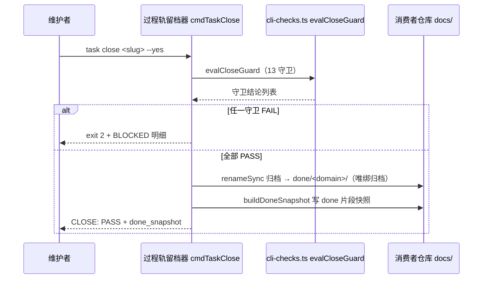

##### §3.2.M3.5 关键流程逻辑

**状态机迁移表**（生命周期状态机，来自 `assets/harness/lifecycle.yaml`）：

| 起始状态 | 触发事件 | 终止状态 | 触发条件 / 校验 | 副作用 |
| --- | --- | --- | --- | --- |
| draft | to_00 | signed | spec_reviews_retention 通过 | 记录事件 |
| signed | to_30 | in_progress | HG-AUDIT-R1 / HG-TASK-DRAFT / reviews_retention / audit_D5 / task_lint 五守卫全过 | 发送 pre-30 invoke |
| in_progress | close | done | close_invoke/self_check/acceptance/slug/status/review/graph_delta/kpi/experience/wiki_delta/wiki_promotion/pr_merged/hub_index 13 守卫全过 | renameSync 归档 + done 快照 |
| done | archive | archived | 归档完成 | 更新 Hub 索引 |

**状态机图**（生命周期状态机，与上表同源 `assets/harness/lifecycle.yaml`）：

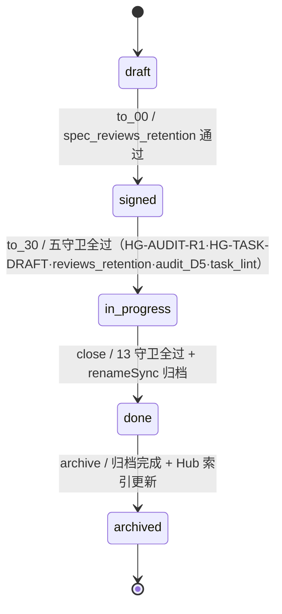

#### 3.2.M4 图谱与事件轨（graph/wiki）

##### §3.2.M4.1 模块概述

图谱与事件轨覆盖 `graph yaml compile/check/export`、`graph ingest/snapshot/axioms`、`wiki export`，业务逻辑在维护者与消费者仓库之间流动，涉及包内 graph 模板（C-02）、事件轨落盘（C-01）、YAML 解析（C-04）。它实现 YAML-first 技术图谱（唯一编辑源 `.graph.yaml`）与 HGM 事件幂等落盘。

##### §3.2.M4.2 接口清单

| 子领域 | 方法 | 路径 | 用途 | 请求 DTO | 响应 VO | 幂等 |
| --- | --- | --- | --- | --- | --- | --- |
| 图谱 | compile | `graph yaml compile --all / --graph-id` | 编译 yaml 源为 md | `GraphCompileArgs` | `CompileResult` | 是（generated_at 内容幂等） |
| 图谱 | check | `graph yaml check --all` | 比对 yaml 与 graph.json 切片 | `GraphCheckArgs` | `CheckResult` | 天然 |
| 图谱 | export | `graph yaml export` | 导出 graph.json | `GraphExportArgs` | `ExportResult` | 是 |
| 事件轨 | ingest | `graph ingest` | 仓库事件幂等摄入 | `IngestArgs` | `IngestResult` | 是（幂等键 type:subject[:状态]） |
| 事件轨 | snapshot | `graph snapshot` | 生成事件快照 | `SnapshotArgs` | `SnapshotResult` | 是 |
| 事件轨 | axioms | `graph axioms check` | HGM 公理校验 | `AxiomsArgs` | `AxiomsResult` | 天然 |
| wiki | export | `wiki export` | wiki 图导出 | `WikiExportArgs` | `WikiResult` | 天然 |

##### §3.2.M4.3 关键结构定义（DTO）

```typescript
// 对应 cli-graph-yaml.ts / cli-graph-hgm.ts / cli-wiki.ts
type GraphNode = { id: string; kind: 'flow' | 'struct' | 'external' };
type GraphEdge = { from: string; to: string; label?: string; anchors?: { path: string }[] };
type HgmEvent = { type: string; subject: string; data?: Record<string, unknown> };
type IdempotencyKey = string;  // type:subject[:状态摘要]
```

| DTO / VO 名 | 字段名 | 类型 | 必填 | 业务含义 | 约束 / 默认值 |
| --- | --- | --- | --- | --- | --- |
| GraphNode | id | string | 是 | 节点 id | 正则 `^[a-zA-Z_][a-zA-Z0-9_]*$` |
| GraphNode | kind | string | 是 | 节点类型 | 枚举：flow/struct/external |
| GraphEdge | anchors | array | 否 | 代码锚点 | 每项含 path |
| HgmEvent | type | string | 是 | 事件类型 | GateStatusChanged/TaskCreated/... |

##### §3.2.M4.4 模块逻辑时序图

| 编号 | 标题 | 场景类别 | 是否包含异常分支 |
| --- | --- | --- | --- |
| SQ-04 | 图谱与事件轨 - graph yaml pipeline | 核心动作执行 | 是 |

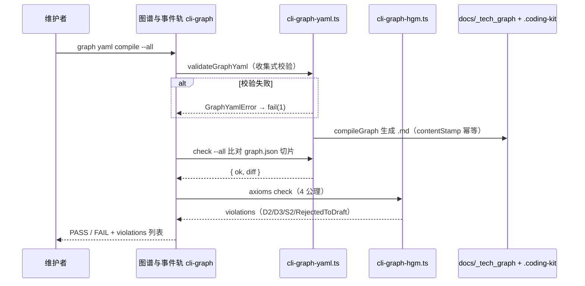

##### §3.2.M4.5 关键流程逻辑

无复杂状态机/事务/跨多步异步，本段省略。关键幂等约束：`graph ingest` 幂等键 `type:subject[:状态摘要]`（DEF-015）；`generated_at` 由 yaml 源 SHA-256 前 16 hex 派生（内容幂等非 wall-clock）。

#### 3.2.M5 迁移治理器（升级/迁移）

##### §3.2.M5.1 模块概述

迁移治理器覆盖 `upgrade` / `init` / `refresh-ide-blocks`，业务逻辑在旧产品线用户与消费者仓库之间流动，涉及 npm registry（E-02）、旧产品线 `@cyning/harness`（E-04）、manifest 落盘（C-01）。它承载 MVP F3/F4（旧产品线迁移时间表 + `.cyning-harness` 语义收敛）与 R-07 IDE 块刷写。

**经中间确认（用户裁决：方案 B「彻底收敛 + 降级兼容」，2026-09-07）**：本模块新落盘目录统一为 `.coding-kit`，`.cyning-harness` 仅作 legacy 探测标记（只读降级访问）；探测到旧目录时提示用户执行 `upgrade` 迁移，旧目录内容只读保留不删除。

##### §3.2.M5.2 接口清单

| 子领域 | 方法 | 路径 | 用途 | 请求 DTO | 响应 VO | 幂等 |
| --- | --- | --- | --- | --- | --- | --- |
| 升级 | upgrade | `upgrade [--yes]` | 钉版本升级（manifest 钉版） | `UpgradeArgs` | `UpgradeResult` | 是（版本钉比较） |
| 初始化 | init | `init` | 初始化落盘 + preset | `InitArgs` | `InitResult` | 是（no-clobber） |
| 刷新 | refresh | `refresh-ide-blocks [--yes / --dry-run]` | 刷写旧 IDE marker 块 | `RefreshArgs` | `RefreshReport` | 是（A4 防二刷） |

##### §3.2.M5.3 关键结构定义（DTO）

```typescript
// 对应 cli.ts cmdUpgrade/cmdInit + cli-refresh-ide-blocks.ts
type Manifest = {
  version: string;       // 当前钉版
  preset: string;        // 预设（VALID_PRESETS = ['harness-only']）
  ide: string[];         // IDE 适配清单
  from_version: string | null;  // 旧产品线来源版本（迁移语义）
  upgraded_at: string;   // 升级时间
};
type RefreshReport = { schema: 'dsh-coding-kit/refresh-ide-blocks-report@1'; exit: 0 };
```

| DTO / VO 名 | 字段名 | 类型 | 必填 | 业务含义 | 约束 / 默认值 |
| --- | --- | --- | --- | --- | --- |
| Manifest | from_version | string/null | 否 | 旧产品线版本 | kit 线（1.x）不算跨产品线 |
| Manifest | preset | string | 是 | 预设 | 枚举：harness-only |
| RefreshReport | exit | number | 是 | 退出码 | 字面量 0 |

##### §3.2.M5.4 模块逻辑时序图

| 编号 | 标题 | 场景类别 | 是否包含异常分支 |
| --- | --- | --- | --- |
| SQ-05 | 迁移治理器 - upgrade 钉版 | 核心动作执行 | 是 |

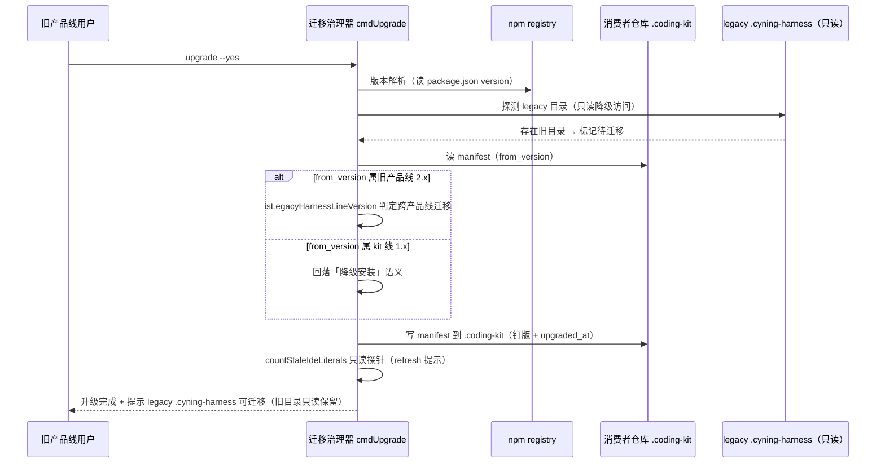

##### §3.2.M5.5 关键流程逻辑

```text
触发：upgrade --yes

Step 1: 版本钉比较（同步）
  ├── 读当前版本（HARNESS_VERSION 后门 → package.json version → 'unknown'）
  └── 读 manifest.from_version 判跨产品线（isLegacyHarnessLineVersion）

Step 2: manifest 落盘
  ├── 写 version / preset / ide / from_version / upgraded_at
  └── no-clobber：已存在不覆写（init 语义）

Step 3: 只读探针
  └── countStaleIdeLiterals（永不抛错·不读写 manifest·不写文件）

Step 4: refresh-ide-blocks（R-07，仅 --yes 路径）
  ├── preflight 四道 fail-fast：assertNotS2 → git dirty 拒写 → malformed 拒写 → mixed 拒写
  ├── 写前 5 代备份 → atomicWrite（tmp+rename）→ pruneBackups 保留 5 代
  └── 退出码统一 2（阻断语义）
```

#### 3.2.M6 资产同步与 Skills 分发

##### §3.2.M6.1 模块概述

资产同步与 Skills 分发覆盖 `sync index` / `sync prompts` / `skills build` / `skills check` / `skills install`，业务逻辑在维护者与消费者仓库之间流动，涉及包内 assets 资产库（C-02）、`.dsh/skills` 落盘。它承接方法论内核域（hat 帽制 → skills 封装）与 Starter 帽同步白名单。

##### §3.2.M6.2 接口清单

| 子领域 | 方法 | 路径 | 用途 | 请求 DTO | 响应 VO | 幂等 |
| --- | --- | --- | --- | --- | --- | --- |
| 同步 | index | `sync index` | 生成 invoke 索引 | `SyncIndexArgs` | `IndexResult` | 是 |
| 同步 | prompts | `sync prompts [--yes/--force]` | 同步 Starter 帽（sha256 三分） | `SyncPromptsArgs` | `SyncPromptsResult` | 是（sha256） |
| 技能 | build | `skills build [--with-execute-hats]` | 生成 skills 产物 | `SkillsBuildArgs` | `BuildResult` | 是 |
| 技能 | check | `skills check` | 校验产物与源一致 | `SkillsCheckArgs` | `CheckResult` | 天然 |
| 技能 | install | `skills install --target` | 安装技能树 | `SkillsInstallArgs` | `InstallResult` | 是（no-clobber） |

##### §3.2.M6.3 关键结构定义（DTO）

```typescript
// 对应 cli-sync-prompts.ts / cli-skills.ts
type SyncClass = 'add' | 'skip' | 'conflict';  // sha256 三分
type SkillFrontmatter = { name: string; description: string; track?: string };
type SkillName = string;  // kebab-case，正则 ^[a-z0-9]+(-[a-z0-9]+)*$
```

| DTO / VO 名 | 字段名 | 类型 | 必填 | 业务含义 | 约束 / 默认值 |
| --- | --- | --- | --- | --- | --- |
| SyncClass | — | string | 是 | 同步分类 | 枚举：add/skip/conflict |
| SkillFrontmatter | name | string | 是 | 技能名 | kebab-case |
| SkillFrontmatter | track | string | 否 | 轨道 | starter / starter-experimental |

##### §3.2.M6.4 模块逻辑时序图

| 编号 | 标题 | 场景类别 | 是否包含异常分支 |
| --- | --- | --- | --- |
| SQ-06 | 资产同步 - sync prompts 三分类 | 核心动作执行 | 是 |

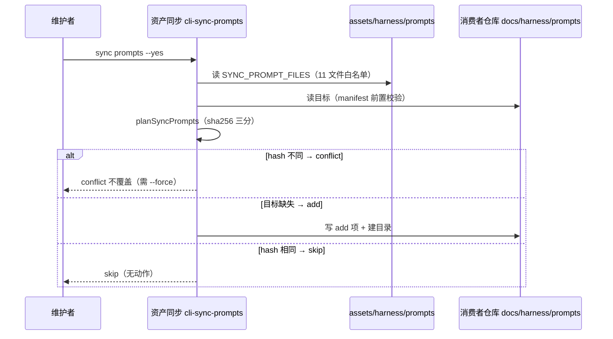

##### §3.2.M6.5 关键流程逻辑

无复杂状态机/事务/跨多步异步，本段省略。关键约束：`sync prompts` 默认 dry-run 零写入；conflict 默认不覆盖，`--force` 显式覆盖；`skills build` 产物为生成物（勿手改），`skills check` 拦 drift。

#### 3.2.M7 公共基础设施（shared/yaml/S2 真值源）

##### §3.2.M7.1 模块概述

公共基础设施是跨模块公共能力（对应 §3.4），覆盖 `cli-shared.ts`（CliError/fail/takeOption/parseHarnessMeta）、`yaml.ts`（js-yaml 单点封装）、以及 F1 交付的 S2 真值源共享常量。它被 M2/M3/M4/M5/M6 复用，是"永不覆写 S2"硬约束的唯一实现源。

##### §3.2.M7.2 接口清单

| 子领域 | 方法 | 路径 | 用途 | 请求 DTO | 响应 VO | 幂等 |
| --- | --- | --- | --- | --- | --- | --- |
| 错误 | fail | `fail(message, exitCode)` | 统一失败出口 | string | never | 天然 |
| 元信息 | parse | `parseHarnessMeta(content)` | 解析 Harness 元信息节 | string | MetaMap | 天然 |
| YAML | load | `yamlLoad(text)` | YAML 解析 | string | unknown | 天然 |
| S2 判定 | isS2 | `isS2Path(relPath)` | 判定是否命中 S2 过程域 | string | boolean | 天然 |

##### §3.2.M7.3 关键结构定义（DTO）

```typescript
// 对应 cli-shared.ts / yaml.ts + F1 收敛后新增共享常量
class CliError extends Error { readonly exitCode: number; }  // 默认 1
function fail(message: string, exitCode = 1): never;         // throw new CliError
// F1 收敛后：S2 前缀唯一真值（消除 X7 四份硬编码）
const S2_TRUTH_PREFIXES = [
  'docs/tasks',
  'docs/harness/reviews',
  'docs/harness/invokes/by-task',
] as const;
function isS2Path(rel: string): boolean;  // 全项目唯一 S2 判定
```

| DTO / VO 名 | 字段名 | 类型 | 必填 | 业务含义 | 约束 / 默认值 |
| --- | --- | --- | --- | --- | --- |
| CliError | exitCode | number | 是 | 退出码 | 默认 1；门禁阻断 2 |
| S2_TRUTH_PREFIXES | — | readonly array | 是 | S2 前缀真值 | 收敛后唯一 |

##### §3.2.M7.4 模块逻辑时序图

| 编号 | 标题 | 场景类别 | 是否包含异常分支 |
| --- | --- | --- | --- |
| SQ-07 | 公共基础设施 - fail 统一退出码出口 | 异常/补偿 | 是 |

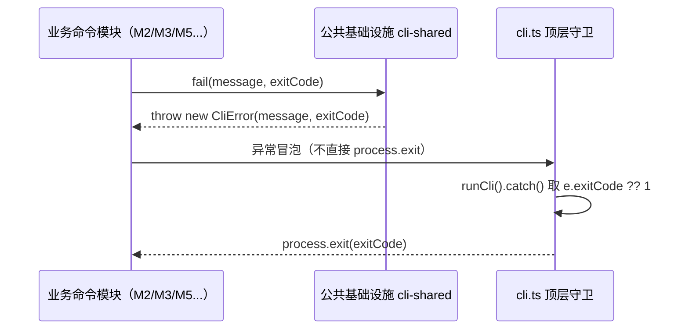

##### §3.2.M7.5 关键流程逻辑

无复杂状态机/事务/跨多步异步，本段省略。核心约束：`fail()` 只 throw 不 exit，退出码经异常冒泡到 `cli.ts` 统一落地——这是全项目唯一的失败出口（避免多模块散落 `process.exit`）。

### 3.3 核心业务对象清单

#### 3.3.1 对象定义

| 编号 | 对象名（代码类名） | 对象类型 | 包路径 | 模块归属 | 被哪些模块复用 | 实例化策略 | 序列化约定 | 持久化策略 |
| --- | --- | --- | --- | --- | --- | --- | --- | --- |
| O-01 | `Manifest` | 聚合根 | `src/cli.ts` | M5 迁移治理器 | M5 / M6 | 工厂 `readManifest()` | JSON | 落盘 `.coding-kit/manifest.json`（legacy `.cyning-harness/manifest.json` 只读探测） |
| O-02 | `HgmEvent` | 实体 | `src/cli-graph-hgm.ts` | M4 图谱与事件轨 | M4 | 幂等键 `type:subject[:状态]` | JSON | 落盘 `.coding-kit/events/<月分片>`（legacy `.cyning-harness/events/` 只读探测） |
| O-03 | `GraphNode` / `GraphEdge` | 值对象 | `src/cli-graph-yaml.ts` | M4 图谱与事件轨 | M4 | new（不可变） | YAML/JSON | 落盘 `*.graph.yaml` → `graph.json` |
| O-04 | `Task` | 聚合根 | `src/cli-shared.ts` | M3 过程轨留档器 | M2 / M3 | parseHarnessMeta | Markdown | 落盘 `docs/tasks/*` |
| O-05 | `Hat` / `HatId` | 共享枚举 | `src/cli-checks.ts` | M2 门禁器 | M2 / M3 / M6 | 常量词表 | String | `assets/harness/prompts/*` + `skills/*` |
| O-06 | `ExitCode` | 共享枚举 | `src/cli-shared.ts` | M7 公共基础设施 | 全部 | 字面量 | number | 进程退出码（0/1/2） |
| O-07 | `InjectionBundle` | 值对象 | `src/index.ts` | M1 规范注入器 | M1 | loadMarkdownBundle | String | 注入 systemPrompt（不落盘） |
| O-08 | `S2_TRUTH_PREFIXES` | 共享常量 | `src/cli-shared.ts` | M7 公共基础设施 | M1 / M2 / M3 / M4 / M6 | 冻结数组 | as const | 代码内唯一真值（F1） |
| O-09 | `CliError` | 领域异常 | `src/cli-shared.ts` | M7 公共基础设施 | 全部 | `fail()` 抛出 | — | 不落盘（瞬时） |
| O-10 | `DshHostAdapter` | 防腐层 ACL | `src/index.ts` | M1 规范注入器 | M1 | new + 适配 | — | 不落表，瞬时转换 |

**对象类型说明**：

| 类型 | 含义 |
| --- | --- |
| 聚合根（Aggregate Root） | 业务一致性边界；外部引用必须通过聚合根 ID |
| 实体（Entity） | 有标识、生命周期独立，但归属某个聚合根 |
| 值对象（Value Object） | 无标识、不可变；如金额、时间段、地址 |
| 共享 DTO | 跨模块传输用的数据结构，无业务行为 |
| 共享枚举 | 跨模块的状态值 / 类型值 |
| 防腐层 ACL | 对接外部系统时的转换层（与 §2.2 ACL 关系对齐） |

#### 3.3.2 命名漂移登记表

| 业务实体（§2） | 代码类名（§3.3.1） | 落盘格式（§4.2） | 漂移原因 |
| --- | --- | --- | --- |
| 迁移治理 | `Manifest` | `.coding-kit/manifest.json` | X11 已收敛（**经中间确认用户裁决方案 B，2026-09-07**）：目录随产品更名迁移到 `.coding-kit`，`.cyning-harness` 降级为 legacy 探测标记（只读降级访问） |
| 事件轨 | `HgmEvent` | `.coding-kit/events/` + `graph/snapshot.json` | 随 X11 一并收敛到 `.coding-kit`，`.cyning-harness/events/` 仅作 legacy 只读探测 |
| 过程轨 | `Task` | `docs/tasks/` + `docs/harness/reviews/` + `docs/harness/invokes/by-task/` | 业务单一"过程轨"在落盘层拆为三目录（S2 过程域） |

### 3.4 跨模块公共能力

| 公共能力 | 简述 | 提供方（SDK / 切面 / Bean） | 被哪些模块复用 | 接入方式 |
| --- | --- | --- | --- | --- |
| 统一失败出口 | `fail()` 只 throw 不 exit，退出码经异常冒泡统一落地 | `src/cli-shared.ts` `CliError` + `fail` | M2 / M3 / M4 / M5 / M6 | 直接 `import { fail }` |
| S2 真值源判定 | 「永不覆写 S2」唯一实现源 | `src/cli-shared.ts` `S2_TRUTH_PREFIXES` + `isS2Path` | M1 / M2 / M3 / M4 / M6 | 直接 `import` 共享常量（F1 收敛） |
| Harness 元信息解析 | `## Harness 元信息` 节解析（先到先得） | `src/cli-shared.ts` `parseHarnessMeta` | M2 / M3 / M4 | 直接函数调用 |
| YAML 读写 | js-yaml 单点封装 | `src/yaml.ts` `yamlLoad` / `yamlDump` | M4 / M6 | `import` 转引 yaml.ts |
| 目录候选常量 | 兼容多种消费者仓布局 | `src/cli-checks.ts` / `src/cli-task-extra.ts` | M2 / M3 | 直接 `import`（X12 去重后收敛为单份） |

**填写说明**：上表能力以"共享模块 / 共享常量"形式提供（本项目无 Spring AOP / 注解体系），接入方式均为 TypeScript `import`。

### 3.5 接口契约

#### 3.5.1 全局错误码体系

**错误码格式**：

| 项 | 取值 |
| --- | --- |
| 错误码格式 | 6 位字符串：1 位类别 + 2 位模块 + 3 位错误序号，例：`A02001` |
| 分段规则 | 类别（A/B/C）+ 模块（01~06）+ 序号（001~999） |
| 类别取值 | `A` = 业务/门禁语义失败（退出码 2 或 1）/ `B` = 系统错误（退出码 1）/ `C` = 客户端错误（退出码 1） |

**错误响应统一结构**（CLI 退出码 + 结构化 JSON，`--json` 时输出）：

```json
{
  "code": "A02001",
  "msg": "命中 S2 过程域，拒绝覆写",
  "exitCode": 2,
  "traceId": "abc123",
  "timestamp": "2026-09-04T10:00:00Z"
}
```

**错误码注册表**（模块 01=CLI 通用 / 02=门禁 / 03=过程轨 / 04=图谱 / 05=迁移 / 06=skills）：

| 错误码 | 退出码 | 所属模块 | 含义 | 重试建议 | 用户文案 |
| --- | --- | --- | --- | --- | --- |
| C01001 | 1 | M7 通用 | 未知命令 | 不重试 | 未知命令，请用 --help 查看用法 |
| C01002 | 1 | M7 通用 | 参数校验失败 | 不重试 | 参数错误 |
| C01003 | 1 | M7 通用 | 互斥旗标冲突 | 不重试 | 旗标不可同现（如 --yes 与 --dry-run） |
| A02001 | 2 | M2 门禁 | S2 过程域命中，拒绝覆写 | 不重试 | 命中 S2 过程域，永不覆写 |
| A02002 | 2 | M2 门禁 | D5 缺测试制品 | 补齐后重试 | test_strategy=required 缺测试制品 |
| A02003 | 2 | M2 门禁 | 门禁 BLOCKED | 修复后重试 | 门禁未通过，阻断放行 |
| A03001 | 2 | M3 过程轨 | task close 守卫未过 | 修复后重试 | 关账守卫未通过 |
| A04001 | 2 | M4 图谱 | HGM 公理未通过 | 修复后重试 | HGM axioms 未通过 |
| A05001 | 1 | M5 迁移 | git 工作区脏，拒写 | 提交后重试 | 工作区未提交，先 commit/stash |
| A05002 | 1 | M5 迁移 | marker 块畸形 | 修复后重试 | IDE 块畸形，无法刷写 |
| B99001 | 1 | 全局 | 系统内部错误 | 可重试 | 系统繁忙，请稍后再试 |

#### 3.5.2 幂等性约定

| 接口类型 | 是否要求幂等 | 幂等键来源（建议） |
| --- | --- | --- |
| 写入类（init/upgrade/skills install） | 必须幂等 | no-clobber（目标已存在即跳过）+ 版本钉比较 |
| 更新类（sync prompts） | 必须幂等 | sha256 内容哈希（add/skip/conflict 三分） |
| 删除/归档类（task close） | 必须幂等 | renameSync 唯绑归档事件（快照存在性唯绑归档） |
| 查询类（status/timeline/check） | 天然幂等 | — |
| 事件摄入（graph ingest） | 强制幂等 | 业务侧幂等键 `type:subject[:状态摘要]`（DEF-015） |
| 刷新类（refresh-ide-blocks） | 强制幂等 | A4 防二刷（命中位置前已含现行字面即不改） |

**幂等设计需考虑的问题**：

| 问题维度 | 设计要点 |
| --- | --- |
| 幂等键的生命周期 | ingest 幂等键永久保留（事件文件不重写，新键自变更点生效） |
| 重复请求的语义 | sync prompts 返回 conflict；ingest 返回 skipped 计数 |
| 执行中态的处理 | 单进程同步执行，无并发执行中态 |
| 失败请求的可重试性 | dry-run 零写入，失败可安全重试 |
| 存储兜底 | 落盘文件作为唯一真值源，无缓存丢失风险 |

#### 3.5.3 限流约定

> 本项目为本地 CLI，无服务端 QPS 限流；限流语义映射为「本地并发写互斥 + dry-run 默认」。

| 维度 | 默认值 | 触发动作 | 调整方式 |
| --- | --- | --- | --- |
| 全局并发写 | 单进程串行（`--test-concurrency=1`） | 写冲突时 no-clobber 跳过 | 代码内 |
| 单消费者仓库写 | 1 进程 / 仓库（无跨进程锁） | preflight fail-fast 拒写 | 代码内 |
| 单 IP QPS | 不适用（本地，无网络入口） | — | — |
| 单用户 QPS | 不适用（本地） | — | — |
| 重保命令（verify/gate-check） | 高频只读，无写副作用 | 天然幂等 | — |

**降级策略**：

| 策略项 | 内容 |
| --- | --- |
| dry-run 默认 | `sync prompts` / `refresh-ide-blocks` 默认零写入，`--yes` 才写盘 |
| preflight 四闸 | refresh-ide-blocks 写前四道 fail-fast（S2/git 脏/malformed/mixed） |
| 只读兜底 | DEF-029 无 marker 文件只读检出，绝不改写 |

#### 3.5.4 默认超时与重试基线

| 调用类型 | 默认超时 | 默认重试 | 重试条件 |
| --- | --- | --- | --- |
| 进程内同步调用（模块间） | 无网络超时（同步） | 0 次 | — |
| npm registry 调用（E-02） | 60s | 0 次（本地 npm CLI 自行重试） | 仅网络错误 |
| GitHub Actions（E-03） | CI job 上限 | 0 次（workflow 重跑由人触发） | — |
| 文件系统写（落盘） | 无（同步） | 0 次 | — |

**说明**：本地 CLI 无分布式超时/重试语义；重试能力由外层（CI 重跑 / 人重跑命令）承担，重试依赖 §3.5.2 幂等性保证无副作用。

#### 3.5.5 路由设计规范

**CLI 命令路由规范**（本项目无 HTTP API，映射为 CLI 命令面）：

| 维度 | 取值 |
| --- | --- |
| 风格 | CLI 命令面（`<cmd> <sub> --flag`，扁平 if 链分派） |
| 版本控制 | `--version` / `-V` 输出版本号 |
| 命名 | kebab-case（`refresh-ide-blocks` / `gate-check`） |
| 资源命名 | 名词（`task` / `graph` / `skills` / `wiki` / `sync`） |
| 子命令 | `<cmd> <sub>`（如 `graph yaml compile` / `task close`） |
| 动作类接口 | `--yes` / `--dry-run` / `--force` / `--json` 旗标 |

**前端页面路由清单**（本项目无 Web 前端，映射为 CLI 触点端）：

| 路径 | 页面 / 功能 | 入口角色（§2.3） | 鉴权要求 | 关联模块（§3.2.M{N}） |
| --- | --- | --- | --- | --- |
| `npx dsh-coding-kit verify --task` | P0 门禁输出 | CLI 门禁执行者 | 本地（无网络鉴权） | M2 |
| `npx dsh-coding-kit task close` | 关账输出 | 维护者 | 本地 | M3 |
| `dsh plugin add dsh-coding-kit` | 插件安装面 | 宿主内开发者 | DSH 宿主加载 | M1 |
| `apply_coding_standards` | 规范注入面板 | 宿主内开发者 | 宿主工具注册 | M1 |
| `npx dsh-coding-kit upgrade --yes` | 升级面板 | 旧产品线用户 | 本地 | M5 |

---

## 4. 数据库设计

> 本章语义适配：本项目无数据库，落盘数据为本地文件（JSON/YAML/Markdown）。「单表设计」适配为「落盘格式 schema 设计」，保留五段式结构。

### 4.1 全局数据约定

| 约定项 | 取值 | 说明 |
| --- | --- | --- |
| 命名规范（落盘目录） | S2 三域 `docs/tasks/` + `docs/harness/reviews/` + `docs/harness/invokes/by-task/`；迁移域 `.coding-kit/`（legacy `.cyning-harness/` 仅作探测标记，只读降级访问） | 全项目统一前缀 |
| 命名规范（字段名） | JSON snake_case / YAML snake_case | 禁止驼峰 |
| 主键类型 | 事件幂等键 `type:subject[:状态摘要]`；graph_id 声明值 | 全项目统一 |
| 字符集 / 排序 | UTF-8 | 支持中文与多语言 |
| 时间字段类型 | UTC 秒级（`toISOString().replace(/\.\d{3}Z$/, 'Z')`） | 统一时区 UTC |
| 软删除字段 | 无（落盘文件物理删除 / 归档） | 归档而非软删 |
| 审计字段 | task 元信息表（task_slug/git_branch/related_pr/created 等） | 命名锁定 |
| 隔离字段（多租户） | 消费者仓库级隔离（git root 路径），无服务端 tenant_id | 本地隔离 |
| 业务唯一标识 | 幂等键 / sha256 内容戳 | 与外部对齐时使用 |
| 状态枚举 | YAML 字符串（lifecycle 5 状态 / discipline 4 级） | DDL 注释列出全部取值 |
| 版本字段 | 版本钉（SPEC/ontology/discipline 三处 `as_of_package_version`） | 发布前一致性校验 |

### 4.2 单表设计

> 每类落盘格式严格按下面 5 段编写。以下以 `manifest.json` 为主例，`graph.json` 与 task/review md 在各段补充。

#### 4.2.1 库表元信息

| 字段 | 取值 |
| --- | --- |
| 数据库类型 | 本地文件系统（JSON 落盘） |
| 库名 | 消费者仓库根 `.coding-kit/`（legacy `.cyning-harness/` 仅探测，只读降级访问） |
| 表名 | `manifest.json` |
| 业务含义 | 记录消费者仓库的 kit 安装钉版与迁移来源（from_version） |
| 模块归属（§3.2） | M5 迁移治理器 |
| 对应核心对象（§3.3） | O-01 `Manifest` |

#### 4.2.2 库表结构定义

| 列名 | 数据类型 | 可为空 | 约束 | 默认值 | 备注 |
| --- | --- | --- | --- | --- | --- |
| version | string | NOT NULL | — | 当前版本 | 当前钉版号 |
| preset | string | NOT NULL | 枚举 | 'harness-only' | VALID_PRESETS 唯一合法值 |
| ide | string[] | NULL | — | [] | IDE 适配清单 |
| from_version | string | NULL | — | null | 旧产品线来源版本（迁移语义） |
| upgraded_at | string | NULL | — | 升级时间 | UTC 秒级 |

**graph.json 补充结构**（对应 O-03）：`schema_version=graph_v2` / `freeze_id` / `generated_at=sha256-16hex` / `graphs[]`（id/title/source_yaml_path）/ `nodes[]`（id/kind/label）/ `edges[]`（from/to/label/anchors）。

**task/review md 补充结构**（对应 O-04）：`## Harness 元信息` 表（task_slug/test_strategy/code_quality_bar/related_pr 等）+ `## 人工闸` 表 + 正文章节。

#### 4.2.3 索引设计

| 索引名 | 索引类型 | 字段（含顺序） | 设计目的 | 关联查询场景 |
| --- | --- | --- | --- | --- |
| PRIMARY | 主键 | manifest 路径（唯一） | 唯一标识 | `upgrade` 读 manifest |
| uk_event_key | 唯一键 | 事件幂等键 `type:subject[:状态]` | 幂等去重 | `graph ingest` 差集计算 |
| idx_events_month | 分片键 | 事件月分片目录 | 按月分片 | `loadEvents` 按月加载 |
| uk_graph_id | 唯一键 | graph_id 声明值 | 图谱唯一 | `--graph-id` 定位 |
| idx_task_slug | 唯一键 | task_slug 归一化 | task 去重 | `task close` 定位 |

#### 4.2.4 DDL

```json
{
  "$schema": "http://json-schema.org/draft-07/schema#",
  "title": "Manifest",
  "type": "object",
  "required": ["version", "preset"],
  "properties": {
    "version": { "type": "string", "description": "当前钉版" },
    "preset": { "type": "string", "enum": ["harness-only"] },
    "ide": { "type": "array", "items": { "type": "string" } },
    "from_version": { "type": ["string", "null"], "description": "旧产品线来源版本" },
    "upgraded_at": { "type": "string", "description": "升级时间（UTC 秒级）" }
  }
}
```

#### 4.2.5 扩展逻辑（数据清理机制）

| 清理机制 | 适用场景 | 配置 |
| --- | --- | --- |
| 归档 | 已完成 task 物理归档 | `task close` 时 `renameSync` → `done/<domain>/` |
| 备份清理 | refresh-ide-blocks 写前备份 | 保留最近 5 代（BACKUP_KEEP=5），pruneBackups 删除超出 |
| 月分片 | HGM 事件按月分片 | `eventsFileForMonth()` 按月目录 |
| 软删 | 无 | 落盘文件物理删除 / 归档 |
| 触发器 | 无 | 本地 CLI 无触发器 |

### 4.3 数据部署与备份

#### 4.3.1 存储清单

| 存储类型 | 用途 | 部署模式 | HA 方案 | 备份策略 | 日志 / 审计去向 |
| --- | --- | --- | --- | --- | --- |
| 本地文件系统（manifest/graph/events） | 迁移/图谱/事件轨主数据 | 消费者仓库内 | git 版本库 + 本地 5 代备份 | 随仓库 git 提交 + refresh 写前备份 | 无独立日志服务 |
| 包内 assets（只读） | 规范/skills/适配器资产 | npm tarball 内 | npm 分发（GitHub Releases） | 随包版本发布 | 无 |
| 消费者 `docs/`（S2 只读保护） | 过程轨 tasks/reviews/invokes | 消费者仓库内 | git 版本库 | 随仓库 git 提交 | 无 |

#### 4.3.2 备份与恢复

| 维度 | 取值 |
| --- | --- |
| 备份方式 | git 版本库（消费者仓库）+ refresh-ide-blocks 写前 5 代本地备份 |
| 备份位置 | git 远端（消费者自管）+ `.coding-kit/backups/refresh-ide-blocks/`（本地） |
| 保留策略 | 备份保留 5 代；git 历史永久保留 |
| RPO（数据丢失容忍） | ≤ 5 分钟（关键落盘写入同步；refresh 写前即时备份使其 RPO ≈ 0） |
| RTO（恢复时间目标） | ≤ 1 分钟（git checkout / 备份 cp 回） |
| 恢复演练 | 频率：每次 refresh-ide-blocks 写前备份自证；负责人 `@维护者` |

### 4.4 缓存与 Key 规范

> 未启用：§4.4（理由：本地 CLI 无服务端缓存组件 / Redis；幂等与去重走落盘事件文件与 manifest，不引入缓存中间件）。

### 4.5 数据迁移与兼容性

> 语义适配：本项目无存量数据库迁移，迁移对象是「旧产品线 `@cyning/harness` → kit」的落盘布局与语义（X11 目录语义收敛 + from_version 迁移语义）。
>
> **经中间确认（用户裁决：方案 B「彻底收敛 + 降级兼容」，决议时间 2026-09-07）**：本节落盘目录收敛方向已定稿——新落盘目录统一为 `.coding-kit`；`.cyning-harness` 仅作 legacy 探测标记；检测到旧目录时提示用户执行 `upgrade` 迁移，并保留只读降级访问。
>
> **落地动作（方案 B）**：
>
> 1. 新落盘目录统一为 `.coding-kit`（manifest / 事件轨 / 备份）；DSH 宿主场景可用 `.dsh/coding-kit`，与 `.coding-kit` 语义等价。
> 2. `.cyning-harness` 降级为 legacy 探测标记，**不再作为新落盘目标**，保留只读访问用于迁移探测。
> 3. 探测到 `.cyning-harness` 即输出提示，引导用户执行 `upgrade` 迁移到 `.coding-kit`；迁移前旧目录内容只读可用，不做删除。
> 4. 交叉影响点已同步定稿：§3.2.M5 迁移治理器接口、§5.1 落盘路径、§7.2.2 数据安全分级，三处目录名 / 迁移语义 / 降级访问口径一致。

#### 4.5.1 迁移范围与数据源

| 数据域 | 源系统 | 源存储 | 数据量 | 增量速度 | 目标落盘（§4.2） |
| --- | --- | --- | --- | --- | --- |
| manifest | `@cyning/harness` | `.cyning-harness/manifest.json`（legacy 源，只读探测） | 每消费者 1 文件（< 10KB） | 一次性（升级时） | `.coding-kit/manifest.json` |
| IDE 块 | 旧包字面 | 消费者 `AGENTS.md` / `CLAUDE.md` / `.cursor/rules/*.mdc` | 每消费者数处 marker 块 | 一次性（refresh 时） | 现行字面 `npx dsh-coding-kit` |
| 事件轨 | 旧包事件 | `.cyning-harness/events/*`（legacy 源，只读探测） | 月分片 | 幂等摄入 | `.coding-kit/events/*`（布局兼容） |

#### 4.5.2 迁移方案选型

| 方案 | 适用场景 | 是否选用 | 说明 |
| --- | --- | --- | --- |
| 停机全量迁移 | 本地 CLI 单进程切换，无停机窗口概念 | 是 | `upgrade --yes` 一次切换，no-clobber |
| 存量 + 增量（双写） | 数据量大、不可停机 | 否 | 本地 CLI 无需双写，旧目录兼容探测代替 |
| 灰度切流 | 风险敏感、需逐步验证 | 否 | `refresh-ide-blocks` 默认 dry-run 提供"只读预览" |
| CDC（Binlog 同步） | 异构数据库、实时同步 | 否 | 不适用 |

**选型理由**：本地 CLI 无服务端，迁移本质是"单次 `upgrade` 钉版 + `refresh-ide-blocks` 改写存量字面"，采用「一次切换 + 兼容探测窗口」而非双写过渡——旧目录兼容探测（from_version / legacy hint）承担过渡期职责。

#### 4.5.3 迁移分阶段计划

| 阶段 | 阶段名称 | 进入条件 | 退出条件 | 回滚预案 | Owner |
| --- | --- | --- | --- | --- | --- |
| T0 | 方案评审 + deprecate 准备 | G4/G5 评审通过 | npm deprecate 语义确定 | — | `@架构` |
| T1 | 旧包挂 deprecate | EOS 时间表发布 | `npm deprecate @cyning/harness` 生效 | 撤销 deprecate | `@维护者` |
| T2 | 新目录落盘切换（F4） | 兼容探测就绪 | 新落盘统一 `.coding-kit`；`.cyning-harness` 收敛为 legacy 探测标记（只读降级访问，探测到即提示 `upgrade`） | 回退旧目录 + 兼容探测 | `@研发` |
| T3 | IDE 块刷新（R-07） | refresh-ide-blocks 就绪 | 存量字面改写完成 | git checkout 回退 | `@研发` |
| T4 | 旧产品线 EOS | 过渡窗结束 | EOS 日达成 | — | `@维护者` |

#### 4.5.4 数据校验

| 校验类型 | 方式 | 阈值 |
| --- | --- | --- |
| 版本钉一致性 | 发布前校验 SPEC/ontology/discipline 三处版本钉 vs 包版本 | 偏差 = 0 |
| 幂等键校验 | graph ingest 差集计算（已有键集合 vs 候选事件） | skipped 计数准确 |
| 内容戳校验 | `graph yaml check` 比对 yaml 源 vs graph.json 切片 | diff = 0 |
| 门禁结论一致性 | S2 真值源回归（4 命令同一路径结论一致） | 一致率 100% |

#### 4.5.5 回滚预案

| 阶段 | 回滚动作 | RTO | 数据丢失风险 |
| --- | --- | --- | --- |
| T2 目录切换（`.cyning-harness` → `.coding-kit`） | 回退旧目录（恢复 `.cyning-harness` 落盘）+ 保留兼容探测；旧目录内容只读保留不删除 | < 1 min | 0 |
| T3 IDE 刷新 | `git checkout -- <path>` / 备份 cp 回 | < 1 min | 0 |
| T4 EOS | 撤销 deprecate | < 5 min | 0 |

---

## 5. 部署架构

> 本章语义适配：本项目部署形态为 npm 包 + 本地 CLI + DSH bundle 插件，无 K8s/云资源。本章只承载对开发产生约束的部署结论。

### 5.1 环境与集群划分

| 环境名称 | 环境定位 | 集群隔离 | 集群规格 |
| --- | --- | --- | --- |
| dev | 本地开发自测（`node --test` 直跑 TS） | 本机 | 无 |
| int | CI 联调（GitHub Actions ci.yml） | GitHub 托管 runner | node 22/24 矩阵 |
| uat | 预发（`npm pack --dry-run` + prepublishOnly 四门） | 本地 + GitHub | 无 |
| prod | 生产（npm publish + GitHub Releases） | npm registry | 无服务端 |

**配置策略**：

| 配置层级 | 存放位置 | 适用内容 | 变更生效 | 对开发的约束 |
| --- | --- | --- | --- | --- |
| L1 代码内 | `src/*.ts` 常量 | 默认值、枚举、S2 真值源、VALID_PRESETS | 重新构建 | 禁止写入环境差异、密钥 |
| L2 数据配置 | `.coding-kit/manifest.json` + 版本钉（SPEC/ontology/discipline）（legacy `.cyning-harness/manifest.json` 仅只读探测，经中间确认方案 B） | 钉版、迁移来源、纪律台账 | 命令消费 | 版本钉一致性发布前校验 |
| L3 环境变量 | `HARNESS_VERSION`（测试后门） | 版本注入 | 进程启动 | 测试注入用，禁止生产依赖 |
| L4 Secret | npm token / GitHub OIDC | 发布凭据 | 动态 | 归 security-architect；禁止入代码 |

### 5.2 运行时高可用与弹性

#### 5.2.1 负载均衡

| 维度 | 取值 |
| --- | --- |
| 类型 | 不适用（本地 CLI 无负载均衡） |
| 健康检查路径 | 无（无服务端点） |
| 健康检查频率 | 不适用 |
| 失败阈值 | 不适用 |
| 恢复阈值 | 不适用 |
| 会话保持 | 不适用 |

#### 5.2.2 弹性伸缩

| 维度 | 取值 |
| --- | --- |
| 触发指标 | 不适用（无服务端实例） |
| 扩容阈值 | 不适用 |
| 缩容阈值 | 不适用 |
| 副本区间 | 不适用 |
| 冷却时间 | 不适用 |

#### 5.2.3 容灾级别

| 维度 | 取值 |
| --- | --- |
| 容灾级别 | 单活（本地无状态，消费者仓库 git 版本库为灾备） |
| 故障切换 RTO | ≤ 1 分钟（git checkout / 备份 cp 回，与 §4.3.2 自洽） |
| 跨 Region 数据同步策略 | 不适用（无服务端数据） |

#### 5.2.4 可用性来源拆分

| 可用性来源 | 范围 | 责任方 |
| --- | --- | --- |
| npm registry SLA 兜底 | 包分发可用性（npm 官方） | npm |
| GitHub Actions SLA | CI 可用性 | GitHub |
| 本系统自身保障 | 机械判定正确性 / 幂等 / no-clobber / 离线可用 | 研发团队 |
| 强依赖外部（E-xx）故障策略 | npm 不可达 → 已安装包照常执行（离线可用） | 研发团队 |

**对开发的约束**：

| 契约项 | 本系统取值 | 开发实现要求 |
| --- | --- | --- |
| 无状态化 | 全部无状态（CLI 进程内无本地持久状态，落盘归消费者仓库） | 禁止进程内缓存到生命周期外 |
| 优雅停机 | 同步命令执行完即退出（无长驻进程） | 单进程，无 in-flight 请求 |
| Liveness | 无（无长驻服务） | — |
| Readiness | 无 | — |
| 幂等性范围 | 全部写接口必须幂等（见 §3.5.2） | no-clobber / 幂等键 / sha256 |
| 超时与重试基线 | 见 §3.5.4 | 本地同步无重试，外层 CI 重跑 |

### 5.3 服务级别（SLA）

| SLA 指标项 | 指标定义 | 目标值 | 度量方式 |
| --- | --- | --- | --- |
| 系统开放时间 | CLI 本地执行时间窗口 | 7×24（本地，无服务窗口） | 本地执行 |
| 系统可用性 | 已安装包离线可用率 | ≥ 99.9%（不依赖运行时云） | 离线可用测试 |
| 单命令响应时延 | 门禁判定端到端 | P95 ≤ 3s；P99 ≤ 5s（本地进程） | 本地计时 |
| 故障恢复目标（RTO、RPO） | 落盘数据丢失容忍 / 恢复时间 | RTO ≤ 1 分钟；RPO ≤ 5 分钟 | 演练验证 |
| 计划内停机窗口 | 发布维护 | 无（本地，发布不中断消费者） | 公告 |
| 不可用界定 | 何为"不可用" | 退出码语义错误 / 版本钉偏差 > 0 | 回归测试 + 版本钉校验 |

### 5.4 部署拓扑图

#### 5.4.1 物理拓扑图

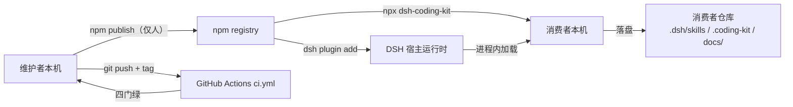

#### 5.4.2 拓扑要素清单

| 要素 | 取值 |
| --- | --- |
| 跨 Region 部署 | 否（本地 CLI，npm registry 由 npm 托管） |
| 跨 AZ 部署 | 否（无服务端） |
| 流量入口路径 | `npm install / npx` → 本地 node 进程；`dsh plugin add` → 宿主进程 |
| 内部调用路径 | 进程内函数调用（无服务发现） |
| 落盘访问路径 | 消费者仓库本地文件系统（无连接池） |

#### 5.4.3 故障域划分

| 故障域 | 影响范围 | 容错机制 | 预期 RTO |
| --- | --- | --- | --- |
| 单命令失败 | 单次调用 | 退出码 + 可重试（幂等） | 即时（重跑） |
| 单文件损坏 | 该落盘文件 | git checkout / 备份 cp 回 | < 1 min |
| npm registry 不可达 | 新安装 / 升级 | 已安装包离线照常执行 | 无影响 |
| DSH 宿主契约变更 | 插件面注入 | 版本嗅探 + 不匹配降级（U-01） | 视降级路径 |

### 5.5 容量规划

#### 5.5.1 业务量预估

| 业务指标 | 当前值 | MVP 阶段值 | 生产阶段值 | 备注 |
| --- | --- | --- | --- | --- |
| 消费者仓库数 | 试点 ops-desk-api | 1~10 | 数十~数百 | 开源分发 |
| 单仓库资产落盘量 | < 100KB | < 100KB | < 500KB | manifest/graph/events |
| 注入字符量 | 24k 截断上限 | 24k | 24k | MAX_INJECT_CHARS |
| 测试用例数 | 310（X19 口径待核） | 稳定 | 增长 | npm test |
| tarball 体积 | assets + lib + bin | 数十 KB~数百 KB | 受控 | files 白名单 |

#### 5.5.2 资源容量推算

| 资源 | 推算公式 | 当前配置 | 生产阶段配置 |
| --- | --- | --- | --- |
| 运行时内存 | 单进程 < 100MB（无大数据集） | < 100MB | < 100MB |
| 磁盘（消费者侧） | manifest + graph + events + 备份 5 代 | < 1MB | < 5MB |
| npm tarball | files 白名单（bin/lib/assets/README/RELEASING/LICENSE） | 数百 KB | 受控 |
| 网络 | 首次 npx 下载 tarball | 一次性 | 一次性 |

#### 5.5.3 扩容触发与路径

| 资源 | 扩容触发指标 | 扩容方式 | 扩容耗时 |
| --- | --- | --- | --- |
| 无服务端资源 | 不适用 | 不适用 | — |

#### 5.5.4 容量水位线

| 水位 | 阈值 | 动作 | 对开发的约束 |
| --- | --- | --- | --- |
| 注入字符水位 | < 24k | 无动作 | 超过 24k 按文件边界截断 |
| 资产目录水位 | 随包增长 | 发布前 pack --dry-run 核对 | files 白名单受控 |
| 备份代数 | 5 代上限 | pruneBackups 清理 | BACKUP_KEEP=5 |

---

## 6. 网络架构

> 本章语义适配：本项目网络架构为「宿主进程内调用 + npm/GitHub 分发链路」，无 VPC/子网/网关。

### 6.1 网络环境规划

| 网络环境 | 用途 | 说明 / 访问策略 |
| --- | --- | --- | --- |
| 本地环境 | CLI 执行 + 宿主进程内调用 | 无网络，本地文件系统访问 |
| npm registry | 包分发与版本解析 | HTTPS，仅下载/发布 |
| GitHub | CI + Releases | HTTPS + OIDC 令牌 |
| 离线环境 | 已安装包执行 | 无网络依赖（唯一运行时依赖已打包） |

### 6.2 流量入口与南北向流量

#### 6.2.1 入口流量链路

| 组件 | 作用 | 部署位置 |
| --- | --- | --- |
| npm registry | 包下载 / 版本解析 | 公网 |
| `npx dsh-coding-kit` | CLI 进程入口 | 消费者本机 |
| `dsh plugin add` | 插件安装入口 | DSH 宿主 |
| 本地文件系统 | 落盘读写 | 消费者仓库 |

**入口决策（对开发的约束）**：

| 决策项 | 取值 | 对开发的约束 |
| --- | --- | --- |
| TLS 终结点 | npm registry（HTTPS，npm 官方托管） | 业务侧无 TLS 处理 |
| 限流位置 | 本地（无网络限流，见 §3.5.3） | 无 |
| 鉴权位置 | npm token / GitHub OIDC（归 security-architect） | 发布侧鉴权，运行时无需 |
| 真实客户端 IP 获取 | 不适用（本地） | — |

#### 6.2.2 出口流量

| 决策项 | 取值 | 对开发的约束 |
| --- | --- | --- |
| 出口方式 | npm CLI / HTTPS（npm registry） | 已安装包离线可用 |
| 是否需要固定出口 IP | 否 | 无 |
| 出口白名单 | npm registry（registry.npmjs.org）+ GitHub | 发布/CI 域 |
| 跨地域 / 跨云出口 | 无 | 无 |

### 6.3 内部互联（东西向流量）

| 决策项 | 取值 | 对开发的约束 |
| --- | --- | --- |
| 服务发现 | 无（进程内函数调用，无服务发现） | 禁止硬编码 IP（不适用） |
| 服务间通信协议 | 进程内函数调用 + 文件落盘（无 RPC/MQ） | 模块间同步调用 |
| 内部 mTLS | 不启用（无网络内部通信） | 无 |
| 跨 VPC 互联 | 不适用 | 无 |
| 跨服务调用幂等性 | 落盘写遵循 §3.5.2 幂等 | 写操作必须幂等 |

---

## 7. 安全设计

> 本章只做架构侧引用，权威在 security-architect（G5）。以下为架构侧需关注的机制选择与关键基线，完整威胁模型与 IAM 策略归《安全设计》文档。

### 7.1 架构安全全景

| 能力域 | 选用产品 / 机制 | 作用范围 | 是否启用 |
| --- | --- | --- | --- |
| 抗 DDoS | 不适用（本地 CLI，无公网入口） | — | 否（不适用：本地） |
| WAF | 不适用（无 Web 应用层） | — | 否（不适用：本地） |
| 防火墙 / 安全组 | 不适用 | — | 否（不适用） |
| 主机安全 | 依赖消费者本机 | 消费者本机 | 由消费者环境保障 |
| 容器安全 | 不适用（无容器） | — | 否 |
| 数据安全审计 | 发布前版本钉一致性校验 + S2 真值源回归 | 落盘数据 | 是（自建校验器） |
| 密钥管理（KMS） | npm token / GitHub OIDC | 发布凭据 | 是（归 security-architect） |
| 安全运营中心（SOC） | 不适用 | — | 否 |
| 堡垒机 | 不适用（无运维通道） | — | 否 |

### 7.2 业务安全架构

#### 7.2.1 用户认证

| 维度 | 取值 |
| --- | --- |
| 账号体系 | 无（本地 CLI，无账号体系） |
| 登录方式 | 不适用（发布凭据归 security-architect） |
| 多因素认证（MFA） | 不适用（本地） |
| 密码强度 | 不适用 |
| 登录失败锁定 | 不适用 |
| Token 有效期 | npm token / OIDC 短期令牌（归 security-architect） |
| 会话管理 | 无（进程短生命周期） |

#### 7.2.2 数据安全

| 维度 | 取值 |
| --- | --- |
| 数据分级 | L1 公开（assets 资产）/ L2 内部（过程轨 docs/）/ L3 迁移元数据（manifest.from_version，落盘 `.coding-kit/manifest.json`；legacy `.cyning-harness/` 只读降级访问、不导出） |
| 传输加密 | npm HTTPS（官方托管）；无内部通信 |
| 存储加密 | 不启用（本地明文，消费者仓库 git 自管） |
| 敏感字段清单 | 无个人敏感字段（本地开发者工具） |
| 数据导出与共享 | npm tarball 白名单（files 字段）控制导出 |

**敏感字段处理策略表**：

| 字段 | 分级 | 存储策略 | 展示策略（脱敏） | 导出策略 |
| --- | --- | --- | --- | --- |
| from_version | L3 | 明文（迁移元数据） | 完整展示 | 随 manifest 本地落盘（`.coding-kit/manifest.json`）；legacy `.cyning-harness/` 只读降级访问、禁止导出 |
| 仓库绝对路径 | L3 | 不落盘（lint 阻止绝对路径） | — | 禁止导出 |

#### 7.2.3 密钥与凭证

| 维度 | 取值 |
| --- | --- |
| 存储方式 | npm token / GitHub OIDC（归 security-architect） |
| 下发方式 | OIDC 临时令牌优先（GitHub Actions） |
| 轮换策略 | 归 security-architect（基线 90 天） |
| 红线 | 禁止入库 / 入代码 / 入配置明文（npm publish 仅人） |

#### 7.2.4 审计日志

| 维度 | 取值 |
| --- | --- |
| 启用的日志类型 | 过程轨（invoke/reviews/tasks）+ 发布回顾（docs/releases/） |
| 审计内容 | 谁（hat_id）、何时、对什么（task_slug）、做了什么、结果、来源 |
| 不可篡改保障 | 消费者仓库 git 历史 + S2 永不覆写 |
| 保留期 | git 历史永久保留（≥ 1 年） |

#### 7.2.5 访问控制

| 维度 | 取值 |
| --- | --- |
| 权限模型 | hat 帽制（00 delegate-only / 10 / 20 / 30 / 40 execute），非 RBAC |
| 多租户隔离 | 消费者仓库级隔离（本地文件系统隔离） |
| 越权防护 | 插件面 dest 白名单（.coding-kit / .dsh/coding-kit）+ S2 永不覆写 |
| 接口级权限 | CLI 命令本地执行无鉴权；发布操作（npm publish）仅人 |

---

## 8. 可观测设计

> 本章回答：本地 CLI 如何知道健康、如何定位问题。三大支柱：Metrics / Logs / Traces（语义适配为退出码 / 结构化日志 / 观测 schema）。

### 8.1 Metrics

#### 8.1.1 指标分层

| 指标层 | 示例 | 工具 |
| --- | --- | --- |
| 业务指标 | 门禁 PASS/BLOCKED 数 / 任务关账数 / 迁移改写数 | 退出码 + 命令输出 |
| 应用指标 | RED：命令成功/失败/耗时（本地计时） | 命令输出 + `--json` |
| 中间件指标 | 落盘文件数 / 事件幂等 skipped 数 / graph diff 数 | 命令输出 |
| 资源指标 | tarball 体积 / 注入字符量 / 备份代数 | `npm pack --dry-run` |

#### 8.1.2 关键指标 Dashboard 清单

| Dashboard 名 | 受众 | 核心指标 | 刷新频率 |
| --- | --- | --- | --- |
| P0 门禁大盘 | 维护者 | check/verify/gate-check/audit 结论分布、退出码 2 计数 | 每次执行 |
| 过程轨健康大盘 | 维护者 | task close 13 守卫 PASS/BLOCKED、status 事件数 | 每次执行 |
| 资产漂移大盘 | 维护者 | graph yaml check diff、skills check drift、discipline 接线状态 | 每次执行 |
| 发布质量大盘 | 维护者 | prepublishOnly 四门、版本钉一致性 | 每次发布 |
| 迁移健康大盘 | 维护者 | upgrade 改写数、refresh plain_mentions、残留旧字面 | 每次执行 |
| 事件轨大盘 | 维护者 | HGM ingest 新/跳过、axioms violations | 每次执行 |

### 8.2 Logs

#### 8.2.1 日志分级与去向

| 日志类型 | 级别 | 保存时间 | 日志去向 |
| --- | --- | --- | --- |
| 命令输出（正常） | INFO+ | 终端即时 | stdout |
| 命令输出（失败） | ERROR+ | 终端即时 + 退出码 | stderr + exit code |
| 过程轨（invoke/reviews/tasks） | INFO+ | git 历史永久 | `docs/harness/invokes/by-task/*` |
| 审计日志（发布回顾） | INFO+ | git 历史永久 | `docs/releases/*` |
| CI 日志 | INFO+ | GitHub 保留期 | GitHub Actions |

#### 8.2.2 结构化日志规范

```json
{
  "timestamp": "2026-09-04T10:00:00Z",
  "level": "INFO",
  "service": "dsh-coding-kit",
  "traceId": "<单次 CLI 调用 trace>",
  "tenantId": "<消费者仓库标识（git root）>",
  "module": "M2",
  "event": "verify.pass",
  "exitCode": 0,
  "msg": "verify --task 通过",
  "extra": {}
}
```

**硬性要求**：

| 要求项 | 内容 |
| --- | --- |
| 必含字段 | 所有日志必须含 `traceId`（单次调用）+ `tenantId`（消费者仓库标识） |
| 敏感字段 | 禁止打印仓库绝对路径明文（lint 阻止绝对路径泄漏） |
| ERROR 级别 | 必须含完整堆栈 + 业务上下文（task_slug / exitCode） |

### 8.3 Traces

| 项 | 取值 |
| --- | --- |
| 协议标准 | 本地进程无分布式追踪；traceId 为单次 CLI 调用标识 |
| 采样策略 | 无（单进程，每次全量） |
| 透传方式 | 进程内变量透传（无跨服务） |
| 关键 Span 命名 | `<module>.<command>`（如 `M2.verify`） |
| 跨外部系统 | npm / GitHub 调用透传 traceId（若支持） |

### 8.4 告警体系

#### 8.4.1 告警分级

| 级别 | 适用场景 | 响应时间 | 通知方式 |
| --- | --- | --- | --- |
| P0 紧急 | 发布阻断（prepublishOnly 四门失败 / 版本钉偏差） | ≤ 5 min | CI 红 + IM |
| P1 高 | 资产漂移（graph yaml check 差异 / S2 真值源回归失败） | ≤ 15 min | CI 红 + IM |
| P2 中 | 接线状态漂移（discipline-coverage 与实现不一致） | ≤ 1 h | IM |
| P3 低 | 文档时效缺口（发布回顾未续写 / 缺陷口径不一致） | 工作时间 | IM / 邮件 |

#### 8.4.2 告警规则编排

| 编号 | 级别 | 触发条件 | 维度 | Owner | Runbook |
| --- | --- | --- | --- | --- | --- |
| AL-01 | P0 | prepublishOnly 四门任一失败 | 发布质量 | `@维护者` | 修测试→typecheck→build→test:lib |
| AL-02 | P0 | 版本钉偏差 > 0（SPEC vs 包版本） | 发布质量 | `@维护者` | RELEASING.md ④ 版本钉同步 |
| AL-03 | P1 | graph yaml check 漂移（tech-graph.yml 红） | 资产漂移 | `@维护者` | compile --all + git diff --exit-code |
| AL-04 | P1 | S2 真值源回归失败（跨命令结论不一致） | 门禁一致性 | `@维护者` | 回归测试 + 收敛共享常量 |
| AL-05 | P2 | discipline-coverage 接线状态与实现漂移 | 资产漂移 | `@维护者` | cli-discipline-coverage 测试 |

---

## 附录：中间确认自检报告

> 本节为 system-architect 自检记录，供 G4 人工审核追溯。协议依据：`protocols/intermediate_confirmation.md`。

### 节点一：§2 业务架构 / DDD 限界上下文完成后

**§2.1 方案分歧判定：未命中。** 限界上下文拆分直接映射 G3《高层架构设计》已冻结的模块全景（§6.2）与业务域，粒度无二义；上下文映射 5 种关系模式由关系性质唯一确定（DSH 宿主=强势上游→ACL/Conformist，S2 常量=Shared Kernel），且 5 种模式是硬指标要求。

**§2.3 反向验证（强制三问）**：

- **Q1（3 个月后被推翻，返工成本）**：返工范围 = §2.2 两张表 + §3.2 模块清单编号映射；切换成本 ≈ 0.2 人月（改业务域命名与模块归属映射，不动源码）。判为可控。
- **Q2（用户/客户/监管能否感知）**：三方均感知不到。判断依据：业务域/限界上下文是内部设计组织方式，不改变 CLI 命令面、落盘格式或对外承诺；不随 npm 包分发（`.workbuddy/` 不入 files 白名单）。
- **Q3（与原始诉求一致性）**：一致。业务域 6 个完整继承 G3 冻结的模块全景（规范注入/门禁/过程轨/方法论/迁移/分发），未新增业务域、未扩展产品范围。

### 节点二：§3 应用架构 / 模块设计 / 接口契约完成后

**§2.1 方案分歧判定：未命中。** 模块划分直接映射 `src/` 下 17 个真实 TS 模块（资料摘要 D9），接口契约风格为 CLI 命令面（G3 已冻结，无 REST/gRPC 选择空间）；技术选型每项有版本号 + 选型理由，均为既有事实。

**§2.3 反向验证（强制三问）**：

- **Q1**：返工范围 = §3.2.M1~M7 七节 + §3.1.3 依赖清单；切换成本 ≈ 0.3 人月（模块归并/拆分不改变源码，仅改文档映射）。判为可控。
- **Q2**：三方均感知不到。判断依据：模块映射是源码组织的文档化，不改变 CLI 行为、退出码语义或对外承诺。
- **Q3**：一致。模块 M1~M7 与 G3 §6.2 模块全景一一对应（CLI 面/插件面/规范注入器/P0 门禁器/过程轨留档器/方法论内核/迁移治理器/assets/S2 真值源/分发底座），未新增核心模块。

### 节点三：§4 落盘格式 schema 与迁移路径完成后

**§2.1 方案分歧判定：命中。** §4.5 数据迁移路径中「`.cyning-harness` 目录名语义收敛方向」存在 ≥2 种合理方案（方案 A 保留现行落盘 vs 方案 B 重命名新目录 + 降级 legacy 标记），且 G3 冻结文档 F4 只说"语义收敛 → 单一定义"、未指定方向，研究报告 U-06 明确"视为 G4 系统设计的重构项处理"。**已按协议 §3 以 `[中间确认]` 前缀向主理人发起单题确认**（论题 = `.cyning-harness` 目录收敛方向）。

**§2.3 反向验证（强制三问）**：

- **Q1**：返工范围 = §4.5 全节 + §3.2.M5 迁移治理器接口 + §5.1 落盘路径 + §7.2.2 数据安全分级；切换成本 ≈ 0.5 人月（若选 B 需改 5 处代码 + 兼容探测 + 迁移窗口）。判为可控但高于前两节点，故发起中间确认。
- **Q2**：**用户可感知**。具体感知点：旧产品线用户的 manifest 落盘目录（方案 B 会改变 `.cyning-harness` 的现行落盘位置，迁移窗口内用户需执行 `upgrade` 迁移）；对外承诺（MIGRATION 文档承诺的目录名）。故命中 §2.2(2)。
- **Q3**：**用户诉求未显式提及此点，但本决策改变对外承诺**。研究报告 U-06 原文「`.cyning-harness` 目录名的双重语义（X11）应如何收敛：保留为现行落盘位置，还是统一改为 legacy 标记」→「视为 G4 系统设计的重构项处理」；G3 §6.1 F4「双重语义 → 单一定义」未指定方向。故命中 §2.2(3)。

**§2.4 决议记录（供 G4 / G6 追溯）**：

| 项 | 内容 |
| --- | --- |
| 论题 | `.cyning-harness` 目录名语义收敛方向（X11） |
| 决议时间 | 2026-09-07 |
| 裁决方 | 用户（经主理人转交） |
| 裁决结果 | **方案 B「彻底收敛 + 降级兼容」** |
| 落地动作 | ① 新落盘目录统一为 `.coding-kit`（DSH 宿主场景 `.dsh/coding-kit` 语义等价）；② `.cyning-harness` 降级为 legacy 探测标记，不再作为新落盘目标；③ 探测到旧目录即提示用户执行 `upgrade` 迁移，迁移前旧目录内容保留只读降级访问 |
| 交叉核对 | 阻塞范围四处（§4.5 全节 / §3.2.M5 迁移治理器接口 / §5.1 落盘路径 / §7.2.2 数据安全分级）目录名、迁移语义、降级访问三处口径已统一 |
| 状态 | 已定稿，不再就同一论题发起确认 |

### 节点四：§5 部署架构概览与高可用设计完成后（最后一次完整复核）

**§2.1 方案分歧判定：未命中。** 部署形态（npm 包 + 本地 CLI + DSH bundle 插件）由 G3 §4.2 冻结；高可用模式为本地单活/无状态（无多活/主备选择空间）；RPO/RTO 有数字（RTO ≤ 1min、RPO ≤ 5min）且与 §4.3.2 自洽。

**§2.3 反向验证（强制三问）**：

- **Q1**：返工范围 = §5.1~§5.5 五节；切换成本 ≈ 0.1 人月（环境/SLA/容量表内重写）。判为可控。
- **Q2**：三方均感知不到。判断依据：部署架构是本地 CLI 的形态描述，不改变产品形态、对外承诺或合规基线（零云约束保持不变）。
- **Q3**：一致。G3 §4.2 原文「部署形态：npm 包 + 本地 CLI + DSH bundle 插件（非 SaaS / 私有化 / 混合云）」；本节完整继承，未引入云资源或改变分发形态。

### 自检小结

| 节点 | §2.1 判定 | Q1 返工可控 | Q2 可感知方 | Q3 与诉求一致 | 是否发起 |
| --- | --- | --- | --- | --- | --- |
| 一 · §2 业务架构后 | 未命中 | 是（≈0.2 人月） | 无 | 一致 | 否 |
| 二 · §3 应用架构后 | 未命中 | 是（≈0.3 人月） | 无 | 一致 | 否 |
| 三 · §4 迁移路径后 | **命中（方案分歧 + 用户可感知）** | 是（≈0.5 人月） | **用户可感知**（manifest 落盘目录） | 诉求未显式提及且改变对外承诺 | **是（已裁决：方案 B，2026-09-07）** |
| 四 · §5 部署架构后 | 未命中 | 是（≈0.1 人月） | 无 | 一致 | 否 |

**结论**：四个自检节点中仅节点三命中并已发起中间确认，用户已于 2026-09-07 裁决采用**方案 B「彻底收敛 + 降级兼容」**，本文档据此定稿（见 §0 修订记录 v1.1、§4.5 落地动作、节点三 §2.4 决议记录）。至此全文无未决中间确认项。
