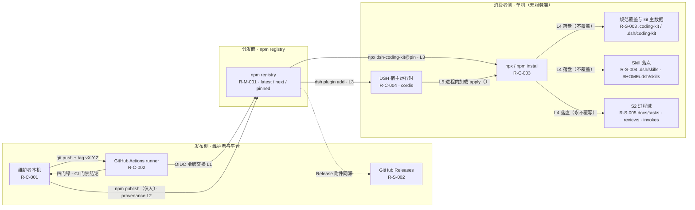

# AICoding 架构设计 · 部署设计

> 本文档为《AICoding 架构设计》核心产物之一，定位为**系统部署设计模版**。
> 上游输入：《系统设计》中的部署架构、网络架构、可观测设计；
> 下游输出：环境与资源清单、流水线、监控告警、应急回滚等可落地的运维交付物。

> **模版使用约定（语义适配说明）**：本项目是**本地 CLI + npm 分发的 Node 包（kit，v1.10.0），零云资源、无服务端、无数据库**。模板《部署设计》以云上业务系统为默认语境，本文按主理人裁定做 **A 档语义适配**——**保留模板全部标题与编号不变**，仅将正文语境从「云上集群部署」映射为「分发与运行环境（npm registry / GitHub Releases / GitHub Actions runner / 消费者本机 Node 进程 / 消费者仓库落盘）」。适配映射见 §0 修订记录。
> **运行时决策**：`need_cloud_baseline_check=false`（本项目无腾讯云资源），故**不执行 CloudQ 云资源现状核对**，§2.3 复用资源清单以「复用外部平台能力」语义填写。
> **权威边界**：公网暴露 / 安全组语义（npm 2FA、token 作用域、provenance、依赖扫描规则）、密钥分级与轮转周期、审计字段与合规保留期归《安全设计》（security-architect）；本文档只落**存储机制选型与部署侧配置口径**（见 §2.2.4 / §2.2.5 / §2.2.6 / §7）。

---

## 0. 元信息：修订记录

> 记录文档版本、变更内容、修订人、修订时间，确保设计文档的可追溯。

| 文档版本 | 发布日期 | 修订人 | 修订说明 |
| --- | --- | --- | --- |
| v1.0 | 2026-09-08 | platform-architect（毕落地） | 初稿：基于 G4《系统设计》v1.1（已冻结）与 G1《资料摘要》v1.1，将模板语义 A 档适配为「本地 CLI + npm 分发链路」，落定环境矩阵、六类资源清单、分发拓扑与五条链路、八阶段流水线、三层回滚与容量成本基线 |

**语义适配映射（A 档，保留标题只改正文）**：

| 模板章节 | 模板默认语境 | 本项目适配语境 |
| --- | --- | --- |
| §1.1 适用范围与部署形态 | 私有化 / 公有云 / 混合云 | 本地 CLI + DSH bundle 插件 + npm 分发（非 SaaS / 私有化 / 混合云，继承 G3 §4.2 冻结口径） |
| §2.1 环境矩阵 | K8s 集群隔离 | dev 本机 / int GitHub 托管 runner / uat `next` 通道 + 试点仓 / prod `latest` 通道，隔离粒度为「通道 + 仓库 + runner VM」 |
| §2.2 云资源清单 | 云资源实例 | 分发与运行环境清单：npm registry、GitHub Actions、GitHub Releases、Node engines 矩阵、消费者仓库落盘位置 |
| §3 部署拓扑 | Region / AZ / 节点 | 分发拓扑：源码仓库 → CI → npm publish → 消费者 `npx` / `dsh plugin add` → 落盘路径（`.coding-kit` / `.dsh/coding-kit` / `.dsh/skills`） |
| §3.2.2 内部互联链路 | 服务发现 / mTLS / 连接池 | 五条分发链路 L1–L5（OIDC 令牌交换 → provenance 签名链 → integrity/lockfile 校验 → 落盘不覆盖策略 → cordis 加载与工具注册） |
| §3.3 高可用与故障容错 | Pod / Node / AZ / Region 四层 | 单命令 / 单落盘文件 / 单发布版本 / 分发通道 四层故障域 |
| §4 部署流程 / 流水线 | 镜像构建与集群部署 | GitHub Actions CI（ci.yml + tech-graph.yml）+ `prepublishOnly` 四门 + tarball 制品 + 版本通道发布 |
| §5 监控告警 | Prometheus / Grafana / APM | CLI 结构化日志 + 退出码 + 观测 schema（obs_status/obs_timeline）+ CI 门禁告警 |
| §7 安全合规 | 云安全产品接入 | 发布面防护与凭据存储机制（部署侧配置口径），策略权威归《安全设计》 |
| §8 容量与成本 | 云账单 | 分发与维护成本（npm 发布、CI 时长/配额、维护人力），无云账单 |

**关键术语区分（全文必须显式区分同名不同义）**：

- **DSH** = DeepSeek Harness，宿主运行时；本项目是它的插件（`dsh plugin add` 安装面）。
- **kit** = 本产品 `dsh-coding-kit`，全文不用 harness 指代本产品。
- **latest / next / pinned** = npm dist-tag 版本通道；`pinned` 指消费者显式锁定 `X.Y.Z`（§4.5.5 定义回退语义）。
- **三层回滚** = ① 发布侧回退 ② 部署侧回滚 ③ **消费者侧回退**（本项目独有，见 §6.1.4）。
- **S2 过程域** = `docs/tasks/` + `docs/harness/reviews/` + `docs/harness/invokes/by-task/`，任何命令永不覆写（硬约束）。
- **G1–G7 阶段门** = 专家团阶段门，与 kit 的**过程命令族 G1–G7**（`status/timeline/lifecycle/graph/sync/skills/wiki/task`）同名不同义。

---

## 1. 引言

> 本章界定本文档的适用范围、部署形态边界与名词口径，是后续全部章节的语义前提。

### 1.1 适用范围与部署形态

**适用范围**：本文档覆盖 `dsh-coding-kit`（v1.10.0，`github.com/Cyning12/dsh-coding-kit`）从源码到消费者本机的**完整交付链路**——环境划分、资源清单、分发拓扑、CI/CD 流水线、制品与配置管理、发布策略、监控告警、应急回滚、上线前安全自检、容量与成本。不含业务边界与模块拆分（归《系统设计》），不含安全策略裁定（归《安全设计》）。

**部署形态（继承 G3 §4.2 冻结口径）**：

| 维度 | 取值 |
| --- | --- |
| 系统形态 | npm 包 + 本地 CLI + DSH bundle 插件 |
| 是否 SaaS / 私有化 / 混合云 | **否**，三者均不适用（无服务端、无租户、无云端托管） |
| 云资源 | **零**（非功能性需求 N2「维持零云资源约束」，见《高层架构设计》§6.1） |
| 运行时 | Node.js `^22.19.0 \|\| >=24.0.0`（`package.json#engines`） |
| 唯一运行时依赖 | `js-yaml ^4.1.0`（进程内，随包分发，离线可用） |
| 分发通道 | npm registry（主）+ GitHub Releases（辅） |
| 消费者落盘 | 消费者仓库本地文件系统（`.coding-kit` / `.dsh/coding-kit` / `.dsh/skills` / `docs/`），详见 §3.1.3 |
| 隔离粒度 | 消费者仓库级隔离（本地文件系统），无服务端多租户 |

**部署形态对本文档的三条硬约束**：

1. 不得为满足模板字面要求而**生造云资源**（无 VPC / 无安全组 / 无云 MySQL / 无对象存储桶）；凡云语义章节一律在正文内做等价适配并显式标注「不适用（理由）」。
2. 不得整表写「无」：六大资源分类（计算 / 存储 / 网络 / 中间件 / 安全 / 可观测）必须逐项落到本项目真实构件并给出可核验数字。
3. 发布与回滚必须**区分三层**（发布侧 / 部署侧 / 消费者侧），不得混用（见 §6.1.4）。

### 1.2 名词与缩写

| 缩写 / 名词 | 全称 / 含义 | 在本文档中的语义 |
| --- | --- | --- |
| kit | dsh-coding-kit | 本产品（npm 包名，v1.10.0） |
| DSH | DeepSeek Harness | 宿主运行时（E-01），首个宿主非唯一宿主 |
| CLI 面 | `npx dsh-coding-kit` | 消费者本机进程入口（`bin/dsh-coding-kit.js` → `lib/cli.js`） |
| 插件面 | `apply_coding_standards` / `init_coding_kit` | DSH 宿主进程内调用入口（`lib/index.js` 的 `apply()`） |
| tarball | npm 制品包 | `dsh-coding-kit-<semver>.tgz`（v1.10.0 实测 200.0 kB / 解包 748.7 kB / 135 文件） |
| dist-tag | npm 分发标签 | `latest`（稳定）/ `next`（预发）/ 版本直钉（pinned） |
| provenance | npm 制品来源证明 | Sigstore 签名链，绑定 CI 工作流与 commit，用于制品溯源 |
| OIDC | OpenID Connect | GitHub Actions 与 registry 之间的临时令牌交换机制，替代长期 token |
| S2 | 过程域真值源 | `docs/tasks` + `docs/harness/reviews` + `docs/harness/invokes/by-task`，永不覆写 |
| HGM | 事件轨机制 | 仓库生命周期事件幂等落盘（`.coding-kit/events/*`） |
| ICVO | Inform·Constrain·Verify·Orchestrate | 纪律资产方法论内核（不直接影响部署，仅用于理解落盘语义） |
| RTO / RPO | 恢复时间目标 / 恢复点目标 | 继承《系统设计》§5.3：RTO ≤ 1 分钟，RPO ≤ 5 分钟 |
| MTTR | 平均修复时长 | 本文档用于发布侧回退口径：目标 ≤ 15 分钟（§6.1.3） |
| failClosed | 失败即阻断 | 门禁不确定时按阻断处理，退出码 2 |

---

## 2. 环境与资源清单

> 本章回答：kit 在哪些环境运行、依赖哪些承载资源、哪些是复用能力。资源编号（R-C / R-S / R-N / R-M / R-O / R-Sec）为全文引用锚点，§3~§8 的链路表、告警表与水位线表均引用同一编号。

### 2.1 环境矩阵

| 环境 | 用途 | 集群隔离 | 数据 | 网络访问 |
| --- | --- | --- | --- | --- |
| dev | 维护者本机开发自测（`node --test --experimental-strip-types` 直跑 TS 源码） | 本机工作目录 + 特性分支隔离（`feat/*`），与 int/uat/prod 无资源共享 | 模拟数据：`test/` 夹具（39 份根级用例 + 1 份 lib 冒烟） | 无需公网（可离线）；`npm ci` 时按需访问 registry |
| int | CI 联调（GitHub Actions `ci.yml` node 22.x/24.x 矩阵 + `tech-graph.yml` 图谱锁步） | GitHub 托管 runner，**每次运行全新 VM**，运行结束即销毁；仓库级 workflow 隔离 | 本仓真实 `docs/_tech_graph`（dogfood 数据）+ 测试夹具 | 公网，出口限 `registry.npmjs.org` + `github.com`（见 §6.2.2 出口白名单） |
| uat | 预发 / 验收（`npm pack --dry-run` 清单核对 + `prepublishOnly` 四门 + `next` 通道试装） | npm `next` dist-tag 通道隔离 + 试点仓（ops-desk-api）隔离；与 `latest` 通道互不影响 | 试点仓真实数据（ops-desk-api） | 公网 + 试点仓本地文件系统 |
| prod | 生产（npm `latest` dist-tag + GitHub Releases + git tag `vX.Y.Z`） | npm `latest` dist-tag 通道 + 包名作用域唯一（`dsh-coding-kit`）+ 消费者仓库级文件系统隔离 | 消费者仓库真实数据（由消费者自持） | 分发时公网；**消费者执行期零网络依赖**（已安装包离线可用） |

**环境隔离策略补充说明**：

| 隔离维度 | 策略 |
| --- | --- |
| 通道隔离 | `next`（uat）与 `latest`（prod）为两条互不干扰的 dist-tag 通道；`pinned` 消费者不受任一通道变更影响（§4.5.5） |
| 制品隔离 | 制品不可变：已发布版本 tarball 内容永久固定，禁止覆盖发布（npm 侧强制） |
| 过程隔离 | dev/int 不触碰 prod 的 dist-tag；`latest` 移动仅由人工 `npm publish` 触发（RELEASING ⑧ 仅人） |
| 数据隔离 | 无服务端存储，全部数据落在消费者仓库，天然仓库级隔离 |

### 2.2 云资源清单

> **A 档语义适配**：本项目零云资源，本节标题保留不变，正文适配为**「分发与运行环境清单」**——即把「云资源实例」逐项映射到本项目真实承载构件（npm registry / GitHub Actions / GitHub Releases / Node 运行时 / 消费者仓库落盘）。所有「资源 ID」列填写可定位的真实标识（工作流路径、包内路径、域名），凡云平台侧未暴露 ID 的标注「平台托管，无对外资源 ID」。

#### 2.2.1 计算资源

| 资源编号 | 类型 | 产品 | 资源 ID | 名称 | 规格 | 数量 | 环境 | 复用 / 新建 | HA 方案 | 用途 |
| --- | --- | --- | --- | --- | --- | --- | --- | --- | --- | --- |
| R-C-001 | 本地开发机（非云） | 维护者本机（macOS / Linux） | 本机（无云资源 ID） | dev-workstation | Node `^22.19.0 \|\| >=24.0.0`（多版本并行，nvm 管理）；2 vCPU 级即可（单进程 < 100MB） | 1 | dev | 复用 | 不适用（无状态；本机故障由 git 远端版本库兜底） | 本地开发自测、四门本地执行、`npm publish`（仅人，RELEASING ⑧） |
| R-C-002 | CI 计算 | GitHub-hosted runner（`ubuntu-latest`） | `.github/workflows/ci.yml`、`tech-graph.yml` | gh-runner | GitHub 标准托管 runner（GitHub 官方规格，具体 vCPU/内存以官方为准，**待人工确认**）；node 矩阵 `22.x` / `24.x` | 3 作业/次（ci.yml 2 + tech-graph.yml 1） | int | 复用（公共仓库） | 每次运行全新 VM，无状态；失败重跑即可 | 四门门禁（typecheck/test/build/test:lib）+ 图谱 compile/check 锁步 |
| R-C-003 | 消费者执行环境（非云） | Node.js 进程（消费者本机） | `npx dsh-coding-kit@<version>` | cli-process | 单进程内存 < 100MB；同步执行完即退出（无长驻进程） | 峰值并发 10（生产阶段，见 §8.1.1） | prod | 复用（消费者自备） | 不适用（短生命周期同步进程，失败即时重跑，命令幂等） | CLI 门禁与过程命令执行（`check`/`verify`/`gate-check`/`audit`/`task`/`graph`/`skills` 等） |
| R-C-004 | 宿主执行环境（非云） | DSH 宿主运行时（cordis 加载） | `dsh plugin add dsh-coding-kit` | dsh-host | 宿主进程内调用，无独立资源配额；契约锚 `0.1.0-rc.8` | 按宿主实例数 | prod | 复用（上游 E-01） | 宿主自管；契约版本不匹配走降级路径（U-01） | 插件面 `apply_coding_standards` / `init_coding_kit` 工具注册 |

#### 2.2.2 存储资源

| 资源编号 | 类型 | 产品 | 资源 ID | 名称 | 规格 | 容量 | 环境 | 复用 / 新建 | HA 方案 | 备份策略 |
| --- | --- | --- | --- | --- | --- | --- | --- | --- | --- | --- |
| R-S-001 | 制品存储 | npm registry（公共） | 包 `dsh-coding-kit` 版本 tarball | npm-tarball | 单版本 **200.0 kB**（解包 748.7 kB / 135 文件，v1.10.0 `npm pack --dry-run` 实测） | 年 48 版 ≈ 9.6 MB | prod | 复用 | npm CDN 多副本；版本内容不可变 | 不另备份（制品可从 git tag 重建）；已发布版本**禁止覆盖** |
| R-S-002 | 发布件存储 | GitHub Releases | `Cyning12/dsh-coding-kit/releases/tag/vX.Y.Z` | gh-release | Release 附件 + 源码快照（GitHub 自动生成） | < 10 MB/版本 | prod | 复用 | GitHub 侧多副本 | GitHub 侧保留；git tag 同步（RELEASING ⑤） |
| R-S-003 | 消费者落盘主数据 | 消费者仓库本地文件系统 | `<repo>/.coding-kit/`（含 `manifest.json`、`events/*`、备份） | kit-ondisk | manifest < 10 KB；事件轨月分片；备份 5 代 | 当前 < 1 MB / 仓库；生产阶段 < 5 MB | prod | 新建（由 CLI 首次写入） | 不适用（本地文件） | **5 代备份 prune**（`BACKUP_KEEP=5`）+ 消费者仓库 git 版本库（RTO ≤ 1 min，git checkout / cp 回） |
| R-S-004 | 消费者 Skill 落盘 | 消费者仓库 / 用户主目录 | `<repo>/.dsh/skills/`、`$HOME/.dsh/skills/` | skills-dest | 6 个 Starter 帽 Skill（`SKILL.md` + references） | < 500 KB | prod | 新建 | 不适用（本地文件） | 可重建（`npx dsh-coding-kit skills build`），无需备份 |
| R-S-005 | 消费者过程轨（S2） | 消费者仓库本地文件系统 | `docs/tasks/`、`docs/harness/reviews/`、`docs/harness/invokes/by-task/` | s2-truth | yaml + md（tasks/reviews/invokes 三域） | 随仓库规模增长（试点仓 < 1 MB） | prod | 新建 | 不适用（本地文件） | **git 历史永久保留，永不覆写**（S2 硬约束）；保留期 ≥ 1 年（《系统设计》§7.2.4） |
| R-S-006 | 本地缓存（可重建） | npm cache | `~/.npm/_cacache` | npm-cache | 依赖缓存（tsc / types / js-yaml / cordis / dsh-tools） | < 500 MB | dev / int | 复用 | 不适用 | 不备份，`npm ci` 可重建 |

#### 2.2.3 网络资源

> **A 档语义适配**：本项目无 VPC / 子网 / 网关 / 安全组。本节「网络资源」适配为**分发链路上的网络端点与通道**；所有公网暴露策略（2FA、token 作用域、WAF 语义替代）归《安全设计》，本文档只登记端点事实。

| 资源编号 | 类型 | 产品 | 资源 ID | 名称 | 规格 | 环境 | 复用 / 新建 | 用途 |
| --- | --- | --- | --- | --- | --- | --- | --- | --- |
| R-N-001 | 出口端点（分发） | npm registry | `registry.npmjs.org` | npm-registry-endpoint | HTTPS / 443；出口无需固定 IP | int / uat / prod | 复用 | 包下载、版本解析、dist-tag 发布 |
| R-N-002 | 出口端点（CI / 发布） | GitHub | `github.com` | github-endpoint | HTTPS / 443 + OIDC 令牌交换 | int / uat / prod | 复用 | CI 运行、Releases、git push / tag |
| R-N-003 | 本地通道（无网络） | 消费者本机文件系统 | 进程内 + 本地 FS 读写 | local-fs-channel | 无网络（无监听端口、无 socket） | dev / prod | 复用 | 落盘读写与进程内调用（CLI 面与插件面互不 import） |
| R-N-004 | 公网暴露面 | 无 | 不适用 | no-public-listener | **本系统不监听任何端口、不提供任何入站服务** | 全部 | 不适用 | 说明：无安全组 / 无 VPC / 无负载均衡；暴露面仅为「发布到 registry 的包」，防护策略归《安全设计》 |
| R-N-005 | 离线通道 | 已安装 tarball | 无网络依赖（唯一运行时依赖 `js-yaml` 随包分发） | offline-channel | 断网可用 | prod | 复用 | registry 不可达时已安装包照常执行（《系统设计》§5.2.4） |

#### 2.2.4 中间件与平台服务

> 含**凭据存储机制选型**（platform 权威，对应模板 KMS / Vault 位）；密钥分级、访问控制、轮转周期归《安全设计》。

| 资源编号 | 类型 | 产品 | 资源 ID | 名称 | 规格 | 环境 | 复用 / 新建 | HA 方案 | 用途 |
| --- | --- | --- | --- | --- | --- | --- | --- | --- | --- |
| R-M-001 | 包分发与版本解析 | npm registry（公共） | 包 `dsh-coding-kit` | npm-registry | semver + dist-tag（`latest` / `next`）+ `deprecate` + provenance | uat / prod | 复用 | npm 侧 CDN 多副本 | 版本通道发布与迁移治理（`npm deprecate` 治理旧产品线） |
| R-M-002 | CI 编排 | GitHub Actions | `.github/workflows/ci.yml`、`tech-graph.yml` | gh-actions | workflow yaml；`ci.yml` 触发 `push` + `pull_request`；`tech-graph.yml` 触发 `pull_request` + `push(main)` | int | 复用 | GitHub 侧托管 | 四门门禁 + 图谱资产锁步（`git diff --exit-code`） |
| R-M-003 | **凭据存储机制**（KMS / Vault 语义替代） | GitHub Encrypted Secrets + OIDC + 本机 `~/.npmrc` | 仓库 Settings → Secrets and variables → Actions；`~/.npmrc` | cred-store | 长期凭据仅 npm granular automation token 一项（本机 Owner 凭据管理器 / `~/.npmrc`，不入仓、不入 CI secrets）；CI 侧一律 OIDC 临时令牌，不落盘 | int / prod | 复用 | GitHub 侧托管 | 发布与 CI 鉴权。**选型说明**：不引入云 KMS / Vault —— 零云约束 N2（《高层架构设计》§6.1）+ 凭据面仅 4 项且全由 npm / GitHub 平台托管，引入外部密钥系统反而新增依赖与暴露面。**《安全设计》已确认引用本命名**（platform 权威 = 凭据存储基础设施命名；security 明确不引入云 KMS / Vault，与 N2 无冲突）；凭据按 §7.2 五类分级（均高敏），npm granular token 轮转 ≤ 30 天（上限 90 天） |
| R-M-004 | 运行时 | Node.js | `package.json#engines` | node-runtime | `^22.19.0 \|\| >=24.0.0` | 全部 | 复用 | 消费者 / runner 侧多版本 | TS 5.8 编译产物执行；`node --test` 直跑 TS（strip-types 实验特性） |
| R-M-005 | 进程内组件（无中间件进程） | `js-yaml` / `cordis` / `dsh-tools` | `js-yaml ^4.1.0`；`@deepseek-ai/cordis ^4.0.1`；`@deepseek-ai/dsh-tools >=0.0.1-rc.1 <0.2.0` | inproc-deps | 唯一运行时依赖 `js-yaml`（随包分发）；cordis / dsh-tools 为 **optional peer** | prod | 复用 | 不适用（进程内） | YAML 读写（`yaml.ts` 单点封装）；宿主插件契约与工具注册（仅插件面需要） |

#### 2.2.5 可观测资源

> 含**日志保留期**基线。**管道与保存位置由 platform 定义；审计维度与合规保留期由《安全设计》定义并覆盖本表** —— 本表保留期列已按安全侧基线回填（《安全设计》口径：git 永久 / CI 日志 ≥ 90 天归档 / 平台审计 ≥ 1 年；不可篡改要求由安全侧定义）。

| 资源编号 | 类型 | 产品 | 资源 ID | 名称 | 规格 | 环境 | 复用 / 新建 | 承载可观测维度 | 保留期 |
| --- | --- | --- | --- | --- | --- | --- | --- | --- | --- |
| R-O-001 | CLI 结构化日志 | 命令输出 + 退出码 | obs schema `obs_status.v1` / `obs_timeline.v1` | cli-log | stdout（INFO+）/ stderr（ERROR+）+ 进程退出码 0/1/2；必含 `traceId`（单次调用）+ `tenantId`（消费者仓库标识） | 全部 | 新建（自研） | Logs / ExitCode / 命令耗时 | 终端即时；需留痕者落消费者仓库 git —— **永久**（安全侧基线） |
| R-O-002 | CI 运行日志 | GitHub Actions Logs | `ci.yml` / `tech-graph.yml` 运行记录 | ci-log | 每次运行完整 stdout；红即 fail | int | 复用 | CI 四门结论 / 图谱漂移 | **≥ 90 天归档**（《安全设计》基线；GitHub 默认值即 90 天，满足基线；是否上调至 GitHub 上限 400 天**待人工确认**，见附录 Q-2） |
| R-O-003 | 发布质量大盘 | 发布前四门 + 版本钉校验 | `prepublishOnly` + RELEASING ④⑨ | release-dashboard | 四门结论、版本钉偏差数、tarball 清单 | uat / prod | 新建（自研） | 发布质量（P0 门禁） | 随每次发布归档至 `CHANGELOG.md` + `docs/releases/` —— **git 永久**（安全侧基线） |
| R-O-004 | 资产一致性与门禁一致性大盘 | `graph yaml check` + S2 真值源回归 + `skills check` | `tech-graph.yml` + `npm test` | drift-dashboard | 图谱 yaml↔json 切片 diff、S2 前缀一致率、skills drift | int | 新建（自研） | 资产漂移 / 门禁一致性 | CI 每次运行 —— **≥ 90 天归档**（同 R-O-002） |
| R-O-005 | 依赖与漏洞扫描 | Dependabot + `npm audit` | GitHub Security 面板 | dep-scan | 依赖树漏洞告警（高危阻断） | int / prod | 复用 | 安全（依赖供应链） | **平台审计 ≥ 1 年**（《安全设计》基线；GitHub Security 面板默认保留即在其内，精确天数以 GitHub 官方为准，**待人工确认**，见附录 Q-3） |
| R-O-006 | 分发健康核验 | `npm view` + 试装冒烟 | `npm view dsh-coding-kit version` / `dist-tags` | dist-health | 版本生效确认 + tarball 抽样校验 | prod | 复用 | 分发可用性 | 发布后一次性核验（RELEASING ⑨），结论入 `docs/releases/` —— **git 永久**（安全侧基线） |

**五维度审计覆盖声明（对齐《安全设计》）**：R-O-001~R-O-006 覆盖安全侧定义的 5 个审计维度 —— ① **平台账号与仓库审计**（GitHub 审计日志 / npm publish 记录，≥ 1 年）；② **CLI 命令与过程轨**（R-O-001 + 消费者 S2 落盘，git 永久）；③ **落盘数据变更**（`.coding-kit/` + `docs/` 变更，git 永久）；④ **变更通道**（签名提交 + PR 记录替代堡垒机，git 永久）；⑤ **发布面防护日志**（R-O-003 发布质量 + R-O-005 依赖扫描 + R-O-006 分发核验，≥ 90 天 / ≥ 1 年 / 永久）。**审计字段定义与不可篡改要求归《安全设计》。**

#### 2.2.6 安全资源

> **权威边界**：下列资源的**存在性与部署方式**由 platform 落定；**分级、轮转周期、访问策略、暴露面规则**归《安全设计》（security-architect）。凡安全侧给出的分级/规则与本文档冲突，以《安全设计》为准并回注本文档。

| 资源编号 | 类型 | 产品 | 资源 ID | 名称 | 规格 | 环境 | 复用 / 新建 | HA 方案 | 用途 |
| --- | --- | --- | --- | --- | --- | --- | --- | --- | --- |
| R-Sec-001 | 发布凭据 | npm granular access token（publish 作用域） | 本机 `~/.npmrc`（不入仓）；CI 侧不入 secrets，改走 OIDC | npm-token | 粒度 = 单包 publish；2FA 强制开启 | prod | 复用 | 不适用（平台托管） | `npm publish`（仅人，RELEASING ⑧） |
| R-Sec-002 | CI 凭据 | GitHub OIDC 临时令牌 | workflow 级 `id-token: write` + `permissions` 声明 | gh-oidc | 运行期动态签发，不落盘、不入库 | int | 复用 | GitHub 侧托管 | CI 内 registry 鉴权与 Releases 写入（替代长期 token） |
| R-Sec-003 | 制品签名与溯源 | npm provenance（Sigstore） | 发布期由 CI / npm 侧签发，绑定 workflow + commit sha | npm-provenance | 签名材料随包元数据存储于 registry | prod | 复用 | npm 侧托管 | 制品来源可溯（防投毒 / 防伪造发布） |
| R-Sec-004 | 依赖漏洞扫描 | Dependabot + `npm audit` | GitHub Security 面板 + CI 步骤 | dep-scan-sec | 高危漏洞阻断门禁 | int / prod | 复用 | GitHub 侧托管 | 供应链安全（对应模板「镜像漏洞扫描」位） |
| R-Sec-005 | 发布面暴露控制 | `files` 白名单 + 分支保护 | `package.json#files`（bin / lib / assets / cordis.patch.yml / README.md / RELEASING.md / LICENSE）+ main 分支保护 | publish-surface | 白名单外内容（`src/`、`test/`、`docs/`、`SPEC.md`、`.workbuddy/`）一律不入包 | prod | 复用 | 不适用 | 防止源码 / 测试 / 过程档泄漏进分发面（对应模板「安全组开放性」位） |
| R-Sec-006 | 代码所有权与合并管控 | CODEOWNERS + 分支保护规则 | 仓库 Settings（**是否已启用待人工确认**） | branch-guard | CI 未绿禁合（RELEASING ⑥）；`npm version` / `npm publish` 仅人执行 | int / prod | 待确认 | 不适用 | 防止未经门禁的变更进入 main 与发布通道 |

### 2.3 复用资源清单

> **A 档语义适配**：本项目无自有云资源，本表登记**复用的外部平台能力**及其与本项目/原业务的隔离方式。CloudQ 云基线核对**不执行**（`need_cloud_baseline_check=false`），故无「已存在云资源水位」列。

| 复用资源 ID | 原业务方 | 余量评估 | 隔离方式 |
| --- | --- | --- | --- |
| R-M-001 | npm, Inc.（公共 registry） | 公开包无发布/下载配额限制（遵循 npm 公平使用策略）；单版本 200.0 kB，年 48 版 ≈ 9.6 MB，余量充足 | 包名作用域唯一（`dsh-coding-kit`）+ dist-tag 通道隔离（`latest` / `next` / pinned） |
| R-C-002 | GitHub（公共仓库托管 runner） | 公共仓库免分钟计费；实测约 **345 分钟/月**（见 §8.1.2）；并发上限按 GitHub 官方策略（**待人工确认**） | 每次运行全新 VM，运行结束即销毁；仓库级 workflow 隔离，跨仓库不可见 |
| R-S-002 | GitHub（Releases） | 公共仓库 Release 附件免费，单文件上限 2 GB；本项目 < 10 MB/版本 | 仓库级隔离；与源码仓库同权限模型 |
| R-C-004 | DeepSeek Harness（宿主 E-01） | 宿主自管容量，本项目不占宿主配额（进程内调用） | cordis 插件加载 + 契约版本嗅探（锚 `0.1.0-rc.8`），不匹配即降级（U-01）；本产品不在宿主内写宿主私有目录 |
| R-M-005 | 开源社区（`js-yaml` / `cordis` / `dsh-tools`） | 无限（开源依赖） | 进程内依赖，`js-yaml` 随包分发；cordis / dsh-tools 为 optional peer，CLI-only 场景可不装 |
| R-S-005 | 各消费者（消费者仓库 git） | 消费者自管 | 仓库级文件系统隔离（无服务端多租户）；S2 三域永不覆写 |

---

## 3. 部署拓扑与高可用设计

> 本章回答：包从源码到消费者本机的完整交付链路长什么样、落盘落在哪里、故障如何被隔离与恢复。

### 3.1 物理拓扑

> **A 档语义适配**：本项目无 Region / AZ / 节点划分，本节「物理拓扑」适配为**分发拓扑**——即「源码仓库 → CI → npm registry → 消费者安装面 → 消费者仓库落盘」的真实交付链路与落盘位置。

#### 3.1.1 物理拓扑图

**Mermaid 内嵌图（节点命名与 §2.2 资源编号、§3.1.2 拓扑要素、§3.2 链路表完全一致）**：



**落盘侧 legacy 说明**：`.cyning-harness/`（任意位置）**不再作为新落盘目标**，仅作 legacy 只读探测 + `upgrade` 迁移提示，故拓扑中不承载写入边（详见 §3.1.3）。

**独立矢量图（作者直接产出，供评审与归档引用）**：见同目录 `部署拓扑图.svg`（节点分层与命名与上图一致）。

> **图示产出说明**：`diagrams-generator` 依赖的 graphviz / python `diagrams` 运行时在本机不可用（`dot` 未安装、`diagrams` 模块缺失），且该 Skill 要求先取得用户确认才可进入生成阶段（与本阶段无用户交互的批量流程冲突）。因此拓扑图由本文档作者**直接产出**（Mermaid 内嵌 + 手写 SVG 文件），不委托独立图表角色；图示节点命名、分层与连线语义与 §2.2 / §3.1.2 / §3.2 表格逐项一致。

#### 3.1.2 拓扑要素清单

| 要素 | 取值 |
| --- | --- |
| 跨 Region 部署 | **否**（本地 CLI 无服务端；分发可用性由 npm registry 的 CDN 边缘承载，非本系统 Region 概念） |
| 跨 AZ 部署 | **否**（无服务端实例）；消费者侧「多实例」= 消费者本机多进程，天然分散在各自机器 |
| 流量入口路径 | ① `npm install` / `npx dsh-coding-kit@<pin>` → 消费者本机 Node 进程（R-C-003）；② `dsh plugin add dsh-coding-kit` → DSH 宿主进程（R-C-004） |
| 内部调用路径 | 进程内函数调用（CLI 面与插件面**互不 import**）；模块间同步调用，无服务发现、无 RPC、无 MQ |
| 落盘访问路径 | 消费者仓库本地文件系统直读直写（无连接池、无网络）：`.coding-kit/`（R-S-003）、`.dsh/skills/`（R-S-004）、`docs/` S2（R-S-005），详见 §3.1.3 |
| 发布路径 | 维护者本机 `npm publish`（仅人）→ npm registry（R-M-001）；CI 侧 `npm ci → typecheck → test → build → test:lib` 四门绿为前置 |
| 分发冗余 | registry 侧 CDN 多副本 + 消费者本地 npm cache（R-S-006）+ 已安装 tarball 离线可用，三层冗余 |

#### 3.1.3 落盘路径清单（platform 权威口径）

> 本节是**落盘路径的唯一权威清单**（位置 / 写入时机 / 覆盖合并语义 / 按命令枚举写入口）。《安全设计》直接消费本节，不重述、不自行补路径；落盘资产的**完整性检测与影响评级**归《安全设计》。

**落盘目录语义裁决（继承《系统设计》v1.1 经中间确认的方案 B「彻底收敛 + 降级兼容」）**：新落盘目录统一为 `.coding-kit`（DSH 宿主场景 `.dsh/coding-kit` 语义等价）；`.cyning-harness` **降级为 legacy 探测标记**，不再作为任何新落盘目标，仅只读降级访问并提示 `upgrade` 迁移。

| 路径 | 语义 | 写入时机 | 覆盖 / 合并语义 | 写入命令（枚举） | legacy 处理 |
| --- | --- | --- | --- | --- | --- |
| `<repo>/.coding-kit/` | kit 主数据根（规范覆盖 + 迁移 + 事件 + 备份） | 首次 `init`；后续 `upgrade` / HGM ingest / IDE 刷写 | no-clobber（已存在不覆盖）；备份 5 代后 prune | `init`、`upgrade`、`graph ingest`、`graph snapshot`、`graph axioms`、`refresh-ide-blocks`（备份根） | — |
| `<repo>/.coding-kit/manifest.json` | 版本钉与迁移来源（`from_version`） | `init` 首次写入；`upgrade` 改写 | 幂等（保留 `from_version`，重复执行结果一致） | `init`、`upgrade`；`sync prompts` 作前置探测 | legacy `.cyning-harness/manifest.json` **仅只读探测**，不写、不导出 |
| `<repo>/.coding-kit/events/*` | 事件轨（HGM）月分片 | `graph ingest` | 幂等键（sha256）去重，重复事件 skipped | `graph ingest`、`graph snapshot` | legacy `.cyning-harness/events/*` **仅探测**，禁止写入 |
| `<repo>/.dsh/coding-kit/` | DSH 宿主场景规范覆盖（与 `.coding-kit` 语义等价） | 插件面 `init_coding_kit` | 同 `.coding-kit/` | `init_coding_kit`（插件面） | — |
| `<repo>/.dsh/skills/` | 消费者 Skill 安装落点（项目级，DSH 扫描 rank 100） | `skills install` | no-clobber（`--force` 才覆盖） | `skills install` | — |
| `$HOME/.dsh/skills/` | 用户级 Skill 安装落点（DSH 扫描 rank 400） | `skills install --global` | 同上 | `skills install --global` | — |
| `<repo>/docs/tasks/`、`docs/harness/reviews/`、`docs/harness/invokes/by-task/` | **S2 过程域真值源** | 过程轨命令执行时 | **永不覆写**（`S2_TRUTH_PREFIXES` 唯一共享常量，X7 收敛目标） | `task close`、`task lint-done`、`status`、`timeline`、`lifecycle` | — |
| `<repo>/docs/_tech_graph/*.md` | 图谱 compile 产物（`.graph.yaml` 为唯一编辑源） | `graph yaml compile` | **全量重写**（产物非真值；`generated_at` 由 yaml 源 sha256 派生，幂等） | `graph yaml compile`、`graph yaml export` | — |
| `<repo>/docs/harness/prompts/*` | Starter 白名单 prompts（11 文件 + TASK_TEMPLATE） | `sync prompts --yes` | SHA-256 三分比对；默认 dry-run | `sync prompts` | — |
| `<repo>/docs/standards/`、`docs/coding_wiki/` 等宿主原生配置位（含 `AGENTS.md` / `CLAUDE.md` / `.cursor`） | 规范注入落点 | `init_coding_kit` / `apply_coding_standards` | 注入字符超 24k 按**文件边界**截断；no-clobber | `init_coding_kit`、`apply_coding_standards` | — |
| `<repo>/.claude/skills/` | **默认不写** | — | — | 无（README 明示默认不写） | — |
| `.cyning-harness/`（任意位置） | **legacy 探测标记，非新落盘目标** | 只读探测 | **禁止写入**；探测到即提示执行 `upgrade` 迁移 | 无（仅 `index.ts` 探测 + 只读降级访问） | 迁移前旧内容保留只读降级访问，禁止导出 |

### 3.2 流量与网络链路（连通视图）

> **A 档语义适配**：本项目无南北向 / 东西向服务流量。本节三表分别登记：**分发入口端点**、**五条分发链路**、**跨网络（本地 ↔ 公网平台 / 离线）通道**。

#### 3.2.1 流量入口链路

| 组件 (R-xx) | 协议 - 端口 | TLS 终结 | 作用 |
| --- | --- | --- | --- |
| npm registry（R-M-001 / R-N-001） | HTTPS - 443 | npm 侧终结（官方托管，业务侧无 TLS 处理） | 包下载、版本解析、dist-tag 发布；消费者与维护者的唯一公网入口 |
| `npx dsh-coding-kit@<pin>`（R-C-003） | 本地进程（无端口） | 不适用（无监听） | CLI 面入口：`bin/dsh-coding-kit.js` → `runCli`，执行门禁与过程命令 |
| `dsh plugin add`（R-C-004） | 宿主进程内（无端口） | 不适用（无监听） | 插件面入口：cordis 加载 `apply()`，注册 `apply_coding_standards` / `init_coding_kit` |
| GitHub Actions runner（R-C-002 / R-N-002） | HTTPS - 443（出站） | GitHub 侧终结 | CI 入口：pull 源码、跑四门、与 registry 做 OIDC 交换 |
| 消费者本地文件系统（R-N-003） | 本地 FS（无网络） | 不适用 | 落盘读写（唯一「数据面入口」） |

#### 3.2.2 内部互联链路

> 模板原「服务发现 / mTLS / 数据库连接 / 缓存连接 / MQ 连接」五行在本项目**无对应物**，按主理人裁定替换为分发链路 L1–L5（表头保留，行替换）。

| 项 | 说明 |
| --- | --- |
| **L1 · 源码仓库 ↔ CI runner（OIDC 令牌交换）** | `git push` / `pull_request` 触发 `ci.yml` / `tech-graph.yml`；GitHub 以 **OIDC 临时令牌**向 runner 授予最小权限（`id-token: write` + `permissions` 显式声明），不使用长期 token；令牌随运行结束失效，不落盘。失败处理：令牌交换失败 → 作业直接失败，不降级为匿名访问 |
| **L2 · CI ↔ npm registry（provenance 签名链）** | 四门全绿后由**人**执行 `npm publish`（RELEASING ⑧，Agent 禁止）；发布开启 **npm provenance**（Sigstore），把 workflow 身份 + commit sha 绑定进制品元数据，形成「源码 → 构建 → 制品」不可抵赖的签名链；tarball 附 `integrity`（sha512）+ shasum。失败处理：provenance 不可用 → 禁止降级为「无签名发布」，改期发布 |
| **L3 · registry ↔ 安装器（integrity / lockfile 校验 · 版本通道）** | 消费者侧 `npm install` / `npx` 按 dist-tag 解析版本：`latest`（稳定）/ `next`（预发）/ pinned（`X.Y.Z` 直钉）；安装时以 lockfile + `integrity`（sha512）校验，**校验失败即 failClosed 安装失败**，禁止静默升级或降级；`pinned` 通道不受维护者新发布影响（回退语义见 §4.5.5） |
| **L4 · 安装器 ↔ 落盘路径（不覆盖策略）** | 命令写盘遵循三条硬语义：① **no-clobber**（已存在目标不覆盖）；② **幂等**（sha256 幂等键，重复执行 skipped）；③ **S2 永不覆写**（`docs/tasks`、`docs/harness/reviews`、`docs/harness/invokes/by-task` 命中即拒写）；`refresh-ide-blocks` 写前留 5 代备份（prune）。写入口按命令枚举见 §3.1.3 |
| **L5 · 宿主进程 ↔ 插件包（cordis 加载 + `apply()` 注册工具）** | DSH 宿主以 cordis 加载 `lib/index.js`，`apply()` **仅注册工具、不自动注入规范**（须模型/用户调用 `apply_coding_standards`）；宿主契约随上游演进（锚 `0.1.0-rc.8`），加载时做版本嗅探，**不匹配即降级**（U-01），不抛错中断宿主；插件面与 CLI 面零代码共享（互不 import） |

#### 3.2.3 跨网络互联

> 本项目「跨网络」= 消费者 / 维护者 / CI 的**本地环境** 与 **公网平台（registry / GitHub）** 之间的通道；无跨 VPC / 跨账号 / 跨 Region 灾备链路。

| 互联类型 | 通道 | 带宽 | 加密 | 用途 |
| --- | --- | --- | --- | --- |
| 本地 → npm registry（跨网络） | 公网 HTTPS 443 | 一次性下载 tarball（200.0 kB/版本）；年分发流量 ≈ 9.6 MB（R-S-001） | TLS 1.2+（npm 官方托管） | 安装 / 升级 / 发布 |
| 本地 → GitHub（跨网络） | 公网 HTTPS 443 + OIDC | CI 单次拉取仓库 + 日志回传（< 10 MB/次） | TLS 1.2+（GitHub 托管） | CI 运行、git push / tag、Releases |
| CI runner → registry（跨网络） | 公网 HTTPS 443 + OIDC 令牌 | 同本地 → registry | TLS 1.2+ | CI 内鉴权与发布准备 |
| 本地 ↔ 宿主进程（同机，无网络） | 进程内调用（cordis） | 不适用（无网络） | 不适用（同进程地址空间） | 插件面工具注册与调用 |
| 离线环境（无网络） | 已安装 tarball 本地执行 | 0 | 不适用 | registry 不可达时已安装包照常执行（R-N-005） |
| 跨 VPC / 跨账号 / 跨 Region 灾备 | **不适用**（零云资源，无 VPC / 无账号体系 / 无 Region） | — | — | 灾备由消费者仓库 git 版本库承担（§3.3.5） |

### 3.3 高可用与故障容错

> 本项目无服务端集群，可用性的含义是「已安装即可用 + 落盘可恢复 + 坏版本可快速回退」。以下五节按故障域 → 均衡 → 健康检查 → 弹性 → 容灾逐级展开。

#### 3.3.1 故障域划分

| 故障域 | 影响范围 | 容错机制 | 预期 RTO |
| --- | --- | --- | --- |
| FD-1 · 单命令失败（单进程） | 单次 CLI 调用 | 退出码语义（0 放行 / 1 通用失败 / 2 阻断）+ 命令幂等，直接重跑 | 即时（重跑，< 10 s） |
| FD-2 · 单落盘文件损坏（单消费者仓库） | 该仓库的单个落盘文件（manifest / events / 图谱 / IDE 块） | 5 代备份 cp 回或 `git checkout -- <path>`；S2 域由 git 历史兜底 | < 1 min（与《系统设计》§4.3.2 / §5.2.3 自洽） |
| FD-3 · 单发布版本缺陷（全量该版本消费者） | 所有安装该版本的消费者（`latest` 通道影响最大） | 发布侧回退：`npm deprecate` 标记 + dist-tag 回指上一版；消费者侧按 §4.5.5 pinned 语义回退；必要时发 patch 版本 | ≤ 15 min（撤版 + 通道回指）；patch 发布 ≤ 30 min |
| FD-4 · 分发 / 构建通道故障（npm registry 或 GitHub Actions 不可用） | 新安装、升级、CI 门禁（**不影响已安装消费者**） | 已安装 tarball 离线照常执行（R-N-005）；CI 不可用可回退到维护者本机执行 `prepublishOnly` 四门；发布顺延 | 对已安装消费者：**无影响**；CI 恢复随平台（不可控） |

**可用性来源拆分**：

| 可用性来源 | 覆盖范围 | 责任方 |
| --- | --- | --- |
| npm registry SLA（平台兜底） | 包分发可用性（下载 / 版本解析 / CDN 冗余） | npm, Inc. |
| GitHub Actions / Releases SLA（平台兜底） | CI 可用性、Release 存储与 git 远端可用性 | GitHub |
| 本系统自身保障 | 机械判定正确性、幂等、no-clobber、S2 永不覆写、**离线可用**（不依赖运行时网络） | 研发团队 / 维护者 |
| 消费者侧兜底 | 落盘数据可用性与可恢复性（git 版本库 + 5 代备份） | 消费者（kit 提供机制与命令） |
| 上游宿主（E-01）故障策略 | DSH 宿主契约变更 → 版本嗅探 + 不匹配降级（U-01），不中断宿主 | 研发团队（降级路径）+ 宿主方（契约演进） |

#### 3.3.2 负载均衡

| 维度 | 取值 |
| --- | --- |
| 4 层 / 7 层负载均衡 | **不适用**（本地 CLI，无服务端、无监听端口、无流量分发） |
| 分发侧等效机制 | npm registry CDN 边缘缓存承担下载分流；消费者本地 npm cache（R-S-006）二次兜底 |
| 健康检查路径 | 无 HTTP 端点；等效健康检查见 §3.3.3 |
| 会话保持 | 不适用（单进程同步执行，无会话） |

#### 3.3.3 健康检查配置

> 无服务端点，本节登记**四类等效健康探针**（替代 HTTP 健康检查路径 / 频率 / 阈值）。

| 探针 | 检查对象 | 频率 | 失败阈值 | 连续成功阈值 | 失败动作 |
| --- | --- | --- | --- | --- | --- |
| P1 · 本地四门探针 | `npm run typecheck && npm test && npm run build && npm run test:lib` | 每次提交前 + 每次 CI 运行 | 任一步非零退出即失败 | 4/4 全绿 | 阻断发布（AL-01） |
| P2 · CI 门禁探针 | `ci.yml`（node 22/24 矩阵）+ `tech-graph.yml`（compile + `git diff --exit-code` + check） | 每次 push / PR | 任一作业红即失败 | 全部作业绿 | CI 未绿禁合（RELEASING ⑥） |
| P3 · 制品清单探针 | `npm pack --dry-run` 逐行核对（无 `test/` / `src/` / `docs/` 泄漏，仅白名单内容） | 每次发布前 | 出现白名单外条目即失败 | 清单与白名单完全一致 | 停止发版（RELEASING ⑦，AL-06） |
| P4 · 发布后分发探针 | `npm view dsh-coding-kit version` + `dist-tags` + 抽样 `npm pack dsh-coding-kit@latest` 新装验证 | 每次发布后 | 版本/dist-tag 与预期不符即失败 | 版本与 dist-tag 均符合预期 | 触发 §6.1 三层回滚（AL-03） |

#### 3.3.4 弹性伸缩配置

| 维度 | 取值 |
| --- | --- |
| 触发指标 | **不适用**（无服务端实例，无 CPU/QPS/队列水位可扩） |
| 扩容阈值 / 缩容阈值 | 不适用 |
| 副本区间 | 不适用 |
| 等效弹性 | ① 消费者侧：并发 CLI 进程由消费者本机资源决定（单进程 < 100MB，生产阶段峰值 10，见 §8.1.1）；② CI 侧：并发作业由 GitHub 托管 runner 队列承载，公共仓库免分钟计费，并发上限按 GitHub 官方策略（**待人工确认**） |
| 冷却时间 | 不适用（无自动伸缩动作） |

#### 3.3.5 容灾切换配置

| 维度 | 取值 |
| --- | --- |
| 容灾级别 | **单活**（本地无状态执行；消费者仓库 git 版本库为唯一灾备载体） |
| 落盘数据恢复 | `git checkout -- <path>` / 5 代备份 cp 回；RTO ≤ 1 min、RPO ≤ 5 min（《系统设计》§5.3） |
| 分发侧容灾 | registry 不可达 → 已安装 tarball 离线可用（FD-4，对已安装消费者无影响） |
| CI 侧容灾 | GitHub Actions 不可用 → 维护者本机执行 `prepublishOnly` 四门（等价门禁），发布顺延至 CI 恢复 |
| 宿主侧容灾 | DSH 宿主契约不匹配 → 版本嗅探降级（U-01），插件面不影响 CLI 面可用性 |
| 故障切换 RTO | ≤ 1 min（落盘级）；≤ 15 min（版本级，见 §6.1.3） |
| 跨 Region 数据同步 | 不适用（无服务端数据） |

---

## 4. 部署流程

> 本章回答：一次变更如何从提交走到消费者可安装。核心是八阶段流水线 + `prepublishOnly` 四门 + 版本通道发布。

### 4.1 代码仓库与分支

| 项 | 规范 / 值 | 说明 |
| --- | --- | --- |
| 代码仓库地址 | `https://github.com/Cyning12/dsh-coding-kit`（git+https） | 公共仓库，MIT；npm 包同名 `dsh-coding-kit` |
| 分支管理 | `main`（发布真值，受保护）+ `feat/*`（特性分支，如 `feat/hat-identity-system-reanchor`）；无长期 release 分支（无并行版本线维护需求） | 单一主干 + 短生命周期特性分支，与「无服务端、无多版本并行」形态匹配 |
| 合并规范 | PR 合并进 `main`；**CI 未绿禁合**（RELEASING ⑥）；`npm version` / `npm publish` **仅人执行**（Agent 禁止）；禁止从未提交工作树 publish（RELEASING ①，DEF-001 教训） | 合并即准入发布通道 |
| 标签规范 | `vX.Y.Z`（semver），由 `npm version <patch\|minor\|major>` 自动落 tag；`git push --follow-tags` 保证远端 tag 与发布真值对齐 | tag 与 `CHANGELOG.md` 版本节、npm `latest` 三者必须一致 |
| 发布通道标签 | npm dist-tag：`latest`（稳定）/ `next`（预发）/ 版本直钉（pinned，消费者自决） | 通道语义见 §4.5.5 |

### 4.2 流水线（CI / CD）

> 八阶段流水线，每阶段适配到本项目真实动作（构建 → 代码扫描 → 安全扫描 → 集成测试 → 制品打包构建 → 部署集成环境 → 部署测试环境 → 部署生产环境）。

| 阶段 | 触发条件 | 关键动作 | 失败处理 |
| --- | --- | --- | --- |
| 构建 | `push` / `pull_request` 自动触发（`ci.yml`） | `npm ci` → `npm run typecheck`（`tsc -p tsconfig.json --noEmit`，strict）→ `npm run build`（`tsc` 产出 `lib/`，17 模块 × 3 = 51 文件） | 阻断后续阶段 |
| 代码扫描 | 构建后 | 类型与结构扫描：strict 零错误；**S2 真值源唯一性回归**（`S2_TRUTH_PREFIXES` 收敛为 1 份共享常量，跨命令门禁结论一致率 100%）；**版本钉一致性静态校验**（`package.json` vs README 双文件 vs `assets/ontology.yaml` vs `assets/harness/discipline-coverage.yaml` 的 `as_of_package_version`，偏差必须为 0） | 不达标阻断（AL-02 / AL-05） |
| 安全扫描 | 构建后 | `npm audit`（依赖漏洞）+ Dependabot 告警（供应链）+ **发布面扫描**（`files` 白名单核对，禁 `test/` / `src/` / `docs/` / `SPEC.md` / `.workbuddy/` 泄漏） | 高危阻断（AL-09 / AL-06） |
| 集成测试 | 合并到 `main` / PR | `npm test`（`node --test` 跑 `test/*.test.ts` 39 份根级用例；**用例总数口径 X19 待核：310 / 288**）+ `npm run test:lib`（`test/lib-smoke` 编译产物冒烟，验证 `src→lib` 无漂移） | 阻断后续阶段 |
| 制品打包构建 | 构建 / 测试通过 | `npm pack --dry-run` 逐行核对清单 → 产出 tarball `dsh-coding-kit-<semver>.tgz`（v1.10.0 实测 **200.0 kB**，解包 748.7 kB，135 文件）+ `integrity` sha512 + provenance 签名 | 失败重试；清单异常停止发版（RELEASING ⑦） |
| 部署集成环境 | Package 完成 | 部署到 dev / int：`ci.yml` 在 `ubuntu-latest` 上按 node `22.x` / `24.x` 矩阵跑四门；`tech-graph.yml` 跑 `graph yaml compile --all` + `git diff --exit-code` + `graph yaml check`（图谱资产锁步，红即 fail） | 失败回滚到上一版本（修复后重推，不移动 dist-tag） |
| 部署测试环境 | 手动触发 | 部署到 uat：`next` dist-tag 试装 + 试点仓（ops-desk-api）新装冒烟（`check` / `verify` 绿、`--json` 输出 schema 不破）；观测窗口 ≥ 24h（§4.5.3） | 失败回滚到上一版本（撤销 `next` 标签，不污染 `latest`） |
| 部署生产环境 | **人工审批**（RELEASING ①–⑨，`npm publish` 仅人，Agent 禁止） | `latest` dist-tag 发布 + 同步 GitHub Releases + `npm view dsh-coding-kit version` 与 `dist-tags` 核验 + 更新过程档状态 | 按 §4.5.5 / §6.1 三层回滚实施（AL-03） |

### 4.3 构建产物与制品管理

| 配置项 | 配置值 / 规则 | 说明 |
| --- | --- | --- |
| 产物类型 | npm tarball（`.tgz`）+ GitHub Release 附件（源码快照 + tarball 副本） | 无容器镜像、无 Jar、无前端静态包 |
| 制品仓库 | npm registry（包 `dsh-coding-kit`）+ GitHub Releases（`Cyning12/dsh-coding-kit`） | 双通道同源，registry 为权威分发源 |
| 制品命名 | `dsh-coding-kit-<semver>.tgz`（如 `dsh-coding-kit-1.10.0.tgz`），版本号与 git tag `vX.Y.Z` 严格对齐 | 对应模板「镜像命名 `<repo>/<service-name>:<git-tag>-<commit-sha-short>`」位 |
| 制品保留期 | **已发布版本永久保留且不可变更**（npm 强制）；`npm unpublish` 仅在发布后 **72 小时**窗口内可用，超窗只能 `npm deprecate` 语义降级 | 72h 是本项目唯一的「发布不可逆点」，见 §6.1.3 |
| 制品溯源 | git tag `vX.Y.Z` → commit sha → CI 运行记录 → tarball `integrity`（sha512）+ provenance（Sigstore 签名，绑定 workflow 与 commit）；`lib/` 与 `src/` 一致性由 `test:lib` 与 CI `build` 锁步保证 | 对应模板「Label 必含 git-commit / build-time / pipeline-id」位 |
| 签名与校验 | **启用** npm provenance（Sigstore）；消费者侧以 lockfile + `integrity`（sha512）校验，校验失败即安装失败（failClosed），禁止静默升降级 | 对应模板「cosign / Notary」位；不引入第三方签名工具（零云约束） |
| 制品内容白名单 | `bin` / `lib` / `assets` / `cordis.patch.yml` / `README.md` / `RELEASING.md` / `LICENSE` | `src/` `test/` `docs/` `SPEC.md` `.workbuddy/` 一律不入包 |

### 4.4 配置管理

> 配置中心选型：**不使用配置中心**（无服务端、无动态下发需求）。沿用《系统设计》§5.1 的 **L1~L4 四层级**配置模型，本层只补充部署侧落位与变更生效口径。

| 层级 | 存放位置 | 适用内容 | 变更生效 | 部署侧约束 |
| --- | --- | --- | --- | --- |
| L1 代码内常量 | `src/*.ts` 常量（`S2_TRUTH_PREFIXES`、`VALID_PRESETS`、`MAX_INJECT_CHARS=24k`、`BACKUP_KEEP=5`、`SYNC_PROMPT_FILES`） | 默认值、枚举、S2 真值源、profile 档位、备份代数 | 重新构建（`tsc`）+ 发版 | 禁止写入环境差异与任何密钥；常量必须唯一化（X7 收敛目标） |
| L2 数据配置 | 消费者仓库 `.coding-kit/manifest.json` + 版本钉（`SPEC` / `ontology` / `discipline-coverage` 的 `as_of_package_version`）；`assets/ontology.yaml`、`assets/harness/discipline-coverage.yaml` | 钉版、迁移来源（`from_version`）、纪律台账 | 命令消费（读）/`upgrade` 改写 | 版本钉一致性做成**发布前校验**（F5 / V2）；legacy `.cyning-harness/manifest.json` 仅只读探测 |
| L3 环境变量 | `HARNESS_VERSION`（测试后门） | 版本注入 | 进程启动 | 仅测试注入用，**禁止生产依赖**；不引入其他环境变量配置面 |
| L4 Secret | npm granular token（本机 `~/.npmrc`，不入仓）；GitHub OIDC 临时令牌（CI 运行期动态签发，不落盘） | 发布与 CI 凭据 | 动态 | **禁止入库 / 入代码 / 入配置明文**；`npm publish` 仅人执行；分级与轮转归《安全设计》 |
| 动态配置下发 | **不适用** | — | — | 无长驻进程、无配置中心；配置随版本分发，消费者升级即生效 |

### 4.5 发布策略

> 全系统采用「**版本通道（latest / next / pinned）+ 消费者钉版**」发布。说明：本项目无服务端与流量比例概念，**蓝绿 / 滚动 / 金丝雀均不适用**；灰度维度退化为「通道 + 试点仓 + 观测窗口」。

#### 4.5.1 发布方式

| 模块 | 发布方式 | 说明 |
| --- | --- | --- |
| CLI 面（`bin/dsh-coding-kit.js` → `lib/cli.js`） | 版本通道发布（latest / next / pinned） | 无服务端实例，不存在滚动批次；同一通道内全体消费者拿到同一 tarball |
| 插件面（`lib/index.js` + `cordis.patch.yml`） | 同 CLI 面，**与 CLI 面同包同版发布** | 禁止两面独立发版，避免版本漂移与宿主 patch 与包体不一致 |
| assets 资产（`standards` / `coding_wiki` / `graph` / `harness` / `skills` / `ide` / `ci` / `docs` + `ontology.yaml`） | 随包整体发布（`files` 白名单整目录） | 资产不建独立通道，随 tarball 分发；资产漂移由 `graph yaml check` / `skills check` 拦截 |
| 过程轨资产（`docs/tasks`、`docs/harness/reviews`、`docs/harness/invokes/by-task`） | **不发布**（白名单外） | 本仓自持；消费者侧过程轨由其仓库自持，永不覆写 |

#### 4.5.2 发布标准流程

- **首次发布标准流程（含资源初始化）**：① 建 GitHub 仓库 + 配 `ci.yml` / `tech-graph.yml`；② 配 npm 包名与 `files` 白名单、开启 2FA 与 provenance；③ 建 `main` 分支保护与 CODEOWNERS；④ 发 `v1.0.0`：`prepublishOnly` 四门 → `npm pack --dry-run` 核对 → `npm publish --tag latest` → `npm view` 核验 → GitHub Release；⑤ 建 `docs/releases/` 首份发布回顾。
- **常规迭代发布流程**：严格按 `RELEASING.md` 九步硬 checklist —— ① 工作树干净且全提交 → ② 四门全绿 → ③ CHANGELOG 版本节归拢 → ④ 版本钉同步（README 双文件 / 版本断言测试 / `ontology.yaml` / `discipline-coverage.yaml`）→ ⑤ `npm version` + tag（仅人）→ ⑥ PR 合并 + CI 绿（未绿禁合）→ ⑦ `npm pack --dry-run` 核对 → ⑧ `npm publish`（仅人）→ ⑨ `npm view` 核验 + 过程档状态更新。可先行 `next` 通道试装（uat），观测窗 ≥ 24h 后再推 `latest`。
- **资源变更流程**：凡涉及以下三类「部署资源变更」，必须走**独立 PR + 双签（维护者 + 至少 1 名 Owner）+ 变更说明入 CHANGELOG**：① `files` 白名单变更（影响发布面与 tarball 体积）；② `engines` 变更（影响消费者可安装范围，属对外承诺）；③ `peerDependencies` 契约变更（cordis / dsh-tools，影响宿主兼容）。

#### 4.5.3 灰度路径与观测窗口

| 批次 | 通道 | 覆盖对象 | 观测窗口 | 放量条件 |
| --- | --- | --- | --- | --- |
| B0 | 本机 dev | 维护者本机：39 份根级用例 + `test:lib` 编译产物冒烟 | 即时（每次提交） | 四门 4/4 全绿 |
| B1 | `next` | 维护者 + 试点仓（ops-desk-api） | **≥ 24 h** | `next` 新装 `check` / `verify` 绿；`--json` 输出 schema 未破坏；无 P0 / P1 告警 |
| B2 | `latest` | 全体非钉版消费者 | **≥ 72 h** | B1 窗口无缺陷回退；`CHANGELOG` 与版本钉一致；`npm view` + 抽样新装核验通过 |
| B3 | `pinned` | 下游 CI / 宿主 Capability 白名单（`npx --yes dsh-coding-kit@<pin>`） | 长期（消费者自决升级） | 消费者显式 bump pin；pin 值须落在维护者公布的 last-known-good 清单 |

**回滚触发**：任一观测窗口内触发 AL-01 ~ AL-03（四门失败 / 版本钉偏差 / latest 版本存在阻断缺陷）→ 立即按 §6.1 三层回滚执行，不放量。

#### 4.5.4 发布门禁

| 门禁项 | 拦截条件 | 检查时机 |
| --- | --- | --- |
| 单元测试通过率 | **100%**（`npm test` 39 份根级用例全绿；用例总数口径 X19 待核：310 / 288，取实测通过率 100% 为准） | Build / Integration Test 阶段 |
| 单元测试覆盖率（增量） | **以全量用例通过率 100% 替代增量覆盖率**：`node:test` 当前未接入覆盖率采集，不设覆盖率门禁（避免虚假达标）；补齐采集后再引入 ≥ 70% 增量门槛 | Code Quality 阶段（当前为口径声明，非阻断项） |
| 集成测试通过率 | **100%**（`npm run test:lib` 编译产物冒烟全绿，验证 `src→lib` 无漂移） | Integration Test 阶段 |
| 静态扫描严重问题数 | **0**（`tsc --noEmit` strict 零错误；S2 真值源唯一性回归通过） | Code Quality 阶段 |
| 安全扫描高危漏洞 | **0**（`npm audit` 高危 0；Dependabot 高危告警已处置） | Security Scan 阶段 |
| 制品（tarball）扫描 | **高危 0 且清单合规**：`npm pack --dry-run` 无 `test/` / `src/` / `docs/` / `SPEC.md` / `.workbuddy/` 泄漏，仅 `files` 白名单内容 | 制品扫描（RELEASING ⑦） |
| 接口契约校验 | **兼容（不破坏在网调用方）**：CLI 命令面退出码语义（0 / 1 / 2）不变更；`--json` 输出字段只增不改；`assets` 资产路径不重命名 | Integration Test 阶段 |
| 性能基线 | **P99 不退化**：单命令端到端 P95 ≤ 3 s、P99 ≤ 5 s（本地进程，《系统设计》§5.3） | 性能测试（随 `npm test` 计时观测） |
| **版本钉偏差（本项目独有）** | **= 0**：`package.json` 版本 与 README 双文件 / 版本断言测试 / `assets/ontology.yaml` / `assets/harness/discipline-coverage.yaml` 的 `as_of_package_version` 五处完全一致 | Code Quality 阶段 + 发布前（RELEASING ④） |
| 人工审批 | **至少 1 名 Owner**（`npm version` ⑤ 与 `npm publish` ⑧ 仅人执行，Agent 禁止） | 生产发布前 |

#### 4.5.5 pinned 回退语义（发布侧定义 · 消费者侧回退与下游 CI 熔断通道依赖）

> 本节是《安全设计》§5.2.2「分发可用性 / 下游 CI 熔断回滚通道」的**唯一依赖源**。三层回滚边界见 §6.1.4。

**通道语义表**：

| 通道 | 解析方式 | 维护者新发布是否影响 | 适用对象 |
| --- | --- | --- | --- |
| `latest` | `npm i dsh-coding-kit` / `npx dsh-coding-kit`（默认解析 latest） | **是**（新版本发布即被新装获取） | 追求最新稳定版的个人消费者 |
| `next` | `npm i dsh-coding-kit@next` | 是（预发版本先落此通道） | 试点仓、维护者自验 |
| `pinned` | `npm i -D dsh-coding-kit@1.10.0` / `npx --yes dsh-coding-kit@1.10.0 verify` | **否**（锁定到具体 `X.Y.Z`，维护者发布不自动生效） | 下游 CI、宿主 Capability 白名单、对可复现性有要求的仓库 |

**pinned 回退语义（五条硬规则）**：

1. **隔离性**：`pinned` 消费者的解析结果**不受**维护者发布侧回退（deprecate / dist-tag 回指）影响——新装仍获取其钉定版本；因此 pinned 既是稳定性保障，也是「坏版本滞留风险」，须配合规则 2。
2. **维护者侧义务（坏版本处置三件套）**：一旦某版本被判定为坏版本，维护者**必须同时**执行——① `latest` 回指上一已知良好版本（保护非钉版消费者）；② 发布 patch 版本（`X.Y.Z+1`）并在 `CHANGELOG` 显式标注「坏版本 X.Y.Z 已废弃，建议钉升至 X.Y.Z+1」；③ **对被废弃版本保留可安装性**（走 `npm deprecate`，**不做 `npm unpublish`**——unpublish 仅在发布后 72h 窗口内可用，超窗不可逆且会击穿所有 pinned 消费者）。
3. **消费者侧回退路径（消费者侧回退，见 §6.1.4 第 ③ 层）**：把 pin 值改为 last-known-good 版本 —— 本地 `npm i -D dsh-coding-kit@<last-good>`；CI / 宿主 `npx --yes dsh-coding-kit@<last-good> verify`；安装时 lockfile + `integrity`（sha512）校验，**校验失败即安装失败（failClosed），禁止静默升级或降级**。
4. **下游 CI 熔断回滚通道（供《安全设计》§5.2.2 引用）**：下游仓库 CI 采用 pinned 后，当 registry 不可用、新版本异常或 provenance 校验失败时，可通过**改一行 pin 值**完成熔断回滚，**无需等待维护者撤版**；前提是 pin 值必须落在维护者公布的 last-known-good 清单内（以 `CHANGELOG.md` 版本节 + GitHub Releases 为准）。该通道的可用性依赖：① tarball 永久可安装（规则 2③）；② 消费者本地 npm cache 或 registry 可达；③ lockfile 未被 `npm update` 静默改写。
5. **落盘侧配套回退**：版本回退后，若新版本已写入不兼容落盘（manifest / events / 图谱），按 §6.1.3「落盘数据」行执行 git 回滚或 5 代备份恢复（RTO ≤ 1 min、RPO ≤ 5 min）；`upgrade` 命令的 `from_version` 保证跨版本迁移可追溯。

---

## 5. 监控告警接入

> 本章回答：本地 CLI 如何知道健康、如何定位问题、谁来响应。数据源为 CLI 结构化日志与退出码 + CI 运行日志。

### 5.1 监控架构与数据流

> **A 档语义适配**：无 Prometheus / CLS / APM。数据流为「CLI 进程与 CI 作业 → 结构化日志 / 退出码 / 观测 schema → 四类大盘 → 告警引擎（CI 红 + IM）」。

```text
CLI 进程 (R-C-003) ──┬─► 结构化日志 + 退出码 (R-O-001, obs_status.v1 / obs_timeline.v1)
                     ├─► 落盘事件（幂等键 sha256）──► .coding-kit/events (R-S-003)
                     └─► 命令耗时（本地计时 P95/P99）
CI 作业 (R-C-002) ───┬─► CI 运行日志 (R-O-002)
                     ├─► 四门结论 + 版本钉偏差 ──► 发布质量大盘 (R-O-003)
                     └─► graph yaml check / S2 回归 ──► 资产一致性大盘 (R-O-004)
依赖扫描 (R-Sec-004) ─► GitHub Security 面板 (R-O-005)
分发核验 (R-O-006) ───► npm view + 抽样新装 ──► 分发健康
                                          ▼
                                  告警引擎（CI 红 + IM，§5.4）
                                          ▼
                              Runbook 索引（§6.2）→ 三层回滚（§6.1.4）
```

### 5.2 关键 Dashboard 清单

| 大盘 | 用户 | 指标 |
| --- | --- | --- |
| 发布质量大盘（R-O-003） | 维护者 | `prepublishOnly` 四门结论；版本钉偏差数（目标 0）；tarball 体积与文件清单；`npm view` 版本与 dist-tag 状态 |
| 门禁一致性大盘（R-O-004） | 维护者 | `check` / `verify` / `gate-check` / `audit` 结论分布；退出码 2 计数；S2 真值源跨命令一致率（目标 100%） |
| 资产漂移大盘（R-O-004） | 维护者 | `graph yaml check` 漂移数（目标 0）；`skills check` drift；`discipline-coverage` 接线状态与实现一致率 |
| 过程轨健康大盘（R-O-001） | 维护者 / 消费者 | `task close` 守卫 PASS/BLOCKED 分布；`status` / `timeline` 事件数；invoke 留档完整率 |
| 容量与分发大盘（R-O-006 / §8） | 维护者 | CI 月分钟与单次时长；tarball 体积；单仓落盘存量与备份代数；npm 月下载量（**待人工确认接入方式**） |

### 5.3 告警规则清单

| 编号 | 级别 | 触发条件 | 关联资源 (R-xx) | Owner | Runbook |
| --- | --- | --- | --- | --- | --- |
| AL-01 | P0 | `prepublishOnly` 四门任一失败（typecheck / test / build / test:lib） | R-C-002、R-O-002 | `@维护者` | RB-01 |
| AL-02 | P0 | 版本钉偏差 > 0（package.json vs README 双文件 / ontology / discipline-coverage） | R-O-003 | `@维护者` | RB-02 |
| AL-03 | P0 | 已发布 `latest` 版本被判定为坏版本（消费者 `verify` 误判 / 退出码语义错误 / 安装即崩） | R-M-001、R-O-006 | `@维护者` | RB-03 |
| AL-04 | P1 | `graph yaml check` 漂移（`tech-graph.yml` 红 / `git diff --exit-code` 非 0） | R-O-004 | `@维护者` | RB-04 |
| AL-05 | P1 | S2 真值源回归失败（跨命令门禁结论不一致） | R-O-004、R-S-005 | `@维护者` | RB-04 |
| AL-06 | P1 | tarball 清单异常（`test/` / `src/` / `docs/` 泄漏或白名单外文件入包） | R-Sec-005 | `@维护者` | RB-01 |
| AL-07 | P2 | `discipline-coverage` 接线状态与实现漂移 | R-O-004 | `@维护者` | RB-05 |
| AL-08 | P2 | CI 月分钟 ≥ 预警水位（≥ 300 min/月）或单次作业 ≥ 6 min | R-C-002、R-O-002 | `@维护者` | RB-05 |
| AL-09 | P2 | `npm audit` / Dependabot 报高危依赖漏洞 | R-Sec-004、R-O-005 | `@维护者` | RB-05 |
| AL-10 | P3 | 文档时效缺口（发布回顾未续写 / CHANGELOG 版本节未归拢 / 缺陷口径不一致） | R-O-003 | `@维护者` | RB-05 |

### 5.4 告警通道

| 级别 | 响应时间 | 通知方式 | 上升机制 |
| --- | --- | --- | --- |
| P0 | ≤ 5 min | CI 红（GitHub Actions 失败通知）+ IM | 15 min 未响应升级至 Owner；30 min 未响应启动 §6.1 三层回滚（先撤版再定位） |
| P1 | ≤ 15 min | CI 红 + IM | 60 min 未响应升级至 Owner；阻塞下一批次放量 |
| P2 | ≤ 1 h | IM | 1 个工作日未闭环，进入缺陷台账（docs/releases 缺陷口径） |
| P3 | 工作时间 | IM / 邮件 | 随下个版本统一处置，不单独升级 |

---

## 6. 应急与回滚

> 本章回答：出事之后怎么办。**本项目三层回滚（发布侧 / 部署侧 / 消费者侧）极易混淆，引用时必须指名层号**，边界见 §6.1.4。

### 6.1 回滚机制

> 回滚的触发条件、决策人与执行 SOP；落盘数据与不可回滚动作单列。

#### 6.1.1 回滚触发条件

- 已发布版本存在**阻断缺陷**：消费者 `verify` / `gate-check` 误判、`check` 三向版本判定错误、退出码语义错误（1/2 混淆）、安装即崩。
- 版本钉偏差 > 0（对外承诺失真，AL-02）。
- tarball 清单异常导致发布面泄漏（AL-06）。
- 关键告警触发：AL-01 / AL-02 / AL-03 任一命中。
- 单命令性能退化：P95 > 3 s 或 P99 > 5 s（《系统设计》§5.3 基线）。
- 落盘数据损坏：单仓库 manifest / events / 图谱不可解析（触发落盘级回滚而非版本回滚）。

#### 6.1.2 回滚决策人

| 场景 | 决策人 | 说明 |
| --- | --- | --- |
| P0 级坏版本撤版（`latest` 回指 + deprecate） | 维护者 Owner（可先执行后补记录） | 对外承诺相关，须在 30 min 内决断；执行后 24 h 内补 `CHANGELOG` 与发布回顾 |
| 落盘级回滚（消费者仓库 git / 备份恢复） | 消费者（kit 提供命令与机制） | 数据属消费者，kit 不代做决策，只保证可恢复性 |
| 下游 CI pinned 熔断回退 | 下游仓库维护者 | 改 pin 值即可，无需上游批准（§4.5.5 规则 4） |
| P1 / P2 级回滚（撤销 `next`、重跑 CI） | 任一维护者 | 不污染 `latest` 通道 |
| 超 72h 窗口的 `npm unpublish` | **禁止执行**（不可逆），必须 Owner + 至少 1 名评审人双签并走 `[中间确认]` | 会击穿所有 pinned 消费者，等价不可逆变更 |

#### 6.1.3 回滚执行 SOP

| 对象 | 回滚方式 | 预计耗时 | 有损风险 / 数据丢失 |
| --- | --- | --- | --- |
| 应用版本（npm 发布版本） | ① `npm deprecate dsh-coding-kit@<bad> "<原因>"`（保留可安装性，保护 pinned 消费者）；② `npm dist-tag add dsh-coding-kit@<last-good> latest`（通道回指）；③ 发 patch 版本 `X.Y.Z+1` 修复后重新放量。**禁止**超窗 `npm unpublish` | ≤ 15 min（撤版 + 回指）；patch 发布 ≤ 30 min | 无（已安装消费者不受影响；新装自动获取上一良好版） |
| 配置（dist-tag / manifest 版本钉） | `npm dist-tag` 回指上一版；消费者侧 `manifest.from_version` 保留不改写（保证迁移可追溯） | < 5 min | 无 |
| 落盘数据（消费者仓库 `.coding-kit/` / `docs/`） | `git checkout -- <path>` 或 5 代备份 cp 回（`BACKUP_KEEP=5`）；S2 三域由 git 历史兜底 | < 1 min | **有**：未提交的落盘改动会丢失（RPO ≤ 5 min，靠 5 代备份与 git 提交缩小窗口） |
| 落盘 schema 变更（等价 DDL） | 落盘格式 schema 变更必须与代码**同包发布且双向兼容**（新旧版本均可读旧 manifest）；**不可回滚的 schema 变更禁止与代码同发布**，须前置单独版本铺垫 | < 30 min（铺垫版本发布） | 有（跨版本不兼容会阻塞消费者 `upgrade`） |
| 不可回滚动作（红线） | `npm unpublish` 超过发布后 **72 小时**窗口即不可逆；超窗只能 `npm deprecate` 语义降级。**该动作必须由业务侧确认是否接受，禁止 Agent 自动执行** | — | **单向不可逆**：会击穿所有 pinned 消费者与下游 CI |

#### 6.1.4 三层回滚边界（发布侧 / 部署侧 / 消费者侧）

> 本项目**无服务端**，三层回滚极易混淆，本节显式区分，任何 Runbook 引用时必须指名层号。

| 层 | 名称 | 触发方 | 动作 | 归属章节 | 预计耗时 | 消费者是否需动作 |
| --- | --- | --- | --- | --- | --- | --- |
| ① | **发布侧回退** | 维护者 | 撤坏版本（`deprecate`）+ `latest` dist-tag 回指上一良好版 + 发 patch 修复版 | §4.5.5 规则 2 + §6.1.3 首行 | ≤ 15 min | **否**（新装自动拿到上一良好版；已装旧版不受影响） |
| ② | **部署侧回滚** | 维护者 / CI | CI 重跑上一 tag 四门、重建制品、必要时重发版本；撤销 `next` 通道试装 | §6.1（本节）+ §4.2 | ≤ 30 min（一轮 CI ≈ 10 min + 人工 publish） | 否 |
| ③ | **消费者侧回退**（本项目独有，最易漏） | **消费者** | 改 pin 值退回 last-known-good（`npm i -D dsh-coding-kit@<last-good>` / CI `npx --yes dsh-coding-kit@<last-good> verify`）+ 落盘 git 回滚 / 5 代备份恢复 | §4.5.5 规则 3–5 + §6.1.3 落盘数据行 | < 5 min | **是**（下游 CI 熔断回滚通道即本层） |

**三层协作关系**：坏版本事件的标准处置顺序为 ①（先止血，保护新装消费者）→ ③（通知 pinned 消费者与下游 CI 改 pin）→ ②（发 patch 版本，恢复通道）。任一层缺失都会造成「撤版了但下游仍钉在坏版本」或「下游退了但通道仍在放毒」的处置缺口。

### 6.2 故障应急 Runbook

> Runbook 编号与 §5.3 告警规则清单对齐（AL-01~AL-10 → RB-01~RB-05），每条按「症状 → 诊断 → 缓解 → 升级」四段式编写。

#### 6.2.1 Runbook 索引

| Runbook 编号 | 关联告警 | 故障场景 | Owner |
| --- | --- | --- | --- |
| RB-01 | AL-01、AL-06 | 发布阻断（四门失败 / tarball 清单异常） | `@维护者` |
| RB-02 | AL-02 | 版本钉偏差 > 0（对外承诺失真） | `@维护者` |
| RB-03 | AL-03 | 坏版本应急处置（三层回滚全流程） | `@维护者` |
| RB-04 | AL-04、AL-05 | 资产漂移与 S2 真值源回归失败 | `@维护者` |
| RB-05 | AL-07、AL-08、AL-09、AL-10 | 接线漂移 / CI 容量 / 依赖漏洞 / 文档时效 | `@维护者` |

#### 6.2.2 Runbook 编写规范

每条 Runbook 按以下结构编写：

- **症状**：触发该 Runbook 的可观测特征（大盘指标 / 告警内容 / 用户反馈）
- **诊断（按顺序执行）**：定位根因的诊断步骤，明确使用的可观测工具与查询路径
  1. ...
- **缓解**：分场景的处置动作（与回滚 §6.1、降级、限流、切换等机制衔接）
  - 场景 A → ...
  - 场景 B → ...
- **升级**：缓解未生效的升级条件、升级路径与对外通告机制

#### 6.2.3 RB-01：（Runbook 标题）

**RB-01 · 发布阻断：四门失败或 tarball 清单异常**

- **症状**：`prepublishOnly` 四门（typecheck / test / build / test:lib）任一红；或 `npm pack --dry-run` 清单出现 `test/` / `src/` / `docs/` / `SPEC.md` / `.workbuddy/` 等白名单外条目（AL-01 / AL-06）。
- **诊断（按顺序执行）**：
  1. 定位失败门类：`npm run typecheck` → `npm test` → `npm run build` → `npm run test:lib`，逐级单跑缩小范围。
  2. 类型错误：读 `tsc` 报错行，确认是否 `src/` 改动未同步或 `lib/` 陈旧（`test:lib` 红说明 `src→lib` 漂移，重跑 `npm run build`）。
  3. 用例红：确认是否为行为变更导致的旧测失效（参见 CHANGELOG 1.3.0「行为纠偏」类变更），区分「真缺陷」与「断言需更新」。
  4. 清单异常：核对 `package.json#files` 白名单与磁盘实际目录，确认是否新增了未登记目录（历史上 `assets/docs/` 曾漏登记，见资料摘要 X1）。
- **缓解**：
  - 场景 A（真缺陷）→ 修复源码，`node --test` 先红后绿复现，四门重跑全绿后继续 RELEASING 流程。
  - 场景 B（断言需更新）→ 更新测试断言并同步 README / CHANGELOG，注明行为变更。
  - 场景 C（清单异常）→ 修正 `files` 白名单或 `.npmignore` 口径（RELEASING ⑦），重跑 `npm pack --dry-run` 至清单合规。
  - 场景 D（已误发布）→ 72h 窗口内可 `npm unpublish`（**须 Owner 双签**）；超窗转 RB-03 走 deprecate 语义降级。
- **升级**：30 min 未定位 → 升级至 Owner；若已污染 `latest` 通道 → 直接转 RB-03 执行发布侧回退。

#### 6.2.4 RB-02 · 版本钉偏差 > 0（对外承诺失真）

- **症状**：AL-02 触发；`package.json` 版本与 README 双文件 / 版本断言测试 / `assets/ontology.yaml` / `assets/harness/discipline-coverage.yaml` 的 `as_of_package_version` 不一致。
- **诊断（按顺序执行）**：
  1. 列出五处钉点当前值，计算偏差（目标 0）。
  2. 确认是否为 `npm version` 后未同步（RELEASING ④ 漏步）或手工改了 `package.json` 未走 `npm version`。
  3. 确认 `test/cli-discipline-coverage.test.ts` 是否钉死失败。
- **缓解**：
  - 场景 A（未发版，仅偏差）→ 按 RELEASING ④ 同步五处钉点，重跑四门。
  - 场景 B（已发版）→ 发 patch 版本修正钉点；若引发消费者 `check` 误判，转 RB-03。
- **升级**：偏差出现在已发布版本且影响消费者 `check` 三向判定 → P0 升级，转 RB-03。

#### 6.2.5 RB-03 · 坏版本应急处置（三层回滚全流程）

- **症状**：AL-03 触发；消费者报告 `verify` / `gate-check` 误判、退出码语义错误、安装即崩、注入内容异常；或 AL-02 在已发布版本上触发且影响门禁结论。
- **诊断（按顺序执行）**：
  1. 复现：在干净环境 `npm i dsh-coding-kit@<bad>` + 试点仓跑 `check` / `verify`，保存 `--json` 输出与退出码。
  2. 定界：确认影响面是单命令（可绕过）还是全命令（必须撤版）；确认是否涉及落盘写入（不兼容落盘需追加落盘回滚）。
  3. 确认 last-known-good 版本（以 `CHANGELOG.md` 版本节 + GitHub Releases 为准）。
- **缓解**：
  - 第 ① 层（发布侧回退，≤ 15 min）→ `npm deprecate dsh-coding-kit@<bad> "<原因>"`；`npm dist-tag add dsh-coding-kit@<last-good> latest`；`npm view dsh-coding-kit dist-tags` 核验。
  - 第 ③ 层（消费者侧回退，< 5 min）→ 公告 pinned 消费者与下游 CI 改 pin 至 `<last-good>`；本地 `npm i -D dsh-coding-kit@<last-good>`；CI `npx --yes dsh-coding-kit@<last-good> verify`；若落盘不兼容，按 §6.1.3 落盘数据行 git 回滚 / 5 代备份恢复。
  - 第 ② 层（部署侧回滚，≤ 30 min）→ 以 `<last-good>` 对应 tag 重跑四门，修复后发 patch 版本 `X.Y.Z+1`，按 §4.5.3 重新走 B1→B2 灰度。
  - 红线 → **禁止**超 72h 窗口 `npm unpublish`；确需撤回须 Owner + 评审人双签并走 `[中间确认]`。
- **升级**：撤版后仍有消费者受影响（pinned 未迁移）→ 在 README + CHANGELOG + GitHub Releases 三处同步公告，并更新 last-known-good 清单；24 h 内补写发布回顾（AL-10）。

#### 6.2.6 RB-04 · 资产漂移与 S2 真值源回归失败

- **症状**：AL-04 / AL-05；`tech-graph.yml` 红、`git diff --exit-code` 非 0、`graph yaml check` 报漂移；或跨命令门禁结论对同一 S2 路径判定不一致。
- **诊断（按顺序执行）**：
  1. `graph yaml compile --all --input docs/_tech_graph` → `git diff` 看 `.md` 产物漂移；确认是否手改过 `.md`（禁止，`.graph.yaml` 才是唯一编辑源）。
  2. `graph yaml check --all` 比对 yaml 源与 `shared/graph.json` 切片。
  3. S2 一致性：grep `S2_TRUTH_PREFIXES` 是否出现第二份硬编码（X7 复发）。
- **缓解**：
  - 场景 A（编译产物漂移）→ 重跑 compile 并提交产物，禁止手改 `.md`。
  - 场景 B（yaml↔json 切片不一致）→ 先 `export` 再 `check`，定位具体 graph_id。
  - 场景 C（S2 前缀复发）→ 收敛为 1 份共享常量，补跨命令一致性回归用例。
- **升级**：漂移影响发布门禁判定 → 阻断本轮发布，转 RB-01。

#### 6.2.7 RB-05 · 接线漂移 / CI 容量 / 依赖漏洞 / 文档时效

- **症状**：AL-07（`discipline-coverage` 接线状态与实现不一致）、AL-08（CI 月分钟 ≥ 300 或单次 ≥ 6 min）、AL-09（高危依赖漏洞）、AL-10（CHANGELOG / 发布回顾时效缺口）。
- **诊断（按顺序执行）**：
  1. 接线漂移：跑 `cli-discipline-coverage` 测试，比对文档声明与实现。
  2. CI 容量：统计近 30 天 workflow 运行次数与单次时长，对照 §8.1.4 水位线。
  3. 依赖漏洞：`npm audit` 输出 + GitHub Security 面板，确认是否影响实际调用路径。
  4. 文档时效：比对 `CHANGELOG.md` 最新版本节与 `docs/releases/` 覆盖范围。
- **缓解**：
  - 接线漂移 → 更新 `discipline-coverage.yaml` 的 `as_of_package_version` 与 gaps 标注，或接线实现（遵循 R-TRUTH-1 红线：声称的能力必须接线或明示未接线）。
  - CI 容量 → 加 `actions/setup-node` 依赖缓存、收窄触发路径（`paths` filter）、必要时拆分作业（见 §8.1.3）。
  - 依赖漏洞 → 升级依赖并发 patch 版本；若为 optional peer（cordis / dsh-tools）且不影响 CLI 面，标注为可接受风险并记录。
  - 文档时效 → 补写 CHANGELOG 版本节与发布回顾，纳入下个版本。
- **升级**：依赖漏洞影响已发布版本且可被消费者触发 → 升级为 P0，转 RB-03。

---

## 7. 安全合规

> **权威边界**：本节只落**部署侧可执行的安全配置与自检动作**；分级、轮转周期、暴露面规则、威胁模型归《安全设计》（security-architect）。凡与《安全设计》冲突，以《安全设计》为准并回注本文档。

### 7.1 上线前安全自检

| 编号 | 检查项 | 检查内容 / 标准 | 责任人 | 检查时机 | 是否通过 |
| --- | --- | --- | --- | --- | --- |
| 7.1.1 | 《安全架构设计》清单自检 | 逐项比对《安全设计》的发布面防护要求（2FA / token 作用域 / provenance / 依赖扫描），不一致项必须回注本文档 §2.2.6 / §3.2 | 维护者 Owner | 每次发布前 | 待执行（本文档 v1.0 轮次未收到《安全设计》对齐项） |
| 7.1.2 | 合规系统经过合规负责人或合规委员会评审 | kit 为 MIT 开源本地工具，无个人数据收集；评审范围 = 发布面与依赖许可证（MIT 系） | 维护者 Owner | 首次发布 + 每年一次 | 待执行 |
| 7.1.3 | 公网暴露面评估 | 本系统**不监听任何端口**；暴露面仅为 npm 包内容 —— 用 `npm pack --dry-run` 核对 `files` 白名单，确认无 `src/` / `test/` / `docs/` / `SPEC.md` / `.workbuddy/` 泄漏 | 维护者 | 每次发布前 | 待执行 |
| 7.1.4 | 安全组开放性检查（语义替代：发布面与权限开放性） | npm token 为**单包 publish 粒度**、2FA 强制；CI 侧无长期 token（OIDC 临时令牌）；`main` 分支保护与 CODEOWNERS 已启用（**待人工确认**） | 维护者 Owner | 每次发布前 | 待执行 |
| 7.1.5 | 安全组件接入（WAF 语义替代：npm 2FA / provenance / 依赖扫描） | npm 2FA 已开启；发布走 provenance 签名；Dependabot + `npm audit` 已接入且高危阻断 | 维护者 | 每次发布前 | 待执行 |
| 7.1.6 | KMS / 凭证管理（明文票据） | 凭据仅 4 项（npm token / OIDC / GITHUB_TOKEN / 2FA+SSH），来源见 §7.2；`git grep` 全仓确认无 token 明文入库；`~/.npmrc` 不入仓 | 维护者 Owner | 每次发布前 | 待执行 |
| 7.1.7 | 代码漏洞扫描 | `tsc --noEmit` strict 零错误 + S2 真值源唯一性回归 + 版本钉一致性校验（偏差 0） | 维护者 | CI 每次运行 | 待执行 |
| 7.1.8 | 镜像漏洞扫描（语义替代：制品 / 依赖漏洞扫描） | `npm audit` 高危 0；tarball 清单合规（无白名单外文件）；`integrity` sha512 + provenance 可验 | 维护者 | 制品扫描（RELEASING ⑦） | 待执行 |
| 7.1.9 | 系统上线前扫描 | 新装冒烟：干净环境 `npm i dsh-coding-kit@<version>` + 试点仓跑 `check` / `verify` / `--json` schema 校验；`npm view` 版本与 dist-tag 核验 | 维护者 | 发布后（RELEASING ⑨） | 待执行 |

### 7.2 凭证与密钥清单

> **存储机制选型（platform 权威）**：不引入云 KMS / Vault —— 零云约束 N2 + 凭据面仅 4 项且全由 npm / GitHub 平台托管。分级、访问控制、轮转周期归《安全设计》（基线见《系统设计》§7.2.3「轮换基线 90 天」）。

| 凭证编号 | 类型 | 存储方式 | 所有人 | 用途 |
| --- | --- | --- | --- | --- |
| CRED-01 | npm granular access token（publish 粒度） | 维护者本机 `~/.npmrc`（`chmod 600`，**不入仓、不入 CI secrets**）；2FA 强制 | 维护者（人） | `npm publish`（仅人，RELEASING ⑧） |
| CRED-02 | GitHub OIDC 临时令牌 | GitHub Actions 运行期动态签发（workflow 级 `id-token: write`），**不落盘、不入库** | GitHub Actions | CI 内 registry 鉴权与 Releases 写入 |
| CRED-03 | `GITHUB_TOKEN`（workflow 内置） | Actions 运行时注入，作用域由 `permissions` 显式收敛（最小权限） | GitHub Actions | checkout、Releases 写入 |
| CRED-04 | 维护者 GitHub 账号 2FA + SSH 签名密钥 | 本机（账号侧由 GitHub 托管） | 维护者（人） | `git push` / tag 签名、发布身份确认 |
| CRED-05 | npm provenance（Sigstore 签名材料） | 由 npm / CI 侧签发并存储于 registry，**非密钥**，属制品签名材料 | npm（平台） | 制品溯源与防伪造发布 |
| CRED-06 | 消费者侧凭据 | **无**（本地 CLI 无账号体系、无鉴权、无会话） | — | 不适用 |

### 7.3 访问审计接入

| 审计源 | 去向 | 保留期 | 是否启用 |
| --- | --- | --- | --- |
| GitHub Actions 运行日志（四门结论、OIDC 交换、Releases 写入） | GitHub Actions Logs（R-O-002） | **默认 90 天**（GitHub 默认策略；上限 400 天可调，**是否上调待人工确认**） | 是 |
| npm publish / dist-tag / deprecate 变更记录 | npm registry 包审计页（R-M-001） | npm 侧保留（**具体保留期待人工确认**） | 是 |
| git 提交 / tag / PR / 合并历史 | GitHub 仓库 | **永久**（≥ 1 年，《系统设计》§7.2.4） | 是 |
| 消费者侧过程轨（invoke / reviews / tasks） | 消费者仓库 `docs/`（R-S-005，S2 三域） | **git 历史永久，永不覆写**（S2 硬约束） | 是（消费者自持） |
| 发布回顾与缺陷台账 | 本仓 `docs/releases/` + `CHANGELOG.md` | git 历史永久 | 是 |
| 依赖漏洞告警 | GitHub Security 面板（R-O-005） | GitHub 默认保留（**具体天数待人工确认**） | 是 |
| CLI 结构化日志（含 traceId / tenantId） | 终端即时输出（R-O-001）；需留痕者落消费者仓库 git | 即时；留痕部分永久 | 是 |

> **审计字段与不可篡改要求**归《安全设计》定义；本表只保证管道存在与落点可达。审计字段基线（谁 `hat_id` / 何时 / 对什么 `task_slug` / 做了什么 / 结果 / 来源）沿用《系统设计》§7.2.4。

---

## 8. 容量与成本

> 本章回答：规模多大、何时扩容、花多少钱。本项目无云账单，成本 = 分发与维护成本（现金支出恒为 ¥0）。

### 8.1 容量规划

> 按「业务量预估 → 资源容量推算 → 扩容触发与路径 → 容量水位线」四级展开，水位线为四级分层（健康 / 预警 / 危险 / 红线）。

#### 8.1.1 业务量预估

> **A 档语义适配**：本项目无注册账号 / DAU / 服务端 QPS。模板五行保留，括号内标注本项目等价语义，并补充分发量行。

| 业务指标 | 当前值 | MVP 阶段值 | 生产阶段值 | 备注 |
| --- | --- | --- | --- | --- |
| 注册用户数（适配：**接入消费者仓库数**，无账号体系） | 1（试点 ops-desk-api） | 1 ~ 10 | 数十 ~ 数百 | 《系统设计》§5.5.1 口径 |
| DAU（适配：**日均 CLI 命令执行次数**） | ≈ 20（本地开发自测） | ≈ 60 | ≈ 600 | 单命令同步执行，无并发服务端 |
| 峰值 QPS（适配：**峰值并发 CLI 进程数**） | 1 | 3 | 10 | 并发由消费者本机资源承载，非服务端 QPS |
| 数据写入量 / 天（适配：**单仓落盘写入量 / 天**） | < 100 KB | < 100 KB | < 500 KB | manifest / graph / events 合计 |
| 数据存量（适配：**单仓 kit 落盘存量**） | < 1 MB | < 1 MB | < 5 MB | 含 5 代备份 |
| 分发量：CI 月触发次数（`push` + `PR`） | ≈ 60 次/月 | ≈ 60 次/月 | ≈ 120 次/月 | `ci.yml` 触发全量；`tech-graph.yml` 仅 PR + push main |
| 分发量：月发布版本数 | 15（1.2.3→1.10.0 爆发期实测） | 4（常态化） | 4 | 常态化后按 minor/patch 节奏 |
| 分发量：npm 月下载次数 | **待人工确认**（未接入 npm download 统计） | 待人工确认 | 待人工确认 | 需接入 npm download API 或 registry 统计 |
| 分发量：单命令响应时延 | P95 ≤ 3 s / P99 ≤ 5 s | 同左 | 同左 | 《系统设计》§5.3 SLA |

#### 8.1.2 资源容量推算

| 资源 | 推算公式 | 当前配置 | 生产阶段配置 |
| --- | --- | --- | --- |
| 应用实例数（适配：**并发 CLI 进程**） | 并发进程 = 峰值并发调用 3 × 冗余系数 1.3 ≈ **4**（MVP）；生产 10 × 1.3 ≈ 13，取自律上限 **10**（本机内存兜底：10 × 100 MB = 1 GB） | 1 进程 / 单进程 < 100 MB | ≤ 10 并发进程（消费者本机承载，无需服务端扩容） |
| 带宽（适配：**分发下载流量**） | 月流量 = tarball 200.0 kB × 月下载次数；按 1,000 次/月估算 ≈ **200 MB/月**（npm CDN 承载，本系统零带宽成本） | 200.0 kB/版本 | ≈ 200 MB/月（下载次数**待人工确认**） |
| MySQL（适配：**落盘主数据 `.coding-kit/manifest.json`**） | 容量 = manifest (< 10 KB) × 备份 5 代 + 事件轨月分片 (12 × ~2 KB) ≈ **74 KB/仓/年** | < 10 KB + 5 代备份 | < 50 KB + 5 代备份 |
| Redis（适配：**进程内缓存**） | **不启用**（《系统设计》§4.4 未启用：本地 CLI 无缓存组件；幂等与去重走落盘事件文件 + sha256 幂等键） | 不启用 | 不启用 |
| MQ / Kafka（适配：**事件轨 `.coding-kit/events/*`**） | 分片数 = 12 片/年（月分片）；单事件 ≈ 0.5 KB → **≈ 6 KB/仓/年**；无分区/副本概念 | 月分片，幂等键去重 | 月分片 + 归档策略（超 12 片告警） |
| 对象存储 / 文件存储（适配：**npm tarball + GitHub Releases**） | 版本留存 = 200.0 kB × 年 48 版 ≈ **9.6 MB/年**（registry 承载，本机零成本） | 200.0 kB / 135 文件 | 9.6 MB/年（受 `files` 白名单控制） |
| CI runner 时长 | 月分钟 = 触发次数 ×（ci.yml 2 作业 × 2.5 min）+ tech-graph 1.5 min ≈ 60 × 5 + 30 × 1.5 = **345 min/月** | ≈ 345 min/月 | ≈ 690 min/月（120 次触发） |
| 磁盘（消费者侧） | manifest + graph + events + 备份 5 代 | < 1 MB | < 5 MB |

#### 8.1.3 扩容触发与路径

| 资源 | 扩容触发指标 | 扩容方式 | 扩容耗时 |
| --- | --- | --- | --- |
| 并发 CLI 进程 | 并发 ≥ 危险水位（≥ 9，见 §8.1.4） | **消费者本机扩容**（垂直升配 / 错峰执行）；本系统无服务端可扩，命令支持幂等重跑与串行化 | 不适用（消费者自管，kit 无需变更） |
| npm tarball 体积 | 红线 ≥ 475 kB | 垂直「瘦身」：`files` 白名单瘦身、大资产改 POINTER 薄指针、assets 拆可选包 | < 1 人日 |
| 单仓落盘存量 | 红线 ≥ 4.75 MB | prune 备份（`BACKUP_KEEP=5`）+ 事件轨归档 + 图谱产物重建 | < 1 h（命令执行） |
| CI 月分钟 | 危险 ≥ 400 min/月 | 加 `actions/setup-node` 依赖缓存、收窄触发路径（`paths` filter）、必要时收窄 node 矩阵 | < 0.5 人日 |
| CI 单次作业时长 | 危险 ≥ 8 min | 拆分作业（typecheck / test / build 并行化）、缓存 node_modules | < 0.5 人日 |
| 分发通道（registry / GitHub 不可达） | 平台不可用 | **无需扩容**：已安装 tarball 离线可用；CI 回退到维护者本机 `prepublishOnly`；发布顺延 | 无影响（对已安装消费者） |
| 宿主契约演进（E-01） | 宿主版本超出 `>=0.0.1-rc.1 <0.2.0` | 架构演进：扩 `peerDependencies` 范围 + 版本嗅探降级路径（U-01），走独立 PR | < 1 人日 |

#### 8.1.4 容量水位线

**水位分层定义（标准）**

| 水位 | 含义 | 动作 |
| --- | --- | --- |
| 健康水位 | 正常运行区间（< 上限 60%） | 无动作 |
| 预警水位 | 接近瓶颈，需关注（≥ 上限 60%） | 告警，启动扩容评审 |
| 危险水位 | 即将超载（≥ 上限 80%） | 紧急处置（瘦身 / 拆分 / 缓存），不等评审 |
| 红线水位 | 必须保护（≥ 上限 95%） | 触发限流 / 降级 / **阻断发布** |

**各资源水位阈值**

| 资源 | 监控指标 | 健康（<60%） | 预警（≥60%） | 危险（≥80%） | 红线（≥95%） |
| --- | --- | --- | --- | --- | --- |
| npm tarball 体积（自律上限 500 kB） | 单次 `npm pack` 体积 | < 300 kB | ≥ 300 kB | ≥ 400 kB | ≥ 475 kB（阻断发布） |
| 单仓落盘存量（上限 5 MB） | `.coding-kit/` + `docs/` 增量 | < 3 MB | ≥ 3 MB | ≥ 4 MB | ≥ 4.75 MB（强制 prune + 告警） |
| 备份代数（上限 5 代） | `refresh-ide-blocks` 备份数 | ≤ 3 代 | 4 代 | 5 代 | > 5 代（`BACKUP_KEEP=5` 超限即 prune） |
| 注入字符量（上限 24,000 = `MAX_INJECT_CHARS`） | 单次注入字符数 | < 14,400 | ≥ 14,400 | ≥ 19,200 | ≥ 22,800（按文件边界截断 + 告警） |
| CI 单次作业时长（上限 10 min = workflow timeout） | `ci.yml` job duration | < 6 min | ≥ 6 min | ≥ 8 min | ≥ 9.5 min（超时红线） |
| CI 月分钟（自律上限 500 min/月） | 月累计 runner 分钟 | < 300 min | ≥ 300 min | ≥ 400 min | ≥ 475 min（暂停非必要 workflow） |
| 事件轨月分片文件数（上限 12 片/年） | `.coding-kit/events/` 文件数 | ≤ 7 | ≥ 8 | ≥ 10 | ≥ 12（归档 + 告警） |
| 并发 CLI 进程（自律上限 10） | 消费者本机并发进程数 | ≤ 6 | ≥ 7 | ≥ 9 | ≥ 10（串行化执行 + 本机内存告警） |

### 8.2 成本计算

> **A 档语义适配**：本项目无云账单。成本 = **分发与维护成本**：npm 发布、CI 时长 / 配额、维护人力投入。以下为月度 / 年度分项，人力按 **¥1,000 / 人日**（8 人时）折算。

**月度成本分项**

| 成本项 | 计量口径 | 月度数量 | 月度成本（¥） | 说明 |
| --- | --- | --- | --- | --- |
| npm 公开包发布与存储 | 包 `dsh-coding-kit`，年 48 版 ≈ 9.6 MB | 4 次发布 / 0.8 MB | 0 | npm 公共 registry 免费（含 provenance） |
| GitHub Actions（公共仓库托管 runner） | runner 分钟 | ≈ 345 min | 0 | 公共仓库免分钟计费；私有库免费额度 2,000 min/月 |
| GitHub Releases 存储与带宽 | Release 附件 | < 10 MB | 0 | 公共仓库免费（单文件上限 2 GB） |
| 域名 / TLS 证书 | 无自有域名（用 `npmjs.com` / `github.com`） | 0 | 0 | 无服务端、无自有域名 |
| 依赖与漏洞扫描 | Dependabot + `npm audit` | 常开 | 0 | GitHub / npm 内置能力 |
| 备份与灾备 | 消费者仓库 git + 5 代本地备份 | 随仓库 | 0 | 无云端备份存储 |
| 维护人力 · 发布执行 | RELEASING 九步 + 四门 + 过程档，1.5 人时/次 | 4 次 = 6 人时 | 750 | 6 人时 × ¥125/人时 |
| 维护人力 · CI 处置与依赖升级 | 失败处置、依赖升级、告警响应 | 2 人时 | 250 | 含 AL-04 / AL-05 / AL-09 处置 |
| 维护人力 · issue 与消费者支持 | 反馈处理、试点仓支持 | 2 人时 | 250 | 含 FEEDBACK 类跟进 |
| **月度小计** | — | **10 人时 = 1.25 人日** | **1,250** | 其中现金支出 **¥0**，全部为人力折算 |
| 应急储备（10%） | 坏版本处置、撤回、安全事件 | — | 125 | 按 §6.1 三层回滚演练与处置预留 |
| **月度合计** | — | — | **1,375** | — |

**年度成本分项**

| 成本项 | 年度数量 | 年度成本（¥） | 占比 |
| --- | --- | --- | --- |
| 分发与平台侧（npm / GitHub / 域名 / 扫描 / 备份） | 常开 | **0** | 0% |
| 维护人力 · 发布执行 | 48 次 × 1.5 人时 = 72 人时 | 9,000 | 54.5% |
| 维护人力 · CI 处置与依赖升级 | 24 人时 | 3,000 | 18.2% |
| 维护人力 · issue 与消费者支持 | 24 人时 | 3,000 | 18.2% |
| **人力小计** | **120 人时 = 15 人日** | **15,000** | 90.9% |
| 应急储备（10%） | — | 1,500 | 9.1% |
| **年度合计** | — | **16,500** | 100% |

**成本结论与预算校验**：

- **现金支出恒为 ¥0**，与「零云资源约束（N2）」一致；本项目不存在云账单，**不触发**「超预算 ≥ 20%」的中间确认条件（预算基线 = 现金支出 0，实际 0）。
- 成本几乎全部为人力（90.9% + 9.1% 储备）；若年度实际人力超过 **18 人日（= 18,000 元，超基线 20%）**，须按协议发起 `[中间确认]`（论题：人力超预算的降配方案，如降低发布频次或收窄 CI 矩阵）。
- 可优化项：① 加依赖缓存预计可降 CI 时长 30%（年省 ≈ 2 人时）；② 发布频次从 4 次/月降至 2 次/月可年省 ≈ 4,500 元，但会拉长缺陷修复窗口——属业务权衡，不在本文档单方裁决。

---

## 附录：配套工具

### MCP

- `tencent-cloud-portal`：腾讯云文档查询工具 —— **本项目不适用**（零云资源约束 N2，无腾讯云资源可查；Step 1 云资源现状核对已按 `need_cloud_baseline_check=false` 跳过）。

### Skill

- `CloudQ`：腾讯云 CLI 技能 —— **不适用**（无腾讯云资源，不执行云基线核对）。
- `tcloud-arch-diagram`：腾讯云风格架构图 —— **不适用**（无云资源拓扑可绘）。
- `diagrams-generator`：通用图表生成 —— **已尝试调用但本机运行时缺失**（`dot` 未安装、python `diagrams` 模块不存在），且该 Skill 要求先取得用户确认才可进入生成阶段。拓扑图改由本文档作者**直接产出**：§3.1.1 内嵌 Mermaid + 同目录 `部署拓扑图.svg`，节点命名与分层与 §2.2 资源编号、§3.1.2 拓扑要素、§3.2 链路表逐项一致。

---

## 附录：中间确认自检报告

> 本节为 platform-architect 自检记录，供 G5 人工审核追溯。协议依据：`protocols/intermediate_confirmation.md`。

### 节点一：§2 环境与资源清单完成后

**§2.1 方案分歧判定：未命中。** 环境矩阵四环境直接继承《系统设计》§5.1 已冻结的环境划分（dev 本机 / int GitHub Actions / uat 预发 / prod npm registry），隔离策略由形态唯一决定（通道 + 仓库 + runner VM，无集群可选）；六类资源清单逐项映射到真实构件，无两个及以上合理方案并存。

**§2.3 反向验证（强制三问）**：

- **Q1（3 个月后被推翻，返工成本）**：返工范围 = §2.1 环境矩阵表 + §2.2.1~2.2.6 六张资源表 + §2.3 复用表；切换成本 ≈ **0.2 人月**（仅重写映射与编号，不改源码、不改发布链路）。判为可控。
- **Q2（用户 / 客户 / 监管能否感知）**：三方均感知不到。判断依据：资源清单是内部登记口径，不改变 CLI 命令面、落盘格式、退出码语义或任何对外承诺；`.workbuddy/` 不入 `files` 白名单，不随 npm 包分发。
- **Q3（与原始诉求一致性）**：一致。material_digest D3 原文「engines `node ^22.19.0 || >=24.0.0`；**唯一运行时依赖 `js-yaml ^4.1.0`**」、D19 原文「matrix node `['22.x','24.x']`」；本文档 §2.2.1 / §2.2.4 逐项对齐，未新增云资源或第三方依赖。

### 节点二：§3 部署拓扑与高可用设计完成后

**§2.1 方案分歧判定：未命中。** 分发拓扑由 G3 §4.2 冻结形态（npm 包 + 本地 CLI + DSH bundle 插件）唯一决定；落盘目录语义已由《系统设计》v1.1 **经中间确认（方案 B「彻底收敛 + 降级兼容」）裁决**，本文档直接继承、不重新选择；故障域四层与 RTO 均引用《系统设计》§5.2.3 / §5.4.3 既有数字。

**§2.3 反向验证（强制三问）**：

- **Q1**：返工范围 = §3.1（拓扑图 + 落盘路径清单）+ §3.2 三表 + §3.3 五节；切换成本 ≈ **0.3 人月**（拓扑与链路为文档描述层，不改变分发链路实现）。判为可控。
- **Q2**：**用户部分可感知，但非本文档引入的新感知点**。具体感知点：落盘目录由 `.cyning-harness` 收敛为 `.coding-kit`——该变更由《系统设计》v1.1 经中间确认裁决（用户已拍板方案 B），本文档为继承执行，不重复发起确认（遵循协议 §6「禁止就已裁决论题在同一阶段内重复发起」）。
- **Q3**：一致。material_digest D1 原文「路径对照表（`.dsh/skills`/`$HOME/.dsh/skills` = skill 落点；`.dsh/coding-kit`/`.coding-kit` = 规范覆盖非 skill 目录）」；G3 §4.2 原文「部署形态：npm 包 + 本地 CLI + DSH bundle 插件（非 SaaS / 私有化 / 混合云）」。本文档 §3.1.3 落盘清单与之逐项一致。

### 节点三：§4 部署流程与发布策略完成后

**§2.1 方案分歧判定：未命中。** 八阶段流水线沿用模板结构并映射现有 GitHub Actions（ci.yml / tech-graph.yml）；发布方式不存在多方案分歧——**蓝绿 / 滚动 / 金丝雀在无服务端形态下不适用**，通道（latest/next/pinned）是唯一可行的灰度维度，非「多种合理方案择一」。`prepublishOnly` 四门与 RELEASING 九步为既有事实（material_digest D2）。

**§2.3 反向验证（强制三问）**：

- **Q1**：返工范围 = §4.2 流水线表 + §4.5.1~4.5.5 五节；切换成本 ≈ **0.2 人月**（改通道策略文档与 workflow 触发条件）。判为可控。
- **Q2**：**用户可感知**（发布与回退是消费者直接体验面），但本文档未引入新形态：通道语义、pinned 回退、三层回滚均是对既有事实（RELEASING 九步、npm dist-tag、`npm deprecate` 政策）的显式化，未改变「消费者如何安装与升级」这一既有交互路径。判断依据：material_digest D1 原文已存在「三步最小路径（钉 1.10.0 → `upgrade --yes` → 替换 CI 命令）」，即 pinned 已是既有使用方式。
- **Q3**：一致。material_digest D2 原文「⑧ `npm publish`（**仅人**，Agent 禁）」「Agent 禁 `npm publish`/`npm version`」；本文档 §4.2 末行与 §4.5.4「人工审批」行完整继承，未放开 Agent 发布权限。

### 节点四：§6 应急与回滚机制完成后

**§2.1 方案分歧判定：未命中。** 三层回滚（发布侧 / 部署侧 / 消费者侧）是对本项目「无服务端」形态下既有三种回退动作的**分类显式化**，不是三选一决策；SOP 中的耗时与有损风险引用《系统设计》§4.3.2 / §5.3 既有数字（RTO ≤ 1 min、RPO ≤ 5 min）。

**§2.3 反向验证（强制三问）**：

- **Q1**：返工范围 = §6.1 四节 + §6.2.3~6.2.7 五份 Runbook；切换成本 ≈ **0.2 人月**（Runbook 为文档，回滚命令不新增代码）。判为可控。
- **Q2**：**用户可感知**（消费者侧回退需要下游改 pin 值）。但该动作的执行主体是消费者，本文档只是**提供语义与路径**，不代替消费者决策，也未新增消费者的操作义务（pinned 本就是既有使用方式）。
- **Q3**：一致。material_digest D18 原文「Capability 白名单 `npx --yes dsh-coding-kit@<pin> verify\|task …`」——宿主/下游侧本就以 pinned 方式调用；本文档 §4.5.5 规则 4 的下游 CI 熔断通道即该既有方式的回退语义化，未改变对外承诺。

### 节点五：§8 容量与成本测算完成后（最后一次完整复核）

**§2.1 方案分歧判定：未命中。** 成本结构由形态唯一决定（无云账单 = 现金支出 0）；容量水位线四级（健康 60% / 预警 80% / 危险 95% / 红线）为模板硬指标，阈值取值基于实测（tarball 200.0 kB）与既有常量（`MAX_INJECT_CHARS=24k`、`BACKUP_KEEP=5`、workflow timeout 10 min），无方案分歧。

**§2.3 反向验证（强制三问）**：

- **Q1**：返工范围 = §8.1 四节 + §8.2 两张成本表；切换成本 ≈ **0.1 人月**（数字重算与水位线调整）。判为可控。
- **Q2**：三方均感知不到。判断依据：容量水位与成本为内部运维口径，不改变产品形态、定价（MIT 开源、免费）或对外 SLA；超预算降级方案（降发布频次 / 收窄 CI 矩阵）需人工权衡时按协议另行发起 `[中间确认]`，本文档未单方裁决。
- **Q3**：一致。material_digest D3 原文「**唯一运行时依赖 `js-yaml ^4.1.0`**」、《高层架构设计》§6.1 原文「N2. 维持零云资源约束（不引入云依赖 / 第三方托管）」；本文档 §8.2 现金支出 ¥0、无云账单，与零云约束完全一致。

### 自检小结

| 节点 | §2.1 判定 | Q1 返工可控 | Q2 可感知方 | Q3 与诉求一致 | 是否发起 |
| --- | --- | --- | --- | --- | --- |
| 一 · §2 环境与资源清单后 | 未命中 | 是（≈0.2 人月） | 无 | 一致（material_digest D3/D19） | 否 |
| 二 · §3 拓扑与高可用后 | 未命中 | 是（≈0.3 人月） | 用户（已由《系统设计》v1.1 中间确认裁决，不重复发起） | 一致（G3 §4.2 / D1 路径对照表） | 否 |
| 三 · §4 部署流程后 | 未命中 | 是（≈0.2 人月） | 用户（形态未变，仅显式化） | 一致（D2 仅人 publish） | 否 |
| 四 · §6 应急回滚后 | 未命中 | 是（≈0.2 人月） | 用户（回退主体为消费者） | 一致（D18 pinned 调用原文） | 否 |
| 五 · §8 容量与成本后 | 未命中 | 是（≈0.1 人月） | 无（超预算降级另议） | 一致（N2 零云约束） | 否 |

### 待人工确认项汇总

| 编号 | 待确认项 | 影响章节 | 当前处置 |
| --- | --- | --- | --- |
| Q-1 | GitHub-hosted runner 具体规格（vCPU / 内存）与公共仓库并发上限 | §2.2.1 R-C-002、§3.3.4 | 标注「以 GitHub 官方为准，待人工确认」 |
| Q-2 | GitHub Actions 日志保留期是否由默认 90 天上调（上限 400 天） | §2.2.5 R-O-002、§7.3 | 按默认 90 天登记 |
| Q-3 | GitHub Security 面板（Dependabot 告警）与 npm registry 审计记录的具体保留期 | §2.2.5 R-O-005、§7.3 | 标注「待人工确认」 |
| Q-4 | CODEOWNERS 与 `main` 分支保护规则是否已启用 | §2.2.6 R-Sec-006、§7.1.4 | 标注「待人工确认」 |
| Q-5 | npm 月下载次数（未接入统计） | §8.1.1、§8.1.2 | 标注「待人工确认」，容量按 1,000 次/月估算 |
| Q-6 | `npm test` 用例总数口径（X19：310 / 288 冲突） | §4.2、§4.5.4 | 以「通过率 100%」为门禁，不设绝对数门槛 |
| Q-7 | 是否接入覆盖率采集（当前增量覆盖率门禁缺失） | §4.5.4 | 以全量通过率 100% 替代，声明为口径而非达标项 |
