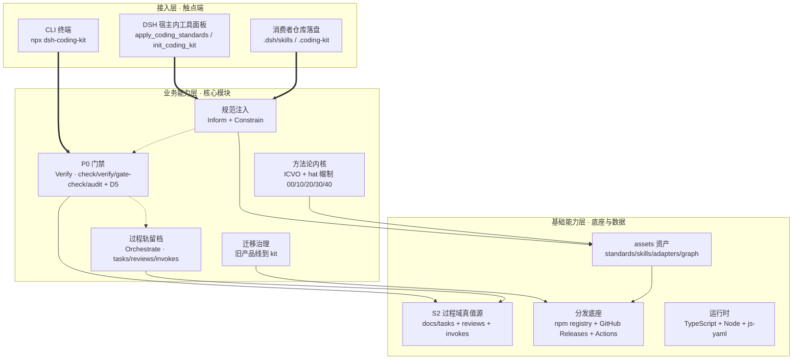
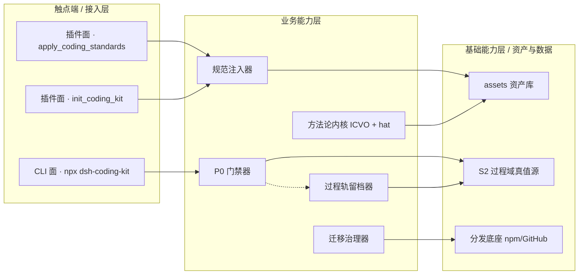

# AICoding 架构设计 · 高层架构设计

> 本文档为《AICoding 架构设计》核心产物之一，对应**高层架构设计模版**。
> 上游输入：业务原始诉求 + 行业调研结论 + 现有架构知识库；
> 下游输出：驱动《系统设计》《部署设计》《安全设计》《UserStory》四份文档的撰写。

---

## 模版使用说明（必读）

> ⚠️ **本文件是「模版」而非真实设计稿**。所有文字、表格、图示中出现的业务内容（如"投诉场景 / 坐席工作台 / T3C / 实时辅助"等）**仅作为示意，便于读者理解填写思路**，并不代表当前项目的真实业务范围。

**约定的占位符 / 示例标记**：

| 标记 | 含义 | 处理方式 |
| --- | --- | --- |
| `<...>` 或 ``<...>`` | 占位符，需替换为真实业务取值 | **必须**替换或删除 |
| `示例：` / `例：` 前缀 | 仅作为填写参考的示例 | **必须**替换为真实内容，或整行删除 |
| `YYYY-MM-DD` / `<n>` / `<x>` | 待填具体日期 / 数字 | **必须**替换为真实数值 |
| 标注「**示例·仅供参考**」的表格/图 | 整段为示例 | **必须**整体重写为真实业务内容 |

**填写纪律**：
1. 文档定稿前，全文不允许残留 `<...>`、`示例：` / `例：`、`YYYY-MM-DD`、`TBD` 等占位标识。
2. 表格中的示例行可以直接覆盖，但**列结构（表头）不允许删除**——它代表了硬性约束。
3. 章节中的"硬指标"段落**不是示例**，是该章节产出物必须满足的合格基线，需保留。
4. 附录 A / B 描述的是生成方法论与工具清单，属于元信息，**不需要按业务替换**。

**领域示例的来源**：本模版示例多以"客服 / 投诉 / 坐席工作台"为背景，仅因当前项目（AICalling）的领域而便于举例，**任何业务领域均可套用**本模版骨架。

---

## 0. 元信息：修订记录

> 记录文档版本、变更内容、修订人、修订时间，确保设计文档的可追溯。

```yaml
标题: dsh-coding-kit - 高层架构设计 v1.0
版本: v1.0
状态: Draft   # Draft | Reviewing | Approved | Deprecated
创建日期: 2026-09-04
最后更新: 2026-09-04
作者: business-architect（许边界）
评审人:
  - 主理人 / 齐构成
  - 业务负责人 / 项目 Owner

关联文档:
  上游输入:
    - 业务原始诉求 / 治理基线: .workbuddy/phase0_charter.md
    - 资料摘要（G1）: .workbuddy/output/material_digest.md
    - 行业调研报告（G2）: .workbuddy/output/research_report.md
  下游产出:
    - 系统设计: AICoding架构设计-2-系统设计.md
    - 部署设计: AICoding架构设计-3-部署设计.md
    - 安全设计: AICoding架构设计-4-安全设计.md
    - UserStory: AICoding架构设计-5-UserStory.md
```

| 版本 | 日期 | 作者 | 变更内容 | 评审状态 |
| --- | --- | --- | --- | --- |
| v1.0 | 2026-09-04 | business-architect（许边界） | 初稿：基于 G1 资料摘要与 G2 调研报告，冻结宿主策略（乙·两步走）与 MVP 范围 | Draft |

> **版本管理纪律**：破坏性变更（章节结构调整 / 关键决策反转）升 MAJOR；新增章节、扩充内容升 MINOR。

---

## 1. 需求概要

### 1.1 需求概要说明

> 一句话描述本期需求要解决的核心业务问题、覆盖的业务场景与服务对象。

- **业务现状**：`dsh-coding-kit`（下文统一称 kit）是已发布至 1.10.0 的 npm 包，同时是 DeepSeek Harness（DSH）的 bundle 插件，用 ICVO（Inform · Constrain · Verify · Orchestrate）方法论给 AI 编码过程加纪律，双入口（插件面 + CLI 面）。
- **触发事件**：项目 Owner 启动 AICoding 架构专家团，要求对 kit 做完整阅读、审查、评价与未来升级路线规划（审查重心四项全选：架构与模块化 / 工程质量与测试 / 产品竞争力与生态位 / 升级路线与版本演进）。
- **系统定位一句话**：kit 是「跨宿主规范分发器」演进方向上的已有系统扩展——**经中间确认，DSH 是首个宿主而非唯一宿主**，1.x 收敛内部一致性、2.0 引入宿主适配表。

### 1.2 关键决策摘要

> 列出本期最关键的 3 ~ 5 项设计决策（含范围决策、技术选型决策、MVP / 完整版边界决策）。

| 编号 | 决策类别 | 决策内容 | 关联章节 |
| --- | --- | --- | --- |
| D1 | 范围决策 | 1.x 阶段只收敛内部一致性（X7 S2 真值源 / X6 SPEC 钉版 / X11 目录语义），不铺开跨宿主；跨宿主规范分发器化落 2.0 | §4.3 / §6.1 |
| D2 | 宿主策略 | **经中间确认**：乙·两步走，DSH 由「唯一宿主」转为「首个宿主」，规避宿主单点依赖（R-02 处置） | §4.2 / §5.2 |
| D3 | 技术选型决策 | 门禁语义对齐行业事实标准（退出码 2 阻断 / failClosed / 分层强制）；分发维持 npm + GitHub Releases（零云） | §3.2 / §4.1 |
| D4 | MVP / 完整版边界 | MVP = R1 / R3 / R4 / R5（内部一致性 + 迁移治理）；R2 落 2.0；R6 后移 G5、R7 / R8 否决 | §4.3 |
| D5 | 复用 vs 新建 | 规范注入层复用现有 assets 适配器与 skills 底座；P0 门禁、过程轨、方法论内核（ICVO + hat）保持自研 | §2.4 / §5.2 |

**硬指标**：≥ 3 条，≤ 5 条；每条决策必须能映射到正文具体章节。

### 1.3 价值主张

> 明确本系统/本期需求对业务的核心价值贡献（效率、合规、收入、成本、体验等维度）。

| 价值维度 | 量化目标 | 度量指标 | 当前值 | 目标值 | 截止时间 |
| --- | --- | --- | --- | --- | --- |
| 合规（产品信任） | 核心硬约束「永不覆写 S2」的实现从分裂收敛为唯一真值源 | S2 过程域前缀硬编码份数 | 4 份互不一致（`src/index.ts:13` / `cli-refresh-ide-blocks.ts:299` / `cli-graph-hgm.ts:367` / `cli-skills.ts:272-283`） | 1 份共享常量，跨命令门禁结论一致率 100% | 1.x MVP 上线 |
| 合规（对外承诺） | 消除对外承诺失真，版本钉一致性做成发布前硬校验 | SPEC 钉版本与包版本偏差 | 8 个版本（SPEC 1.2.0 vs 包 1.10.0） | 0（发布前自动校验阻断） | 1.x MVP 上线 |
| 成本（可维护性） | 消除重复硬编码，降低多入口维护的隐性成本 | 重复常量 / 语义分裂点 | X7（4 份前缀）+ X12（同名同值重复）+ X11（同名双重语义） | 归零，公共符号复用 | 1.x MVP 上线 |

**硬指标**：业务价值 ≥ 2 条 + 技术/成本价值 ≥ 1 条；每条必须可量化，禁止出现"提升 / 优化 / 加强 / 更好"等模糊词。

---

## 2. 需求分析 & 痛点解构

### 2.1 核心角色关注点

> 按"甲方决策者 / 最终用户 / 受影响方"维度盘点角色诉求。

| 角色 | 业务身份 | 主要操作 | Top1 关心点 | 来源 |
| --- | --- | --- | --- | --- |
| 甲方决策者（项目 Owner） | kit 维护者 / 产品方向决策者 | 决定宿主策略、MVP 范围、是否商业化 | 在 `AGENTS.md` 规范注入层已标准化的背景下，能否守住「门禁 + 过程轨留档 + 角色分帽」的差异化护城河 | 用户诉求 / phase0_charter §1 |
| 最终用户 A（宿主内开发者） | 在 DSH 宿主内跑 AI 编码的工程师 | 触发 `apply_coding_standards` / `init_coding_kit` | 纪律注入是否无侵入、不打断编码流程，规范是否随版本一致可预期 | material_digest D1（README） |
| 最终用户 B（CLI 门禁执行者） | 消费者仓库中跑门禁的开发者 | 执行 `npx dsh-coding-kit check/verify/gate-check/audit` | 门禁判定是否机械、可信、可解释，退出码语义是否明确 | material_digest D9（src 源码族） |
| 受影响方（旧产品线用户） | `@cyning/harness` 既有使用者 | 从旧产品线迁移到 kit | 迁移时间表与迁移成本是否明确、可预期 | material_digest D2 / X11 |
| 受影响方（外部评估者） | 依据 SPEC / README 评估 kit 的潜在用户与贡献者 | 阅读对外契约文档 | 对外承诺（SPEC 版本钉、能力边界）与实际能力是否一致 | material_digest X6 / X3 |

**硬指标**：≥ 3 类（甲方决策者 / 最终用户 / 受影响方各至少一行）；每行必须有"Top1 关心点"，禁止笼统写"使用方便"。

### 2.2 核心痛点

> 以 P1 / P2 / P3 ... 的优先级编码，列出本期需要解决的关键痛点。

| 编号 | 痛点描述 | 现象 / 数据 | 影响角色 | 影响程度 | 优先级 |
| --- | --- | --- | --- | --- | --- |
| P1 | 「永不覆写 S2」这一核心硬约束的实现本身是分裂的：S2 过程域前缀有 4 份互不相同的硬编码，无共享常量 | 4 份定义分别是：`src/index.ts:13`（3 项裸形态）、`cli-refresh-ide-blocks.ts:299`（3 项带 docs/harness 前缀）、`cli-graph-hgm.ts:367`（5 项并集）、`cli-skills.ts:272-283`（3 项 + `/.dsh/skills` 白名单），导致同一「是否覆写 S2」在不同命令下结论不一致 | 最终用户 A / B、甲方决策者 | 高（核心硬约束正确性） | P1 |
| P2 | 对外承诺失真：SPEC.md 钉在 1.2.0，包已 1.10.0，落后 8 个版本且不随 npm 包分发 | `SPEC.md:1/49` 钉 `1.2.0`；`package.json` version = `1.10.0`；`ontology.yaml:7` 标 `1.10.0` | 受影响方（外部评估者） | 中（信任与文档竞争力） | P2 |
| P3 | 旧产品线迁移无时间表 + `.cyning-harness` 目录名双重语义，双轨长期并行 | 5 处 `.cyning-harness` 是现行落盘位置（`cli.ts:113` / `cli-refresh-ide-blocks.ts:325` / `cli-graph-hgm.ts:5` / `cli-sync-prompts.ts:50` / R-07 marker），`src/index.ts:186` 又将其当「legacy 布局」探测标记 | 受影响方（旧产品线用户）、甲方决策者 | 中（品牌与维护成本） | P2 |
| P4 | 工程一致性缺口：重复常量、测试/缺陷计数口径矛盾、发布回顾时效缺口 | `INVOKE_DIR_CANDIDATES` 在 `cli-checks.ts:17` 与 `cli-task-extra.ts:14` 重复定义；测试总数 310 vs 288 矛盾（X19）；缺陷 27 vs 33 矛盾（X13）；发布回顾只覆盖到 1.5.0（X3） | 甲方决策者、最终用户 B | 中（可信度） | P3 |

**优先级标准**：
- **P1**：直接影响业务核心流程或合规底线，不解决无法上线。
- **P2**：影响用户体验或运营效率，可在 MVP 后迭代。
- **P3**：体验型 / 长尾问题，列入完整版或后续版本。

**硬指标**：每条痛点必须有"现象 / 数据"佐证；P1 ≥ 1 条且必须在 §2.3 有对应目标。

### 2.3 期待目标

> 以 V1 / V2 / V3 ... 的形式列出可量化的业务目标，对齐核心痛点。

| 编号 | 目标描述 | 对齐痛点 | 度量指标 | 当前值 | 目标值 | 截止时间 |
| --- | --- | --- | --- | --- | --- | --- |
| V1 | S2 过程域前缀收敛为 1 份共享常量，门禁结论跨命令一致 | P1 | S2 前缀硬编码份数 / 门禁结论一致率 | 4 份互不一致 | 1 份 / 一致率 100% | 1.x MVP 上线 |
| V2 | SPEC 版本钉与包版本一致，版本钉一致性进发布前校验 | P2 | 版本钉偏差（版本数） | 8 | 0 | 1.x MVP 上线 |
| V3 | `.cyning-harness` 语义收敛为单一定义，并给出旧产品线迁移时间表 | P3 | 目录名语义数 / 迁移时间表 | 2（现行落盘 + legacy 标记） | 1 / 已发布 EOS 与过渡窗 | 1.x MVP 上线 |
| V4 | 门禁对外承诺明确：退出码 2 阻断、failClosed 默认策略写入文档 | P1 | 门禁语义文档化 | 未成文 | 已写入 README / SPEC | 1.x MVP 上线 |
| V5 | 重复常量去重，工程口径统一（测试/缺陷计数单一口径） | P4 | 重复常量数 / 口径版本数 | X7/X12 等 4 类重复 | 归零 / 1 套 | 完整版（2.0） |

**硬指标**：每条目标必须**有数字 + 对齐至少 1 条痛点**；P1 痛点必须有对应 V 级目标。

### 2.4 基线复用

> 现有架构 / 现有能力中可直接复用的组件、平台、模型、数据资产。

| 复用类别 | 现有能力 | 复用方式 | 来源系统 | 备注 |
| --- | --- | --- | --- | --- |
| 核心底座（规范注入） | `assets/ide/adapters/`（4 份）+ `assets/skills/`（8 份 SKILL 封装） | 复用为规范注入层底座，2.0 抽为声明式适配表 | 本仓 `assets/` | 现状适配关系散落为硬编码（X7/X12），复用前须先抽为声明式清单 |
| 核心底座（门禁） | P0 门禁 `check` / `verify` / `gate-check` / `audit` + D5 测试制品探测 | 复用门禁框架，仅做语义层对齐（退出码 2 / failClosed） | 本仓 `src/cli*.ts` | 门禁正确性先于门禁强制性，须先统一 S2 真值源 |
| 过程资产 | S2 过程域 `docs/tasks/` + `docs/harness/reviews/` + `docs/harness/invokes/by-task/` | 复用，仅统一前缀真值源 | 本仓 `docs/` | 「永不覆写」是硬约束，本次只统一真值源、不改变语义 |
| 方法论内核 | ICVO（Inform · Constrain · Verify · Orchestrate）+ hat 帽制（00/10/20/30/40） | 复用（差异化资产，不自建、不对标） | 本仓 `assets/` / `eval/` | 需补最小对外表达文档，缓解 X6 对外承诺失真 |
| 分发 | npm registry + GitHub Releases + GitHub Actions | 复用（维持现状，零云资源） | npm / GitHub | 与 B3/B4 离线零云路线一致，是合规可控性 5/5 的来源 |
| 运行时 | TypeScript + Node，运行时依赖仅 `js-yaml` | 复用 | 本仓 `package.json` | 测试 `node --test --experimental-strip-types`，构建 `tsc` |

**硬指标**：必须先盘点再决定新建；凡列入"功能缺口"的能力，必须先在本节确认基线无法覆盖。

### 2.5 功能缺口

> 在现有基线之上仍需新建的功能能力（按业务阶段维度分组）。

> 本项目是本地 CLI + npm 分发的 Node 包（非客服/交易类业务系统），阶段维度采用其方法论内核的分段：**注入（Inform/Constrain）/ 门禁（Verify）/ 留档（Orchestrate）/ 治理（演进）**。

| 阶段 | 功能缺口 | 必要性 | 优先级 | 对齐目标 |
| --- | --- | --- | --- | --- |
| 门禁（Verify） | S2 过程域真值源唯一化：4 份硬编码前缀收敛为 1 份共享常量 | 必须 | MVP | V1 |
| 门禁（Verify） | P0 门禁语义对齐行业（退出码 2 阻断 / failClosed / 分层强制） | 必须 | MVP | V4 |
| 治理（演进） | SPEC 版本钉治理：版本钉一致性做成发布前校验项 | 必须 | MVP | V2 |
| 治理（演进） | 旧产品线迁移治理：deprecate + EOS 时间表 + MIGRATION 文档 + `.cyning-harness` 语义收敛 | 必须 | MVP | V3 |
| 注入（Inform/Constrain） | 规范分发器化：单一规范源 → N 个宿主原生配置位（宿主适配表） | 重要 | 完整版（2.0） | V1 |
| 治理（演进） | 工程口径统一：重复常量去重、测试/缺陷计数单一口径 | 重要 | 完整版（2.0） | V5 |

**硬指标**：每条缺口必须对齐 §2.3 至少一条目标；MVP 缺口必须在 §6.3 功能清单中对应有 MVP 范围标记。

---

## 3. 行业调研

### 3.1 行业标杆系统分析

> 对标行业内代表性产品/系统，输出标签化清单（场景覆盖、技术亮点、商业模式等）。

| 标杆系统 | 厂商 / 来源 | 场景覆盖 | 技术亮点 | 商业模式 | 适用度 |
| --- | --- | --- | --- | --- | --- |
| Ruler（B4） | 开源（MIT，npm） | 32 类 agent 目标的规范注入（输出 `AGENTS.md` / `CLAUDE.md` 等） | 声明式适配表 + 单一规范源 + `ruler apply` 编译落地；一条 `npx` 即完成、离线可用 | 开源，零许可 | 高（借鉴形态与适配表设计，不借鉴其 Beta 实现） |
| GitHub spec-kit（B3） | GitHub | 方法论内核 + 过程轨 + 模板资产 + 多宿主（30+ 集成） | 四层模板优先级（本地 > Presets > Extensions > Core）+ 安装期物化 + 产物入仓可审 | 开源，零许可 | 高（借鉴模板治理与过程门禁范式） |
| Claude Code（B1） | Anthropic | 宿主内置 hooks 门禁 + 插件 Marketplace | 退出码 2 / `permissionDecision: deny` 阻断语义、约 30 个钩子事件、项目级 hooks 随仓库共享 | 订阅（约 20 USD/月起） | 中（借鉴门禁语义与分发校验，不借宿主绑定） |
| Cursor（B2） | Anysphere | IDE 内规则四层强制下发 | 四层优先级 Enterprise > Team > Project > User + `failClosed` + `loop_limit` | 订阅（约 20 USD/月起） | 中（借鉴 failClosed 与分层强制，不借 IDE 绑定） |
| AWS Kiro（B5） | AWS | 端到端 IDE 规格驱动开发闭环 | 规格驱动 + Bedrock 绑定、自成闭环 | 多档订阅（最高约 200 USD/月） | 低（否决形态，仅抄其旧产品线迁移治理范式） |

**硬指标**：≥ 3 家；至少包含 1 家头部 SaaS + 1 家开源/自研代表。

### 3.2 方案对标及优先级打分

> 横向对比矩阵 + 打分结果，得出对本期最具参考价值的方案集合。

**对比矩阵**（每行权重之和 = 1）：

| 评估维度 | 权重 | Ruler（B4）得分 | spec-kit（B3）得分 | Claude Code（B1）得分 | Cursor（B2）得分 | AWS Kiro（B5）得分 |
| --- | --- | --- | --- | --- | --- | --- |
| 场景契合度 | 0.30 | 5 | 4 | 4 | 3 | 3 |
| 技术成熟度 | 0.20 | 2 | 4 | 5 | 5 | 4 |
| 集成难度（反向）| 0.15 | 5 | 4 | 3 | 3 | 1 |
| 成本（反向） | 0.15 | 5 | 5 | 3 | 3 | 2 |
| 合规可控性 | 0.20 | 5 | 5 | 4 | 3 | 2 |
| **加权总分** | **1.00** | **4.40** | **4.35** | **3.90** | **3.40** | **2.55** |

**结论摘要**：
- **优先借鉴**：Ruler（4.40）+ GitHub spec-kit（4.35）—— 前者给出「分发形态」答案（单一规范源 + 声明式适配表 + 编译落地），后者给出「过程门禁与模板治理」答案（四层优先级 + 产物入仓可审）。二者相加覆盖 kit 的「规范注入 + 过程门禁 + 可分发的 CLI 产品」三要素。
- **部分借鉴**：Claude Code（3.90）与 Cursor（3.40）—— 借「退出码 2 阻断 / `permissionDecision: deny`」「`failClosed`」「四层优先级」，不借宿主绑定与云仪表盘分发（与 kit 零云资源约束冲突）。
- **不借鉴**：AWS Kiro（2.55）—— 否决其产品形态（需换 IDE + AWS/Bedrock 绑定），但单列抄用其**旧产品线迁移治理范式**（12 个月过渡窗、新注册截止先于 EOS 日、旧渠道挂废弃公告、按渠道给迁移指南）。

### 3.3 完整报告参考

> 给出行业调研完整报告的链接或归档路径，供深度查阅。

- 完整报告链接：`.workbuddy/output/research_report.md`（本仓归档，G2 已通过自动校验 + 人工审核）
- 调研工具：`tech-research-advisor`（见附录 B）
- 调研日期：2026-09-04
- 调研归档：`.workbuddy/output/research_report.md`

---

## 4. 方案决策

### 4.1 价值定位澄清

> 当前需求/系统对业务全局的价值贡献。

**定位三段式**（`对外 / 对内 / 差异化` 三段是固定结构，需保留；具体内容按真实业务填写）：

```
对外价值（客户侧）: 给 AI 编码过程加"可证明的纪律"——规范注入（Inform/Constrain）+ 机械门禁（Verify）+ 过程轨留档（Orchestrate），让编码过程可追溯、可审计、可复现。
对内价值（运营侧）: 维护者获得"跨宿主规范分发器"的可扩展底座，规避宿主单点依赖（R-02）；同时收敛内部一致性，降低多入口维护的隐性成本。
差异化价值        : 五家标杆中无任何一家提供"门禁 + 过程轨留档 + 角色分帽（ICVO + hat 00/10/20/30/40）"的等价物——这是 kit 不被 Ruler 类工具替代的根因，也是护城河所在。
```

**与产品矩阵的关系**：本系统在「AI 编码纪律工具」价值主线中承担「纪律的机械判定与过程留档」这一核心职责，与「规范注入（复用 assets 适配器）」「分发底座（npm/GitHub）」共同形成完整业务闭环（见 §5.2、§5.3）。

### 4.2 系统定位澄清

> 当前系统在产品矩阵 / 技术架构中的边界与上下游。

| 维度 | 内容 |
| --- | --- |
| 系统名称 | dsh-coding-kit（kit） |
| 系统类型 | 已有系统扩展（1.10.0 已发布的 npm 包，非新建） |
| 部署形态 | npm 包 + 本地 CLI + DSH bundle 插件（非 SaaS / 私有化 / 混合云） |
| 多租户 | 消费者仓库级隔离（每个消费者的仓库/工作区是隔离单元，无服务端多租户） |
| 服务对象 | DSH 宿主内开发者、消费者仓库 CLI 门禁执行者、旧产品线 `@cyning/harness` 迁移用户（对齐 §2.1） |
| 上游依赖 | DSH 宿主运行时（`dsh plugin add` 安装面）、npm registry、GitHub Actions（详见 §5.2） |
| 下游消费者 | 各 AI 编码宿主（DSH 为首个，2.0 起 `AGENTS.md` / `CLAUDE.md` 等多宿主落点）、各消费者代码仓库（详见 §5.2） |
| 边界（不做） | 不做云服务、不做自研 IDE、不做商业化计费（R7 / R8 已否决 / 后移）；不规定数据库表结构与资源规格（归下游 system-architect / platform-architect） |

### 4.3 MVP 与完整版决策

> 明确 MVP 范围、完整版范围、两者的演进关系，确保 MVP 不偏离完整版的整体框架。

| 阶段 | 时间窗 | 范围（功能编号） | 架构差异点 | 退出标准 | 不做（延后） |
| --- | --- | --- | --- | --- | --- |
| MVP（1.x 阶段） | 1.x 维护期 | F1, F2, F3, F4, F5 | 纯内部重构 + 文档工程：统一 S2 真值源、门禁语义对齐、SPEC 钉版校验、旧产品线迁移治理、目录语义收敛；不引入宿主适配表、不改变产品形态 | X7/X6/X11 三项内部一致性收敛完成 + P0 门禁语义写入文档 + 迁移时间表发布 + 校验器 FAIL=0 | F6（宿主适配表） |
| 完整版（2.0 阶段） | 2.0 规划期 | + F6 | 在唯一真值源之上引入宿主适配表：单一规范源 → `AGENTS.md` 等 N 宿主原生配置位 | 至少落地 2 个非 DSH 宿主适配（`AGENTS.md` 为首个默认落点），DSH 契约版本嗅探 + 不匹配降级 | — |

**演进纪律**（重要）：
- ✅ MVP 的架构骨架必须是完整版的**子集**：1.x 的「统一 S2 真值源 + 声明式资产清单」正是 2.0 宿主适配表的数据底座，MVP 不推倒重来。
- ✅ 2.0 引入适配表之前，1.x 必须先完成 X7 / X6 / X11 三项内部一致性收敛——否则跨宿主等于把分裂的真值源复制到 N 个宿主。
- ❌ 禁止：MVP 为赶工引入「完整版无法继承」的临时架构（如先给单一宿主写死适配，再在 2.0 反推成适配表）。

---

## 5. 业务架构设计

### 5.1 业务架构图

> 形成系统级业务架构图，体现核心业务模块、流程方向、数据流。

**绘制规范**：
- 至少 3 层：**接入层（用户/触点）→ 业务能力层（核心模块）→ 基础能力层（底座/数据）**。
- 每个模块必须有**标准名**（与 §4.2 系统定位 / 后续术语表一致）。
- 数据流方向必须明确（实线 = 同步调用、虚线 = 异步事件、粗线 = 主链路）。



### 5.2 系统依赖架构

> 基于系统定位，明确上下游模块清单及交互方式（同步 / 异步 / 数据订阅）。

| 依赖类型 | 系统 / 模块 | 提供方 | 依赖能力 | 接入方式 | 同步/异步 | 关键约束 |
| --- | --- | --- | --- | --- | --- | --- |
| 上游 | DSH 宿主运行时 | DSH（DeepSeek Harness） | 插件安装面 `dsh plugin add`、宿主内工具注册 `apply()` | 宿主进程内调用（cordis 加载） | 同步 | 契约随上游版本演进（锚定 0.1.0-rc.8），需版本嗅探 + 不匹配降级（U-01） |
| 上游 | npm registry | npm | 包分发与版本解析、`npm deprecate` 迁移治理 | HTTPS / npm CLI | 同步 | 维持零云资源；发布凭据分级与轮转归 security-architect |
| 上游 | GitHub Actions | GitHub | CI（`prepublishOnly` 四道闸门）、发布制品 | OIDC 令牌 + workflow | 异步 | `npm test` 不覆盖 `test/lib-smoke/`（X10），须走 `test:lib` |
| 下游 | 各 AI 编码宿主 | DSH 首个 + `AGENTS.md` / `CLAUDE.md` 等（2.0） | 规范注入落盘（原生配置位） | 文件落盘（本地） | 同步 | 「永不覆写 S2」硬约束；S2 前缀真值源须唯一（X7） |
| 下游 | 消费者代码仓库 | 各消费者 | 门禁执行 + 过程轨留盘 | CLI 进程 + 文件落盘（`.dsh/skills` / `.coding-kit`） | 同步 | 消费者仓库级隔离；无服务端多租户 |
| 复用底座 | assets 资产目录 | 本仓 | 规范 / skills / 适配器 / 图谱资产 | 文件读取 | 同步 | 现状适配关系散落为硬编码，复用前须抽为声明式清单 |

**硬指标**：
- 每条依赖必须明确"接入方式 + 同步/异步 + 关键约束"，禁止只写"调用 API"。
- 所有 P1 痛点对应的核心能力，必须能在本表中找到依赖来源（自建/复用/采购）。

### 5.3 业务闭环

> 描述业务全链路的闭环路径，标注关键环节、关键反馈回路与运营主线。

**业务主链路**（端到端）：

```
规范注入（Inform/Constrain 落盘） → 门禁机械判定（Verify · P0 门禁） → 过程轨留档（Orchestrate · tasks/reviews/invokes） → 升级审查（本轮诉求：审查→评价→升级路线） → 反馈回路
```

**关键反馈回路**：

| 回路 | 触发点 | 反馈对象 | 反馈机制 | 价值 |
| --- | --- | --- | --- | --- |
| 业务效果回路 | 本轮「审查 + 评价 + 升级路线规划」交付 | 项目 Owner | G3 人工审核 + 下游 G4/G5 设计反哺 | 把审查结论冻结为升级路线（X7/X6/X11 收敛 + 宿主适配表） |
| 运营监控回路 | 门禁结论跨命令不一致（真值源分裂触发） | 维护者 | 回归测试 + 发布前校验 | 把「永不覆写 S2」的判定一致性作为发布硬闸 |
| 资产/版本迭代回路 | 过程轨留档（CHANGELOG / 发布回顾 / defects ledger） | 维护者 / 外部评估者 | 版本钉一致性校验 + 发布回顾续写 | 消除对外承诺失真（X6/X3），保持文档可信 |

**运营主线**：
- **每次发布前**：维护者跑 `prepublishOnly` 四道闸门 + 版本钉一致性校验（对齐 V2）+ S2 真值源回归（对齐 V1）。
- **每周**：维护者核对过程轨留档（tasks/reviews/invokes）与 `docs/releases/` 发布回顾是否续写到当前版本（对齐 X3/X13 口径）。
- **每月 / 阶段门**：项目 Owner 在 G3→G6 各阶段门审阅本架构设计的边界冻结情况与迁移时间表执行进度（对齐 V3）。

---

## 6. 产品需求及原型

### 6.1 需求边界

> 明确本期与后续版本的需求范围、能力边界、交付物边界。

**In-Scope**（本期必做）：

```
F1. 统一 S2 过程域真值源（X7 → R1）：4 份硬编码前缀收敛为 1 份共享常量
F2. P0 门禁语义对齐行业（R3）：退出码 2 阻断 / failClosed / 分层强制
F3. 旧产品线迁移治理（R4）：@cyning/harness deprecate + EOS 时间表 + MIGRATION 文档
F4. 版本钉治理（X6 → R5）：SPEC 版本钉一致性做成发布前校验
F5. .cyning-harness 目录名语义收敛（X11）：双重语义 → 单一定义
F6. 规范分发器化 / 宿主适配表（R2，2.0 阶段）：单一规范源 → N 宿主原生配置位
N1. 消费者仓库级隔离（无服务端多租户）
N2. 维持零云资源约束（不引入云依赖 / 第三方托管）
```

**Out-of-Scope**（本期不做，必须列原因）：

| 编号 | 不做的事 | 原因 | 后续计划 |
| --- | --- | --- | --- |
| O1 | 自研 IDE / 深度绑定单一宿主（R7） | 与 npm 包形态与零云优势冲突，投入产出不成立（对标 B5 评分 2.55） | 不做 |
| O2 | 商业化计费 / 团队席位（R8） | 赛道内最贴近形态的 B3/B4 均为 MIT 开源零许可，内部一致性未收敛前商业化会暴露信任风险 | MVP 外，另行评估 |
| O3 | 第二分发通道 / 第三方 marketplace（R6） | 引入云依赖与第三方审核，击穿「无任何云资源」约束 | 后移 G5 部署设计与安全设计 |
| O4 | 云服务 / SaaS 化 | 本项目是本地 CLI + npm 分发的 Node 包，无任何云资源 | 不做 |

**硬指标**：In-Scope ≤ 15 条；Out-of-Scope ≥ 3 条（"没有不做的事"= 边界没想清）。

### 6.2 产品模块全景图

> 形成产品模块的全景视图，体现模块拆分、模块归属、模块间关系。

**模块卡片**（每个模块必填字段）：

| 模块名称 | 一级归属 | 责任团队 | 上游 | 下游 | MVP 是否包含 |
| --- | --- | --- | --- | --- | --- |
| CLI 面（`npx dsh-coding-kit`） | 接入层 | kit 维护者（项目 Owner） | 消费者仓库、npm registry | P0 门禁、过程轨留档 | 是 |
| 插件面（`apply_coding_standards` / `init_coding_kit`） | 接入层 | kit 维护者（项目 Owner） | DSH 宿主运行时 | 规范注入 | 是 |
| 规范注入器 | 业务能力层 | kit 维护者（项目 Owner） | assets 资产、插件面 | P0 门禁、消费者落盘 | 是（2.0 扩展适配表） |
| P0 门禁器 | 业务能力层 | kit 维护者（项目 Owner） | CLI 面、S2 真值源 | 过程轨留档 | 是 |
| 过程轨留档器 | 业务能力层 | kit 维护者（项目 Owner） | P0 门禁、S2 过程域 | 发布回顾、升级审查 | 是 |
| 方法论内核（ICVO + hat 帽制） | 业务能力层 | kit 维护者（项目 Owner） | assets 资产 | 规范注入、门禁语义 | 是 |
| 迁移治理器 | 业务能力层 | kit 维护者（项目 Owner） | npm registry、旧产品线 | 消费者迁移 | 是 |
| assets 资产库 | 基础能力层 | kit 维护者（项目 Owner） | 分发底座 | 规范注入、方法论内核 | 是 |
| S2 过程域真值源 | 基础能力层 | kit 维护者（项目 Owner） | 运行时 | P0 门禁、过程轨留档 | 是 |
| 分发底座（npm/GitHub） | 基础能力层 | kit 维护者（项目 Owner） | npm registry / GitHub | assets 资产、消费者 | 是 |



### 6.3 功能清单

> 输出"一级模块 / 二级功能 / 优先级 / MVP 范围 / 完整版范围"五列功能清单。

| 编号 | 一级模块 | 二级功能 | 功能描述 | 优先级 | MVP 范围 | 完整版范围 | 对齐目标 |
| --- | --- | --- | --- | --- | --- | --- | --- |
| F1 | 过程轨留档 | S2 真值源唯一化 | 4 份互不一致的 S2 前缀硬编码（X7）收敛为 1 份共享常量，统一「永不覆写 S2」判定 | P0 | ✅ | ✅ | V1 |
| F2 | P0 门禁 | 门禁语义对齐 | 退出码 2 = 阻断、failClosed 失败即阻断、分层强制写入文档与实现（R3） | P0 | ✅ | ✅ | V4 |
| F3 | 迁移治理 | 旧产品线迁移时间表 | `@cyning/harness` 挂 deprecate + EOS 日 + MIGRATION 文档 + 过渡窗（R4） | P0 | ✅ | ✅ | V3 |
| F4 | 迁移治理 | `.cyning-harness` 语义收敛 | 现行落盘位置 vs legacy 标记的双重语义（X11）收敛为单一定义 | P0 | ✅ | ✅ | V3 |
| F5 | 版本钉治理 | SPEC 钉版一致性校验 | SPEC 版本钉与包版本一致，发布前自动校验阻断（X6 → R5） | P0 | ✅ | ✅ | V2 |
| F6 | 规范注入 | 宿主适配表（规范分发器化） | 单一规范源 → `AGENTS.md` 等 N 宿主原生配置位，声明式适配表（R2，2.0） | P1 | ❌ | ✅ | V1 |

**硬指标**：
- 每个 P0 功能必须在 MVP 范围内为 ✅。
- 每个功能必须能反向映射到 §2.5 功能缺口 + §2.3 期待目标。

### 6.4 产品原型 - CLI 命令行交互端

> 核心页面/交互原型设计。
>
> ⚠️ 本项目的「触点端 1」是 CLI 终端（`npx dsh-coding-kit`），非坐席工作台 / 管理端；按 §6.2 模块全景图中的 CLI 面命名。

**核心页面清单**：

| 页面 | 用途 | 关键交互 | MVP |
| --- | --- | --- | --- |
| P0 门禁输出（check/verify/gate-check/audit） | 机械判定纪律是否达标，D5 测试制品探测硬门禁 | 退出码语义（2 阻断 / 1 非阻断）+ 命中项逐条列示 | ✅ |
| 过程命令输出（项目过程命令 G1–G7） | task / lifecycle / status / timeline 流程编排 | 按 task 二级分派 + 过程轨提示 | ✅ |
| 插件初始化（`init_coding_kit`） | 在消费者仓库初始化落盘资产 | 落盘路径确认 + 覆盖策略提示 | ✅ |
| 规范注入（`apply_coding_standards`） | 把规范注入宿主原生配置位 | S2 过程域保护提示（永不覆写） | ✅ |
| 帮助 / 版本 | 命令帮助与版本比较 | `--help` / version 展示 | ✅ |

**关键交互约束**：
- 退出码语义：退出码 2 = 阻断（gate-check 失败不放行）、退出码 1 = 非阻断放行，二者行为必须写入 README / SPEC（对齐 V4）。
- S2 过程域保护：任何命令命中 `docs/tasks/`、`docs/harness/reviews/`、`docs/harness/invokes/by-task/` 时**永不覆写**，并显式提示（对齐 V1）。

**原型链接**：本项目为 CLI 产品，无 Figma/Axure 原型；交互以命令行输出与退出码语义为准。

### 6.5 产品原型 - 宿主内工具面板

> 核心页面/交互原型设计。
>
> ⚠️ 本项目的「触点端 2」是 DSH 宿主内工具面板（`apply_coding_standards` / `init_coding_kit` 两个宿主内工具），非工单总览 / 管理端。

**核心页面清单**：

| 页面 | 用途 | 关键交互 | MVP |
| --- | --- | --- | --- |
| 工具注册面板（`apply_coding_standards`） | 宿主内一键应用编码纪律规范 | 工具触发 + profile 档位（l1 / l1+l2 / full）选择 | ✅ |
| 初始化面板（`init_coding_kit`） | 宿主内初始化 kit 落盘 | 落盘目标确认 + 覆盖策略提示 | ✅ |
| S2 保护提示 | 明确「永不覆写 S2」边界 | 命中 S2 过程域时阻断并提示 | ✅ |

**原型链接**：本项目宿主内工具为插件注册工具，无 Figma/Axure 原型；交互以宿主工具调用与返回文本为准。

---

## 附录 A：生成流程方法论

> 本附录为高层架构设计的**生成方法论**，描述每一步的目标、工具与产物形态，作为正文章节的产出依据。
>
> ⚠️ **附录中"能力效果展示"小节出现的领域举例（如"AI 智慧外呼 / 投诉场景"）仅用于演示方法论的输入与产物形态，不代表本模版的目标领域**。读者只需关注每一步的「目标 / 工具 / 产物形态」即可。

### A.0 生成流程总览

> 高层架构设计采用 **Step0 → Step5** 六步法，逐步从「业务背景」推导至「系统高层架构 + 产品需求原型」。

| 步骤 | 名称 | 核心产出 | 落入正文章节 |
| --- | --- | --- | --- |
| Step0 | 业务基础知识库构建 | 关联文档结构化知识库 | （为全文提供输入） |
| Step1 | 行业调研分析 | 行业标杆 / 方案对比 / MVP 决策 | §3 行业调研 |
| Step2 | 需求分析 / 痛点解构 | 需求画像卡 | §2 需求分析 & 痛点解构 |
| Step3 | 能力盘点，系统定位 | 价值定位 + 系统定位 | §4 方案决策 / §5.2 系统依赖架构 |
| Step4 | 生成系统高层架构设计 | 本文档主文档 | §1 ~ §5 |
| Step5 | 产品需求及原型 | 需求边界 + 全景图 + 原型 | §6 产品需求及原型 |


### A.1 Step0：业务基础知识库构建

#### A.1.1 目标

构建业务系统关联信息知识库，为后续步骤提供「现有架构、外部依赖文档」等业务背景。

#### A.1.2 工具（Skill）

- `docx`：解析 Word 类业务/产品文档
- `pdf`：解析 PDF 类规范、API 手册等
- `pptx`：解析方案 / 汇报型 PPT
- `xlsx`：解析数据表、清单类文件

#### A.1.3 能力效果展示

> 「AI 营销知识示例」：通过上述 Skill 将营销业务的存量文档（产品文档、对接手册、数据字典等）解析、结构化，沉淀为可在后续步骤直接召回的业务知识库。

### A.2 Step1：行业调研分析

#### A.2.1 目标

基于当前需求，调研行业标杆系统及对应解决方案，**对标行业标杆的优秀方案**，结合当前系统背景及基础组件能力，**综合打分决策 MVP 功能和落地路径**。

#### A.2.2 工具（Skill）

- `tech-research-advisor`

#### A.2.3 完整报告参考

- 完整报告链接：`https://doc.weixin.qq.com/doc/w3_AN0AogZ1ACcCNkbQno92nSXa516PH?scode=AJEAIQdfAAoQ9ySyjnAN0AogZ1ACc`

#### A.2.4 能力效果展示

##### A.2.4.1 用户输入问题

> 使用 `tech-research-advisor` 技能，调研行业内解决"AI 智慧外呼"相关工具在解决投诉场景的常规方案和核心能力，辅助坐席进行客户投诉问题信息的有效收集。

##### A.2.4.2 行业标杆

> 调研产出的行业标杆系统清单及标签。

##### A.2.4.3 行业优秀方案及对比

> 行业标杆方案的横向对比矩阵。

##### A.2.4.4 方案打分及 MVP 功能评估

> 综合打分后形成 MVP 功能评估结果。

##### A.2.4.5 能力清单 & 方案总结

> 形成可复用能力清单与最终方案总结。

### A.3 Step2：需求分析 / 痛点解构

#### A.3.1 目标

构建**需求画像卡**，深入解构需求要点及目标。

#### A.3.2 能力效果展示

> 以"智慧外呼-投诉场景"为例，按"核心角色关注点 / 核心痛点 / 期待目标 / 基线复用 / 功能缺口"五段式产出需求画像卡（结构对应正文 §2）。

### A.4 Step3：能力盘点，系统定位

#### A.4.1 目标

- 从能力知识库中召回现有系统架构，与当前问题相关的已有能力，并完成**分层与去重**
- **系统价值及能力嵌入**：明确需求 / 系统在当前架构中的价值定位
- **系统架构定位、上下游推导**：让目标系统在图中"被看见"，并自动生成上下游关系说明

#### A.4.2 产物形态

- 价值定位澄清（对应正文 §4.1）
- 系统定位澄清（对应正文 §4.2）
- 系统依赖架构图（对应正文 §5.2）

### A.5 Step4：生成系统高层架构设计

#### A.5.1 目标

整合行业分析、需求结构、现有项目背景知识库，输出**系统高层设计**（即本文档正文 §1 ~ §5）。

#### A.5.2 产物形态

- 需求概要（§1）
- 需求分析 & 痛点解构（§2）
- 行业调研（§3）
- 方案决策（§4）
- 业务架构设计（§5）

### A.6 Step5：产品需求及原型

#### A.6.1 目标

在系统高层设计的基础上，输出可被产品/研发直接消费的需求边界、功能清单与产品原型（即本文档正文 §6）。

#### A.6.2 产物形态

- 需求边界（§6.1）
- 产品模块全景图（§6.2）
- 功能清单（§6.3）
- 产品原型 - 坐席工作台（§6.4）
- 产品原型 - 工单总览（§6.5）

---

## 附录 B：配套工具清单

### B.1 知识库 Skill

> 用途：解析存量知识库内容。

- `docx`
- `pdf`
- `pptx`
- `xlsx`

### B.2 行业调研

> 用途：基于核心痛点与客户诉求，调研行业标杆项目及解决方案。

- `tech-research-advisor`
